# Excel 求和快捷方式

> 原文：<https://www.javatpoint.com/excel-sum-shortcut>

微软 Excel 或微软 Excel 是最强大的电子表格程序之一。它有广泛的内置函数和公式，其中一个函数是 SUM。使用 SUM 函数，我们可以在 excel 工作表中快速添加或求和值。该函数比其他函数使用更频繁，因此 Excel 提供了使用该特定函数的快捷方式。

本文讨论了基本的 Excel 求和快捷方式，这些快捷方式可以自动为所需或选定的数据范围创建求和公式，并立即提供数据的快速求和。Excel **SUM** 快捷方式通常称为 **AutoSUM** 快捷方式。它们有助于加快我们的工作流程，并在处理大量数据时节省大量时间。

## Excel 中的自动求和快捷方式

Excel 为大多数基本和高级任务提供了广泛的快捷方式。同样，它允许我们使用两种不同的方法或快捷方式来快速计算 Excel 工作表中的值之和。我们可以在 Excel 中使用以下任何 SUM 快捷方式:

*   自动存储键盘快捷键
*   主页选项卡下的自动汇总快捷方式

现在让我们详细讨论每个 Excel SUM 快捷方式:

### 使用键盘快捷键在 Excel 中自动求和

Excel 中的 AutoSUM 快捷方式包括使用 Alt 键和等号(=)键，如**“Alt+=”、**不带引号。我们必须同时按下这两个键来快速总结选定的行或列。但是，可以有不同的方式来使用这个特定的键盘快捷键。只要我们按下快捷键，sum 函数就会自动应用，并给出所选数据范围的结果。

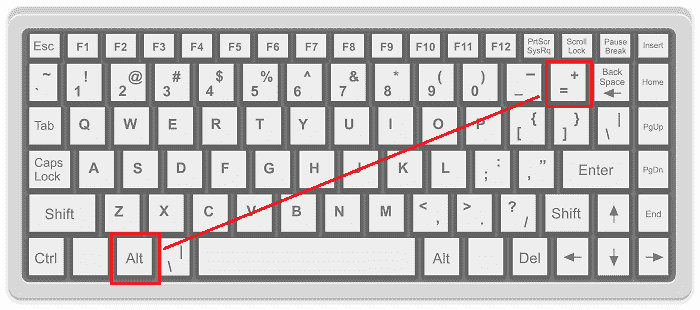

### 使用“主页”选项卡下的“自动求和”快捷方式在 Excel 中自动求和

在 Excel 中快速汇总值的另一个快捷方式位于功能区。我们需要进入**主页**选项卡，从**编辑**组中选择**【自动求和】**图标。我们也可以使用键盘访问这个快捷方式。为此，我们必须按下 Alt 键，后跟 H、U 和 S，即 Alt + H + U +S，一旦我们单击“自动求和”工具快捷方式，就会应用求和功能，并像前面的快捷方式一样提供结果。

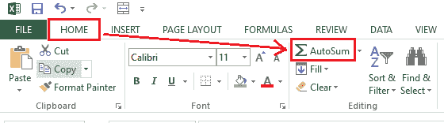

## 在 Excel 中使用自动求和快捷方式的步骤

虽然这两个快捷方式都很方便，但键盘快捷方式比另一个好得多。我们需要按照以下步骤在 Excel 中使用自动求和键盘快捷键:

*   首先，我们必须将光标放在要求和的列的选定单元格下方。同样，我们也可以将光标放在要求和的数据区域之后的行的左外侧。
*   接下来，我们需要按住 Alt 键。按住 Alt 键时，我们还需要按键盘上的等号(=)按钮。
*   最后，我们必须按回车键。

这就是我们如何在 Excel 中使用自动求和键盘快捷键来快速计算工作表中所需值的总和。或者，我们可以在选择所需的单元格后，使用“主页”选项卡中的“自动汇总”快捷方式。它的工作原理类似于 SUM 键盘快捷键。

## 使用 Excel 自动汇总快捷方式的不同方法

由于 Excel 允许我们以不同的方式向工作表中输入数据，因此我们可能需要相应地添加值。具体来说，我们使用行和列来存储数据。因此，我们可能需要根据需要总结行和列的值。此外，根据数据在工作表中的存储方式，我们可能还需要向单行/列或多行/列添加值。

让我们了解使用 Excel SUM 快捷方式和在 Excel 中汇总值的不同方法:

### 自动汇总单列和单行

使用快捷方式在单行或单列中执行 SUM 非常容易。当我们在任何一列中使用 sum 快捷方式时，它被称为**垂直 SUM，**，结果在该特定列的数据范围下方的单元格中给出。此外，当我们在任何一行中使用 sum 快捷方式时，它被称为**水平 SUM，**，并且结果在该特定行的数据范围(右外单元格)旁边的单元格中给出。

让我们用一个例子来讨论这两者:

**自动缩放到下方单元格(垂直自动缩放)**

假设我们有以下数据集，我们希望使用 sum 快捷方式对 C 列的值进行求和。

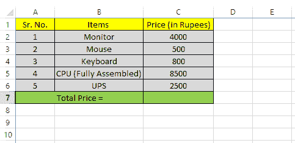

我们需要遵循以下步骤:

*   首先，我们需要选择列 c 中值/数据下方的任何空单元格。如果中间单元格为空，则不需要选择数据区域最后一个单元格下方的直接单元格。但是，当选择数据正下方的单元格时，它看起来更有条理。因此，我们选择单元格 C7。
    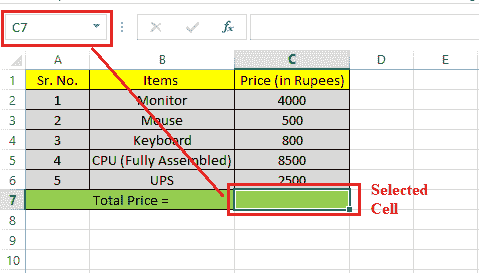
*   选择数据区域下面的单元格后，我们需要使用上面讨论的任何方便的 SUM 快捷方式。我们使用快捷键 **Alt + =。**我们一使用快捷方式，Excel 就会立即在选定的单元格中显示 SUM 函数，将一列中的所有单元格组合在一起。
    T3】
*   最后，我们必须按键盘上的回车键。在下图中，列 C 的所有值都被添加到单元格 C7 中。
    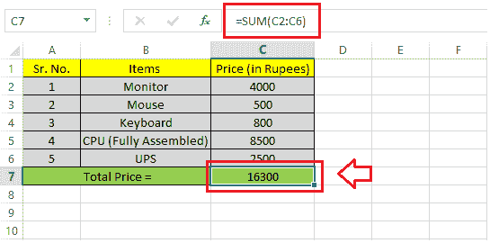

这就是我们如何使用键盘上的 Excel SUM 快捷方式快速汇总一列中的值。

**自动扫描到旁边的单元格(水平自动扫描)**

假设我们有以下数据集，我们希望使用 sum 快捷方式对第 3 行和第 3行的值进行求和。

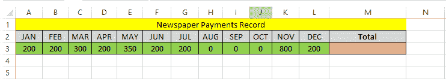

我们需要遵循以下步骤:

*   首先，我们需要选择第 3 第 3行数据范围旁边的任意一个空单元格。如果中间单元格为空，则不必选择数据区域最后一个单元格之后的立即单元格。在我们的例子中，我们选择细胞 M3。
    T3】
*   一旦选择了获得结果所需的单元格，我们就必须使用上面讨论的 SUM 快捷方式。我们使用快捷键 **Alt + =** 来快速获得结果。使用快捷方式后，Excel 会立即在选定的单元格中显示 SUM 函数，将所有单元格合并成一行。
    T3】
*   最后，我们必须按键盘上的回车键。在下图中，3 第 3行的所有值都被添加到选定的单元格 M3 中。
    T3】

这就是我们如何使用键盘上的 Excel SUM 快捷方式快速汇总一行中的值。

#### 注意:如果所选行或列范围的任何单元格中有文本，我们必须选择所有要求和的单元格，然后只使用求和快捷方式。

### 自动汇总多列和多行

有时，我们可能需要添加多列或多行的值，而不是一列或一行。在这种情况下，对每一行或每一列重复使用 SUM 快捷方式需要时间。相反，我们可以使用快捷方式一次，并立即汇总多列或多行的值。

让我们用一个例子来讨论这两种情况(添加多列和多行):

**自动汇总到数据单元格下的单元格中(自动汇总多列)**

假设数据集的值在多个列中，我们需要使用 SUM 快捷方式立即添加它们的值。换句话说，我们需要在下面的 Excel 表中计算每月的账单支付总额:

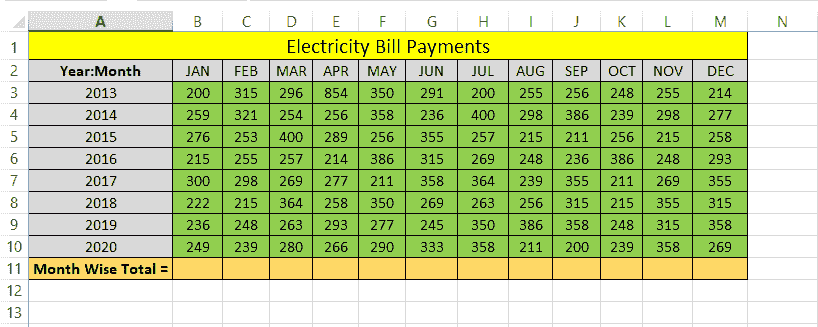

我们需要遵循以下步骤:

*   首先，我们需要选择数据集正下方的所有单元格。在我们的例子中，我们需要从 B11 到 M11 中选择细胞。这些是我们工作表中的结果单元格。
    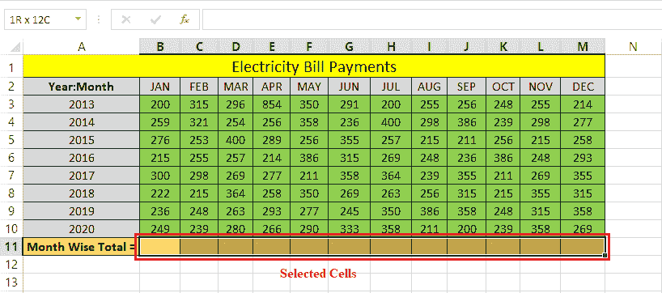
*   选择结果单元格后，我们必须使用任何 SUM 快捷方式。我们用快捷方式**“Alt+=”**快速得到结果。一旦我们按下快捷键，Excel 将立即显示所有选定单元格中的 SUM 值。
    T3】
*   一旦将公式应用于选定的单元格，我们就可以双击或选择任何特定的结果单元格来检查应用于它的公式。此外，我们可以确保该特定列的 SUM 公式中是否涵盖了所有值。
    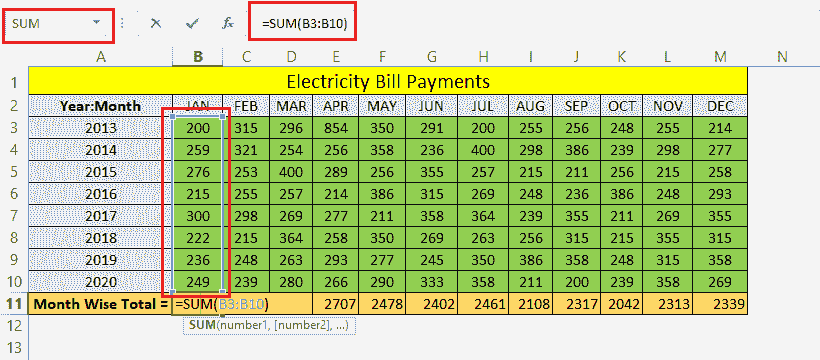

这样，我们可以一次获得多个列的值的总和。

**自动排列到数据单元格旁边的单元格中(自动排列多行)**

现在让我们用另一个场景来举上面的例子。现在，我们需要汇总行中的值。换句话说，我们需要在行中添加单元格的值，并在下表中找到按年计算的付款总额:

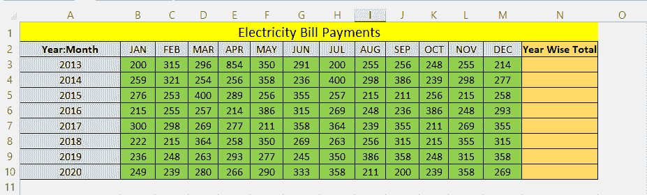

我们需要遵循以下步骤:

*   首先，我们必须选择行中具有必要值的所有单元格，包括结果单元格。
    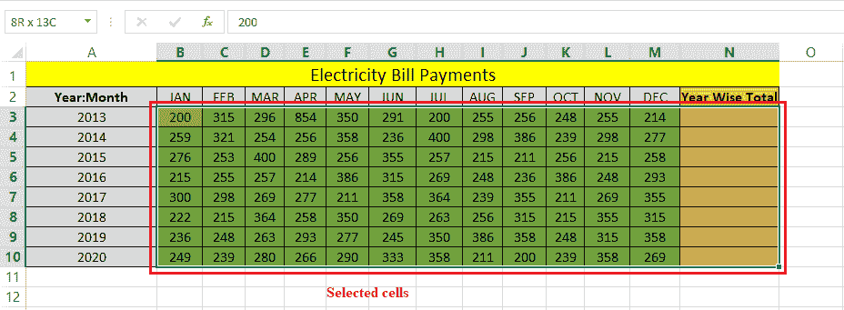
    与前面的方法不同，在这个场景中我们不能只选择结果单元格，因为它包含了行的所有单元格。由于我们在列 A 中有数值，所以 Excel 在只选择结果单元格时，也会将它们与该行的其他单元格相加。
    如果行中没有不需要的数值，我们可以选择结果单元格。
*   选择带有结果单元格的数据区域后，必须按“Alt + =”快捷键。只要我们按下快捷方式，Excel 就会立即在数据单元格旁边的所有结果单元格中显示所需的结果。
    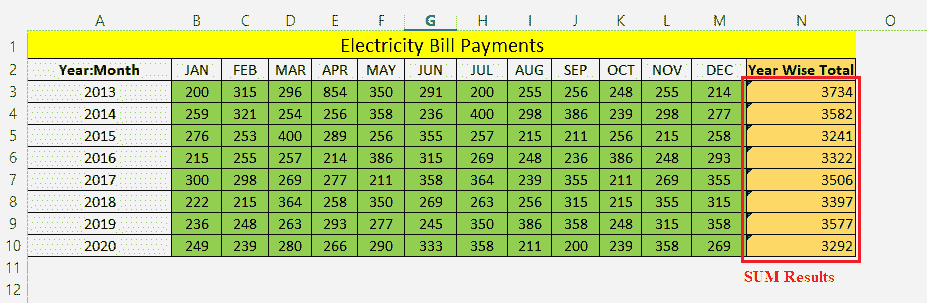
*   我们可以双击任何结果单元格，并检查应用于它的公式。
    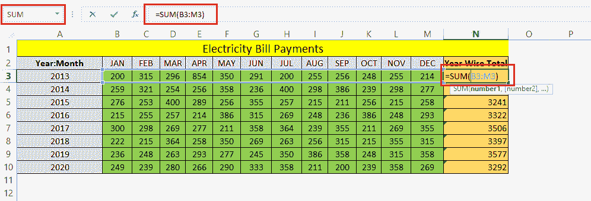

因此，我们可以一次获得多行单元格中的值的总和。

## Excel 自动汇总快捷方式的局限性

Excel SUM 快捷方式有一些限制。使用 SUM 快捷方式的一个主要限制是，它会占用上面所有的单元格，直到找到空白单元格。

假设我们有从单元格 A1 到单元格 A8 的列 A 中的值。但是，在从 A1 到 A8 的范围内还有一个空白单元格(单元格 A4)。看起来是这样的:

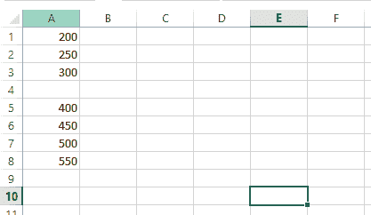

如果我们在数据区域下面的任何单元格中使用 SUM 快捷方式“Alt + =”，我们将得到错误的结果。由于存在空白单元格，Excel 会忽略空白单元格上方的所有单元格，并通过仅添加空白单元格下方的单元格或所选单元格来返回结果。

当我们在单元格 A9 中使用快捷键 Alt + =时，我们会得到以下结果:

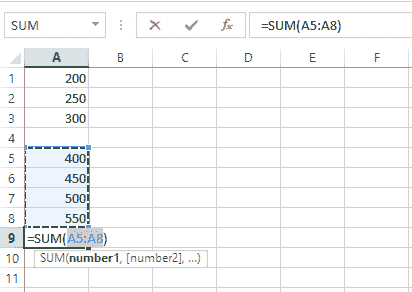

在上图中，我们可以看到 Excel 只在空白单元格下方添加值。但是，我们可以使用 SUM 快捷方式选择所有单元格并获得所需的结果。但是，这并不总是可能的。尤其是，我们在处理大数据时必须使用手动方法，或者在使用快捷方式时要小心。

* * *