# 在 Excel 中重做快捷方式

> 原文：<https://www.javatpoint.com/redo-shortcut-in-excel>

撤消和重做是微软 Excel 中最常见的两个选项或命令。由于 Excel 允许我们处理大数据，所以可能会有出错的情况。但是，如果错误是由于最后一步中执行的任何操作而发生的，我们可以很容易地纠正它们。我们可以在 Excel 中使用“撤消”选项。此外，“重做”选项与“撤消”选项正好相反。如果我们认识到没有必要撤销操作，我们可以使用 Excel 中的“重做”命令取消撤销。

Excel 中撤销和重做选项的最大好处是我们可以通过快捷方式立即使用它们。我们不需要执行几个步骤。在本文中，我们讨论了在 Excel 中访问重做快捷方式的方法。这将有助于我们恢复使用撤销执行的操作。

## Excel 重做快捷方式

对于大多数基本和高级任务，微软 Excel 都有一系列快捷方式。同样，它也有一个重做快捷方式。Excel 允许两种不同的方式或快捷方式在 Excel 工作表中快速执行重做操作。我们可以在 Excel 中使用以下任何重做快捷方式:

*   重做快捷键
*   快速访问工具栏上的重做快捷方式

现在让我们详细讨论这两个问题:

### 重做快捷键

使用大多数 Excel 操作的最快方法之一是使用键盘快捷键。Excel 有各种各样的键盘快捷键。它还为重做命令提供了一个快速键盘快捷键。对于重做命令，我们需要按住 Ctrl 键再按键盘上的‘Y’键，即 **Ctrl + Y.** 这仅适用于 Windows 上的 Excel。

在 MacOS 上，我们必须使用以下键盘快捷键来重做最后一个操作:

重做键盘快捷键允许多级重做操作。这意味着我们可以使用快捷方式重做几个可能的动作。每次我们按下重做快捷键，Excel 都会向前一步或还原一个撤销动作。除此之外，我们还可以使用 F4 功能键在 Windows 上多次重复上一个动作。这可以防止重复使用重做快捷方式。

### 快速访问工具栏上的重做快捷方式

在 Excel 中使用重做选项的另一个快捷方式位于快速访问工具栏(QAT)上。默认情况下，此快捷方式位于撤消快捷方式旁边。快速访问工具栏上的重做快捷方式还包括一个下拉菜单，其中显示了我们可以在特定工作表中重做的所有可能操作。重做下拉菜单的另一个好处是，我们可以立即选择所需的操作并返回到该位置。

快速访问工具栏上的 Excel 重做快捷方式如下图所示:

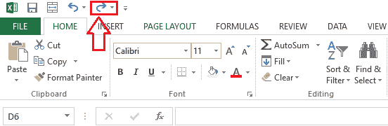

有时，由于 Excel 设置的更改，我们可能看不到快速访问工具栏上的重做快捷方式。但是，我们总是可以通过转到 Excel 设置在快速访问工具栏上添加它。

**在 Excel 快速访问工具栏**中添加重做快捷方式

如果快速访问工具栏上没有重做快捷方式，我们必须使用以下步骤手动添加它:

*   首先，我们需要导航到文件选项卡，并从文件菜单列表中选择**‘选项’**。
    T3】
*   选择“选项”后，Excel 显示**“Excel 选项”**窗口。我们需要从左侧菜单中选择**“快速访问工具栏”**。
    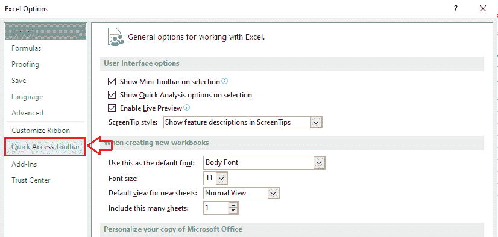
*   接下来，我们必须从**“选择来自”**部分的下拉菜单中选择**“所有命令”**选项。
    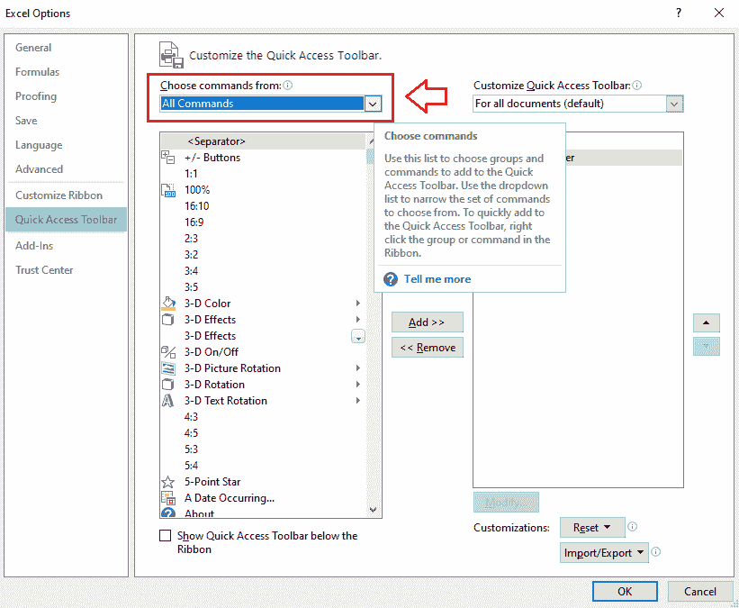
*   获取所有命令列表后，我们需要定位**【REDO】**命令，点击**【添加】>>**按钮。
    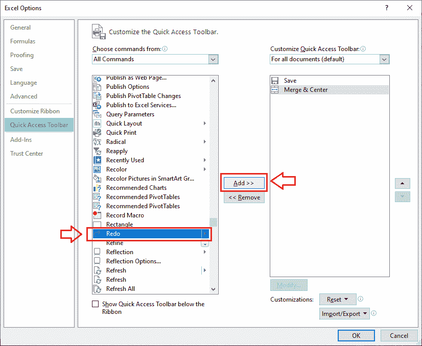
*   一旦右侧框中添加了 REDO 命令，我们必须点击**确定**按钮。
    T3】
*   点击确定按钮后，快速访问工具栏上立即添加 **REDO 命令快捷方式**。
    T3】

## 如何在 Excel 中使用重做快捷方式？

在 Excel 中使用重做快捷方式非常容易。但是，需要注意的是，重做快捷方式仅在我们撤消或撤消一个操作或多个操作后才起作用。要重做我们已经撤消的事情，我们需要按键盘的快捷键 Ctrl + Y。或者。我们也可以按 F4 功能键；但是，我们首先需要按下 Fn 或 F-Lock 键来激活功能键。

如果我们经常使用鼠标，可以直接从快速访问工具栏中点击重做快捷方式，就会执行相应的操作。

## 带有重做快捷方式的简单示例

让我们借助一个例子来理解使用重做快捷方式。首先，我们将在 Excel 工作表中执行一些随机操作，然后相应地撤销它们。接下来，我们将使用重做快捷方式来恢复已经撤消的数据。

为此，我们需要打开一个空的 Excel 工作表，并使用函数 RANDBETWEEN 在单元格 A1 中插入一些随机值:

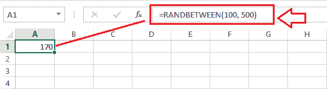

接下来，我们从单元格 A1 复制公式，并将其粘贴到从 A1 到 D10 的特定单元格范围内。

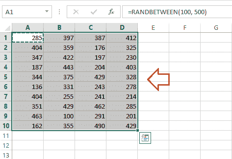

现在，我们已经在 Excel 工作表中执行了两个不同的操作。现在，我们进行一些格式更改。我们添加背景颜色并改变字体大小。

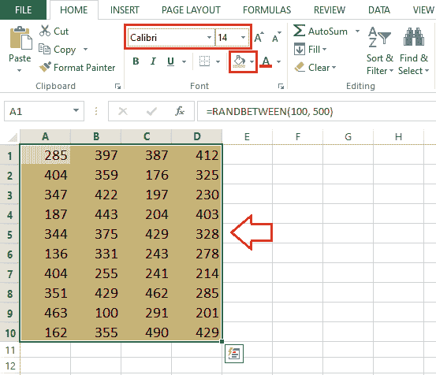

最后，我们复制整个数据集，并使用 Excel 的粘贴特殊功能将其粘贴为值。

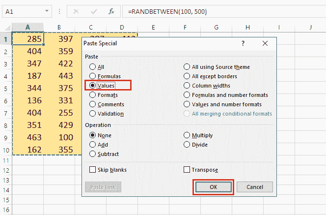

此时此刻，Excel 已经存储了我们到目前为止执行的所有操作。我们 Excel 中的数据是没有公式的。

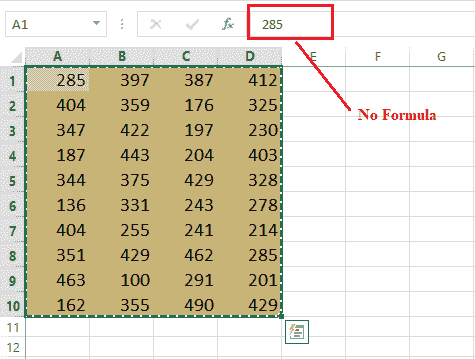

如果我们使用撤销(Ctrl + Z)，Excel 将后退一步，用公式显示值。

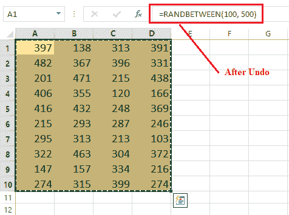

由于我们已经使用了一次撤销命令，我们可以通过按一次重做快捷方式来重做操作。如果我们按重做快捷键 Ctrl + Y，Excel 会往前走一步，显示没有公式的值，就像撤销前的位置一样。

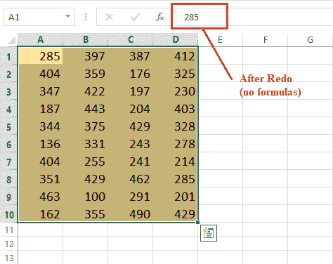

现在，假设我们多次使用 undo 命令，直到我们的工作表变空。在这种情况下，我们可以多次按下重做快捷方式(Ctrl + Y)来返回我们的数据或撤消前的位置。或者，我们可以单击重做下拉列表，查看重做的所有可能操作。我们可以从列表中选择任何操作，并立即到达现有工作表中的该位置。

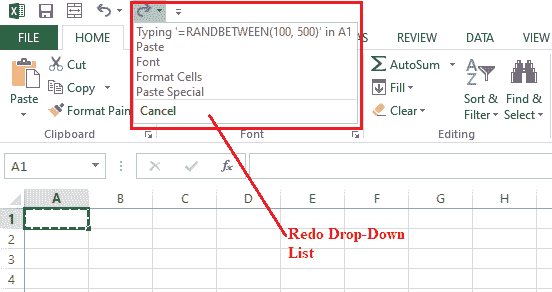

## Excel 中重做快捷方式的局限性

“撤消”和“重做”这两个快捷方式在某种程度上是有联系的。这意味着在工作表中执行撤消操作之前，我们不能使用重做快捷方式。具体来说，如果工作表中没有未完成的内容，就不存在重做的问题。这就是为什么如果没有撤消操作，重做快捷方式将被禁用。

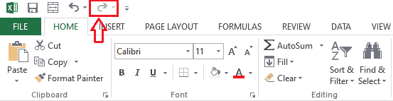

在上图中，我们可以看到重做选项是不可点击的。特别是，重做操作依赖于撤消操作。

* * *