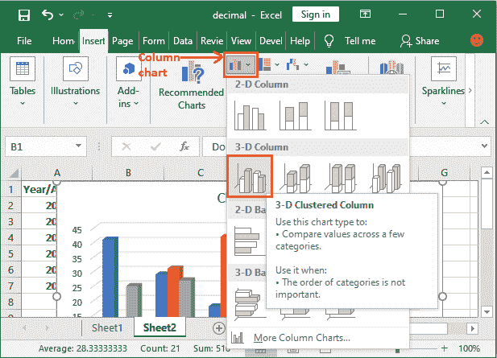

# Excel 中图表的类型

> 原文:[https://www.javatpoint.com/type-of-charts-in-excel](https://www.javatpoint.com/type-of-charts-in-excel)

由于数据的复杂性和大小，有时很难解释 Excel 数据。因此，图表是一种以图形方式表示数据并轻松解释数据的方式。图表是数据的可视化表示。

Excel 提供图表来利用图形表示。通过图表表示的数据比存储在 Excel 表格中的数据更容易理解。这使得分析数据的过程更快。Excel 用户可以快速分析数据。

使用图表对数据进行图形化表示，使复杂的数据分析更容易理解。Excel 有各种各样的图表，每个图表都有自己不同的功能和表示风格。

## Excel 提供的图表

Excel 提供了许多图表来以不同的方式表示数据，例如饼图、条形图、折线图、股票图、表面图、雷达图等等。你可以根据你的数据和分析来使用它们。所有这些图表

有一个基本和高级图表列表，用于不同的目的来解释数据。

1.  [柱形图](#Column)
2.  [折线图](#Line)
3.  [条形图](#Bar)
4.  [面积图](#Area)
5.  [饼图或甜甜圈图](#Pie-or-Doughnut)
6.  [表面图](#Surface)

这些是 Excel 用户通常需要的最常用的 Excel 图表。

微软 Excel 为 2016 年及更新版本推出了一个名为**树形图**的新图表。它具有一些高级特性和表现风格。

我们将在本章中用一个例子来说明每个图表及其功能。仔细学习并相应地使用它们。

### 柱形图

柱形图基本上是一种垂直图表，用于以竖线表示数据。它可以有效地处理不同类型的数据，但通常用于比较信息。

**例如**，一家公司希望以图形方式看到每个月的销售情况，也希望进行比较。柱形图最适合帮助分析和比较每个月的数据。

Excel 提供 2D 和三维柱形图。

### 折线图

折线图对显示趋势最有用。使用此图表，您可以轻松分析数据随时间的起伏。在这个图表中，数据点用线连接。

**例如**，一家公司想要对过去五年的产品销售情况进行图形化分析。此外，它还想分析每年产品销售的起伏。

Excel 提供 2D 和三维折线图。

### 条形图

条形图是像柱形图一样工作的水平条。与柱形图不同，条形图是水平绘制的。或者你可以说条形图和柱形图正好相反。

**例如**某公司用条形图通过竖条对数据进行分析，将数据图形化表示。您可以看到这些值，也可以将它们与数据进行比较。

### 对比图

面积图就像折线图。与折线图不同，面积图中的间隙用颜色填充。面积图很容易分析业务的增长，因为它通过线显示起伏。

与折线图类似，面积图中的数据点是用线连接的。

### 圆形分格统计图表

饼图是一种圆形图形，分为饼图的各个部分。使用此图表，您可以轻松分析划分为切片的数据。它使数据易于比较比例。

饼图便于分析哪些值占整体的百分比。饼图也称为**甜甜圈图**。Excel 提供 2D 和三维饼图。

### 地面天气图

表面图表实际上是一个三维图表，有助于将数据表示为三维景观。这些图表最适合用于大型数据集。该图表允许同时显示多种数据。

使用其他图表不容易表示大型数据集。表面图解决了这个问题，允许使用这个三维图表显示大数据集。

## 明智地选择图表

Excel 提供了太多的图表以及它们的 2D 和三维类型。你可以使用它们中的任何一个，但要根据你的数据明智地选择它们。不同的场景需要不同的图表。不过，它可以显示所有正确的信息。

我们为每种类型的图表列出了一些要点，帮助您明智地选择图表。仔细阅读-

|  | 图表类型 | 何时选择此图表 |
| 1. | 柱形图 | 当您想要比较几个类别的多个值时，请使用柱形图。数值通过竖线显示。 |
| 2. | 折线图 | 当您想要显示一段时间(如数月或数年)的趋势(起伏)时，请选择此图表。 |
| 3. | 条形图 | 像柱形图一样，使用此图表来比较几个类别的值。
在此图表中，数值显示在横条中。 |
| 4. | 对比图 | 面积图与折线图具有相同的模式。该图表最适合用于指示不同集合之间的变化。 |
| 5. | 饼图或圆环图 | 当您想要量化数值并将其显示为百分比时，最好使用饼图。 |
| 6. | 地面天气图 | 曲面图不同于其他图表。当您需要分析两组数据之间的最佳组合时，请使用它。 |

## 如何插入图表？

Excel 提供了易于使用的用户界面，您可以使用该界面轻松插入所需的数据图表。您需要遵循几个简单的步骤，Excel >插入选项卡>图表部分>选择图表。

我们将从头到尾说明为 Excel 数据创建图表的这些步骤。以下是在 Excel 中插入图表的步骤。

**步骤 1:** 我们有以下数据集(2015-2020 年六年的动物种群率)，您希望在 Excel 中为其创建图表。

**步骤 2:** 选择要创建图表的数据，包括列标题和行标签。这些数据将成为图表的源数据。

**步骤 3:** 导航到 Excel 标题中的**插入**选项卡，您将看到一个图表部分，其中包含所有这些图表的列表。

**第四步:**根据你的数据从这里选择一个图表。我们为您的数据选择了包含竖线的**三维柱形图**。

**第五步:**将选定的图表插入到您的 Excel 工作表中。最初，对于在步骤 2 中选择的数据，图表如下所示。

目前，此图表没有有效的标题、清晰的分析值等。您可以通过修改图表来设置图表中的所有这些内容。

**第 6 步:**双击**图表标题**使其可编辑，然后提供与之匹配的新有效标题。

这里蓝色竖条代表到**海豚**，橙色竖条代表到**企鹅**，灰色竖条代表到**白熊**种群数量。

**第 7 步:**还可以为其年份定义每个竖线，这样用户就可以轻松分析数值。点击这里的**图表过滤器**图标。

**第 8 步:**点击列表底部的**选择数据**替换每个竖线的 2015 年。

**第 9 步:**在此选择编号 **1** 替换为 2015 年，点击**编辑**按钮。

**第十步:**输入年份，点击**确定**。

**第十一步:【2015 年马上会在图表上体现出来，其他都变成空白。现在，要将所有其他年份放在每个竖线上，请再次单击此处。**

**第 12 步:**在用逗号分隔的花括号内再添加 2016 年到 2020 年的年份，点击确定。

{2015,2016,2017,2018,2019,2020}

**第 13 步:**现在所有值都被添加。所以，点击**确定**。

**第 14 步:**看图表，图表上反映的年份对应每个竖线。

您可以看到，每个小节的末尾都没有定义确切的值。只有图表在显示。Excel 使用户能够选择详细的栏。

**第 15 步:**从功能区的**图表样式**中为柱形图选择另一种图表样式进行详细描述。我们选择了**风格 2** 。

#### 注意:“图表样式”选项仅在选择了插入到 Excel 工作表中的图表时启用。因此，确保选择了图表。

**第 16 步:**现在，您可以看到该图表中每个条形的精确值也在显示。

同样，您可以在 Excel 工作表中为数据插入、创建和修改其他图表。

## 阅读图表

你应该学会如何阅读图表来理解和分析通过它呈现的数据。学会如何阅读图表是最重要的。图表包含几个组件，例如帮助您解释数据的元素和部分。

这是最重要的一点，因为如果你不能阅读和理解图表，你可能会误解数值并分析数据。

* * *