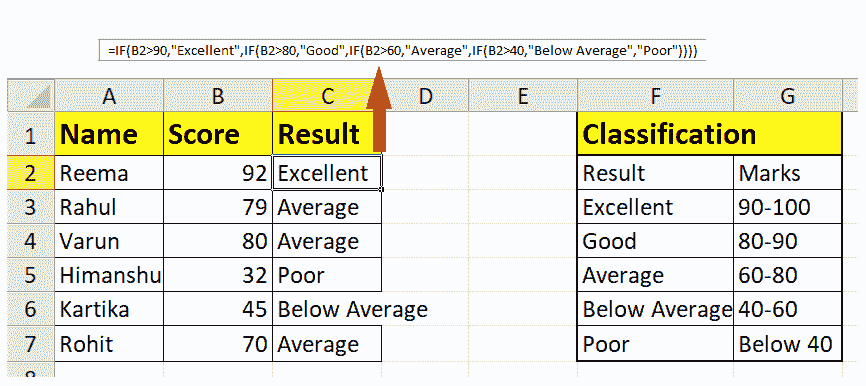
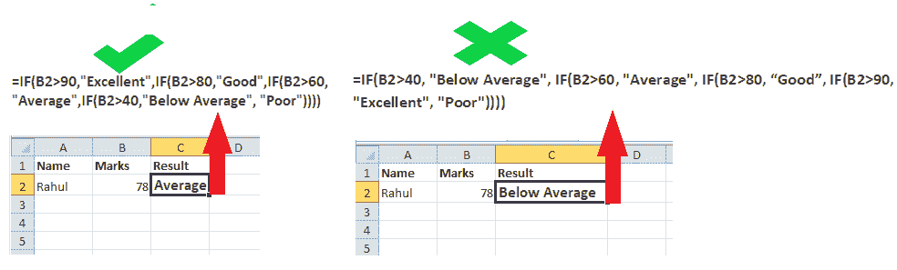

# Excel 中的嵌套 If 函数

> 原文:[https://www.javatpoint.com/nested-if-function-in-excel](https://www.javatpoint.com/nested-if-function-in-excel)

**嵌套 IF 公式**在几乎所有编程语言中都被广泛用于实现决策逻辑。这同样适用于 Excel 工作表。只要用户想要测试某个条件，就会应用 IF 函数，如果条件满足，则返回 true，如果条件不满足，则返回 False。**当用户想要应用多个条件并根据它们的输出返回不同的逻辑值时，他们会选择彼此内部的多个 IF 函数。**

尽管嵌套 IF 语句非常常见，但它们并不是在 Excel 工作表中实现决策逻辑的唯一方法。还有各种其他替代方法。

在本教程中，我们将介绍嵌套 IF，如何在 Excel 中实现它们来检查多个条件，以及使用嵌套 IF 的提示和技巧。

## Excel 嵌套 IF 语句

***【嵌套】*定义为在一个公式中组合多个函数的方法。**

IF 函数使用户能够通过测试条件来执行逻辑比较，如果满足条件，它将返回 TRUE 否则它将返回假。

**当两个或多个 IF 语句组合形成一个公式时，这称为嵌套 IF 语句。**

#### 注意:Excel 最多允许嵌套 64 个不同的 IF 语句。

在 Excel 中移动到嵌套 IF 之前，让我们先了解一下 IF 公式的语法:

### 中频的语法

IF (logical_test, value_if_true, [value_if_false])

哪里，

**logic _ test(必需):**此参数表示用户要测试的条件。

**value_if_true(必需):**此参数表示条件为真时返回的值。

**value_if_false(可选):此参数表示条件为 false 时返回的值。**

### 嵌套中频的语法

IF(logical_test1, output1,IF(logical_test2, output2, IF(logical_test2, output3, output4)))

## 嵌套中频——理解逻辑

在上面的语法中，您会注意到每个后续的 IF 语句都被插入到前一个函数的可选值 if_false 参数中。**每个 IF 语句都以括号开始，括号在公式**的末尾结束。

在我们的语法中，您还会注意到我们输入了 3 个逻辑条件，而它返回了 4 个输出。如果所有条件都不为真，则**公式返回输出 4。转换上述语法是一种可读性更强的格式。**

```
Test logical_condition1, if TRUE - return output1, if FALSE -
test logical_condition2, if TRUE - return output2, if FALSE -
test logical_condition3, if TRUE - return output3, if FALSE -
return output4

```

该公式指示 Excel 执行第一条 IF 语句的 logical _ condition1，如果条件为真，则应返回 value_if_true 参数中提供的 output1 值。如果条件为假，那么它应该测试第二个 If 语句，依此类推。如果不满足任何条件，它最终应该返回 output4。

### 演示经典嵌套中频公式的示例

举个例子，让我们根据学生的考试成绩找出他们的分类列表。我们有以下分类:

| 分类 | 马克斯 |
| 优秀的 | 90-100 |
| 好的 | 80-90 |
| 平均的 | 60-80 |
| 低于平均水平 | 40-60 |
| 穷人 | 40 岁以下 |

对于嵌套的 IF 语句，必须以准确的顺序排列逻辑条件，即从高到低或从低到高。在上面的例子中，我们先对“最高”值排序，然后是“第二高”，依此类推:

让我们根据给定的分类编写一个嵌套的 IF 格式。Excel 嵌套 IF 语句的公式如下:

```
=IF(B2>90,"Excellent",IF(B2>80,"Good",IF(B2>60,"Average",IF(B2>40,"Below Average","Poor"))))

```

按照以下步骤将上述公式嵌入到您的 Excel 工作表中，并根据学生的考试成绩找到他们的分类:

1.  在 C1 单元格中输入公式，然后按回车键。它将向您显示输出。
2.  对于下一个单元格，将公式拖到填充手柄上。
3.  它会自动复制公式并为您更改单元格引用。
4.  如下所示，您将拥有分类。



由于有多个 IF 语句、条件、括号，要将嵌套 IF 语句的逻辑精确地公式化到最后就变得有点复杂了。虽然 Microsoft Excel 支持在单个公式中嵌套多达 64 条 IF 语句，但不建议在工作表中嵌入 64 条 IF 语句。

### Excel 嵌套 IF -提示和技巧

与任何其他编程语言不同，如果您知道逻辑，Excel 中的嵌套 IF 很容易实现。但是遵循这些提示和技巧将有助于您防止错误，并有助于您改进嵌套的 IF 公式。

**嵌套中频的限制**

在早期版本的 Excel 中，即 Excel 2003 或更低版本，用户最多只能嵌套 7 个嵌套的 IF 函数。但是它在 Excel 2007 中得到了升级，用户可以在一个公式中嵌套多达 64 条 IF 语句。虽然不建议在工作表中嵌入 64 个 IF 语句，但这会使公式复杂化，导致更多错误**。**

**精确写出嵌套 IF 语句的顺序**

Excel 中的嵌套 IF 函数按照公式中出现的顺序操作逻辑条件。**如果任一条件为真，excel 停止公式，不再测试进一步的逻辑条件**。因此，你的逻辑陈述的顺序非常关键。

让我们用一个例子来理解上面的陈述。下面给出了一个嵌套的 IF 语句，其中 B2 = 78。它将检查第一条语句 78>90，返回 false，并移动到下一条语句。它将再次检查 78 > 80，并返回 False。此外，在下一个条件，78>60，它返回真。公式将在这里终止，输出将是平均值。

```
=IF(B2>90,"Excellent",IF(B2>80,"Good",IF(B2>60,"Average",IF(B2>40,"Below Average", "Poor"))))
```

如果你颠倒中频函数的顺序:

=IF(B2>40, "Below Average", IF(B2>60, "Average", IF(B2>80, "Good", IF(B2>90, "Excellent", "Poor"))))

Excel 将测试公式中的第一个条件，由于 78 > 40，将返回 TRUE。此外，该公式将返回“低于平均值”，而不测试其他逻辑条件。

**评估公式逻辑**

要一步一步地观察嵌套的 IF 语句的逻辑进程，请利用 Excel 的“公式审核”组 中 ***的“公式”选项卡上的“计算公式”功能。***

**关闭嵌套 IF 语句的括号**

在 Excel 中使用嵌套的 IFs 时，用户大多会打开括号而忘记关闭。**如果括号对不平衡，你的公式会显示错误。**幸运的是，微软 Excel 提供了几个功能，帮助用户在构建公式时匹配括号

如果公式中有两个或多个括号，括号对将以不同的颜色着色。左括号和右括号的颜色相同。

**区别对待文字和数字**

在构建逻辑条件时，用户通常将文本和数字放在同一个上下文中处理，最终得到的往往是不正确的公式。

例如，一些用户也错误地给数字加上了双引号

=IF(B2>"45", "Pass",…)

**上面的公式将返回 False 输出，因为这里，45 代表一个字符串值。**

请始终记住，文本和数字在 Excel 中的显示方式不同。文本总是用双引号括起来，而数字在书写时没有任何引号。

=IF(B2>45, "Pass",…)

**通过添加空格或换行符使嵌套的 IF 公式可读。**

在用多个 IF 语句制定嵌套的 IF 公式时，**确保两个 IF 语句之间有适当的间距或换行符，**以便您清楚地区分它们。Excel 不会用公式中的额外间距来限制用户。

#### 注意:要在 Excel 公式中使用换行符，请将光标放在要插入换行符的位置，然后按快捷键 Alt + Enter。

* * *