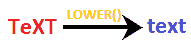
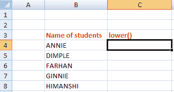
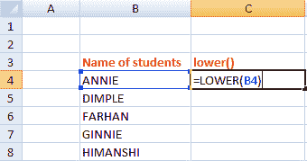
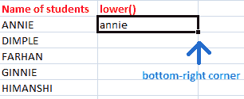
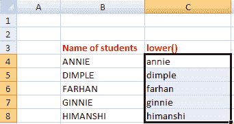
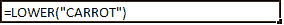
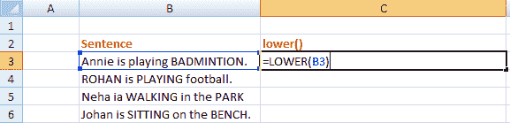
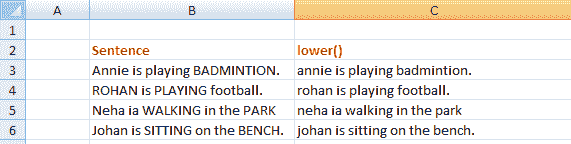

# excel 中的下限()

> 原文：<https://www.javatpoint.com/lower-in-excel>

excel 中的 lower()函数将字符串转换为小写。如果字符串已经是小写，将不会有任何转换。如果字符串是大写(大写)，它将被转换为小写。

当 excel 中存在大量文本时，LOWER 函数可以用作组织这些单词的公式。它由下式给出:

**LOWER(文本)**

在 excel 中，我们将函数声明为:

=LOWER(C2)

哪里，

C2 是包含文本形式的字符串的指定单元格

或者

我们可以用双引号内的文本来声明函数，如下所示:

=LOWER("TEXT")

它将输出为**文本**。

函数的作用是:将指定单元格中的大写字母转换成小写字母，如下所示:


LOWER()函数有多种不同的工作方式。

**情况 1:** 当一个单词的第一个字母是大写时

它会将指定单词的第一个字母转换为小写，如下所示:


**情况 2:** 当一个单词中有多个大写字母时

它会将单元格中的所有大写字母转换为小写，如下所示:



**情况 3:** 当一个单元格中有多个单词时

它会将句子中出现的所有大写字母转换为小写字母，如下所示:


因此，无论小写字母和大写字母的格式如何，期望的结果将是仅小写的**字母。**

**情况 4:** 如果所有字母都已经小写

在这种情况下，对单元格中的指定语句没有影响。单词中的小写字母将保持不变。


## LOWER()函数的效果

*   单元格中的所有数字都不受影响。
*   标点符号不受影响。
*   两个字之间的间距不受影响。
*   它只适用于角色。转换仅在大写字母上执行。
*   小写字母不受影响。它将保持不变。

#### 注意:UPPER()和 LOWER()是不同的函数。我们不应该混淆这两者。UPPER()将小写转换为大写，而 LOWER()将大写转换为小写。

让我们考虑一些基于 LOWER()公式的例子。

## 例子

### 示例 1:将学生姓名从大写转换为小写

请考虑以下步骤:

1.  点击下方()列的第一个单元格，如下图:
    
2.  键入“=LOWER(B4)。”
    
    所选单元格显示为包围在蓝色边界内。
3.  按**进入**。指定单元格中的大写字母将被转换为小写字母。
4.  点击该单元格的右下角，拖动到该列的最后一个单元格，如下所示:
    
    该 LOWER()将自动应用于指定列的其他单元格。
    

基于上述数据，LOWER()函数将按如下方式工作:

```
PROPER(B4)
It is will return 'annie'
PROPER(B5)
It will return 'dimple'
PROPER(B6)
It will return 'farhan'
PROPER(B7)
It will return 'ginnie'
PROPER(B8)
It will return 'himanshi'

```

我们还可以指定用双引号括起来的文本，而不是单元格编号。考虑下面的例子。

```
PROPER("ANNIE")
It will return 'anie'
PROPER("DIMPLE")
It will return 'dimple'
PROPER("FARHAN")
It will return 'farhan'
PROPER("GINNIE")
It will return 'ginnie'
PROPER("HIMANSHI")
It will return 'himanshi'

```

### 示例 2:将蔬菜的名称转换为小写字母。

给定的蔬菜名称是**胡萝卜**。

请考虑以下步骤:

1.  单击 excel 表上的任何单元格。
2.  类型' = low(“胡萝卜”)，如下所示:
    
3.  压
4.  大写到小写转换后，会出现想要的结果，如下图:
    

#### 注意:上述方法在将单个单元格中的数据从大写转换为小写时非常有用。但是，在数据量很大的情况下，我们通常更喜欢在 lower()函数中声明指定的单元格编号(如 B4、C4)。

### 示例 3:将给定的句子从小写字母和大写字母的组合转换为仅小写字母。

请考虑以下步骤:

1.  单击下方()列的第一个单元格。
2.  类型' =LOWER(B3)，'如下所示:
    
3.  按**进入**。指定单元格中的大写字母将被转换为小写字母。
    单击该单元格的右下角，并拖动到列中的最后一个单元格。下方的()将自动应用于指定列的其他单元格，如下所示:
    

* * *