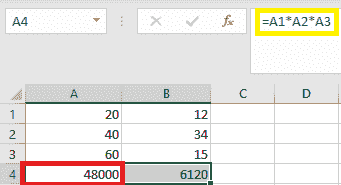
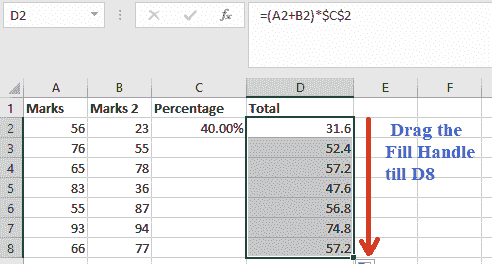
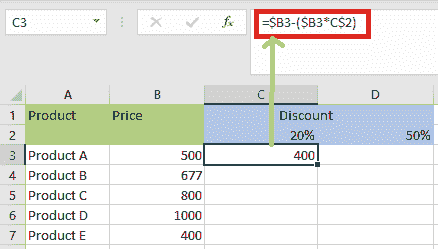

# Excel 中引用的类型

> 原文:[https://www.javatpoint.com/types-of-references-in-excel](https://www.javatpoint.com/types-of-references-in-excel)

Excel 中的工作表由单元格组成。可以通过指定行值和列值来引用这些单元格。在 Excel 中，单元格引用是一种通过组合工作表中的列名和行号来表示任何单元格的标识和位置的技术。例如，假设我们说 A5，那么它扩展为一个**列 A** 和 **5 第行。**同样，我们也可以声明或定义工作表中任意位置的单元格引用。我们也可以从 Excel 选项中激活 **R1C1** ，这是引用单元格的另一种方式，其中 **R** 1 表示**第 1 行**， **C1** 表示**第 1 列。**

## Excel 中单元格引用的类型

以下是 Excel 中的三种引用类型:

1.  相对单元格引用
2.  绝对单元格引用
3.  Excel 中的混合单元格引用

### 1.相对单元格引用

在 Excel 中，相对引用是单元格引用的一种形式。默认情况下，所有单元格引用都是相对引用 ***。当基于行和列的相对位置跨不同单元格复制时，相对引用会发生变化。*** 例如，假设我们将公式 **=B1*C1** 从第 1 行复制到第 2 行，公式将变成= **B2*C2** 。当我们必须跨许多行或列重复计算时，相对引用非常有用。

### 2.绝对单元格引用

在 Excel 中， ***绝对单元格引用是一种单元格引用类型，其中被引用的单元格不会像在相对引用*** 中那样改变。我们通过按下 **f4** 使用 **$** 符号来创建绝对参考的公式。$符号表示锁定，它锁定所有公式的单元格引用，确保相同的单元格引用所有公式。

### 3.Excel 中的混合单元格引用

***混合单元格引用是相对和绝对单元格引用的混合*** 。在混合单元格引用中，美元符号被附加到字母或数字上。例如， **$B2** 或**B4**。这是相对参考和绝对参考的混合。

*让我们仔细看看每个单元格引用:*

## 如何使用相对单元格引用？

**示例 1:** 我们来看一个基本示例，演示相对引用在 Excel 中的工作原理。假设我们要在三个不同的单元格中乘以三个数字- **A1，A2** 和 **A3** ，结果在第三个单元格- **A4。**

所以，我们使用公式 **A1*A2*A3** ，它在单元格 **A4 中给出了我们 **48000** 。**

结果是 **48000**

假设下一列**(“B”)**包含类似的情况。单元格 **B1、【B2】T3、 **B3** 有三个数字，我们想在 **B4 中进行乘法运算。****

通过使用两种方法，我们可以实现这一点:

第一种方式，我们可以手动编写公式将 **B1、【B2】T1、 **B3** 相乘得到结果。**

结果是 6120

另一种方法是我们可以很容易地从单元格 **A4** 复制公式，粘贴到单元格 **B4 中。**

因此，当我们复制 **A4** 单元格的值并粘贴到 **B4** 或拖动 **A4** 的内容并粘贴到 **B4、**时，只复制公式，不复制结果。通过右键单击单元格 **A4** 上的**并选择复制，我们可能会获得相同的结果。**

然后，我们移动到下一个单元格 B4，**右键单击**，从粘贴选项中选择**“公式(f)”**。

**例 2:** 借助这个例子，我们将更多地讨论相对单元格引用的使用。在这个例子中，我们有一个药品销售表；A 表中 **A 栏(A2:A7)**数量 **B 栏(B2:B7)**价格 **C 栏(C2:C**7)**D 栏**合计销售价值包含药品，我们需要确定。

如果我们想计算每种商品的总销售额，我们必须将每种产品的价格乘以该商品的数量。

考虑第一项；单元格 **D1** 中第一项的公式是 Excel 中的乘法 **=B2*C2。**

上述公式将返回总销售额。

我们现在可以将公式应用于整个范围，而不是为每个单元格单独键入公式。为了将公式向下复制到列中，我们需要在单元格 **D2、**中单击，我们将看到选中的单元格，选择一直到 **D7** 的单元格。因此，将选择该列范围。之后，使用 **Ctrl+D** 将公式应用于整个范围。

在这里，当我们将一个带有相对单元格引用的公式复制或移动到另一行时，行引用将自动更新(同样对于列也是如此)。

正如我们在上面看到或注意到的，单元格引用会立即调整到正确的行。

为了检查相对引用，我们必须选择 D 列中“总销售额”的任何单元格，公式将出现在公式栏中。例如，在单元格 **D3、**中，公式已从 **=B2*C2** 更改为 **=B3*C3。**

### 在 Excel 中何时使用相对单元格引用？

当我们需要为一系列单元格创建公式，并且公式需要引用相对单元格引用时，相对单元格引用很有帮助。在这种情况下，我们可以为一个单元格制作公式，然后将其复制粘贴到其他单元格中。

## Excel 中如何使用绝对单元格引用？

借助下面的例子，我们将讨论绝对单元格引用的使用。

下表显示了绝对单元格引用的使用:

| 绝对参考 | 特别的 | 键盘上的按键 |
| $A1 | 当我们复制一个列时，它保持不变。 | 按 F4 三次。 |
| 1 澳元 | 当我们复制一列或一行时，什么都不会改变。 | 按 F4。 |
| 一美元 | 当我们复制一行时，它保持不变。 | 按两次 F4。 |

在编写带有绝对引用的公式时，我们通常会使用 **$A$1** 语法。另外两种格式的使用频率要低得多。

我们可以通过在创建公式时按下键盘上的 **F4** 键在相对和绝对单元格引用之间切换。这是一种插入绝对引用的快速简单的技术。

与相对单元格引用不同，当公式复制到其他单元格时，绝对单元格引用不会改变。

### 例 1:

*   我们把公式写在任意单元格里，然后要按**进入**才能算出来。在本例中，我们在单元格 **D2** 中使用公式 **=(A2+B2)*$C$2)** ，并按回车键计算公式。
    
*   接下来，我们必须点击包含公式( **D2)的单元格角上的**填充手柄**。**
    
*   现在，我们将填充手柄向上拖动到要填充的单元格。在这个例子中，我们将把它拖到单元格
    
*   现在百分比在**栏 D** 计算，我们可以看到下图截图。
    T3】
*   我们可以双击任意单元格来检查操作是在哪些单元格中执行的，我们看到单元格 **C2 的**地址保持不变。
    T3】

正如我们在前面的例子中所看到的，单元 **C2** 的地址保持不变，而列 A 和 B 的地址根据行和列的相对位置而变化。这是因为我们使用了**号房**号房的绝对地址。

### 例 2:

假设我们有以下数据集，需要确定每件商品总销售额的佣金。

**30%** 是在单元格 **F1** 中列出的佣金。

为了计算每个项目销售的佣金金额，我们必须在单元格 **E2** 中输入以下公式，并将其复制到所有其他单元格中。

=D2*$F$1

### 美元符号是做什么的？

当美元符号被放置在行和列号的前面时，单元格变成绝对的(意味着当复制到其他单元格时，它阻止了行和列号的改变)。

例如，在上面的例子中，如果我们将公式表单 E2 复制到 E3，它会从 **=D2*$F$1 修改为=D3*$F$1。**

值得注意的是，虽然 D2 改为 D3，但 1 美元保持不变。

因为我们在 F1 的‘F’和‘1’前面放了一个美元符号，所以复制时单元格引用不会改变。

因此，单元格引用现在是绝对的。

### Excel 中何时使用绝对单元格引用？

将公式从一个单元格复制到另一个单元格时，当不需要修改单元格引用时，我们使用了绝对单元格引用。这可能是当我们有一个固定值，我们必须在公式**中使用的情况(如佣金率、税率、月数等)。).**

虽然我们可以在公式**中硬编码这个数量(例如，$F$2 而不是 30%)，**将它放入一个单元格中，然后利用单元格引用允许我们在之后更改它。

例如，如果我们的佣金结构发生变化，我们现在支付的是 **30%** 而不是 **25%，**我们只需修改单元格 **F2** 中的数字，所有计算都会立即更新。

## 如何在 Excel 中使用混合单元格引用？

绝对和相对单元格引用比混合单元格引用更容易处理，而混合单元格引用更难处理。

混合单元格引用有两种类型:

1.  当复制公式时列发生变化时，行被锁定。
2.  当复制公式时列发生变化时，列被锁定。

考虑下面的例子来说明它是如何工作的:

**示例 1:** 以下示例演示了如何在实践中使用两种形式的混合引用。

在下表中，我们列出了产品及其价格。每种产品都有两种折扣。

我们必须在 C3 细胞中输入以下公式。

=$B3-($B3*C$2)

公式锁定在**列 B ($B3** )和**行 2 (C$2)。**

如果我们需要自动填充位于 **(C4)** 单元格下方的单元格，那么 Excel 将为价格 **($B4)** 选择下一行，而不是为 **(C$2** )选择下一行。因此，该列将始终有 20%的折扣。

让我们看看它是如何工作的细胞权利，这是 **D3** 。B 列 **($B3)** 不会因为被锁定而改变。

单元格 **C$2** 将更改为 **D$2** ，因为列上没有锁，只有行。由于本例中我们在同一行，因此 **D3** 公式如下:

=$B3- ($B3*D$2)

填充剩余单元格后，我们将得到以下结果:

**例 2:** 下面是数据集，我们要根据单元格 **E2、【F2】T3、 **G2 中的百分比值来计算三层佣金。****

现在我们可以利用混合参考的力量，用一个公式计算所有这些佣金。

我们将在单元格 E4 中键入以下公式，并复制所有单元格:

=$B4*$C4*E$2

在上面的计算中，使用了两种形式的混合单元格引用(一种是锁定的，另一种是锁定的)。

让我们看看每个单元格引用，看看它是如何工作的:

*   **$B4(和$C4): -** 美元符号出现在列符号之前，但不出现在行号之前。因为列是固定的，所以当我们将公式复制到右边的单元格时，引用将保持不变。例如，如果我们将公式从 **E4 复制到 F4** ，则该引用不会改变。但是，因为它没有被锁定，所以当我们将其复制下来时，行号会有所不同。
*   **E$2: -** 在此引用中，美元符号正好位于行号之前，尽管列符号不包括美元符号。这意味着当我们将公式复制到单元格中时，引用不会因为行号被锁定而改变。但是，因为公式没有被锁定，所以如果我们将公式复制到右侧，列字母表将会改变。

## 如何将参考从相对更改为绝对(或混合)？

如果我们希望将引用从相对修改为绝对，我们必须在列符号和行号之前放置一个美元符号。例如 **A1** 是一个相对的单元格引用，但是当我们将其更改为 **$A$1** 时，它就变成了绝对的。

如果我们只需要修改一些引用，我们可能会发现手动修改很简单。因此，我们可以更改公式栏中的公式)或选择单元格，按 F2，然后更改它)。

然而，利用**键盘快捷键-F4-** 是实现这一点的更快方法。

当我们在选择单元格引用时(在公式栏或编辑模式下)按下 F4 时，引用会改变。

如果单元格中有引用=A1。

当我们选择参考并按下 F4 键时，就会发生这种情况。

*   **按一次 F4 键:**单元格引用从 A1 变为$A$1(从“相对”变为“绝对”)。
*   **按两次 F4 键:**单元格引用从 A1 变为 A$1(变为行被锁定的错过引用)。
*   **按 F4 键三次:**单元格引用从 A1 变为$A1(列锁定时变为混合引用)。
*   **按四次 F4 键:**单元格引用再次变为 A1。

* * *