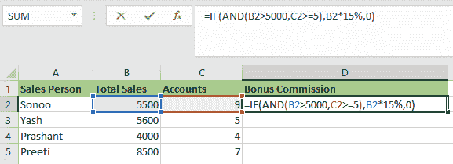

# Excel 中的与函数

> 原文：<https://www.javatpoint.com/and-function-in-excel>

## 什么是与函数？

***在 Excel 中，AND 函数是一个逻辑函数，用于测试多个条件，并根据条件是否满足返回“真”或“假”。*** 我们使用“与”函数来查看测试中的一组条件是否为**真**。例如，“与”功能可用于测试单元格 **A2** 中的数字是否大于 **100** 且小于 **200** 。“与”函数的目的是测试多个条件。

我们可以使用 AND 函数作为 IF 函数内部的逻辑测试，以避免额外的嵌套 IF，它也可以与 OR 函数结合使用。

**和**功能用于一次验证多个逻辑条件，最多 255 个条件，作为参数提供。每一个论点**(逻辑 1，逻辑 2 等。)**必须是返回**真**或**假**的表达式，或者是可被评估为**真或假**的值。常量、数组、单元格引用或逻辑表达式可以是提供给 AND 函数的参数。

### 与函数的语法

以下是 AND 函数的语法:

=AND(logical1, [logical2], ...)

## “与”函数的参数

以下是 AND 函数的两个参数:

*   **逻辑 1:** 逻辑 1 是要评估的第一个逻辑值或条件。
*   **逻辑 2:** 逻辑 2 是要评估的第二个逻辑值或条件。

逻辑 1 参数是必需的，但逻辑 2 参数是可选的。

## “与”函数的特征

“与”功能具有以下特征:

*   如果所有逻辑值或条件评估为真，与函数返回**“真”**。
*   如果任何逻辑值或条件评估为假，与函数返回**“假”**。
*   “与”函数忽略空单元格作为参数。
*   经常与其他 Excel 函数结合使用，如 **IF，OR，**等。
*   根据条件和要求，“与”函数可以有更多的逻辑值。
*   当评估数字时，它认为零是**“假”**，非零值是**“真”**

## 与函数的输出

以下是“与”函数在各种情况下的输出:

| 公式 | 输出 |
| =与(真，真) | 真实的 |
| =与(真，假) | 错误的 |
| =与(假，假) | 错误的 |
| =与(假，真) | 错误的 |

## 如何在 Excel 中使用 AND 函数？

“与”函数使用起来很简单。让我们看几个例子来了解它是如何工作的。

### 示例 1: -与函数

在这个例子中，有一个游戏，其中游戏有四个级别和 **12** 玩家。玩家必须完成所有四个关卡才能获胜。如果玩家未能完成四个级别中的任何一个，他或她将被淘汰出游戏。

下表总结了玩家在不同级别的表现。我们必须决定谁是赢家。

现在，我们应用**栏中的**和**公式**

公式是:

=AND(B2="yes"C2="yes",D2="yes",E2="yes")

玩家 **D、E、I、**和 **K** 已经完成所有关卡。**和**功能返回“**真”**，因为这四个玩家的所有逻辑条件都满足。

其余选手未能完成全部四个阶段。如果没有清除任何级别，则**和**功能返回**“假”**。

### 示例 1.1 与函数

在这个例子中，我们将使用**和**函数来查看一个数值是否在两个定义的值之间。我们可以通过将两个逻辑测试与**和**功能相结合来实现这一点。

假设我们有以下数据集:

我们将使用以下公式:

=AND(C2>MIN(A2,B2),C2 <max div="">
=AND(C2>MIN(A2,B2),C2 <max div="">在上式中， **MIN** 函数用于将数值与两个数字中较小的一个进行比较。在第二个表达式中，该值与两个值中的较大值进行比较，这是由 **MAX** 函数确定的。如果数值大于较小的数字且小于较大的数字，则**和**功能将返回**真**。

我们得到如下输出:

### 示例 1.2:与函数

借助这个例子，让我们进一步探讨**和**函数。假设我们想算出我们公司每个销售人员的奖金。要获得 **5%** 奖金，卖方必须在一年内达到超过**5000 美元**的销售额。否则，他们应该已经达到或超过了 **5** 账户的账户目标。他们需要满足这两个标准才能获得 15%的奖金。

我们有以下数据:

我们将使用**和**功能来确定奖金佣金。公式如下:

应用此公式后，输出将是:

我们不需要**和**功能来计算奖金，但是我们需要使用**或**功能。下面是要使用的公式:

=IF(OR(B2>5000,(C2>=5)),(B2*5%),0)

应用公式后，结果是:

### 示例 2: -带嵌套 IF 函数的 AND 函数

在这个例子中，我们有一所学校 12 名学生的分数。我们需要根据给定的标准来确定每个学生的分数。

如果学生的分数超过 **90%** 分，则获得**“A+”**。百分比大于或等于 **80%** 但小于或等于 **90%** 的为 A 级**“A”**。

如果百分比低于 **40%** ，则学生不及格。下表还列出了不同百分比的等级。

我们应用以下公式:

=IF(B2>90,"A+",IF(AND(B2<=90,B2>80),"A",IF(AND(B2<=80,B2>75),"B+",IF(AND(B2<=75,B2>70),"B",IF(AND(B2<=70,B2>60),"C+",IF(AND(B2<=60,B2>50),"C",IF(AND(B2<=50,B2>40),"D","FAIL")))))))

如果我们使用嵌套的 **IF 函数**和大量的**和**函数来计算等级。后者支持同时测试两种情况。

以下是中频函数的语法:

=IF(logical_test,[value_if_true],[value-if-false])"

如果满足条件，中频功能返回**真**，否则**假**

**“B2>90”**是初始逻辑测试或条件。如果该条件为**“真”，则分配等级**“A+”**。**如果条件为**“假**”，则 **IF** 功能评估下一个条件。

**“B2<= 90，B2 > 80** 是下一个逻辑测试或条件。如果这个条件是**为“真”，则分配**等级**为“A** ”。如果该条件为**“假”**，则评估下一个语句。类似地， **IF** 功能检查公式中的每个条件。

**“B2 = 50，B2>40”**是最后的逻辑检验。如果这个条件是**“真”**学生被分一个等级**“D”**，如果不是，学生就会不及格。

如下图所示，我们对所有类别的学生使用该公式。

### 示例 3:嵌套的与函数

在这个例子中，我们将理解嵌套**和**函数的概念。在这个例子中，我们有一个想要参军的人的名单，如果满足某些要求的话。以下是资格要求:

*   必须是考生身高必须大于或**等于 18，但小于 35 岁。**
*   候选人的视力必须
*   候选人身高必须大于 **167 cm** 。
*   候选人必须已经完成**长期任务。**

我们必须确定哪些人有资格参军。

我们使用嵌套的**和**函数，以便根据指定的参数评估候选项。

使用以下公式。

=AND(B2>167,C2="Normal",D2="Successful",AND(E2>=18,E2<35))

我们同时评估多个逻辑条件。我们还会查看年龄是否在规定范围内。因此，我们在另一个“与”函数中使用“与”函数。

下图描述了公式的结果。

**阿努拉格**和**三尚**是唯一符合选拔要求或条件的候选人。因此，他们的合格输出(**栏中的 F)** 为“真”其余的候选人没有资格参军。

## “与”函数的局限性

“与”功能的局限性如下:

*   从 Excel 2007 开始，如果公式长度小于 **8，162** ，AND 函数可以检查 **255 个参数**
*   如果公式长度小于 **10，24** ，Excel 2003 和以前版本中的 AND 函数最多可以测试 **30** 个参数
*   “与”功能返回**“# VALUE！** **如果逻辑条件作为文本传递，或者如果没有参数计算为逻辑值，则出现错误“**。
*   **“# VALUE！如果提供的所有参数都是空单元格，**和**函数将返回错误“**”。

如果提供一个空单元格和一个文本字符串作为参数，下面两张图片演示了**和**函数的结果。

* * *</max></max>