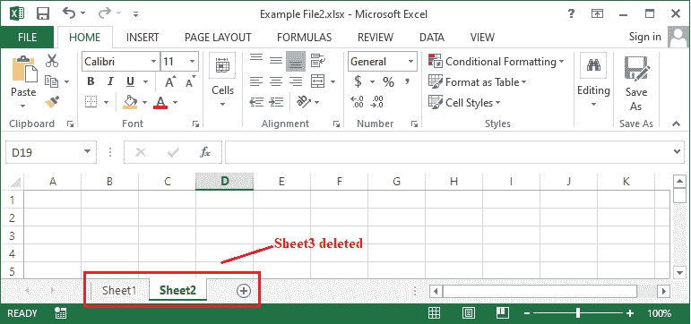

# 如何在 Excel 中删除工作表

> 原文：<https://www.javatpoint.com/how-to-delete-a-sheet-in-excel>

微软 Excel 是最强大的电子表格程序之一，可以有效地处理大量数据。Excel 允许我们在一个工作簿或电子表格中的多个工作表中存储数据。当我们创建一个新的 Excel 文档时，默认情况下我们通常会得到三张空白纸。有时候，我们可能不需要所有的床单。在这种情况下，我们必须从工作簿中删除不需要的工作表。因此，我们必须知道在 Excel 文档中删除工作表的过程。

本文讨论了从 Excel 工作簿中删除不需要的工作表的基本方法。使用这些方法，我们可以更精确地安排我们的数据，并加快一点性能。本文还讨论了一次删除多个不需要的工作表的步骤。

## 在 Excel 中删除工作表

Excel 提供了从电子表格中删除工作表的不同方法。我们可以使用以下任何方法删除或移除 Excel 中的工作表:

*   通过使用右击选项
*   功能区上的按格式选项
*   通过使用键盘快捷键

#### 注意:需要注意的是，纸张删除后无法恢复。因此，我们应该始终保留原始文件的副本，以便在出现任何不确定性或不必要的操作时恢复我们的数据。

让我们详细讨论每种方法:

### 使用右键单击选项删除图纸

从 Excel 工作簿中删除工作表的另一种快速方法包括使用右键单击选项。因此，如果我们不想要工作表并且需要从工作簿中删除它，我们可以按照以下步骤操作:

*   首先，我们需要打开一个要删除工作表的工作簿。接下来，我们必须从工作簿的底部找到“工作表”选项卡。
    
*   我们需要选择一个要删除的工作簿，然后右键单击它。一旦我们单击右键，Excel 就会显示与特定工作表相关的一些选项。
    
    在这里，我们必须点击选项“删除”。
    
    选择删除选项后，Excel 会显示一条警告消息，询问我们是要删除工作表还是取消操作。
    
    我们必须从警告对话框中点击【删除】按钮，所选工作表将从当前工作簿中立即删除。
    

这就是我们如何使用 Excel 中的右键选项删除工作表的方法。

### 通过功能区上的格式选项删除图纸

使用功能区工具删除图纸是最简单的方法之一。我们需要按照以下步骤使用格式选项删除工作表:

*   首先，我们需要打开一个需要删除的特定工作表。我们可以从 Excel 窗口底部的工作表标签中选择特定的工作表。
    
*   选择一张工作表后，我们需要导航到**主页**选项卡，然后单击**“单元格”组下**“删除”**图块下方的**下拉菜单**图标。**
    
    之后，我们必须从下拉列表的底部选择选项**【删除工作表】**。
    
    如果 Excel 显示一个警告框询问是否删除一张工作表，我们必须点击**【删除】**按钮继续删除一张工作表。
    
*   单击警告对话框中的删除按钮后，选定的工作表将从工作簿工作表选项卡中删除。
    

这就是我们在 Excel 中使用“格式”选项删除工作表的方法。

### 使用键盘快捷键删除工作表

虽然 Excel 没有提供直接的键盘快捷键来删除类似“Ctrl + C”的工作表进行复制，但是我们可以使用 Alt 序列方法。这意味着我们可以按下 Alt 键，然后按一些特定的键，立即从功能区访问所需的选项。通常有两种不同的键盘快捷键有助于从活动工作簿中删除工作表:

*   **通用 Alt 顺序:**按照通用 Alt 排序方式，我们需要先按 Alt 键，再按 H、D、s 键，我们不需要；需要用鼠标删除活动工作表。该快捷方式通常会通过功能区进入**主页>删除功能区上的>表单**。
    
*   **旧版 Alt 序列:**按照旧版 Alt 序列方法，我们必须按 Alt 键，后面跟着 E 和 l 键，顾名思义，这个特殊的快捷键是通过导航到旧版 Excel，即 Excel 2003 中设计的功能区来工作的。但是，后来的版本有一个完全不同的功能区菜单。但是，Excel 保留了此快捷方式，并在所有更高版本的 Excel 中提供了它。在 Excel 2007 或更高版本中使用此快捷方式时，我们不会在屏幕上看到任何热键；但是，快捷方式仍然可以正常工作。
    T3】

当删除 Excel 工作簿中的工作表时，我们只需要选择一个特定的工作表，并使用上述任何键盘快捷键。选定的工作表将被立即删除。这就是我们在 Excel 中使用快捷键删除工作表的方法。

## 如何在 Excel 中删除多张工作表？

虽然我们可以用上面讨论的方法删除多张纸，但我们必须对每张纸重复整个过程。当我们有三张以上要删除时，这将是一个有点漫长的过程。因此，Excel 还为我们提供了一种一次删除多张工作表的方法。

删除多个工作表时，可能会出现两种不同的情况。首先，我们可能只需要删除相邻的工作表。其次，我们可能只需要删除不相邻的工作表。流程同上；然而，我们应该相应地选择床单。

*   **对于相邻纸张:**要选择相邻纸张，我们需要按住 Shift 键，然后点击第一张和最后一张需要删除的纸张。该范围内的所有纸张也将相应地被选择。但是，我们也可以使用 Ctrl 键。但是，我们将不得不反复点击所有的表格。
    T3】
*   **对于非相邻纸张:**要仅选择非相邻纸张，我们不能使用 Shift 键。为此，我们必须使用 Ctrl 键。我们需要按住 Ctrl 键，然后逐个点击所有需要的工作表。这样，所有需要的非相邻纸张都将被选中。
    T3】

现在让我们用一个例子来理解删除多个工作表的过程:

*   假设我们有以下 Excel 工作簿，并且我们想要立即删除**工作表 2** 和**工作表 3**:
    
    首先，我们必须**选择我们想要从工作簿中删除的所有工作表**。要选择第 2 页和第 3 页，我们需要按住 Ctrl 键，并使用鼠标按钮逐个单击这两页。我们可以从 Excel 窗口底部的工作表选项卡中单击并选择所需的工作表。
    
*   选择完工作表后，我们可以使用上面讨论的任何方法。这里，我们使用右键单击方法。这意味着我们用鼠标右键单击带有选定图纸的图纸标签上的**，然后从右键菜单选项中单击**【删除】**选项。
    **
***   只要我们点击**删除**按钮，所有选中的工作表都会被立即删除。
    T3】**

 **这就是我们在 Excel 中删除多张工作表的方法。

* * ***