# 如何在 Excel 中插入图表

> 原文：<https://www.javatpoint.com/how-to-insert-chart-in-excel>

MS Excel 是 Office 套件中最强大的电子表格工具之一，图表是 Excel 必不可少的表现元素。图表有助于我们以图形方式可视化 Excel 数据。图形表示比单元格中显示的数据更容易分析或解释数据。有时，Excel 中的简单图表可能比充满值或数字的工作表更有意义和帮助。因此，了解在 Excel 中插入图表的过程至关重要。

本文讨论在 Excel 工作簿中插入图表的分步过程。由于 Excel 有各种各样的图表，本文还介绍了如何在 Excel 中选择最适合 Excel 数据的不同类型的图表。

## 在 Excel 中插入图表

将图表插入 Excel 是一个易于使用的过程。例如，我们以下面的表格为例，为其插入一个图表。

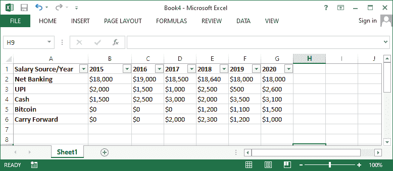

要在 Excel 中为上述数据创建图表，我们需要遵循下面提到的步骤:

*   首先，我们必须选择要记录在图表中的所有单元格，包括相应的行标签和列标题。所选单元格用作要创建的图表的源数据。在我们的示例中，我们需要从单元格 A1 到单元格 G6 选择单元格。
    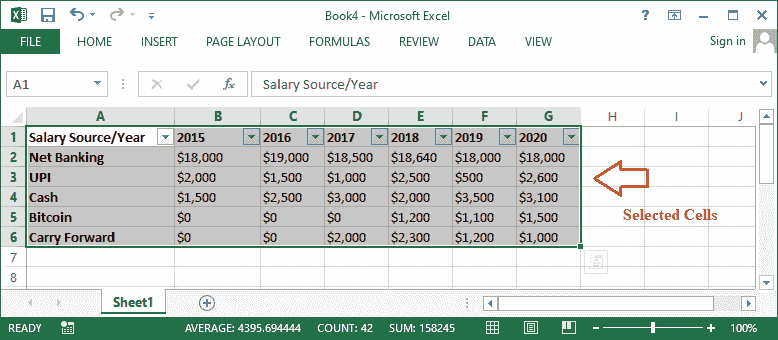
*   接下来，我们需要导航到**插入**选项卡，并从**图表**组中选择要插入的图表。
    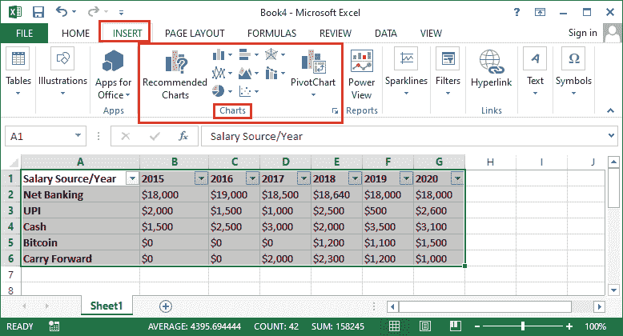
    如果所选图表类型下有更多图表，Excel 会显示所有可用选项。例如，当我们选择插入柱形图或条形图时，我们会得到以下图表选项:
    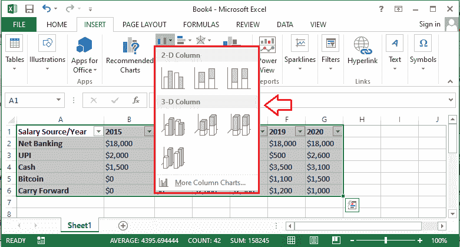
    在上图中，我们只需要点击所需的图表类型。只要我们单击所需的图表类型，相应的图表就会立即插入到活动数据表中。
    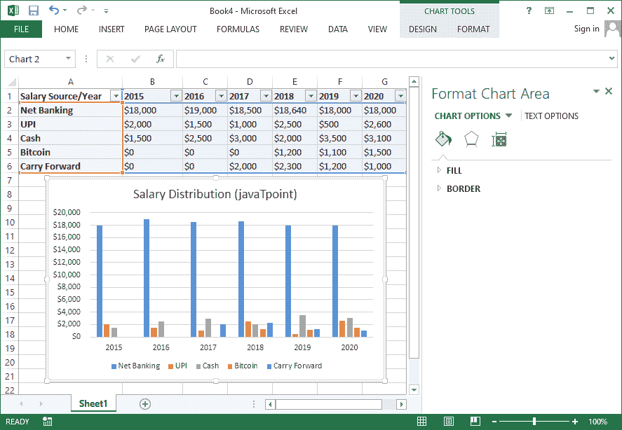

## 理解图表

Excel 支持多种图表，帮助我们选择正确的图表，使数据的图形表示更加有效。Excel 中经常使用以下图表:

*   **饼图:**饼图便于不同比例之间的比较。每个值都绘制为饼图的一部分；因此，它被称为饼图。饼图主要用于我们想要量化数值并以百分比显示它们的时候。这些图表很容易看出具体的数值，构成了整个饼图的百分比。
    T3】
*   **柱形图:**柱形图用竖线表示数值。这些图表可以轻松处理多种数据类型。然而，它们通常用于比较数据。柱形图有助于在垂直表示中比较不同类别的值。
    T3】
*   **条形图:**条形图与柱形图几乎完全相同。条形图和柱形图的唯一区别是条形图使用水平条，而不是柱形图的垂直条。当我们希望在水平表示中比较某些类别的值时，通常使用条形图。
    T3】
*   **折线图:**折线图以突出趋势而闻名。这些图表使用图形界面中的不同线条连接数据点。折线图帮助我们了解各个值是随时间增加还是减少，即天、月、年等。
    T3】
*   **面积图:**面积图的工作方式与折线图相同。面积图和折线图的唯一区别是，线下面的区域在面积图中填充，而在折线图中它们保持空白。
    T3】
*   **表面图:**表面图表示三维视图中的数据。它们最适合大数据。表面图可以帮助我们在三维环境中同时查看各种相关信息。
    T3】
*   **组合图:**组合图帮助我们选择聚集在一起的不同图表类型。例如，我们可以插入一个组合图来得到一个聚集的柱形图、副轴上的聚集的柱形图、堆叠的区域聚集的柱形图等。或者，我们也可以在组合图表下自定义我们风格的图表类型。
    T3】

根据我们使用的 Excel 版本，可以在图表部分找到其他几个图表。每张图表都是为特定目的而设计的，各有优点。如果我们不能确定选择一个合适的图表类型，我们可以通过插入选项卡下的**推荐图表**部分。此选项通常会根据源数据建议一些特定的图表。

## 更改图表类型

如果我们插入任何图表，但由于某种原因不喜欢它，我们总是可以将它更改为另一种图表类型。我们不需要重复整个过程。我们需要遵循以下步骤:

*   在上面的例子中，我们插入了一个柱形图。现在，我们将用折线图替换柱形图。
    
*   首先，我们需要进入设计选项卡，点击**“更改图表类型”**选项。我们必须确保选择了现有图表；否则，将不会显示“设计”选项卡。
    T3】
*   完成上一步后，Excel 将显示“更改图表类型”对话框。我们必须点击**“所有图表”**选项卡，选择所需的图表和相应的布局。在我们的例子中，我们单击并选择折线图。
    T3】
*   一旦选择了所需的图表，我们将看到新图表的预览。最后，我们需要点击**确定**按钮，相应的图表会以相同的数据瞬间插入到我们的 Excel 表中。在我们的示例中，柱形图已被折线图取代。
    T3】

## 调整图表布局和样式

插入图表后，我们可能希望更改图表中的几个元素在数据显示方式上的参数。从“设计”选项卡可以很容易地编辑图表的布局和样式。下面讨论一些最常见的图表布局和样式调整:

### 自定义图表

Excel 允许我们添加或插入所需的图表元素，如图表标题、图例、数据标签等。图表元素有助于使我们的图表更容易阅读。要插入图表元素，我们需要点击**设计**选项卡下的**“添加图表元素”**选项，然后从下拉菜单中选择所需的元素。

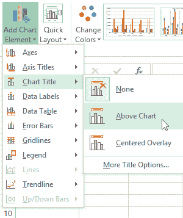

如果我们不想手动插入图表元素，我们可以使用 Excel 的预定义布局之一。我们需要点击**‘快速布局’**选项，通过点击下拉菜单图标选择需要的布局。

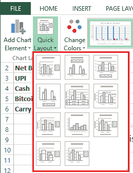

Excel 还提供了许多不同的图表样式，因此我们可以轻松地更改插入图表的外观和界面。要修改图表样式，我们需要从“图表样式”菜单中选择所需的样式。

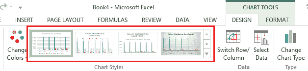

我们还可以使用图表格式快捷按钮来插入所需的图表元素、更改图表样式以及快速筛选图表数据。快捷方式位于图表的右侧，如下图所示:

### 切换行和列数据

有时我们可能需要改变图表对数据进行分组的方式。例如，薪资分配数据在下图中按年份分组，每个分配来源类型都有列。

但是，我们可以切换行和列，按照分布源类型对数据进行分组，每一年都有列。在这两种情况下(切换行和列之前和之后)，图表包含相同的数据——只是排列方式不同。我们可以按照以下步骤切换行和列数据:

*   首先，我们需要选择一个要在其中切换行和列数据的图表。
    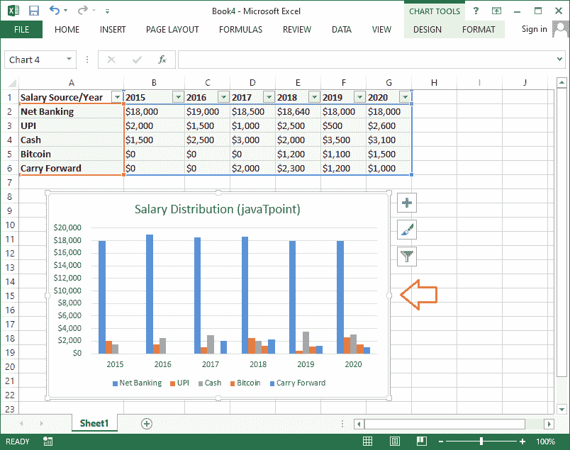
*   接下来，我们需要进入**设计**选项卡，选择**切换行/列选项。**
    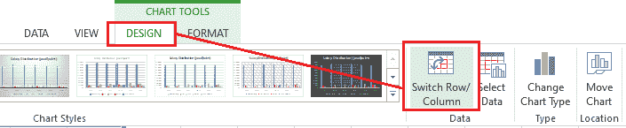
*   只要我们单击切换行/列选项，行和列数据就会立即切换。在我们的示例数据集中，数据被切换，现在按分布源类型可见，每一年有一列:
    

### 定位图例

Excel 还允许我们将图例位置移动到图表的任何一侧。例如，我们可以将图例向左、向右、向上和向下移动。

我们需要执行以下步骤来更改图表中图例的位置:

*   首先，我们需要选择要更改图例位置的图表。
    
*   接下来，我们需要点击图表右侧的加号(+)按钮。之后，我们将看到图表元素的列表。我们必须选择选项**图例**旁边的箭头，然后在相应的图表中为图例选择所需的位置。
    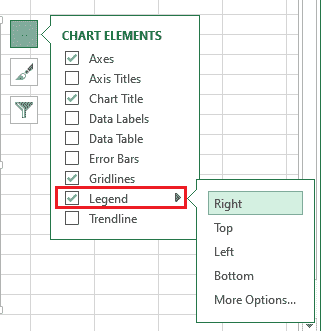
    在我们的示例数据中，我们将图例从图表的底部移到右侧:
    

同样，我们可以移动其他图表元素。尽管如此，我们可以通过选择列表中的复选框来启用/禁用图表元素，我们可以通过单击图表右侧的加号(+)图标来获得该列表。

### 移动图表

当我们在 Excel 工作表中插入图表时，它是以带有源数据的对象的形式插入的。Excel 允许我们将插入的数据移动到另一个工作表中。这样，我们可以将现有图表从一个工作表插入到另一个工作表中，并保持数据的有序性。

我们需要按照以下步骤将图表从一个 Excel 工作表移动/插入到另一个工作表:

*   首先，我们需要选择一个特定的图表，我们想移动到另一张表。
    
*   接下来，我们需要进入**设计**选项卡，选择**“移动图表”选项。**
    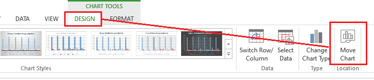
*   选择移动图表选项后，Excel 将显示移动图表对话框。
    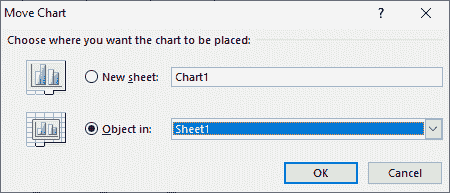
    在这里，我们必须选择想要的位置或者工作表来移动相应的图表。如下所示，我们选择“新建工作表”选项，将选定的图表移动到新的工作表中。
    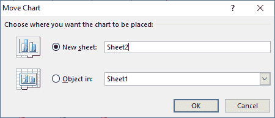
    选择所需位置后，必须点击**确定**按钮。Excel 将创建一个新工作表，选定的图表将被移动到相应的工作表中。在我们的示例中，图表现在被移动到新的工作表中，即工作表 2:
    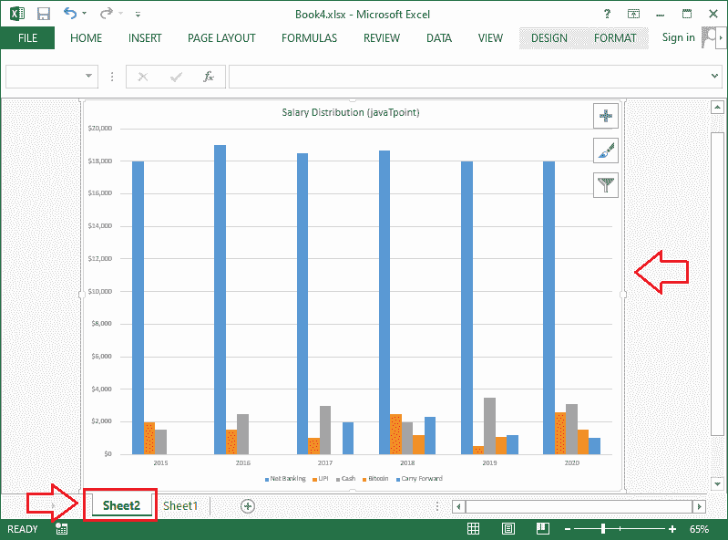

### 保持图表最新

默认情况下，当我们向电子表格中添加更多数据时，新数据可能不会包含在图表中。我们可以通过手动调整特定的数据范围来修复它。我们可以单击并选择图表，这将突出显示活动工作表中的数据范围。然后，我们可以单击并拖动右下角的手柄来更改数据的范围。

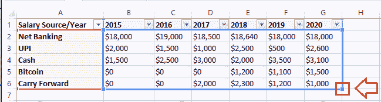

如果我们经常向工作表中添加更多数据，更新数据范围会变得很困难。然而，还有一个更简单的方法。我们应该将源数据格式化为表格，然后基于该表格创建图表。向表的底部添加更多的数据将自动连接表和图表，保持所有内容一致和最新。

* * *