# Excel ISERROR()函数

> 原文：<https://www.javatpoint.com/excel-iserror-function>

顾名思义，ISERROR()是 Excel 的一个逻辑函数。这是 Excel 的一个特殊功能，用于识别单元格是否会被引用为错误。该功能能够检测所有类型的错误。

如果 ISERROR()函数发现指定单元格有任何类型的错误，它将返回真。或者，如果被引用的单元格没有错误，它将返回 FALSE。因此，单元格引用在此函数中作为参数传递。

此函数处理错误 Excel 使用不正确的值或数据生成的错误，如-#不适用，#值！，#NUM！，#REF！，#DIV/0！，#NAME？，或空。

## ISERROR()函数的性质

1.  ISERROR()函数是一个可以识别 Excel 工作表中所有类型错误的函数。
2.  它以单元格引用作为参数。
3.  它还可以传递一个数字表达式来识别其中的错误。例如 34/0。
4.  函数的作用是:如果发现错误，返回真。否则，如果没有检测到任何错误，它将返回 FALSE。
5.  如果在此函数中提供了对空单元格的引用，它将返回 FALSE，因为它不会将空单元格视为错误。
6.  如果单元格已经包含错误，并且您使用该单元格进一步执行操作，If 将再次返回您的错误。
7.  ISERROR()函数与 IF()函数一起使用来查找和处理错误。

## 为什么要使用 ISERROR()函数？

您的 Excel 数据中可能会出现缺失值。如果对这样的数据执行进一步的操作，它会给你一个错误，而不是一个有价值的结果。

**比如**，如果你用 0 除一个数，会产生一个错误，即#DIV/0！。如果对它进行进一步的操作，你会得到更多的错误。因此，在进行此类操作之前，请检查操作中是否有任何错误。

**ISERROR()** 函数是一个帮助您识别可能由于此类操作而发生的错误的函数。然后，您可以避免执行这些操作，因为这些操作会产生错误。

### 句法

ISERROR()函数只接受一个参数，这是必须在其中提供的。

ISERROR(value)

此值参数可以是单元格引用、数值表达式、值、数字或要测试错误的表达式。

### 返回值

函数的作用是:返回一个布尔值，真或假(一次一个)。

如果在给定的表达式中发现错误，它将返回真。否则，它将返回 FALSE，因为在值/表达式中找不到任何错误。

### 例子

这里有一个粗略的例子，你可以用它来学习不同的价值观。

| 数据(值) | 公式 | 返回值 | 描述 |
| Two hundred and fifteen | =IFERROR(215) | 错误的 | 215 是正常的数值，不是错误。因此，它将返回 FALSE。 |
| #不适用 | = ifror(# na) | 真实的 | 这已经是一个错误。如果进一步执行操作时出现错误，它将再次生成错误。所以，它返回真。 |
| 13/0 | =IFERROR(13/0) | 真实的 | 13/0 是除以 0 (#DIV/0)的错误。然而，它将返回真。 |
|  | =IFERROR() | 错误的 | 如果您传递空白单元格的引用，或者在此函数中不传递任何值，它将返回 FALSE，因为这不是错误。 |
| #VALUE！ | IFERROR(#VALUE！) | 真实的 | 它返回真，因为它是一个错误。 |

现在，让我们在 Excel 工作表中用 ISERROR()函数实现这些表达式或值。在 Excel 数据上向您展示所有这些示例，以便您也可以验证其结果。

### 例 1

**步骤 1:** 我们在 Excel 工作表中存储了以下值和表达式。我们将检查这些值或表达式是否是错误的。

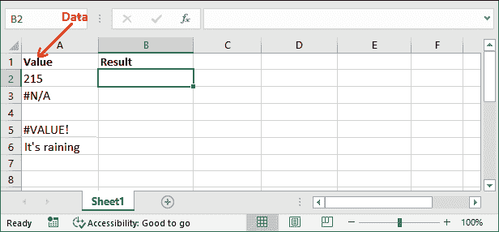

**第二步:**首先，对于 A2 单元格值，编写如下 IFERROR()函数。

=ISERROR(A2)

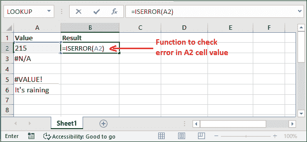

**第三步:**按下**回车**键，得到布尔值结果，根据表达式/值为真或假。

请注意，它为下面的表达式返回了 FALSE，因为这不是一个错误。

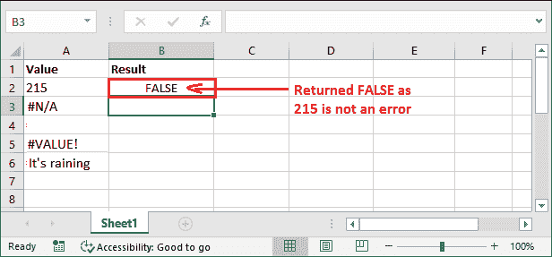

**步骤 4:** 现在，我们将检查另一个值的错误(单元格 A3)。所以，为它写下下面的 IFERROR()公式。

=IFERROR(A3)

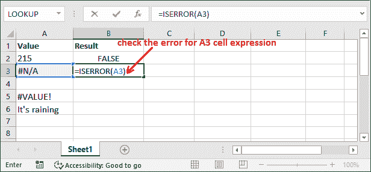

**第五步:**按**回车**键得到结果，看会返回什么。您可以看到它返回了 FALSE，因为该表达式包含一个错误。

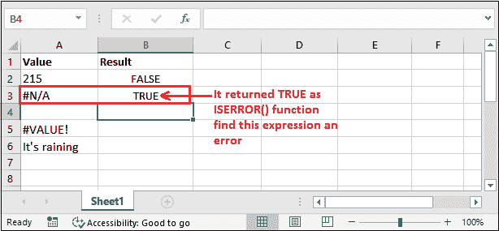

**第 6 步:**查看所有表达式的结果，即使是字符串参数。

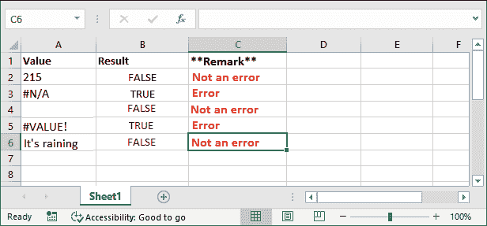

以上都是简单表达式和值的简单示例，包括字符串参数。

#### 注意:当 Excel 在 ISERROR()函数中提供的表达式中发现 Excel 错误时，它总是返回真。

### 例 2

我们会给你看一个表情。不要混淆他们。传递内部 ISERROR()函数的方式可以改变结果值。

我们已经告诉过你，像 17/0 这样的表达式会产生**除以 0** 的误差。

让我们看一个例子-

**步骤 1:** 我们在单个 B3 单元中存储了一个数值表达式(被零除)，我们想要检查它是否是一个错误。

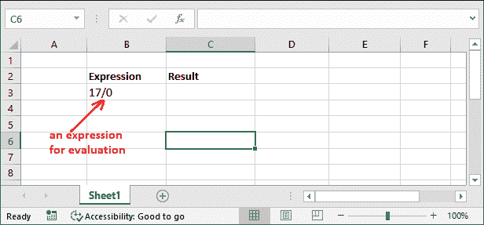

**第二步:**在相邻单元格中为其写入 IFERROR()公式。

=ISERROR(B3)

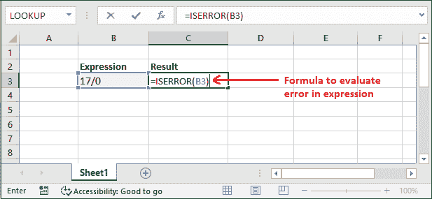

**第三步:**点击**进入**键获取结果。根据我们的研究，它必须返回真，因为这个表达式是一个生成 **#DIV/0 的错误！**错误。但是它返回了 FALSE。

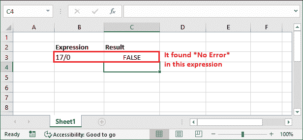

意思是——这个函数已经把 A4 单元格的值(表达式- 17/0)作为字符串，没有发现任何错误。这就是它在这里返回 FALSE 的原因。

**步骤 4:** 为了避免这个错误，像这样在不同的单元格中提供这些值，然后应用 is error()函数。

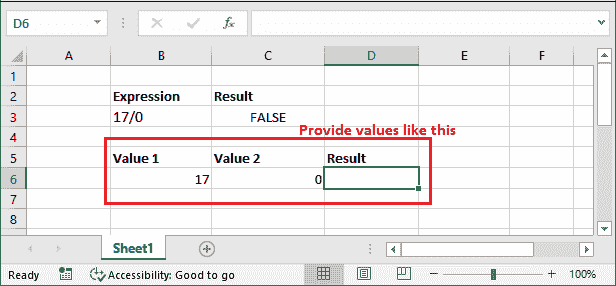

**第五步:**为此，以这种方式编写 ISERROR()公式来计算除以 0 表达式。

=ISERROR(B6/C6)

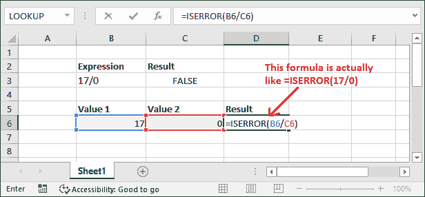

**第六步:**再次点击**进入**键，同样得到结果。你现在会看到它这次返回了**真**。它的意思是——它这次把这个表达式当成了一个错误。

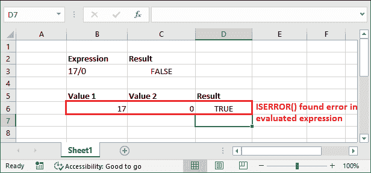

您可以比较这里给出的两个结果，避免在函数内部提供值时出错。学习这个例子很重要。

#### 注意:在正确评估表达式时，您可能会犯这样的常见错误。所以，使用时要小心。

### 示例 3:统计错误数量

如果您希望计算 Excel 工作表中出现的错误总数，可以在 ISERROR()函数的帮助下轻松完成。ISERROR()与 SUMPRODUCT()函数一起使用来计算错误的数量。

这个例子将展示如何做到这一点:

**第一步:**看到下面的数据，其中包含一些正常数据和一些错误。对于此工作表，我们将检查总错误。

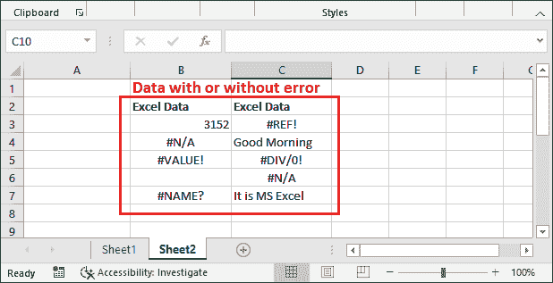

**步骤 2:** 使用 SUMPRODUCT()和 ISERROR()为一系列单元格(B3:C7)编写以下公式。

=总积（--ISERROR（ B3：C7））

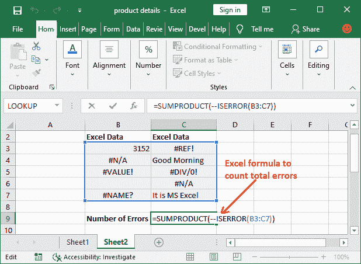

**第三步:**按下键盘的**回车**键，查看结果。

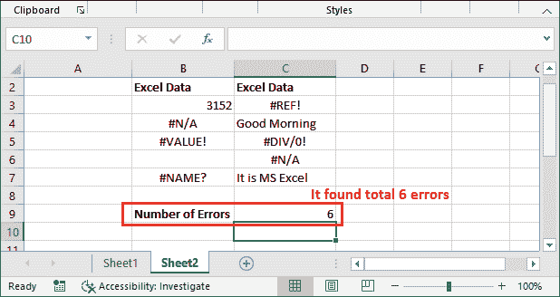

同样，您可以找到并获得整个工作表中所选和或的总误差。

### 用上述公式计算误差如何？

=总积（--ISERROR（ B3：C7））

SUMPRODUCT()接受了一个或多个数组，并计算了相应数字的乘积之和。看看所有这些完整的公式是如何工作的:

1.  首先，ISERROR()函数查找范围内所有选定单元格的结果。
2.  它返回{假、真、真、假、真、真、假、真、真、真、假}并转换为 0 和 1。看起来像这样{0，1，1，0，1，1，0，1，1，0}。
3.  现在，SUMPRODUCT()函数将所有 1 值的结果相加，并返回给 Excel 用户。
4.  它已返回结果值 6，因为所选数据中有六个错误。

*不使用 SUMPRODUCT()功能，也可以使用 SUM()但是要按 **Shift+Ctrl+Enter** 而不是简单的按 **Enter** 键才能得到结果。*

### 示例 4:处理错误

ISERROR()函数与 IF()函数一起使用来查找和处理错误。当在 IF()函数中使用 ISERROR()函数时，您可以提供一个自定义消息来告诉用户错误。

=IF(ISERROR(值)、“自定义错误消息”，值))

**返回值**

如果函数发现错误，它将返回您提供的自定义消息。否则，它将返回值本身，而不会发现任何错误。

**自定义错误信息的步骤**

请参见以下步骤，了解如何实际完成:

**第一步:**看给定的数据，其中一个是错误数据，另一个是正常数据。首先为 A2 单元格编写以下公式。

=IF(ISERROR(A2)，“这是一个错误”，A2)

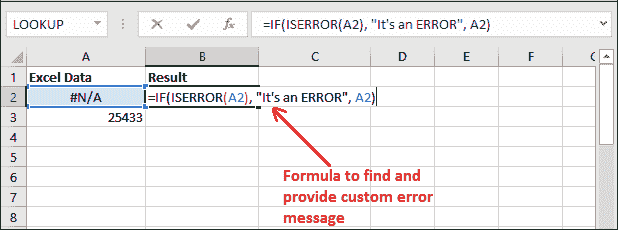

**第二步:**得到结果，看到已经返回自定义消息“**是错误**，因为发现了#N/A 错误。

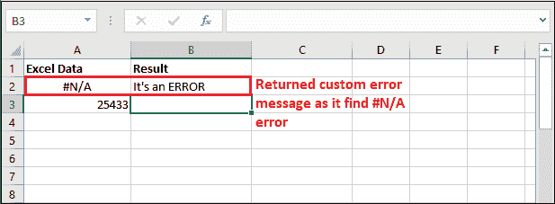

**第 3 步:**为下一个包含数字的单元格 A3 编写公式。

=IF(ISERROR(A3)，“这是一个错误”，A3)

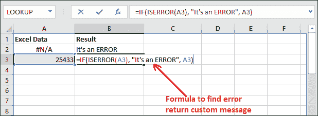

**步骤 4:** 这一次，它已经返回了值本身，因为它在 A3 单元格中没有发现任何错误。

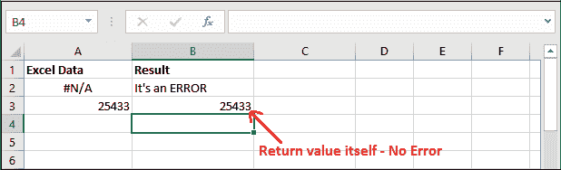

* * *