# Excel 加载项

> 原文：<https://www.javatpoint.com/excel-add-ins>

Excel 加载项为微软 Excel 用户提供了额外的功能。外接程序增强了 Excel 用户无法直接使用的 Excel 功能，方法是在 MS Excel 中跨不同平台(包括 Windows、Mac、Linux 操作系统)添加它们。

加载项启用了微软 Excel 没有直接提供的功能，用户也很少需要它们。每当用户需要时，他们可以激活、安装和使用它们。Excel 用户必须执行一些额外的步骤来激活外接程序。

加载项是可选的，如果您需要，可以通过安装来使用它们。本章将讨论 Excel 加载项以及如何和何时在 Excel 应用程序中使用它们。

## 什么是 Excel 加载项？

外接程序是 Excel 的附加功能，Excel 用户不能立即使用。用户必须在需要时手动激活它们。Excel 提供了一些预构建的加载项，您还可以创建自定义加载项。除此之外，一些网站还提供了可下载的 Excel 加载项。

外接程序也被称为插件。它们为 Excel 用户提供了额外的功能。

一个预建 Excel 插件的例子，比如**分析工具箱**，有些可以从下载中心下载。这些加载项是由第三方设计的。

## 加载项的类别

您可以将 Excel 加载项分为三个不同的类别-

1.  [Excel 预建插件](#prebuilt)
2.  [可下载加载项](#Downloadable)
3.  [自定义加载项](#Custom)

详细学习这些类别。

### 1.Excel 预构建加载项

微软 Excel 提供了预建的加载项，但默认情况下不会被激活。当您需要使用这些加载项时，您必须手动激活它们。当您在系统中安装微软 Excel 应用程序时，它们会随之而来。

您不需要显式下载这些外接程序。Excel 预构建的外接程序是-分析工具箱和求解器。**分析工具箱**用于用户需要对 Excel 数据进行复杂分析时。

按照本章中 **<u>激活预建 Excel 加载项</u>** 的主题，激活您的 Excel 应用程序的预建加载项。

### 2.可下载的加载项

在脱机模式下，某些加载项在 MS Excel 应用程序上不可用。因此，您必须从互联网手动下载它们，然后为您的微软 Excel 应用程序激活它们。

这些 Excel 加载项也可以在互联网上找到。你必须下载然后激活才能使用它们。他们没有微软 Excel。这些加载项也可以在微软 Excel 的官方网站上找到，其他几个网站也向 Excel 用户提供。

按照本章中的 **<u>主题下载并激活加载项</u>** 来激活您的 Excel 应用程序的预构建加载项。

### 3.自定义加载项

有时，自定义外接程序由开发人员和解决方案提供商自己设计，以根据用户需求提供解决方案。这些自定义外接程序像自定义组件对象模型(COM)、VBA 外接程序、自动化外接程序或 XLL 外接程序。

您还必须安装自定义加载项才能使用它们。按照下面本章中的 **<u>主题创建自定义加载项</u>** 来激活 Excel 应用程序的预构建加载项。

## 激活预建的 Excel 插件

Excel 有一些预构建的外接程序，默认情况下是禁用的，因为通常不需要它们。有时，Excel 用户会有这些加载项的需求。Excel 允许用户随时激活预构建的外接程序。

**分析工具箱**是 Excel 的预建插件之一。当用户需要对 Excel 数据进行复杂分析时，需要分析工具箱。我们将在下面的步骤中激活此外接程序。

以下是激活/启用此外接程序的步骤。

**第一步:**右键点击你的 Excel 功能区进行自定义。

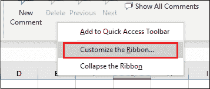

**第二步:**在面板右侧，点击**插件**选项，显示相关选项。

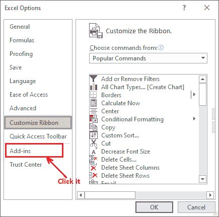

**步骤 3:** 现在，确保在**管理**下拉列表下选择 **Excel 加载项**，然后单击**转到**按钮。

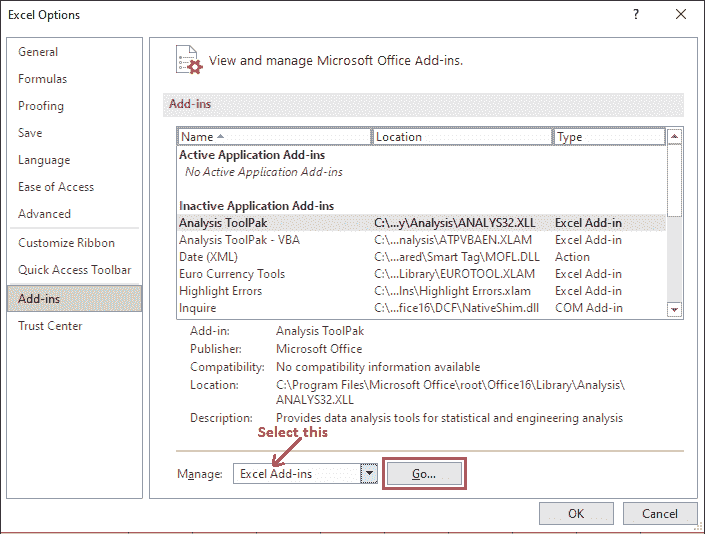

**第 4 步:**选中**分析工具箱**复选框，点击**确定**。这个预构建的外接程序将插入到 Excel 功能区的“数据”选项卡中。

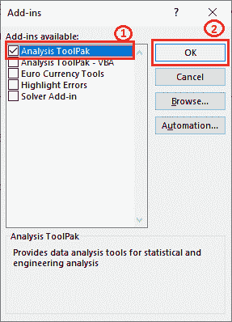

**第 4 步:**导航到**数据**选项卡，看到**分析工具库**最终已经添加到该选项卡。

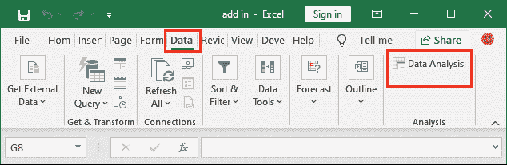

现在，这个外接程序可用于复杂的数据分析。它是为所有 Excel 工作簿插入的。

## 下载并激活加载项

我们从网上下载了一个 **Excel 到 JSON 转换器插件**供 Excel 将 Excel 数据转换成 JSON 格式。这个插件不是直接激活的，当我们从网上下载时，我们必须手动加载和激活它。它在“加载项”选项下的“开发人员”选项卡中可用。

按照本章中的 **<u>主题下载并激活加载项</u>** 来激活您的 Excel 应用程序的预构建加载项。

请参阅以下步骤，将外接程序下载并添加到您的 MS Excel 应用程序中。

**第一步:**进入**开发者**标签，点击这里的**插件**按钮。

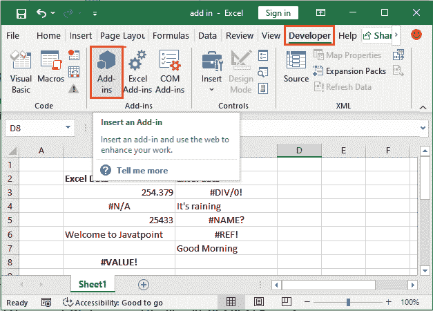

**第二步:**你会看到一个名为加载项的 Excel 转 JSON，点击选择后点击**添加**。

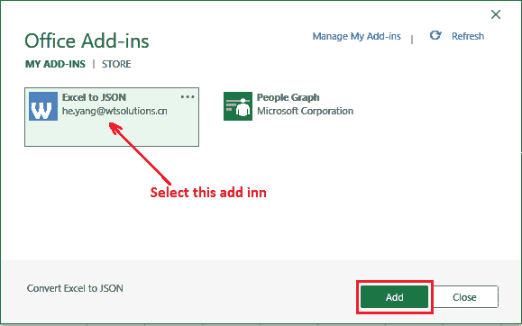

**第 3 步:**一旦外接程序加载到 Excel，就会出现这样的消息。

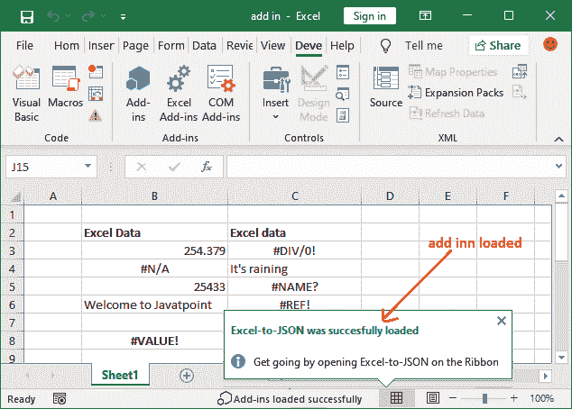

#### 注意:当加载项加载到 Excel 应用程序时，Excel 会自动为下载的加载项创建一个新选项卡。但是您必须手动将其添加到功能区。

**步骤 4:** 如果此下载的加载项未作为新选项卡或现有选项卡包含在 Excel 功能区中，请自定义您的 Excel 功能区。(在功能区上单击鼠标右键以自定义功能区)


**步骤 5:** 现在，要将下载的外接程序包含到 Excel 功能区中，请在下拉列表中选择**主选项卡**。然后选择 **Excel 转 JSON** 选项卡，点击**添加**按钮。

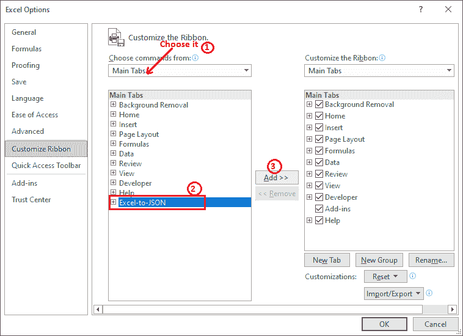

**“默认情况下，页签名称与 add-inn 名称相同，即 Excel-to-JSON”**

**步骤 6:** 您下载的加载项现在被添加到 Excel 功能区的新选项卡中。现在，点击**确定**保留更改。

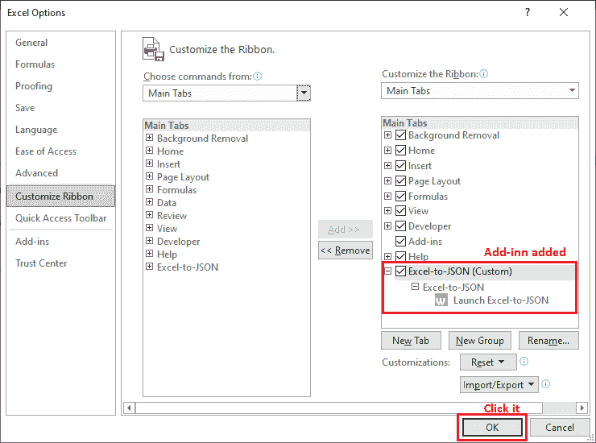

**第七步:**现在可以看到带有 Excel-to-JSON 插件的 **Excel-to-JSON** 选项卡现在添加在 Excel 功能区的末尾。

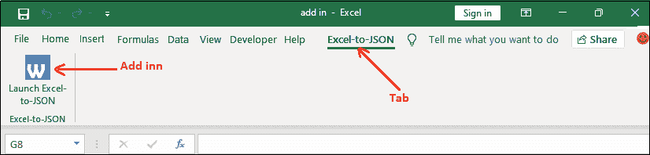

同样，您可以根据自己的需求下载互联网上的其他加载项并激活它们。

## 创建自定义外接程序

Excel 允许用户通过创建宏来创建自定义加载项。当用户需要在不同的工作簿中运行宏时，Excel 会更有用。

假设您有一个包含一些数据的 Excel 工作表。它也可能包含一些错误。您想要突出显示有错误的单元格。在自定义外接程序的帮助下，只需点击一个按钮就可以非常轻松地完成。使用编程创建外接程序。你必须遵循以下三个步骤:

### 步骤 1:在 VBA 模块中编写代码

1.  要转到 VBA 代码编辑器，请打开目标 Excel 工作表，然后按 Alt+F11。
2.  在这个 VBA 编辑器中，您将在面板的右侧看到**表 1** (在微软 Excel 对象下)。
    T3】
3.  右键点击**第 1 张**，点击**插入**，然后选择**模块**。
    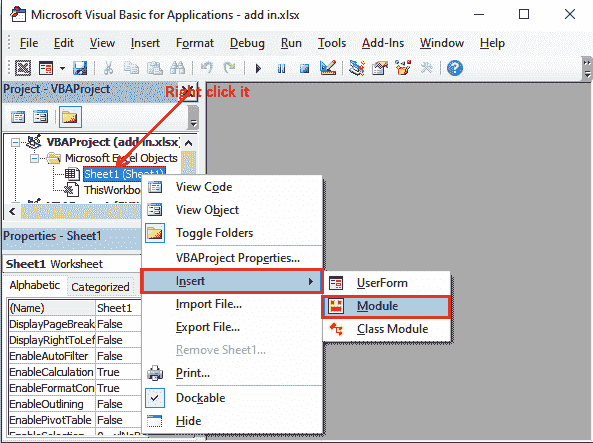
4.  现在，在您的 VBA 代码编辑器中编写以下代码。它将突出显示所有有错误的单元格。

```
Sub HighlightErrors()
Selection.SpecialCells(xlCellTypeFormulas, xErrors).Select
Selection.Interior.Color = vbGreen
End Sub

```

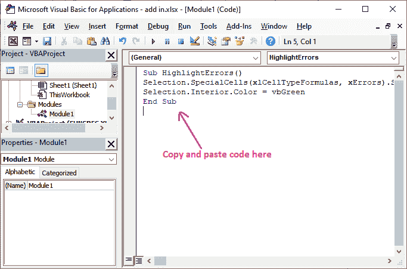

按 Alt+F11 返回 Excel 工作表。

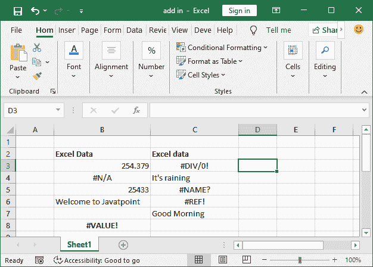

### 步骤 2:保存并安装外接程序

成功插入代码后，您必须保存该代码，然后安装外接程序。

1.  点击**文件**，然后**另存为**
    T5】
2.  提供文件名并选择文件扩展名**。xlsm** 。(文件名将是您的附加名称)。我们已经用**高光错误. xlsm** 保存了文件。
    
3.  您可以注意到，文件位置会自动更改。
    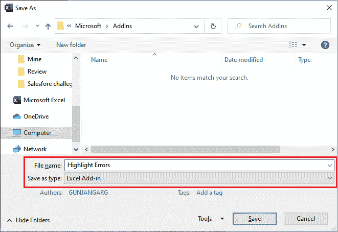
4.  现在，打开工作表，进入**开发者**选项卡> **插件**部分>点击 **Excel 插件**
    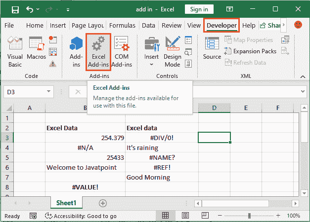
5.  在“加载项”对话框中，找到您在步骤 2 中使用的加载项的文件名。选中复选框，点击**确定**。
    T3】
6.  突出显示错误插件现已激活，但您现在可能看不到任何添加到您的 Excel 功能区的选项卡或按钮。
7.  所以，右键点击你的 Excel 功能区，点击**自定义快速访问功能区**
    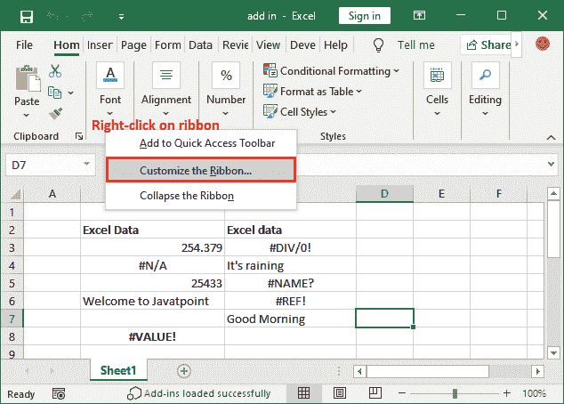
8.  在这里，从下拉列表的选择命令中选择**宏**，现在点击**突出显示错误**，然后点击**添加**
    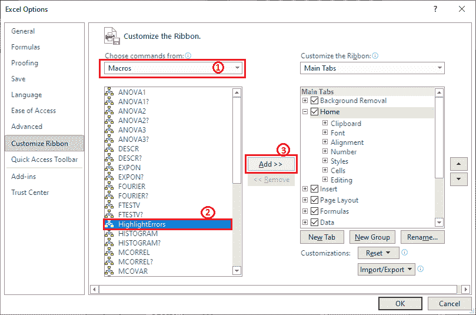
9.  您可能会看到一个错误对话框“此命令需要添加一个自定义组”。所以，你必须创建一个新的组来添加这个**高亮错误**
    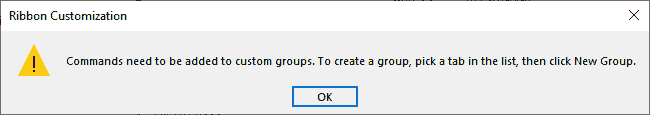
10.  要创建群组，请选择“主页”、“插入”等选项卡，然后单击**新建群组**。我们选择了公式选项卡。
    T3】
11.  确保添加了一个新组。你可以改名。我们已经将其重命名为**自定义插件**。
    T3】
12.  现在，再次尝试将**高光错误**添加到**公式**中的这个**自定义添加**组。您可以在下面的截图中看到高光错误被添加。
    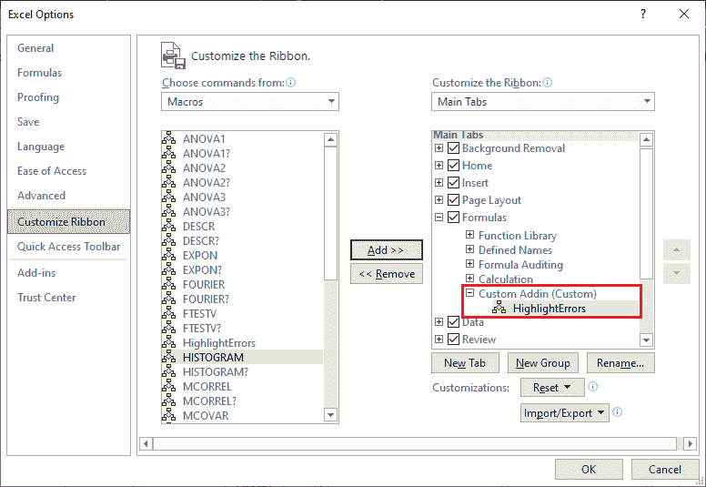
13.  转到**公式**选项卡，看到一个按钮**高亮错误**被添加到新创建的组自定义插件中。
    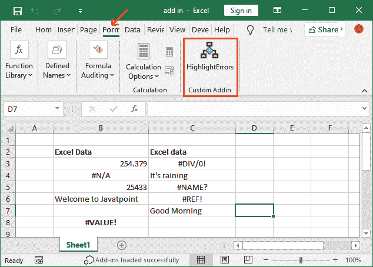

此外接程序现在可用于所有 Excel 工作簿。使用此自定义插件**“高光错误”**检查并突出显示 Excel 工作表中的绿色错误。

* * *