# excel 中的 IF()

> 原文:[https://www.javatpoint.com/if-in-excel](https://www.javatpoint.com/if-in-excel)

IF()是 excel 中的一个逻辑测试，它确定函数中给出的条件在 excel 数据中是否正确。我们可以直接说它运行一个测试，返回 **True** 或者 **False。**

该公式由下式给出:

```

IF(logical_test, [value_if_true], [value_if_false])

```

上述公式规定，如果指定的逻辑正确，excel 将返回[value_if_true]中指定的值。如果指定的逻辑不正确，它将返回[value_if_false]。

哪里，

**Logical_test:** 包含待求值的表达式。

**[value_if_true]:** 包括表达式为真时返回的值。

**[value_if_true]:** 包括表达式为假时返回的值。

例如，

A = 30

B = 50

让条件为甲>乙

现在，excel 将检查条件，并将匹配变量中的指定值。如果条件被发现是正确的，它返回真，否则它返回假。

在上例中，A < B. But, according to the specified condition A > B

因此，excel 将返回**假。**

上面的例子可以表示为:

**IF(A > B，真，假)**

#### 注意:我们只能在 IF()函数中直接指定 TRUE、FALSE 和数字。如果我们想指定其他参数(通过、失败)，我们必须用双引号将这些参数括起来。

让我们讨论传递不同值的方法。

**情况 1:真或假**

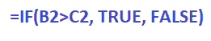

哪里，

B2 和 C2 是手机号码。

如果上述逻辑测试为真(B2 大于 C2)，函数将返回**真。**如果为假(B2 比 C2 小)，If()函数将返回 **FALSE。**

**情况 2:通过或失败**

通过和失败是 excel 中未指定的参数。为此，我们需要用双引号将这些值括起来。否则，excel 将返回一个错误。

它由下式给出:

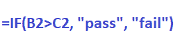

哪里，

B2 和 C2 是手机号码。

如果上述逻辑测试为真(B2 大于 C2)，函数将返回**通过。**如果为假(B2 比 C2 小)，If()函数将返回**失败。**

**情况 3: 1 或 0**

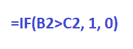

哪里，

B2 和 C2 是手机号码。

如果上述逻辑测试为真(B2 大于 C2)，函数将返回 1。如果为假(B2 比 C2 小)，If()函数将返回 0。

**情况 4:或大或小**

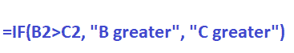

哪里，

B2 和 C2 是手机号码。

如果上述逻辑测试为真(B2 大于 C2)，函数将返回 **B 大于。**如果为假(B2 比 C2 小)，If()函数将返回 **C 大。**

我们还可以将上述逻辑测试指定为:

同样，按照上述情况，我们可以根据 excel 中的数据传递函数中的任何参数。我们将在本主题后面讨论实际的例子，以便更好地理解。

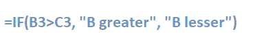

**情况 5:结果公式**

这里，函数返回的值将作为公式。

它由下式给出:

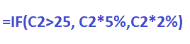

哪里，

C2 是手机号码

如果上述逻辑测试为真(单元格 C2 中的值大于 25)，该函数将返回公式中的值。也就是说，它会将结果单元格值乘以 **5% (C2 * 5/100)。**如果为假(C2 小于 25)，If()函数将返回 2% **(C2 * 2/100)的结果单元格值。**

同样，我们可以使用任何公式作为不同逻辑运算符的组合。

**情况 6:带 AND 功能的 IF()**

带“与”的 IF()函数由两个逻辑测试条件组成。如果两个指定的条件都是**正确的话，“与”功能将输出为**真**。**否则会认为不正确而返回值。

它由下式给出:

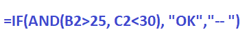

哪里，

B2 和 C2 是手机号码

如果上述逻辑测试为真(B2 大于 25，C2 小于 30)，该功能将返回 **OK。**如果一个或两个逻辑测试被发现为假，If()函数将返回 **-。**

**情况 7:带 OR 功能的 IF()**

带有“或”的 IF()函数也包括两个逻辑测试条件。如果两个指定条件都不正确**，或函数将输出为**假**。**否则，如果函数中指定的一个或两个逻辑测试正确，它将返回值 true。

它由下式给出:

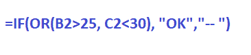

哪里，

B2 和 C2 是手机号码

如果上述逻辑测试为真(B2 大于 25 或 C2 小于 30 或两个条件都满足)，该功能将返回 **OK。**如果两个逻辑测试都为假，If()函数将返回 **-。**

**情况 8:带 NOT 功能的 IF()**

顾名思义，带有 IF()的 NOT 函数将以**反转**的方式工作。这意味着如果一个条件为真，它将返回值来代替假。它只包含函数中的一个逻辑测试。

声明由以下人员给出:

=IF(NOT(某物为真)，值为真，值为假)

例如，

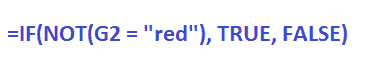

哪里，

G2 是单元格编号

如果在单元格 G2 中找到的值为红色，该函数将返回 **FALSE。**否则，返回真。例如，如果 G2 是绿色的，函数将返回真。

## 例子

让我们考虑一些例子。

### 例 1:检查学生考试是不及格还是及格。

让我们认为及格分数是 100 分中的 **60** 。在这里，我们会找到考试及格或不及格的学生。

步骤如下:

1.  点击**结果**列的第一个单元格。
2.  键入 **'=IF(C3 > 60，“通过”、“失败”)，'**如下所示:
    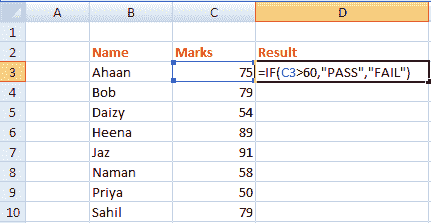
3.  按**回车。**第一个学生的成绩会出现。
    我们可以在每个单元格上随机键入相同的函数，或者执行拖放方法。
4.  点击第一个单元格的右下角，下拉到最后一个单元格，如下图:
    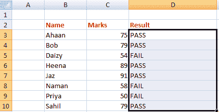
    函数内的相同公式会自动应用到该列的其余单元格。所以，八个学生中，五个通过了，三个失败了。

### 例 2:根据绩效增加工资。

在这里，我们将根据组织中 10 名不同员工的绩效分数来增加工资。

步骤如下:

1.  点击**增量%** 列的第一个单元格。
2.  类型 **'=IF(C3 > 7、“40%”、“15%”，**如下所示:
    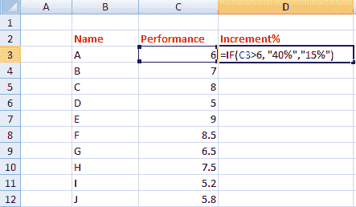
3.  按**回车。**会出现第一个学生的增量%。
4.  点击第一个单元格的右下角，下拉到最后一个单元格，如下图:
    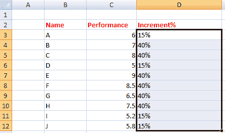

函数中的相同公式将自动应用于列的其余单元格。因此，在 10 名员工中，4 名员工获得了 15%的增量，6 名员工获得了 40%的增量。

### 示例 3:使用 IF()函数生成公式作为结果

在这里，我们将为各种价格范围的商品提供折扣价。

步骤如下:

a.点击**折扣**栏的第一个单元格，如下图:

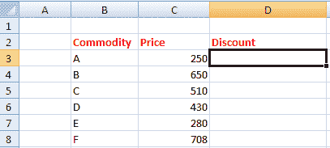

b.类型 **'=IF(C3 > 300，C3*10%，C3*20%)'**

c.按**回车。**会出现想要的折扣值。

d.单击第一个单元格的右下角，下拉到最后一个单元格，如下所示:

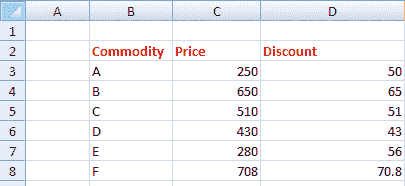

函数中的相同公式将自动应用于列的其余单元格。所以，有两种商品的价格低于 300。因此，此类商品将给予 20%的折扣，而其他商品将给予 10%的折扣。

### 示例 4:对 IF()函数使用 AND 和 OR

考虑 excel 中的以下数据。

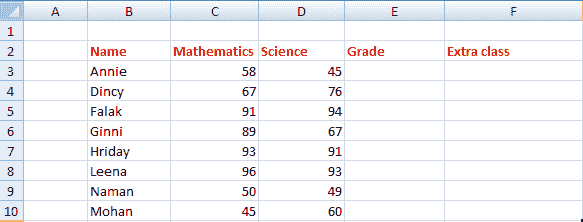

### 将与函数用于中频()

在这里，我们会找到获得**A 级的学生，**给予所有科目成绩在 90 分以上的学生。

步骤如下:

e.点击**等级**列的第一个单元格。

f.类型 **'=IF(AND(B3 > 90，C3 > 90)，“A 级”，“-”。”**

g.按**回车。**第一个学生想要的结果会出现。

h.单击第一个单元格的右下角，下拉到最后一个单元格，如下所示:

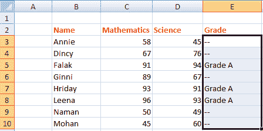

函数中的相同公式将自动应用于列的其余单元格。所以，在这个班的八个学生中，有三个学生获得了甲级。

这里，AND 函数将通过检查两个逻辑测试来工作。如果一个学生两科成绩都在 90 分以上，他/她就是 a 级，否则就不是。

### 将或函数用于中频()

在这里，我们会找到在这两个科目中任何一科都不及格的学生。它将提供需要参加相应科目的额外课程的学生名单。及格数字是 50。

步骤如下:

1.  点击**额外类**列的第一个单元格。
2.  键入 **'=IF(OR(C3 < 50，D3 < 50)，“YES”，“NO”)，'**如下所示:
    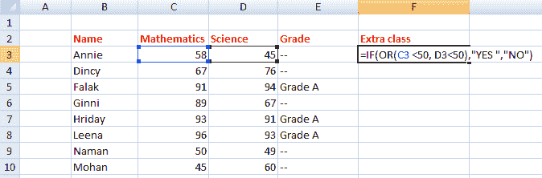
3.  按**回车。**第一个学生想要的结果会出现。
4.  点击第一个单元格的右下角，下拉到最后一个单元格，如下图:
    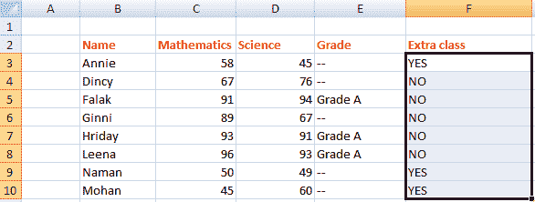

函数中的相同公式将自动应用于列的其余单元格。所以，在班级的八个学生中，**有三个**的学生需要额外上课。

在这里，OR 函数将通过检查两个逻辑测试来工作。如果一个学生在任一科目或两个科目的分数都低于 50 分，他/她就需要去上课。否则，不会。

* * *