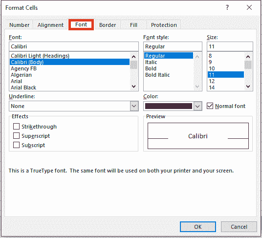
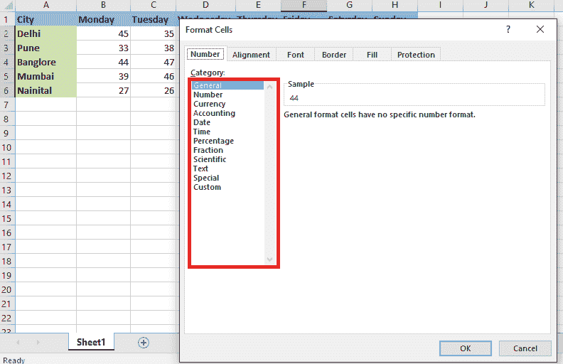

# 什么是 Excel 中的格式？

> 原文:[https://www.javatpoint.com/what-is-formatting-in-excel](https://www.javatpoint.com/what-is-formatting-in-excel)

Excel 中的格式意味着我们可以用来修改工作表中数据外观的技巧。我们可以用各种方式格式化数据，比如我们可以借助样式和**主页选项卡中的**格式选项卡**来格式化单元格或表格的字体。**

在 Excel 中格式化工作表(或工作表)数据比以往任何时候都更容易。有多种快速简便的方法可以生成专业的工作表，高效地展示我们的数据。例如，我们可以利用文档主题为我们的 Excel 电子表格提供一致的设计、应用预定格式的样式，以及其他手动格式化功能来突出重要数据。

微软 Excel 有几个功能，允许用户自定义他们的数据显示方式。这是有充分理由的:对单元格进行格式化有助于将注意力集中到基本数据上，或者更恰当地显示内容(例如，在包含价格值的单元格中添加$或者将代表日期的单元格配置到 **xx/xx/xxxx 的标准显示中)。**

Excel 格式化是数据准备之后的可选步骤，或者是准备数据进行分析所必需的所有**数据清理、结构化、丰富、**和**标准化**。

新数据很少没有自己独特的问题集；分析师有责任分析他们的数据，并保证这些数据能够满足他们分析项目的确切要求。拆分列，删除数据不完整的行，并根据某个名称进行标准化。

一旦完成，Excel 格式增加了最后的润色，确保数据得到适当的准备和呈现。

良好的格式将在多方面改善我们的数据:

*   在格式化的帮助下，我们可以正确地呈现我们的数据；例如，格式化为**日期**或**货币**将为我们的数据提供更多价值。
*   合并和调整数据是提高数据可读性的一个重要方面。
*   通过**增加大小、加粗、添加斜体、**或**改变字体**来格式化我们的文本将会改善我们工作表的整体外观。
*   使用样式**(像表格样式)**可以使我们的数据脱颖而出，并帮助读者专注于工作表的关键部分。
*   **条件格式**是一个有用的工具，可以用图形或可视的方式突出显示工作表的关键部分。这些是动态工具。突出显示的区域会随着我们的数据变化而变化。

## Excel 中数据格式化的好处

以下是 Excel 数据格式的一些优点:

*   数据似乎更具代表性。
*   数据格式化节省了大量的时间和精力。
*   借助图表，我们可以分析数据。
*   在格式的帮助下，我们可以突出显示特定的数据，如业务的利润或损失。

## 如何在 Excel 中设置数据格式？

让我们来看看 Excel 中数据格式化的一些简单实例。假设我们有一个简单的公司销售报告，如下所示:

我们需要格式化这份报告中的数据，因为它对观众没有吸引力。

现在，为了在 Excel 中格式化数据，我们将执行以下操作:

*   字号**更大。**
*   我们将列标题**的文本加粗**
*   **中心对齐**数据
*   我们将借助快捷键(Alt+H+B+T)来应用轮廓边框，
*   选择全表**(使用 Ctrl+A)**后，使用快捷键 **(Alt+H+O+I)** 调整列宽。
*   要更改背景，请使用“主页”上“字体”组中的“填充颜色”命令。

借助于**“格式绘制者”**命令，我们将对表的最后一行**“总计”**行使用类似的格式，该行位于**“主页”**选项卡上的“剪贴板”组中。

因为收集的金额是以货币表示的，所以我们必须使用位于**“主页”**选项卡上的“数字”组中可用的命令，将其格式化为货币。

选择需要格式化为货币的单元格后，点击上方箭头，打开**“格式化单元格”**对话框。

选择**【货币】**选项，点击**【确定】**

我们还可以将轮廓边框应用于表格。

现在我们的下一个任务是为报告生成一个标签。借助**形状，**我们将制作报告的标签。如果我们想从表格中创建上面的形状，我们需要添加两行。为此，我们必须通过**‘Shift+空格键’**选择该行，然后按**‘Ctrl+’+“**两次以插入两行。

现在我们可以插入形状，要插入形状，请转到**“插入”**选项卡的**“插图”**组中的**“形状”**命令，并选择适当的形状。

通过右键单击形状并选择**“编辑文本”，创建满足要求的形状并向其添加文本**

我们也可以利用**“格式”**上下文选项卡，用类似**“文本轮廓”、“文本填充”、“形状填充”、“形状轮廓”的命令来格式化形状。**等。我们也可以使用位于**【主页】**选项卡上的**【前台】**组中的命令对文本使用 excel 格式。

**条件格式**也可以用来吸引访问者对**【前 3】**和**【后 3】**销售人员的注意。要执行此操作，我们必须在条件格式中选择选项**顶部/底部**规则，然后我们必须选择名为**顶部 10 个**项目的选项。

之后，对话框将会打开，在这个对话框中，我们必须填充排名靠前的数字和我们想要的颜色。

同样，我们可以对底部 3 进行此操作。

我们还可以使用其他条件格式选项，如**数据条。**

我们还可以生成图表来显示数据，这也是**“Excel 数据格式”的一部分。**

## Excel 中设置数据格式的快捷键

Excel 中有各种快捷方式来设置数据格式:

*   **Ctrl+2** 或者 **Ctrl+B、**我们可以用这个快捷键把**的文字加粗。**
*   **Ctrl+3** 或 **Ctrl+l** 如果我们想使**文本倾斜，**那么我们可以使用这个快捷方式。
*   **Ctrl+4** 或者 **Ctrl+U** 如果我们想要给文字加下划线，那么这个快捷键是有帮助的。
*   **Alt+H，FA** 快捷键用于打开**【对齐】**对话框。
*   **Alt+H，FN** 快捷键用于打开**【前方】**对话框。
*   **Alt+H，FK** 用于使**文字的字号变小。**
*   **Alt+H，FG** 用于使**文字的字号变大。**
*   **Alt+H，B** 用于**添加边框。**
*   **Alt+H，A** 然后 **C** 用于**居中对齐**单元格内容。
*   **Ctrl+1** 打开**【设置单元格格式】**对话框。
*   **Ctrl+Shift+与符号(& )** 用于将**轮廓边框**应用于所选单元格。
*   **Ctrl+Shift+Percent (%)** 应用无小数位数的**百分比格式**。
*   **Shift+F8** 用于将非相邻单元格或范围添加到单元格选择中。
*   **Ctrl+5** 用于应用或删除删除线**数据格式 Excel。**

#### 注意:虽然 Excel 中的数据格式使标题突出、醒目和吸引人，但它也保证了它与我们呈现的内容有明确的联系。然后稍微增加列标题和行标题，并用不同的色调给它们上色。读者将快速浏览列标题和行标题，以了解工作表的内容是如何组织的。这将有助于他们确定和页面上最关键的信息，以及他们必须从哪里开始。

## 什么是 Excel 中单元格的格式？

在 Excel 中，单元格格式用于修改单元格编号的格式，而不修改实际编号。借助格式单元格，我们可以更改**的编号、对齐方式、字体样式、边框样式、填充选项、**和**保护。**

我们可以通过鼠标右键**进入该选项。**右键点击后，**会显示一个**弹出的**，然后我们要点击**格式单元格，**或者我们也可以使用键盘上的快捷键 **Ctrl+1** 。**

**

格式化单元格有五个选项卡用于格式化单元格。利用这个，我们可以修改**数据样式、对齐方式、时间样式，用不同的样式插入边框**，保护单元格等。

### 数字标签

Excel **数字标签**用于更改数字单元格的十进制格式，根据**数字、日期、百分比、分数、**等提供合适的格式。

借助**数字标签，**我们可以按照我们的要求格式化数字。我们可以从各种选择中进行选择，如货币、日期、时间、百分比等。

### 对齐选项卡

**对齐选项卡**可用于对齐单元格的文本，并将两个单元格的文本合并在一起。如果文本被隐藏，我们可以使用**环绕文本**来适当显示它，并将文本对齐到所需的方向。

在“正式单元格”对话框中，“对齐”选项卡允许我们指定我们的值如何对齐**、**水平对齐**和垂直对齐**。****

**

### Tab 字体

借助**字体标签，**我们可以更改**字体大小、字体样式、字体颜色、**等。我们可以改变**的字体效果，**我们可以**给文本加下划线**，并预览它将如何出现。

可从**首页选项卡快速更改字体；**但是，**正式单元格**对话框对于批量更改更有效。从那里，我们可以很容易地修改整个单元格选区的**字体、字号、斜体、磅值、粗体下划线、斜体、**和、**颜色**。

### 边框标签

通过使用**边框选项卡，**我们可以为各种样式创建彩色边框线；如果我们不想提供边框轮廓，可以将其留空。

我们可以在 Excel 中围绕单个单元格或一组单元格创建边框。我们可以选择线条的**粗细、颜色、**和**线条样式**以及它们将被创建的位置(例如，仅在单元格的顶部或所有水平边上)。

### 填充选项卡

我们可以使用**填充选项卡**以各种方式用颜色填充单元格或区域，组合两种颜色，甚至使用**填充选项将图片放入单元格。**

### 保护选项卡

保护选项卡可用于**保护单元格、范围、单元格、工作表、包含的公式、**等。

除非我们已经保护了工作表，否则“保护”选项卡不适用。为此，单击工具菜单中的**保护**，选择**保护工作表，**然后选择**内容复选框**以确定工作表将如何保护。当选择“锁定”选项时，我们被禁止执行以下操作:

*   修改单元格的数据或公式。
*   在空单元格中键入数据。
*   移动手机。
*   调整单元格大小。
*   删除单元格或其内容。

当我们选择**隐藏选项时，**所有用于计算数值的公式将不再在公式栏中查看(虽然我们仍然可以看到该公式的最终结果)。

## Excel 中的格式示例 1:

我们有下面提到的杂乱无章的数据，这看起来很简单。现在，我们将使用 Excel 格式化数据，并以可读的方式显示它。

以下是格式化数据时必须遵循的步骤:

*   首先，我们要选择**表头字段**并使其**加粗。**
    
*   然后，我们将选择整个数据，并在边框下选择名为**“所有边框”**的选项。
    T3】
*   结果，数据会出现如下:
    
*   现在，我们将选择标题字段，并使用边框下的**“粗框边框”**选项来创建粗边框。
    T3】
*   之后，数据会出现如下:
    
*   接下来，我们将在**中心制作标题字段。**
    
*   另外，选择白色以外的**背景色**。我们将在这里使用浅绿色。
    T3】
*   现在数据看起来更有代表性了。
    

## Excel 中的格式-示例 2

借助下面的例子，让我们更好地理解格式。

在这个例子中，我们有不同城市的每日天气预报。

现在我们要突出**周五**的数据。

*   首先，我们要选择整个数据记录，即**列“F”、**的数据，然后点击**右键。**之后会出现**下拉**框。我们将选择名为**“设置单元格格式”的选项。**
    
*   将出现**设置单元格格式**对话框。正如我们所看到的，有许多以各种方式改变字体样式的可能性。
    T3】
*   借助**数字按钮，**可以修改**百分比、小数、日期、时间**等数据类型。
    
*   借助**对齐按钮，**我们可以用不同的样式对齐字体。
    T3】
*   点击**字体按钮。**此按钮有许多字体样式选项。我们可以更改字体**类型、大小、样式、**和**颜色、**等。
    
*   在本例中，我们将使用 11 的**粗体字体和绿色的**颜色。**点击**边框按钮，**也可以让数据的边框更加明显。
    **
*   现在我们的数据看起来像下面的截图:
    

## Excel 中的格式-示例 3

在这个例子中。我们使用和以前一样的数据。在本文中，我们将尝试以图片形式呈现数据。

*   选择整个数据集，进入**插入菜单。**点击**柱形图，从二维柱形图中选择**堆积柱形图**。**
    
*   现在我们的数据看起来像下面的截图。
    

## Excel 用户的格式化技巧

大多数 Excel 用户都熟悉基本的数字和文本格式。另一方面，超越基础的用户将产生更具可读性和有效性的表单。此外，知道如何快速简单地将适当的格式应用于特定的单元格有助于用户提高工作效率。这些格式化提示将帮助用户充分利用 Excel 的格式化功能。

### 1.在工作簿之间复制样式

如果我们在多个工作簿中使用类似的单元格样式，不要浪费时间重新创建自定义单元格样式。相反，以下列方式将样式从一个文件复制到另一个文件:

*   首先，我们要打开**源工作簿**和一个目标工作簿。
*   然后从目标工作簿中，我们必须点击**主页**选项卡上样式组中的**单元格样式**。在 **Excel 2003 中，**从**格式菜单中选择样式。**
*   接下来，我们要选择图库底部的**合并样式**。
*   在结果对话框中，选择打开的工作表，它包含我们需要复制的样式。
*   点击**确定**两次。

如果我们希望所有新工作簿都具有相同的自定义设计，请打开 Excel 的默认工作簿 book.xltx .作为目标。(在 Excel 2003 中，打开 book.xlt)。添加样式后，保存并关闭模板文件。统一样式将包含在基于 book.xltx 的所有新工作簿中。

### 2.添加背景图像

将背景图像添加到工作表中是如此容易，以至于我们可能会想把所有的工作表都变亮。(当然，我们不会这么做)。要将图像添加到工作表背景，请执行以下操作:

*   首先，我们要点击**页面布局选项卡。**
*   然后，我们要点击**页面设置**组中的**背景**选项。
*   最后，浏览到该文件并双击它。

### 3.快速应用表格格式

如果我们选择一个范围，并从**格式为表格下拉列表中选择一个内置格式，** Excel (2007 及更高版本)会将该范围转换为表格对象。如果格式对我们有用，但我们不需要表对象，我们可以保留格式并转储表。

只需点击几下鼠标，但可能比手动格式化要少。要使用内置表格格式快速格式化数据区域，请执行以下操作:

*   首先，我们必须单击数据范围内的任何地方。
*   然后在**主页选项卡**上，我们必须点击**格式为表格下拉菜单**并从图库中选择一种格式。
*   当 Excel 询问该区域是否有标题时，请正确选择，然后单击“确定”。
*   单击表格中的任意位置。
*   在上下文**设计选项卡**当前状态下，在“工具”组中选择“转换为范围”。
*   然后我们必须单击是来确认操作。

### 4.创建指示用途的单元格样式

使用**单元格样式**来确定目的有助于用户更快地适应环境。对公司来说，保持一致性也是一种简单的技术。例如，颜色可以用来分隔输入和标记单元格。使用**细胞风格**是一个快速简单的技术来实现规则。为输入单元格制作一个**单元格样式**来演示这个概念:

*   单击**主页选项卡**，然后单击**单元格样式**组。在 Excel 2003 中，从**格式菜单**中选择并跳到第三步。
*   然后我们要点击列表底部的**新单元格样式**。
*   在结果对话框中输入样式的名称，如输入单元格。
*   然后点击**格式。**在 Excel 2003 中，我们要点击修改。
*   点击**边框标签**，在预设部分选择**轮廓选项**。
*   从“填充”选项卡中选择浅蓝色。
*   点击**确定**查看选择的格式，如下图:
*   再次点击**确定**。

### 5.在快照中更改颜色

假设我们制作了一个电子表格模型或仪表板。我们还想修改颜色，使之更有活力。只需从**页面布局**功能区左上角的**颜色框**中选择一种配色方案。微软已经提出了一些奇妙的调色板。这些对比非常好，在我们的电脑屏幕上看起来棒极了。我们也可以创建自己的配色方案(以匹配公司风格)。此外，我们可以设置字体方案或结合两者来创建一个新的主题。

### 6.使用格式刷

**格式刷**是所有办公程序自带的可爱工具。这对于将格式从一个地方复制到另一个地方很有用。请看下面的截图，以了解它是如何工作的。格式刷位于**家居飘带的左上角。**

应用此公式后，输出为:

### 7.格式化键盘快捷键

Excel 中有许多快捷方式可以用来格式化数据。格式化是一项日常活动。我们在撰写电子邮件、准备报告、创建工作簿、制作演示文稿或绘制一些东西时会这样做。了解一些格式快捷方式将有助于我们提高工作效率。以下是一些格式化键盘快捷键:

*   **Ctrl+1:** -使用这个快捷方式，我们可以打开**格式对话框**为我们选择的任何东西**(图表，绘制形状，图表等)。).**
*   **Ctrl + B:** -这个快捷键是用来**加粗**文字的。
*   **Ctrl + U:** -此快捷键用于**给**文字加下划线。
*   **Ctrl + I:** -这个快捷键是用来**将**文字斜体的。
*   **ALT + EST:** -我们用这个快捷方式**粘贴**格式。它的工作原理类似于**格式画家。**
*   **Ctrl + T:** -我们使用此快捷方式对单元格的当前区域应用格式。
*   **ALT + Enter:** -编辑单元格时，我们可以使用这个快捷方式添加新行。

### 8.使用模板

开发我们自己的电子表格可能是令人愉快和具有挑战性的，但是没有理由在有这么多现成模板的情况下这样做。例如，我们可以获得一个 **C#电子表格库**，它允许我们**读取、修改、**和**创建**电子表格，而无需打开 Excel！

**日历、发票、预算、**等有各种模板。

* * *****