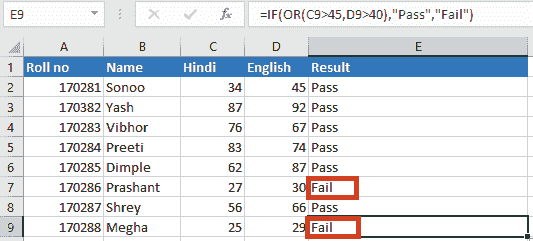

# Excel 中的或函数

> 原文：<https://www.javatpoint.com/or-function-in-excel>

## 什么是 Excel 中的 OR 函数？

**OR 函数**是 Excel 中的内置函数，属于 ***逻辑函数*** 范畴。“或”功能可用作**工作表功能(WS)** 。像工作表函数；“或”函数可以作为工作表单元格中公式的一部分输入。

如果任何条件为**真，**则**或**功能返回**真**，如果所有条件为假，则返回**假**。最多 **255 个参数**可以传递给 OR 函数，每一个都是一个逻辑测试。只需要一个论点。然而，如果我们使用或函数，我们可能至少有两个。

### 句法

**或函数**的语法是:

```

OR(condition1, [condition2, ...condition_n])

```

### 因素

以下是或函数的参数:

1.  情况
2.  条件 2，…条件 _n

**条件 1: -** 要测试的条件可以是**真**或**假。**

**条件 2，…条件 _n:-** 可选。测试条件可以是**真**或**假。**最多可以有 30 个条件。

### 返回

*   如果满足以下任一条件，或函数将返回**真**
*   如果所有条件都是**假**，或函数返回**假**。

## 何时使用或函数？

当我们需要验证一个定义的单元格中的许多条件时，我们使用了**或函数**。

### Excel 中 OR 函数需要记住的事情

关于 Excel 中的 OR 函数，我们要记住以下几点:

*   我们可以将**或**功能与**和**以及 **IF** 结合起来
*   或函数返回**真**或**假**。
*   **或**函数的值或结果取决于给定的参数或参数。
*   “或”功能用于同时测试两个或多个条件或参数。
*   可应用于**或**函数的条件或参数的最大数量为
*   如果公式或参数中没有逻辑，**或**功能将返回**#值**。

## 如何使用 Excel 或函数

让我们借助例子来讨论如何使用 Excel OR 函数:

**例 1:** 这里有一个如何实际利用**或**功能的例子。**销售部**将奖励**南方**团队中整体表现突出的所有员工，以及任何其他团队中销售额超过 **32** 的员工。如果满足这两个条件中的任何一个，员工都有资格获得激励。


如果我们想知道满足一个或两个条件的行，需要两个语句。第一种说法认为**单元格 B2** 中的值是**大于 32** ，而第二种说法认为**单元格 C2** 中的值是单词**“南”**OR 公式如下:

```

=OR(B2>32,C2="South")

```


如果两个陈述都为真或者至少一个陈述为真，则显示结果**为真**。

如果两种说法都不成立，则显示结果**假**。


### 与过滤器功能一起使用

使用过滤器功能，我们还可以使用或函数。它与此功能配合使用效果很好，因为只显示那些满足至少一个上述标准的行并隐藏那些不满足的行是很简单的。


从功能区的**数据选项卡**中，我们必须单击**过滤器图标**，并使用数据集顶部的过滤器箭头来选择在**列 d**中包含**真**值的行。然后，我们必须单击**确定**以应用过滤器，如下图所示:


不符合上述任一标准的行将从显示中过滤掉，如蓝色行号所示。


### 示例 2:带中频功能的或功能


**或功能**也可以和**中频功能**一起使用。在这个例子中，我们有一个包含两个科目的学生分数的数据集:**印地语**和**英语**。如果**印地语成绩**高于**45****英语成绩**高于**40，**该生视为及格。

要找出及格学生，我们必须应用以下公式:

```

=IF(OR(C2>45,D2>40),"Pass","Fail")

```


应用该公式后，我们得到以下输出:



从上图截图中我们可以看到，根据论证或条件要求，卷号 **170286** 和 **170288** 在两个科目**印地语**和**英语**中的数量都较少；因此它们被认为是**失败**。

**卷号 170286** 印地语**27 分、**英语**30 分，要求分别为 **45** 和 **40、**，因此成绩为**不及格**。与**卷号 170288 相同。****

### 例 3。将中频/或与数学计算结合使用。

在本例中，我们将使用带有数学计算的 IF/OR 函数计算**值 _if_true** 。下面的电子表格显示了公司网站在过去 30 天和之前 30 天被访问的次数。


如果**列 B** 或**列 C** 的值**大于 600** ，则认为该位置为**高流量位置**。

我们需要确定哪些城市有高交通位置和 T2 两个月的平均访问量。如果一个城市不被认为是高流量的城市，就不应该计算平均值。

**IF** 和**或**函数将按照与前面示例中相同的方式嵌套用于**参数 1** 。

```

=IF(OR(B2>600,C2>600)

```

**平均函数**将用作第二个参数:

```

AVERAGE(B2:C2)

```

第三个参数可以省略，返回一个 **FALSE** 值，指示那些不符合任何给定标准的单元格。

完整的公式如下:

```

=IF(OR(B2>600,C2>600),AVERAGE(B2;C2))

```


当我们将上述公式复制到**列 D、**的所有相关单元格时，工作表的结果是:


**配合分拣使用**

排序功能现在可以用来创建一个城市列表，这些城市按照交通流量从高到低或从低到高进行排序。


应用排序功能后，我们将得到以下结果:


## 摘要

Excel OR 函数可用于在单个函数中执行多个测试，以找到满足各种标准的单元格。

由于 OR 函数的简单性，该逻辑易于理解，几乎可以用于任何类型的数据集。当与其他微软 Excel 函数和功能结合使用时，它非常有用，适应性很强。

* * *