# Excel 中的求解器

> 原文:[https://www.javatpoint.com/solver-in-excel](https://www.javatpoint.com/solver-in-excel)

## 什么是规划求解？

规划求解是微软 Excel **支持的一个插件编程工具。它是一种优化工具，使用运筹学技术来确定最佳解决方案**，并通过改变对客观问题的假设来获得期望的结果。这是一种“假设分析”，当用户想要找出两个或更多假设的给定集合的“最佳”结果时，这种分析非常有用。

Excel 求解器主要用于**模拟和优化几个业务和工程原型**。它对于求解线性规划模型(线性优化问题)也很有用，正因为如此，它也被称为*线性规划求解器*。除此之外，解算器也是解决光滑和非光滑线性问题的常用工具。

的确，**微软求解器**无法解决所有可能的问题，但当用户处理所有类型的优化问题以做出最佳决策时，**是至关重要的有效工具。例如，您可以使用 MS Solver 来最大化 ROD(投资回报)，为您的活动选择最佳预算，计算销售人员产生的利润，并在此基础上计算出要雇用的销售人员数量，为您的员工制定最佳工作计划，等等。**

## 将规划求解添加到 Excel 工作表中

尽管默认情况下未启用求解程序外接程序，但它会随所有版本的 Microsoft Excel 一起添加。您需要手动将规划求解添加到 Excel 工作表中。要将规划求解合并到 Excel 工作表中，请按照下面给出的步骤操作。

1.  打开你的 Excel 工作表，点击**文件- >选项。**
    
2.  将出现“微软 Excel 选项”对话框。从窗格左侧，点击**加载项选项**。
    T3】
3.  加载项屏幕将显示在中央。在**管理框**所在的屏幕底部，确保在其字段中选择了**加载项选项**。**点击开始**。
    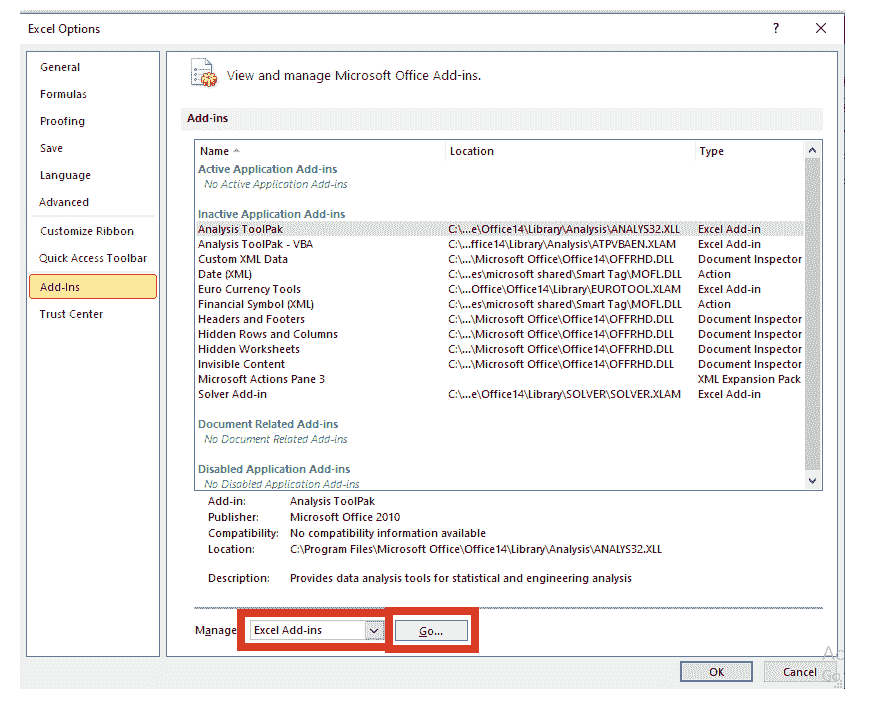
4.  将出现“加载项”对话框。选中求解器**插件框**和**点击确定按钮**。
    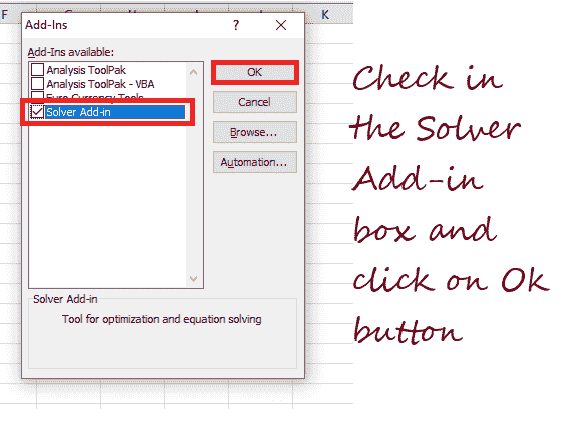
5.  就是这样；它会将 ***求解工具添加到你的 Excel 工作表*** 中。

## Excel 中的规划求解在哪里？

解算器加载项编程工具位于 ***数据*选项卡上的*分析*组中。**

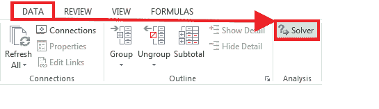

## 在 Excel 中使用规划求解的步骤

在继续 Excel 规划求解外接程序的步骤之前，让我们分析一下我们将在 Excel 工作表中使用规划求解运筹学技术解决的问题。下面是一个简单的优化问题。

***问题:*** 假设你是一家健身房的老板，正在计划扩大服务和锻炼来吸引更多的顾客。为此，您需要购买价值 90，000 美元的各种新机器，并且必须在 12 个月内分期返还该金额。

***目标:*** 找出每个客户的最低成本，让你在规定的时间内支付新机器的预算。

为了简化上述问题，我们在 Excel 工作表中创建了一个模型:

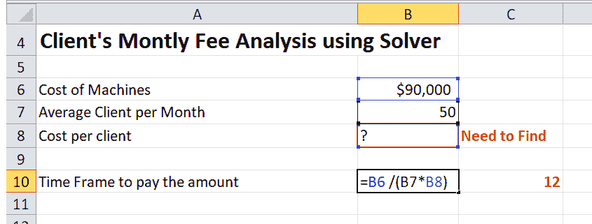

现在，让我们逐步解决上述问题:

### 步骤 1:运行 Excel 规划求解

点击位于分析组中的**数据选项卡。从给定的选项中，**点击求解器按钮**。**

### 第二步:定义问题

它将打开“求解器参数”窗口。我们需要设置 3 个主要的求解器组件，如下所示:

1.  目标细胞
2.  可变单元格
3.  限制

让我们通过解释 Excel 规划求解如何使用上述参数解决任何问题来让您变得简单？它通过调整我们在*变量*单元格中指定的值并遵守约束单元格的限制，为我们在*目标*单元格中定义的公式确定最佳值(最大值、最小值或任何给定值)。

让我们简单了解 3 个求解器组件:

### 目标细胞

*目标*单元格，又称*目标*单元格(在 Excel 的早期版本中命名)，包含**公式**，该公式描述了给定问题的目标或目的，其中目标可以基于某个目标值最大化、最小化或实现。

让我们用一个例子来理解这一点，

在我们的例子中，B10 是我们的目标单元格，它将帮助我们计算付款期限**，其中**公式的结果，***" = B6/(B7 * B8)***应该是**等于 12** 。

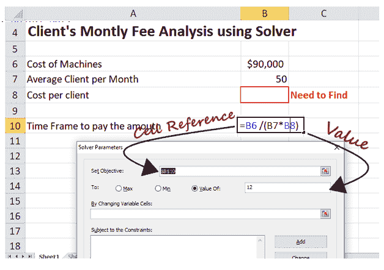

#### 注意:确保目标单元格是一个公式，否则它会在你解决问题时抛出一个错误。

### 可变单元格

*可变*单元格，又称*变化*单元格或*可调*单元格(在 Excel 的早期版本中命名)，保存可变数据，可以更改这些数据以获得最佳目标。Excel 规划求解最多支持 200 个可变单元格。

让我们找到这个例子的可变单元格。下面给出了其值可以更改的单元格:

*   我们可以将 cell B7 分类为可变单元格，因为它的值可以更改，因为每个月的预计客户数应该小于或等于 50；和
*   单元格 B8 也可以归类为可变单元格，因为它表示也可以更改的“每服务成本”。

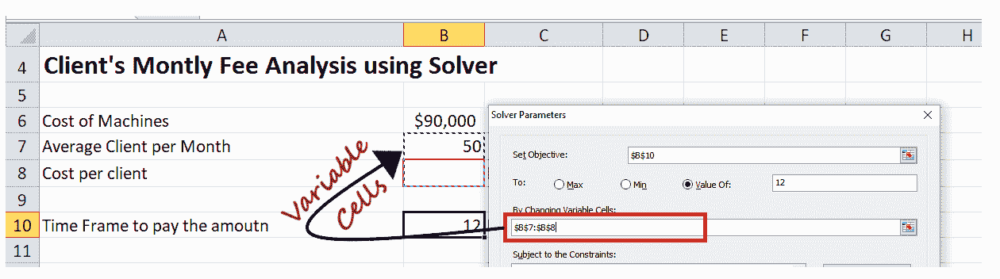

#### 注意:虽然在我们的例子中，变量单元格是相邻的，但是如果单元格是不相邻的，请选择第一个变量单元格，然后在键盘上按 Ctrl 键并选择不相邻的变量单元格。或者另一种方法是手动输入单元格引用，用逗号分隔。

### 限制

约束表示问题的潜在解决方案的限制。简而言之，我们可以得出结论，约束是 Excel 规划求解中必须满足的条件。

“求解器”工具允许用户通过在引用的单元格和约束之间建立关系来定义约束。您可以选择任何给定的选项来指定约束关系。

1.  **比较运算符:**小于(<)、小于等于(< =)、等于(=)、大于(>)和大于等于(> =)是用于设置约束之间关系的四个主要比较运算符。您可以在单元格引用中选择一个单元格，然后选择任意一个比较运算符( **< =** 、 **=、**或 **> =)。**最后，在约束框中输入你的编号/单元格引用。
    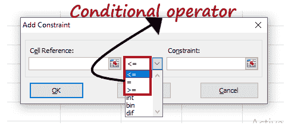
    输入的值可以是整数、二进制或二进制。
2.  **整数:**选择 int，会注意到*约束*框中的值会变为整数。
    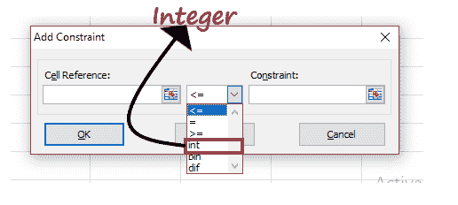
3.  **不同的值:**可以选择 dif，在参考范围内输入不同的值。您会注意到*约束*框中的参数将变为**所有不同的**。
    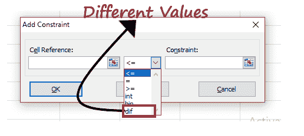
4.  二进制:二进制允许用户将引用的单元格限制为 0 或 1。要启用二进制选择**框**，您将注意到约束框参数将更改为**二进制。**
    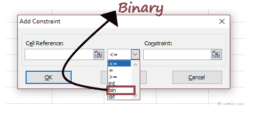
    按照以下步骤在 Excel 工作表中添加约束:
    *   点击*右侧的**添加**按钮，受*框的约束。
        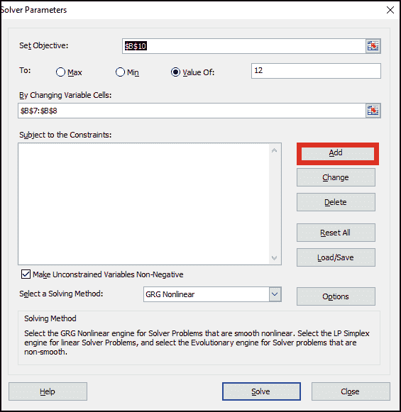
    *   将打开添加约束窗口。在查看中输入值。完成后，单击添加。它将在约束窗口中添加约束。
        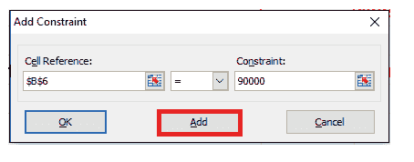
    *   要在您的模型中添加另一个约束，再次点击**添加**它将允许您在窗口中输入下一个约束。同样，也输入其他约束。
    *   输入所有约束后，单击确定按钮。它会带你到主求解参数
        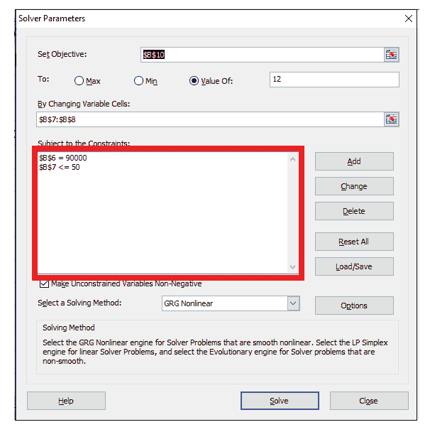

在我们的例子中，我们输入了如下两个约束:

1.  **B6=90000** ，这个约束值表示购买新健身器的费用等于 90000 美元。
2.  **B7 < =50** ，该约束值表示每月的预计客户数不足

### 第三步:解决问题

现在，我们已经填充了所有参数，是时候解决这个问题了。

1.  单击位于求解器参数底部的**求解**按钮，这将使求解器工具能够为给定的问题寻找最优解。
    T3】
2.  尽管根据问题的复杂性、系统内存或处理器速度，处理解决方案可能需要一些时间(从几分钟到几小时)。
3.  一旦规划求解完成处理，它将在对话框窗口中显示*规划求解输出*。从窗口中选择“**保持求解器解”**并点击 ***确定*** *按钮*。
    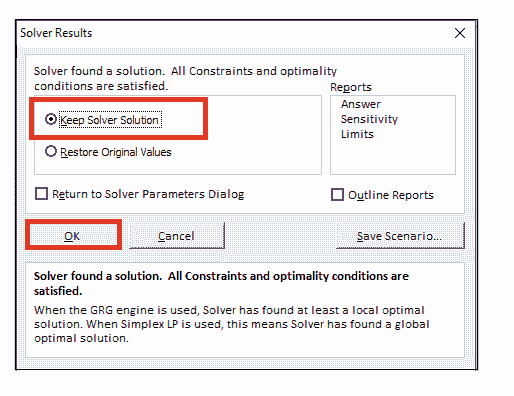
4.  它会自动关闭 ***求解器结果*** 对话框窗口，输出会立即出现在你的 Excel 工作表中。
    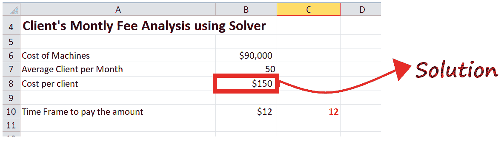

在我们的例子中，你会注意到单元格 **B8 的值将变为$ 150** 。该成本表示每个客户的最低成本，如果每个月至少有 50 个客户，该成本将使您能够在 12 个月内支付新机器的费用。

**要点**

*   如果您的处理器速度慢或问题太复杂，或者由于任何其他原因，规划求解工具已经处理您的问题太长时间，您可以按下 Esc 键暂停该过程。Excel 将停止该过程，并使用为变量找到的最后一个值计算 excel 工作表
*   如果您想了解已解决问题的更多详细信息，请进入**报告**框，单击报告类型并选择确定按钮。Excel 将在新的工作表上创建报表。

## 在 Excel 中保存和加载规划求解问题

一旦解决了某个特定的问题，您可能希望保存变量单元格值的值，以便以后可以观察或处理它们。

例如，在上面的模型中，我们只计算了 50 个客户端的每项服务的成本。但是您可能还想尝试每月不同数量的项目客户，计算最小服务成本，并评估各种服务成本。

因此，保存和加载 Excel 规划求解方案非常重要。保存规划求解数据意味着选择一个单元格区域来保存数据，而加载规划求解问题就是给 Excel 一个保存问题的单元格区域。

### 保存模型

按照下面给出的步骤保存 Excel 求解器方案:

1.  打开计算求解器模型输出的 Excel 工作表，运行求解器。将打开“求解器”窗口。
2.  点击位于求解器参数
    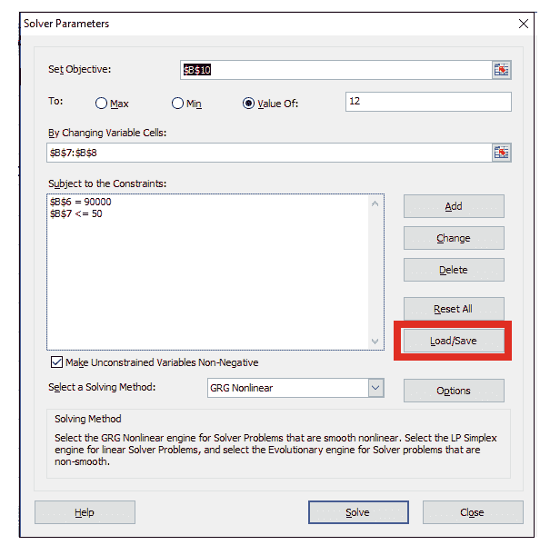右侧的加载/保存按钮
3.  它将抛出一个加载/保存模型窗口，要求您选择指定范围的单元格来保存您的方案。选择指定数量的单元格，然后单击保存按钮。在我们的例子中，我们将选择 6 个单元格。
    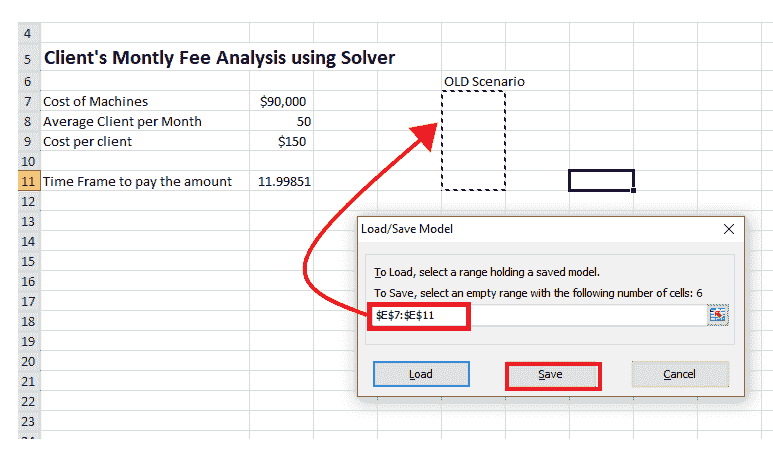
4.  Excel 将保存您的规划求解方案，并给出以下输出。(参考下面截图)。
    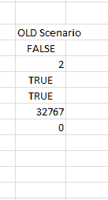

### 加载保存的模型

按照以下步骤加载或恢复已保存的 Excel 规划求解方案:

1.  打开计算求解器模型输出的 Excel 工作表，运行求解器。将打开“求解器”窗口。
2.  点击位于求解器参数
    右侧的加载/保存按钮
3.  选择先前保存的单元格范围，点击**加载选项**。
    T3】
4.  将显示加载模型对话框窗口。选择**替换**
    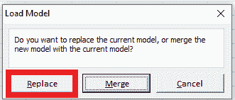
5.  它将立即打开带有先前保存的模型参数的 Excel 规划求解窗口。只需点击“求解”按钮，重新计算所有求解器数字。

* * *