# Excel AVERAGE()函数

> 原文：<https://www.javatpoint.com/excel-average-function>

微软 Excel 是一个广泛流行的电子表格程序，内置于微软办公软件包中。Excel 具有广泛的支持功能，可帮助我们对工作表中的数据执行操作。它有 400 多个函数，AVERAGE()函数是 Excel 中使用最多的函数之一。

在本文中，我们讨论了使用 Excel AVERAGE()函数的过程，包括其语法和示例。

## Excel 中的 AVERAGE 函数是什么？

AVERAGE 函数是 Excel 中流行的内置函数之一。它位于 Excel 统计函数的一个类别中。AVERAGE 函数通常用于从提供的数值范围或单元格中检索平均值或算术平均值。该函数可以接受一系列数字，并相应地计算所提供参数的算术平均值。

AVERAGE 函数可以很容易地用作 Excel 中典型的工作表函数。这意味着 Excel 允许我们将 AVERAGE 函数作为公式的一部分应用于工作表中的一个或多个所需单元格。MS Excel 的所有版本都内置了 AVERAGE 函数，包括最新的 Office 365、Excel 2019、Excel 2016、Excel 2013 等。

average 函数在财务分析中很有用，可以在许多情况下确定数列的平均值(AVERAGE)。例如，我们可以计算一家企业前六个月或更长时间内任何产品的平均销售额。

## 句法

以下是 Excel 中 AVERAGE 函数的语法:

```

=AVERAGE(number1, [number2], ...)

```

在这个语法中，我们可以使用一个或多个数值的集合来识别数字，这些数值包括命名范围、数组、对特定单元格的引用或数字范围。

## 参数或参数

AVERAGE 函数必须与至少一个参数一起使用，这意味着必须向该函数提供一个参数。除此之外，其余的参数都是可选的。它们可以根据需求提供给 AVERAGE 函数，也可以忽略。

AVERAGE 函数有以下参数:

*   **强制参数:** number1 是 AVERAGE 函数中必需的参数或参数。它必须作为第一个数字或单元格引用提供给函数，该引用包含我们要计算平均值的范围的数值。
*   **可选参数:** number2 和其他后续参数是可选的，可以用与强制参数相同的方式提供。但是，它们是额外的数字、单元格引用或我们想要计算平均值的范围。

在旧版本的 Excel 中，例如 Excel 2003 和更早版本，AVERAGE 函数最多接受 30 个参数。但是，该限制在以后的版本中有所增加。因此，更高的版本(Excel 2007 和更高版本)允许我们在 AVERAGE 函数中使用多达 255 个单独的参数。此外，我们可以将每个参数定义为一个值数组或一个单元格区域，进一步包含许多其他值。

## 返回

Excel 中的 AVERAGE 函数从选定/提供的数据单元格/数字范围集合中返回平均数值。

## Excel 中如何使用 AVERAGE 函数？

AVERAGE 函数是最基本且易于使用的内置函数之一。我们可以将这个特殊函数用作 Excel 工作表中的常用工作表函数。这决定了我们可以将 AVERAGE 函数作为公式的一部分应用于工作表中的一个或多个所需单元格。

要在 Excel 工作表中以最简单的形式使用 AVERAGE 函数，我们必须开始在所需的单元格中键入它，并提供随机数值作为参数。例如:

```

=AVERAGE(1, 2, 3)

```

在本例中，AVERAGE 函数返回值 2 作为输出，因为它是所有三个提供的参数的平均值。然而，很少看到我们需要将函数中的值直接作为参数来处理。相反，我们通常对存储在单元格或区域中的值进行操作。在这种情况下，我们需要执行以下步骤来使用 AVERAGE 函数，并根据指定或选定的单元格/数据范围计算平均值:

*   首先，我们必须选择一个特定的单元格来存储一个平均值，然后开始在其中键入 average 函数**' = AVERAGE(**)，不带引号。
*   在输入左括号后，我们必须选择所有有效单元格或数值范围，以便计算结果平均值。我们可以使用鼠标拖动功能来选择所需的单元格/范围。
*   选择所有需要的单元格/区域后，我们必须通过键入不带引号的结束括号“)”来关闭函数。
*   最后，我们必须按回车键在选定的单元格中注册一个平均值。

假设我们有下面的 excel 表，我们想计算存储在列 a 中的值的平均值。由于我们在从单元格 A1 到单元格 A8 的单元格范围内有有效值，所以我们仅对该特定范围应用 average 函数。如果我们将单元格 A9 视为结果单元格，我们在单元格 A9 中使用 AVERAGE 函数，如下图所示:

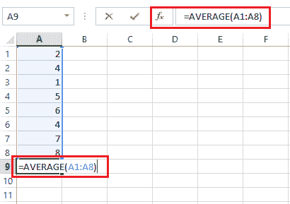

最后，我们按回车键，函数返回结果单元格中指定范围的平均值:

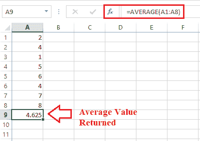

现在让我们借助下面的例子来理解 AVERAGE 函数的不同用例:

## Excel 平均值函数示例

以下示例讨论了我们如何以不同方式使用 AVERAGE 函数的过程:

**例 1:计算平均分数**

我们可以计算写在 Excel 表格中的一些值或标记的算术平均值或平均值。为此，我们需要选择要找出结果的标记范围，并对其应用 AVERAGE 函数。在应用 AVERAGE 函数之前，我们可以相应地选择结果单元格。

例如，让我们考虑下面的 Excel 表，其中有一些在面试中给员工的分数。我们想计算每个员工取得的平均分数。

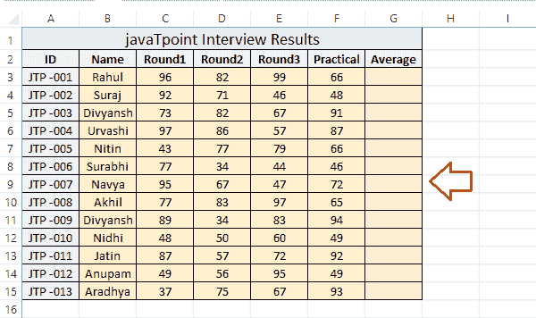

我们可以执行以下步骤来获得每位员工的平均分数:

*   首先，我们需要计算第一个员工的平均分数。为此，我们必须在结果单元格 G3 中对 C3 范围应用 AVERAGE 函数:F3。因此，我们选择结果单元格 G3。
    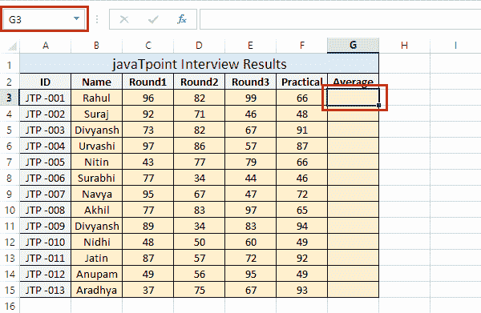
*   接下来，我们在结果单元格中输入 AVERAGE 函数，并选择带有标记的参考单元格或范围，如下图所示:
    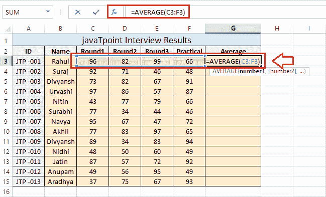
*   之后，我们需要按回车键来检索示例列表中第一个员工的平均分数。
    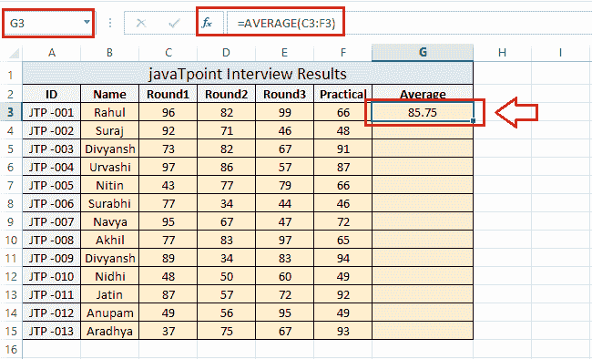
*   一旦我们成功获得第一个员工的平均分数，我们就可以将特定的单元格拖到结果单元格的底部，这将在所有结果单元格中应用相应的公式。为此，我们可以从特定单元格的右下角使用一个拖动支架。
    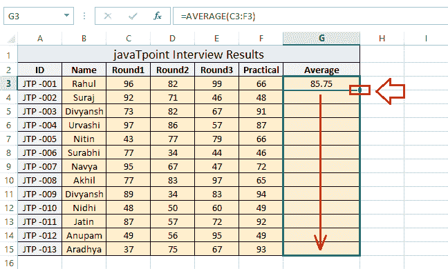
    这将快速提供名单上所有员工的平均分。
    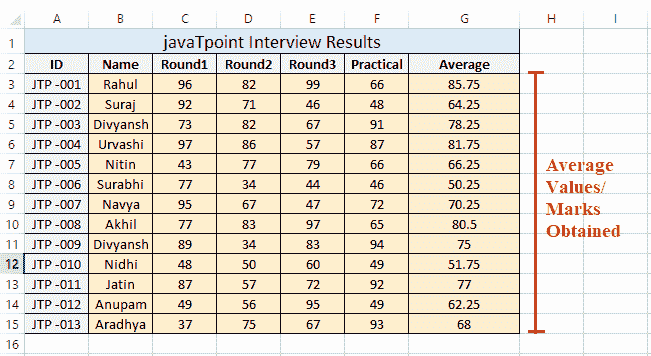
    虽然我们可以在所有结果单元格中逐个应用 AVERAGE 函数，但是会花费更多的时间。因此，拖动单元格是更好的解决方案。

**例 2:计算平均销售额**

AVERAGE 函数用于大多数金融部门，以查找特定时期的平均销售额和总平均收入。当相关数据存储在 Excel 表格中时，此功能使计算平均销售额或收入变得容易。在 excel 工作表中使用 AVERAGE 函数的主要优点是，我们可以随时根据需要更新数据，并实时获得相应的平均结果。

例如，让我们考虑以下 Excel 表格，其中包含任何公司的一些月度销售数据。整体销售数据分为四个不同的区域。现在，我们要计算每个月和每个区域的平均销售额。

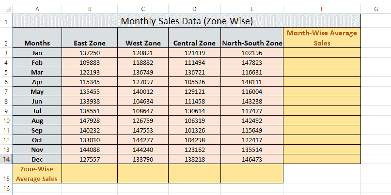

我们可以执行以下步骤来获得每个月和每个区域的平均销售额:

*   首先，我们通过将 average 函数应用于 1 月份的销售数据来计算 1 月份的平均销售额。为此，我们选择结果单元格 F3，输入 B3:E3 数据范围的 AVERAGE 函数，如下所示:
    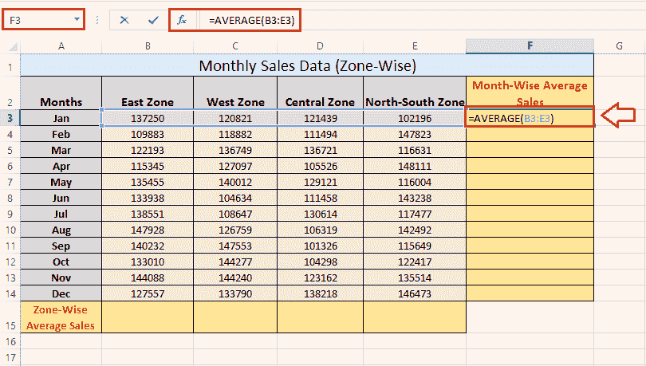
*   按回车键后，我们检索一月份的平均销售额。
    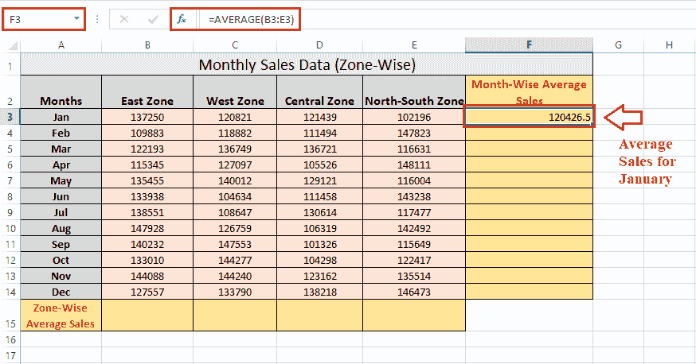
*   同样，我们可以应用 AVERAGE 函数来获得其他月份的平均销售额。但是，我们通常将结果单元格拖到结果单元格的底部，相应的数据会相应地提供给每个月的 AVERAGE 函数。
    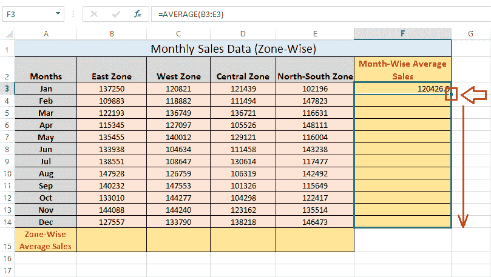
    这即时提供了每个月的平均销量，如下图:
    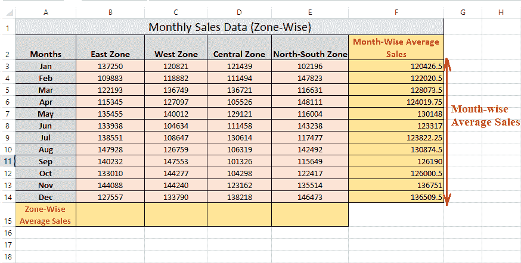
*   接下来，我们需要计算每个区域的平均销售额。为此，我们对范围 B3:B14 的结果单元格 B15 应用 AVERAGE 函数。
    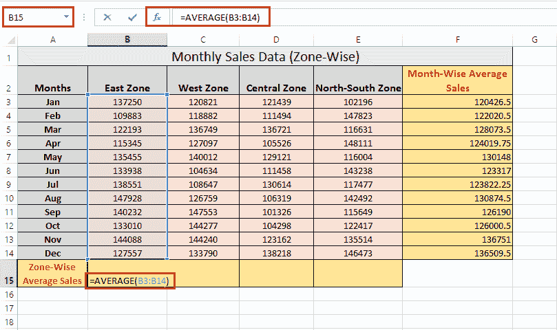
    接下来，我们按回车键得到计算值。通过这样做，我们只计算了东区的平均销售额。
    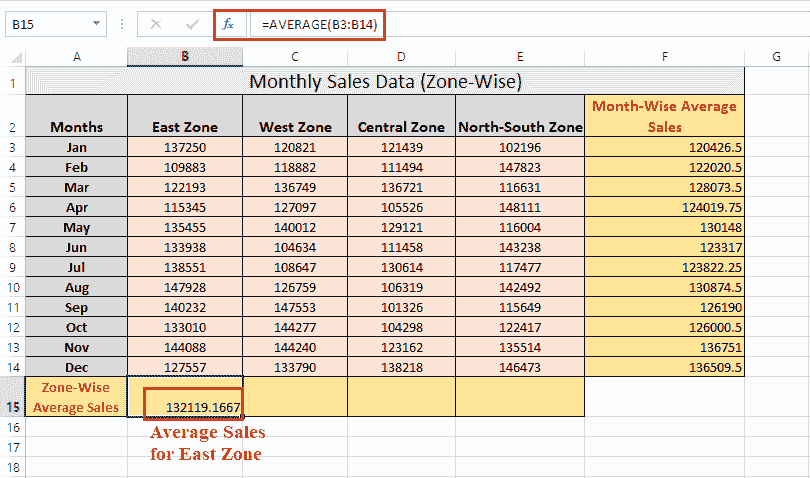
*   最后，我们使用鼠标将结果单元格 B15 拖动到其他单元格 C15、D15 和 E15。
    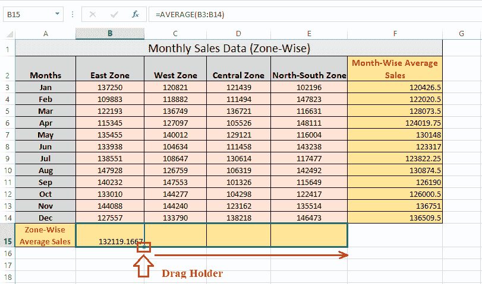
    通过在相应的单元格中应用适当的 average 函数，这将立即提供其余区域的平均销售额。
    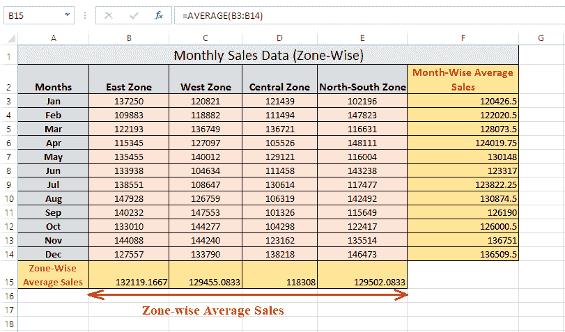

**例 3:计算初始(顶部)n 值的平均值**

我们可以使用 AVERAGE 函数来计算前 n 个数值的平均值。它可以通过将 AVERAGE 函数与 LARGE 函数相结合来执行。

例如，让我们考虑下面的 Excel 表，其中有一些在面试中给员工的分数。我们要计算每个员工只在前三轮取得的平均分数，不包括实际分数。

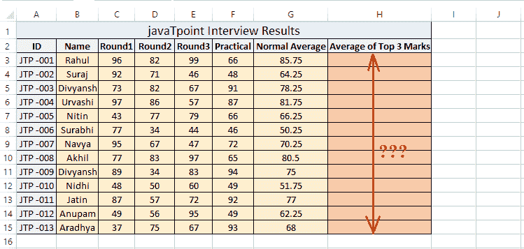

在上面的例子中，我们通常可以通过使用例子 1 中讨论的过程来找出每个学生在所有轮次和实践中的平均分数。但是，要仅计算前三轮的平均分数，我们需要将 average 函数与 LARGE 函数一起使用，如下所示:

=平均值(大(C3:F3，{1，2，3}))

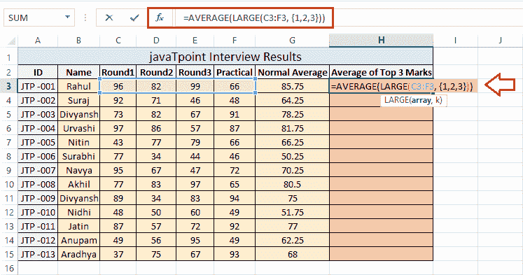

按回车键后，该函数返回员工在所有四个分数中得分最高的前三个分数的平均值，如下所示:

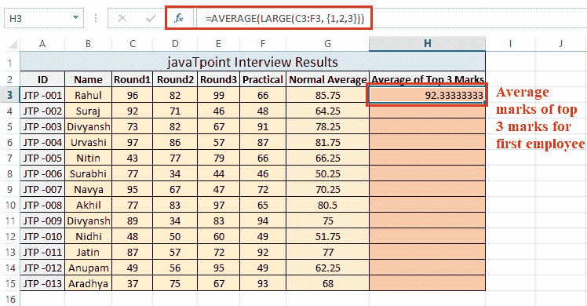

现在，我们已经获得了第一名员工前三轮的平均分数。接下来，我们需要将一个结果单元格拖到其余的结果单元格中。

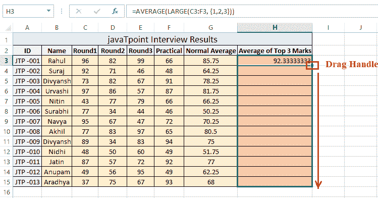

这将为所有其他员工提供前三名的平均成绩。

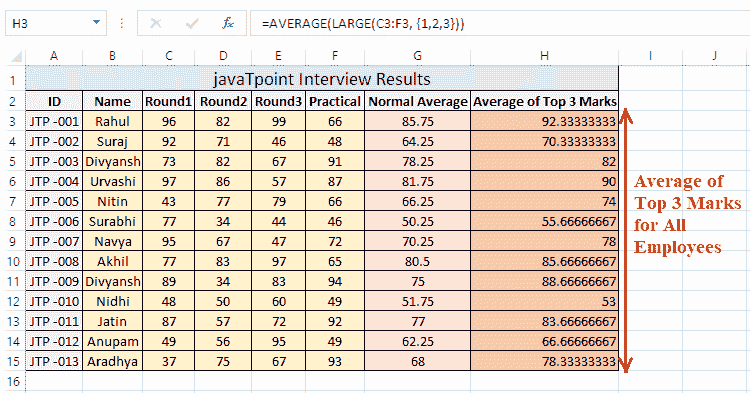

这就是我们在 Excel 中使用 AVERAGE 函数的方法。

## 需要记住的几个要点

要在 Excel 中成功应用 AVERAGE 函数，我们必须记住以下事实:

*   根据平均值的定义，首先将提供的值(或数字)相加，然后将其总和除以提供值的总数。
*   AVERAGE 函数总共可以提供 255 个单独的参数。
*   输入或参数可以直接提供给 AVERAGE 函数、单元格引用或命名范围。
*   Excel AVERAGE 函数忽略所有提供的参数，如文本、文本值、空单元格和逻辑值，如真/假。
*   AVERAGE 函数只理解数值或它们的引用；因此，它返回# VALUE！如果提供的值不能解释为数值，则出现错误。
*   如果 AVERAGE 函数中提供的所有参数都是非数字的，则该函数返回#DIV/0！错误。
*   零值或零值单元格引用在 AVERAGE 函数中计数。

* * *