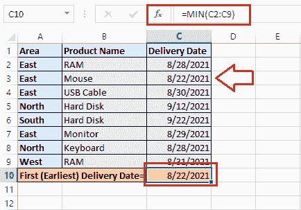
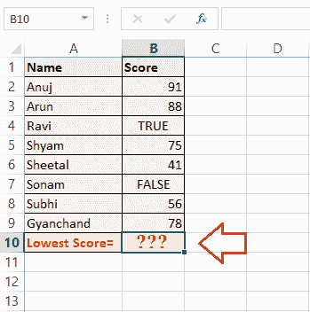

# Excel 最小()函数

> 原文：<https://www.javatpoint.com/excel-min-function>

微软 Excel，也叫 MS Excel 或 Excel，是最常用的功能强大的电子表格软件之一，帮助我们在注册数据上使用广泛的功能。它支持 400 多种不同的功能。MIN()函数是内置的 Excel 函数之一，简单易用。这个函数正好与 MAX()函数相反。

在本文中，我们将讨论 Excel MIN()函数的应用过程，包括其语法和示例。

## Excel 中的最小函数是什么？

最小函数是一个内置的 Excel 函数，可以在 Excel 的统计函数类别中找到。与 MAX 函数不同，MIN 函数主要用于从提供的数据/数组集中检索最小值。它可以作为一个典型的工作表函数在 Excel 工作表中应用。这意味着我们可以在活动工作表的特定单元格中使用该特定函数作为公式的一部分。

在财务分析中，我们可以使用 MIN 函数来计算给任何员工的最低工资、学生在考试中获得的最低分数或分数、完成任何任务所需的最低时间等等。

MIN 函数可用于所有 MS Excel 版本，包括 Office 365、Excel 2019、Excel 2016、Excel 2013 及更早版本。

### 句法

以下是 Excel 中 MIN 函数的语法:

```

=MIN(number1, [number2], ...)

```

上述语法中的数字可以由数值、数组、命名范围、对特定单元格的引用或包含数字的范围来表示。

### 参数或参数

MIN 函数必须至少包含一个参数，这意味着有一个强制参数。此外，其余的参数是可选的。

*   **强制参数:** number1 是 MIN 函数中的必需参数，必须以数字、命名范围、数组或对工作表中另一个数字的引用的形式给出。
*   **可选参数:** number2 和后面的其他参数都是可选的。即使没有提供可选参数，最小函数也能工作。它将基于强制性的论证而产生。可选参数的提供方式与强制参数相同。

Excel 版本在一个最小函数中最多支持 30 个参数。后来，论据限制被提高了。Excel 2007 和其他升级版本最多支持 255 个参数。

### 返回

函数的作用是:从选定的数据单元格/区域中返回最小的数值。

## 如何在 Excel 中使用 MIN 函数？

Excel MIN 函数是一个简单易用的内置函数。它可以作为一个典型的工作表函数在 Excel 工作表中应用。这意味着我们可以在工作表中的所需单元格中使用或实现最小函数作为公式的一部分。

要以最简单的形式将 MIN 函数用作公式，我们需要在包含随机数值的单元格中键入它。例如:

```

=MIN(1, 2, 3)

```

在上面的示例中，MIN 函数返回值 1，因为它是三个指定参数中最小的数值。但是，在 MIN 函数中直接处理值是非常罕见的。通常，我们处理在单元格或区域中注册的值。因此，我们必须遵循以下步骤来使用 MIN 函数，并在选定的单元格/数据范围内找到最小值或最低值:

*   首先，我们必须点击一个特定的单元格来注册最小的值，然后输入**' = MIN(**)而不加引号。
*   之后，我们需要选择要应用最小函数的单元格或数字范围。我们可以用鼠标选择单元格或区域。
*   接下来，我们需要输入不带引号的结束括号 **')'** 。
*   最后，我们必须按回车键。

在下面的示例数据集中，我们在单元格 A8 中使用最小函数，并计算在列 A 中注册的值中的最小值。由于我们在单元格 A1:A7 的范围内有值，因此我们应用类似于下图的最小函数:


按下回车键后，最小值函数将返回以下值，作为选定范围内的最小值:


现在，让我们借助以下示例，讨论以不同方式使用 MIN 函数的过程:

### Excel 最小函数示例

下面讨论 Excel 最小函数的一些基本用例或例子:

**例 1:求一组中的最小值**

如果我们想在 Excel 工作表中的一些数字组中找到最小的数字或值，我们必须通过选择所有相应的单元格/区域来将最小函数应用于整个组。Excel 允许我们选择任意数量的单元格、行和列。

例如，我们有下面的 Excel 表格，上面有一些学生的考试成绩。假设我们需要找到最低分才能知道谁在考试中取得了最低分。


在我们的例子中，我们在 B3:G8 范围内有标记。因此，我们通过使用如下公式在该单元格范围内应用最小函数:

=最小(B3:八国集团)


接下来，我们必须按回车键来获得应用公式的结果。按回车键后，我们会从整个标记集中检索最低的标记。


**示例 2:在不相邻的单元格/范围中找到最小值**

我们有时可能需要找出不相邻/不连续单元格和区域的最小值，而不是在所有连续单元格或区域中应用最小函数。为此，我们需要包含对每个对应单元格和/或范围的引用。要在 Excel 中选择所需的非相邻单元格并相应地应用最小函数，我们可以执行以下步骤:

*   首先，我们必须选择一个特定的结果单元格，并在其中输入 MIN 函数。但是，在输入左括号后，我们需要按住键盘上的 Ctrl 键，并在一张纸上使用鼠标选择所有需要的单元格。
*   一旦选择了所有需要的单元格，我们必须释放 Ctrl 键并输入结束/结束括号。
*   最后，我们必须按回车键才能获得结果。

在我们执行上述步骤后，Excel 会相应地应用适当的语法，并给出所需的结果。

例如，我们有以下数据集，其中包含一些学生在每个科目中的分数以及他们的科目总数。在这个例子中，我们需要找到学生获得的最低总分(学科最低分)。


由于总分写在不相邻的列中(即 D、G 和 J 列)，我们必须使用 Ctrl 键选择这些不相邻列中的连续单元格。当使用 Ctrl 键并将 MIN 函数应用于所有这些有效的非相邻单元格时，我们得到如下公式:

=MIN(D3:D8，G3:G8，JBOY3 乐队:J8)


最后，我们按回车键，从表格中每个科目的指定总分列表中获得学生在任何科目中获得的最低分数。


## 示例 3:在 Excel 中查找最小(最早)日期

由于 Excel 将日期注册为序列号，因此我们可以应用 MIN 函数从选定的数据集中检索最低或最早的日期。

例如，让我们考虑以下带有一些产品及其交付日期的 excel 表。在这个例子中，我们想知道产品的第一个交付日期，换句话说，这是最早的日期。


为了找到最早的日期，我们使用了类似于数字的最小函数。由于交货日期只在从 C2 到 C9 的一系列单元格中登记，因此我们选择整个范围并应用 MIN 函数，如下所示:

=最小(C2:C9)


按回车键后，我们会从选定的交货日期范围中获得最早的交货日期。



**示例 4:从包含布尔值的单元格的范围中找到最小值**

虽然在 Excel 中通常看不到布尔值，但可能会有这样的情况:我们的数据区域中有一些单元格带有布尔值，我们希望从该区域中找到最低值。在下面的例子中，我们在 B 列中有一些个人的分数，我们想从这个列表中找到最低的分数。



即使我们有一些带有布尔值的单元格，也可以通过忽略它们来获得结果。这是因为 Excel 中的 MIN 函数不读取或接受布尔值/逻辑值。这意味着，如果我们在示例中应用 MIN 函数，它将忽略具有布尔值的单元格，并相应地计算结果。

我们有从 B2 细胞到 B9 细胞的一系列细胞的分数。因此，我们选择一个结果单元格，并对范围 B2:B9 应用最小函数，如下所示:


接下来，我们按回车键，从列表中获得最低分，


这就是我们在 Excel 中使用 MIN 函数的方法。

## 需要记住的几个要点

要在 Excel 中使用最小函数而不出错，必须记住以下事实:

*   当前版本的 Excel 在最小函数中最多接受 255 个参数。
*   如果没有为最小函数提供参数，该函数将返回零(0)作为输出。
*   MIN 函数只理解数值；因此，它返回#VALUE！参数中存在非数值时出错。
*   Excel 中的 MIN 函数忽略所有提供的参数，如文本、文本值、空单元格和逻辑值，如 TRUE/ FALSE。
*   MINA 函数不同于 MIN 函数。最小值函数和 MINA 函数的主要区别在于 MINA 函数将真/假值计算为 1 和 0，而最小值函数忽略它们。因此，只有当我们希望在获得的结果中包含逻辑值时，才能使用 MINA 函数。

* * *