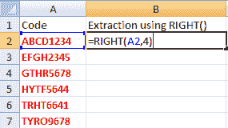
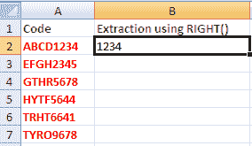
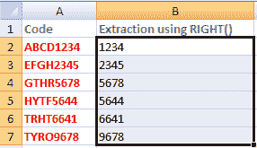
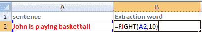
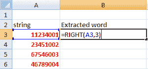
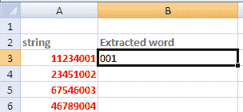
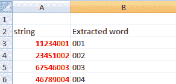

# Excel 右函数

> 原文:[https://www.javatpoint.com/excel-right-function](https://www.javatpoint.com/excel-right-function)

右函数指定从字符串的**右侧**提取元素。指定的可以是**数字、字符、**或**符号**的形式。它还包括两个或多个单词或数字之间的空格。我们可以指定要从给定数据元素中间提取的字符数。我们也可以说，RIGHT()函数返回字符串的最后几个字符。

它由下式给出:

RIGHT(text, Number_of_characters)

哪里，

**文本**是指我们要从中提取元素的指定单元格。

**Number_of_characters** 是指我们要从 excel 中给定数据中提取的字符数。

#### 注意:与 MID()函数不同，它不需要函数中的 start_position 参数。这是因为 RIGHT()函数默认从字符串的右端开始。

例如，

数据字符串= 5674abc123

这里，我们希望从每个字符串的右端提取字符形式的代码。所以，我们将使用 RIGHT()函数。

上述字符串的语法为:

=右(5674abc123，4)

Excel 将从给定字符串的右端开始提取。一个字符串中有 10 个字符。指定的字符数是 4。所以，excel 将从右边第 10 个字符开始到第 7 个字符。表示字符串中字符的第 10 个、第 9 个、第 8 个、第 7 个位置。因此，最后四个字符将作为输出出现。

**输出:** c123

这里，我们还将讨论 **RIGHTB()** 函数，RIGHT()函数的另一部分，它将**双字节字符**计为 2。RIGHT()函数用于使用单字节字符的语言。这将在本主题后面讨论。

## 要点

*   如果指定的字符数大于文本长度，excel 将返回到文本末尾的字符。
    例如
    **文本** : 67546003
    **语法** : RIGHT(67546003，15)
    在这里，excel 将返回 67546003，即从右端开始到左端结束的字符。
*   如果字符数为负数，excel 将返回' #VALUE！'
    比如
    **文字**:1234 ABCD
    T5】语法 : RIGHT(1234ABCD，-4)
    这里，excel 会返回' #VALUE！'

让我们首先考虑 excel RIGHT()函数的一些例子。

## 例子

### 示例 1:从给定的字符串中提取数字代码。

请考虑以下步骤:

1.  单击给定字符串前面的单元格。
2.  键入 **'=RIGHT(A2，4)，**'如下所示:
    
3.  按**进入**。
4.  将出现从右端开始提取的最多 4 个字符，如下所示:
    
5.  拖放到列的最后一个数据单元格。RIGHT()函数将自动应用于其余单元格。如下所示:

在指定的单元格上，RIGHT()函数将分别按如下方式工作:

#### 注意:像 RIGHT()函数一样，LEFT()和 MID()函数也用于从给定字符串中提取字符数。LEFT()函数从指定字符串的左侧提取字符，MID()函数从指定字符串的中间开始提取字符。

### 例 2:从句子中提取一个词

请考虑以下步骤:

1.  点击给定句子前面的单元格。
2.  键入 **'=RIGHT(A2，10)，**'如下所示:
    
3.  按**进入**。
4.  将出现从右端开始提取的最多 10 个字符，如下所示:
    

### 示例 3:从给定的字符串中提取字符代码。

请考虑以下步骤:

1.  单击给定字符串前面的单元格。
2.  键入 **'=RIGHT(A3，3)，**'如下所示:
    
3.  按**进入**。
4.  将出现从右端开始提取的最多 3 个字符，如下所示:
    
5.  拖放到列的最后一个数据单元格。RIGHT()函数将自动应用于其余单元格。如下所示:

## excel 中的 RIGHTB()函数

让我们快速了解一下 excel 中的 RIGHTB()函数，以消除 RIGHT()函数和 RIGHTB()函数之间的混淆。

当我们启用编辑支持 **DBCS** (双字节字符集)的语言并将其设置为默认语言时，RIGHTB()函数将双字节字符视为 2。否则，它认为 1。对于 RIGHT()函数，excel 将双字节字符和单字节字符都视为 1。

双字节语言有中文、韩文和日文。这样的语言很难用单引号来表示。

它由下式给出:

RIGHTB(text, start position, Number_of_characters)

哪里，

**文本**是指我们要从中提取元素的指定单元格。

**Start_position** 是指我们要开始提取的位置。

**Number_of_bytes** 是指我们要从 excel 中给定数据中提取的字符数。

RIGHTB()函数的输出和条件与 RIGHT()函数相似。

让我们考虑一些例子。

示例:

**文字 t1:Priya 的钱**

**语法** : =RIGHTB(Priya Raheja，6)

**返回值**:拉赫加

### 要点

*   字节数应大于或等于 0。
*   如果排除字节数，则假设为 1。
*   如果指定的字节数大于字符串的长度，它将返回完整的字符串。

* * *