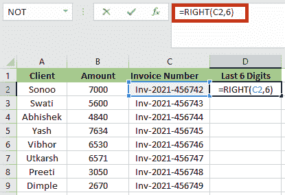
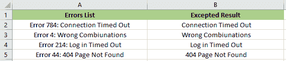

# 如何在 Excel 中使用右函数

> 原文:[https://www . javatpoint . com/excel 中函数的使用方法](https://www.javatpoint.com/how-to-use-right-function-in-excel)

## Excel 中的右函数

**右功能**是 Excel **文本功能**类别的一部分。RIGHT 函数将从给定文本字符串的末尾返回指定数量的字符。它有助于从最右边到左边提取字符。结果取决于公式中指定的字符数。**例如**、" =RIGHT("JAVATPOINT "，5)"作为结果给出**【POINT】**。

如果我们想从文本字符串的右侧提取字符，RIGHT 函数会很有帮助。通常与 **VALUE、COUNT、DAY、DATE、SUM、**等其他函数组合使用。

### 句法

右函数的语法如下:

RIGHT(text, [num_chars])

### 争论

*   **文本(必选):-** 我们需要从中提取字符的文本字符串。
*   **Num_chars: -** Num_chars 是可选的。指定我们需要右提取的字符数。

1.  **num_chars** 必须大于或等于零。
2.  如果省略 **num_chars** ，则假设为 1。
3.  如果**字符数**大于文本长度，右返回。

### 数字字符的特征”

以下是**数字字符**的特征:

1.  “num_chars”的默认值设置为 1。这意味着如果省略**“num _ chars”**的值，RIGHT 函数将返回字符串的最后一个字母。
2.  右功能返回**#值！**如果“字符数”小于零，则出现错误。
3.  如果**“字符数”**大于文本长度，右函数返回完整文本。

**注**

1.  右功能可能不是在所有语言中都可用。
2.  右功能是为使用**单字节字符集(SBCS)的语言设计的。**无论默认语言设置是什么**，RIGHT** 总是将每个字符视为一个，无论是单字节还是双字节。

## 如何在 Excel 中使用 RIGHT 函数？

我们主要是把 RIGHT 函数和其他 Excel 函数结合使用，比如 **FIND、SEARCH、LEFT、LEN 等。**

以下是右功能的用法:

*   它有助于格式化文本。
*   函数的作用是:删除网址中的斜杠。
*   它提取出现在某个字符之后的文本。

*借助下面的例子，让我们了解一下 RIGHT 函数的用法:*

**例 1:** 在本例中，**单元格 A3、**中有一个测试字符串，如下图截图所示。我们需要提取最后一个有 **10** 个字母的单词。

我们将应用 **RIGHT** 函数，以便提取 A3 列中的“字符串”。

我们将使用以下公式:

=RIGHT(A3,10)

应用公式后，结果将是:

**例 2:** 在本例中，我们有一个 8 位数字**(98231212)**，我们必须从这个数字中提取最后 5 位数字。

为了提取最后 5 位数字，我们必须应用以下公式:

=RIGHT(A3,5)

RIGHT 函数返回 **31212，**如下图截图所示:

**例 3:** 在本例中，我们有一个 ID 列表，如“ID201”、“ID202”、“ID203”。“ID204”等。，在 a 栏中。

在这种情况下，ID 的最后三位数字是唯一的，文本“ID”是多余的。因此，我们希望从标识符列表中删除“标识”。

我们将应用以下公式:

=RIGHT(A3,3)

RIGHT 函数在单元格 B3 中返回 210。使用相同的过程，我们将提取每个 ID 的最后三位数字。

**示例 4:** 在本例中，我们有一个包含发票号的数据集。我们想要提取每个发票号码的最后 6 位数字，因此，为此，我们必须使用 RIGHT 函数。

利用 Excel 的 RIGHT 函数，我们可以提取上述文本的最后 6 位数字。

=RIGHT(C2,6)

应用右函数后，结果将是:

**例 5:** 假设我们有一个从 A2 到 A13 的序列号，我们想从右边抽取 8 个字符。

函数的作用是:返回文本右端的最后 8 位数字。

应用公式后，结果将是:

**示例 6:** 在这个示例中，我们在 a 列中有两个动物的名称，使用逗号和空格将名称隔开，如下图截图所示。我们需要提取姓氏。

为了提取姓氏，我们必须使用下面的 RIGHT 公式。

=RIGHT(A4,LEN(A4)-FIND(" ",A4))

*   “查找”(“，A4”)查找空间的位置。它返回 5。或者，我们可以使用“，”进行更严格的搜索。
*   “LEN(A4)”计算字符串“Cat，Lynx”的长度它返回 9。
*   “LEN(A4)-FIND("，" A4 ")返回右边空格的位置。它返回 4。
*   公式“ **RIGHT(A4，LEN(A4)-FIND("，A4))”**从 A4 中的文本字符串右侧返回 4 个字母。

**“Lynx”**是 RIGHT 公式的输出。剩余单元格的输出也是以同样的方式找到的。

**例 7:** Excel 的 RIGHT 函数不适用于日期。因为 RIGHT 函数是文本函数，所以它也可以提取数字，但不能提取日期。假设单元格 A2 的日期为“2021 年 9 月 1 日”。

现在，我们将尝试借助 **RIGHT** 公式提取年份。

结果将是 4440。

在 excel 中。意识形态 **4440** 如果格式为日期，则表示 **2021** 。因此，Excel 的 **RIGHT** 函数会将其解释为数字，而不是日期。

**例 8:** 在这个例子中，我们有二维数据。长度乘以宽度，如下图所示。我们需要从给定的维度中提取宽度。

我们将对第一维使用下面的右公式。

=RIGHT(A3,LEN(A3)-FIND("x",A3)+1))

*   **FIND(“x”，A3)”**将返回**“x”**在单元格中的位置。它将返回 8。
*   公式“FIND(“x”，A3)+11”将返回 9。我们添加一个来省略空格，因为“x”后面是一个空格。
*   **“LEN(A3)”**返回字符串的长度。
*   **“x”+1**后出现的字符数由“**LEN(A4)-FIND(“x”，A3+1)”返回。**
*   公式“ **RIGHT(A3，LEN(A3)-FIND(“X”，A3)+1))”**返回出现在“X”后一个位置的所有字符。

右公式返回第一维的**“700 英尺”**。我们必须拖动填充手柄来确定其他单元格的结果。

**示例 9:** 在本例中，我们有一个电子邮件地址列表。我们需要从这些电子邮件 id 中提取域名。

为了从第一个电子邮件地址中提取域名，我们必须使用下面的 RIGHT 公式。

=RIGHT(A2,LEN(A2)-FIND("@",A2))

弦 **A2** 的长度由**“LEN(A2)”给出。**将返回 **21** 。

*   “FIND(“@”，A2)”将在字符串中找到“@”的位置。对于单元格 A2，它将返回 7。
*   “@”右侧出现的字符数由“**LEN(A2)-FIND(“@”，A2)给出。”**将返回 14。
*   **“RIGHT(A2，LEN(A2)-FIND("@ "，A2))”**返回单元格 B3 的最后 10 个字符。
    T3】
*   RIGHT 公式在单元格 B2 中返回**“javatpoint . com”**。
*   同样，我们将公式应用于剩余的单元格。
    

**示例 10:** 在本例中，我们在使用基于网络的软件时可能会遇到一些错误，如下所示。我们必须提取分隔符最后一次出现后的子字符串。

我们可以通过结合使用 **LEN、SEARCH** 和**replace**以及 Excel 中的 **RIGHT 函数**来实现。

*   首先，我们要借助 **LEN** 函数计算字符串的总长度，这个函数就是 **LEN(A2)。**
*   然后我们要计算没有分隔符的字符串的长度，我们可以借助**replace**函数进行计算，该函数将一个冒号的所有出现替换为无:**LEN(replace(A2)、:、" ")**
*   接下来，我们必须减去没有分隔符的原始字符串的长度，我们将使用以下公式:

应用上述公式后，结果将是:

LEN(A2)-LEN(SUBSTITUTE(A2,":",""))

## 使用正确功能时要记住的事项:

以下是我们在使用右功能时必须记住的事情:

*   在 Excel 中， **RIGHT 函数**用于从文本右侧提取字符。
*   当涉及到日期格式时，RIGHT 函数不会给出准确的结果。
*   数字格式不是字符串的一部分，也不会被计数或提取。
*   在复杂数据集的情况下，我们必须使用其他文本功能，如 **LEN、FIND、SEARCH** 和**replace**。
*   如果用户没有为最后一个参数指定值，那么默认情况下将取 1。
*   **Num_chars** 中的字符数必须大于等于零。如果该值为负，那么它会抛出错误为 **#VALUE。**

* * *