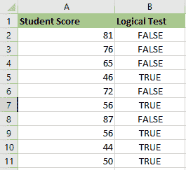

# Excel 中的非函数

> 原文:[https://www.javatpoint.com/not-function-in-excel](https://www.javatpoint.com/not-function-in-excel)

## 非逻辑操作

Excel 中的 **NOT 函数**是一个内置函数。**非函数**属于逻辑函数的范畴。我们可以将其用作工作表函数；“非”函数可以作为工作表单元格中公式的一部分输入。

我们可以将它作为一个单独的函数，或者作为公式和单元格中其他 excel 函数的一部分。例如，使用 **IF、&或**功能。“非”函数用于反转逻辑值。它返回公式中给定逻辑值的相反值。如果参数的值为**真，**则返回**假**，反之亦然。

### 句法

非函数的语法是:

NOT(logical_value)

### 参数或参数

**逻辑值:-** 一个表达式，计算结果为**真**或**假**。如果我们使用**真**的表达式，则返回**假**。如果使用表达式**为假，**则返回**真**。

### 返回

*   如果逻辑值为**真，**则非函数将返回
*   如果逻辑值为**假，**则非功能将返回

## 如何在 Excel 中使用非函数？

Excel 中的非函数使用起来非常简单直接。让我们看一些如何在 Excel 中使用 NOT 函数的例子。

**示例 1:** 在本示例中，**非功能**用于对给定的数据集合**(学生分数)执行逻辑测试。**我们来检查一下**哪个值大于等于 60** 。

表格有两栏:第一栏包括学生分数&第二栏是逻辑测试栏，在这里执行**非功能**。

**结果:**它会给我们相反的结果或相反的值。如果大于等于 60，输出为**假**；如果该值小于或等于 60。那么输出将是**真。**

应用公式后，结果将是:

### 示例 2:使用 NOT 函数排除某些特定值

在这个例子中，我们有一个蔬菜清单；我们可能想排除我们不喜欢的 **Brinjal，**。因此，如果我们使用**非功能**，所有布林哈尔将返回**假**，而如果我们不使用，将返回**真**。

我们使用的公式

**注:**

1.如果我们希望在一个公式中测试多个条件，我们可以使用**而不是**与**和**或**或**例如，如果我们需要排除**布林哈尔**和**胡萝卜，**公式将是:

=NOT(OR(B2="Brinjal",B2="Carrot"))

2.此外，如果我们希望将布林哈尔排除在**北**之外，请将**而非**与 Excel **AND 函数结合使用。**

=NOT(AND(B2="Brinjal",C2="North"))

### 示例 3:使用 NOT 函数处理空白单元格

是 **NOT 功能**的另一种常见用法；我们可以组合 **NOT** 和 **ISBLANK** 函数，以便在应用公式时处理某些空白单元格，这是 **NOT 函数的另一种典型用法。**

例如，我们有一份员工销售报告，有人过度完成了工作。如果他们有额外的销售额，他们将获得奖金，相当于额外的**销售额*10%。**如果他们的额外销售额是空白的，就没有激励。

我们可以用这个公式组合 **NOT** 和 **ISBLANK** 函数，得到如下结果:

=IF(NOT(ISBLANK(C2*10%,"Have No Bonus")

### 示例 4:非函数以及“如果”和“或”函数

在本例中，使用**非功能**和**【IF】**和**【或】**功能对下表中的自行车进行颜色检查。

我们需要从给定的数据集中整理出颜色**“蓝”**或**“黑”**。

我们将使用以下公式:

=IF(NOT(OR(A2="BLACK",A2="BLUE")),"x","")

该逻辑条件适用于颜色栏，该颜色栏包括任何颜色为**【黑色】**或**蓝色的自行车。**

如果条件为真，则输出为**空白。**

如果条件不成立，则输出为**“x”。**

### 示例 5:空单元格、空白或“0”的非函数

空白单元格或空单元格或“0”被认为是**假，**因此**“非”**函数返回**真。**

在单元格**“C2”**中，存储的值为**“0”**假设我们使用带有逻辑参数或值的 **NOT 函数**作为**“0”**或**“C2”，**结果将为 **TRUE。**

### 示例 6:小数的非函数

假设单元格中的值是十进制值。假设我们将参数作为小数，这意味着如果我们使用带有逻辑参数或值的**“NOT”**函数作为**“456.45”**或**“B2”。**结果为**假**。

### 示例 7:负数的非函数

如果单元格中的值为负数。假设我们用一个负数作为参数；例如，如果我们使用带有逻辑参数或值的**“NOT”**函数作为**-2”**或**“A2”，**结果将为 **FALSE。**

### 示例 8:当值或引用是非函数中的布尔输入时

如果值或引用是布尔输入**(单元格中的“真”或“假”)**。在本例中，单元格 **A2、** a **FALSE** 值是这样存储的，如果我们使用带有逻辑参数或值的**“非”**函数作为**“A2”**或**“FALSE”**，结果将是 **TRUE** 。如果逻辑参数为**“真”，**则反之，意味着**非**函数返回**“真”**值作为输出。

**例 9:** 考虑以下场景:我们在**巴黎**有一个总部，还有多个地区办事处。如果站点不是巴黎，那么我们需要显示单词**“是”，**，如果是巴黎，我们需要显示单词**“否”。**

**非功能**嵌套在下面给出的**中频功能**的逻辑测试中，以反转**真**结果。

=IF(NOT(B2="Paris"), "Yes","No")

< >的**非**逻辑运算符也可用于此。下面是一个例子。

IF(B2<>"Paris","Yes","NO")

**例 10:** 使用 Excel 的信息函数时，NOT 函数很有帮助。有一组 Excel 函数，如果检查成功则返回**真**，否则返回**假**。

例如， **ISTEXT** 函数将确定一个单元格是否包含文本，如果包含，则返回**真**，如果不包含，则返回**假**。如果**非功能**能够逆转这些功能的结果，则该功能是有用的。

在下面的例子中，我们需要向销售员支付他们追加销售金额的 15%。但是，如果他们没有追加销售任何东西，单元格中会出现单词**“无”**，从而导致公式错误。

我们使用 **ISTEXT 功能**来检查文本的存在。如果文本存在，则返回**真**。因此，非函数返回假，而中频执行其计算。

=IF(NOT(ISTEXT(B2)),B2*15%,0)

**例 11:** 假设我们不希望我们的毛绒玩具是蓝色和绿色的。我们有以下数据集:

我们将使用公式 **=NOT(C2=“蓝绿色”)**来防止蓝绿色组合。

应用上述公式后，我们将得到如下输出:

* * *