# Excel RAND()函数

> 原文：<https://www.javatpoint.com/excel-rand-function>

RAND()是一个在 Excel 中被归入**数学&三角**范畴的函数。它返回一个介于 0 和 1 之间的随机数。该随机数大于或等于 0 ( > =0)且小于 1 ( < 1)。

Excel RAND()函数不接受任何参数，这个公式的结果是不稳定的。你现在想知道这个公式是如何工作的，为什么要使用它。

在本章中，您将学习 RAND()函数的用法、属性、示例和其他东西，以详细指导每一步。此外，我们还将简要说明为什么使用此功能。

### 句法

这是一个没有任何参数的简单函数。

```

=RAND()

```

## 它返回什么？

当它计算一个介于 0 和 1 之间的随机数时，它会将其返回给用户。

## RAND 的目的()

RAND()函数生成一个介于 0 和 1 之间的随机数。每次公式在 Excel 工作表打开和关闭时重新计算。

**自行指定范围**

此外，您还可以设置自己的范围，从中选择一个随机数。**例如**，

```

=RAND() * (b-a)+a 

```

这里，b 是定义范围内最大的数，a 是最小的数。

#### 注意:这个函数永远不会返回大于最大值的随机数。

例如，

```

=RAND() * (25-10)+10

```

上述公式将生成一个介于 10 到 24.9999 之间的随机数。

我们有一个表中的例子列表，你可以在其中分析这个函数的不同之处以及它返回的内容。

| 公式 | 结果 | 范围 |
| =RAND() | 不包括 1 的 0 到 1 之间的随机数。 | 0 到 0.99999 |
| =RAND() * (25-10)+10 | 介于 10 到 25 之间的随机数。 | 10 至 24.9999 |
| =RAND() * (200-100)+100 | 在大于或等于 100 和 200 之间选择的随机数。 | 100 至 199.9999 |
| =INT（兰特（）* （200-100）+100）） | 介于 100 和 200 之间的随机整数。
*不会选择浮点数。* | 100 到 199(只返回整数)。 |

但是，您也可以为此使用 RANDBETWEEN()公式。Excel 使您能够根据自己的需要自定义 RAND()函数，并执行与 RANDBETWEEN 相同的操作。

### 为什么需要这个功能？

RAND()函数生成一个随机的数字序列。有时，Excel 用户要求分配随机数或任务。你可以用这个函数来做。

它将帮助 Excel 用户通过给一组人分配一个随机数来给他们分配一个随机数或任务。

我们将在本章中讨论以下示例:

*   [示例 1:简单的 RAND()实现](#Example1)
*   [例 2:自定义结果](#Example2)
*   [例 3:生成整数随机数](#Example3)
*   [例 4:随机分配任务](#Example4)

## 如何使用 RAND()函数？

要了解在哪里以及如何使用 RAND()函数，你必须通过将它应用到 Excel 数据中来用例子来学习它。我们将给出两到三个这个函数的例子来帮助你学习这个函数。

现在，我们将对 Excel 数据实现 RAND()函数。为此，我们取了这组数字数据。

### 示例 1:简单的 RAND()实现

**第一步:**首先，我们没有指定任何东西。我们将在这个工作表上简单地使用 RAND()函数。所以，写吧

=RAND()

Excel 工作表中的任何位置。

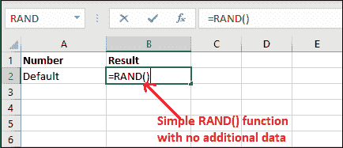

**第二步:**点击**进入**键获得结果。你可以看到这个函数返回的随机数在 0 到 1 之间。

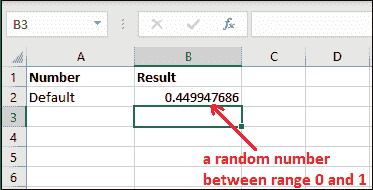

**第三步:**每当您在同一张 Excel 表上尝试添加、删除或执行任何其他操作时，该随机数都会发生变化。

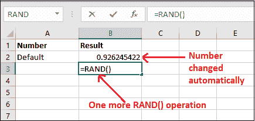

您可以看到，在执行另一个 RAND()操作时，前面的结果已经改变。

**第四步:**每次使用这个函数，都会返回不同的随机数。这个数字不会每次都一样。寻找新的随机数-

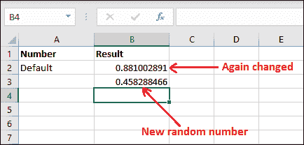

你可以看到之前的结果又改变了一次。

#### 注意:这些随机数会随着工作表的修改而改变，即使工作表会打开或关闭。

### 示例 2:定制结果

Excel 允许用户自定义 0 到 1 之间的结果。虽然您不能为 RAND()函数提供参数，但是您可以决定要生成的随机数的范围。

**例如**，生成一个 0 到 100 之间的随机数，因为默认的起始范围是 0。为此，您必须通过与 RAND()函数相乘来定义范围。

让我们看看如何使用 RAND()函数来实现:

### 自定义 RAND()函数结果的步骤

**第一步:**在这张 Excel 工作表中，我们已经定义了 A 列中的范围，在 B 列中，我们对特定范围应用 RAND()公式，并得到结果。

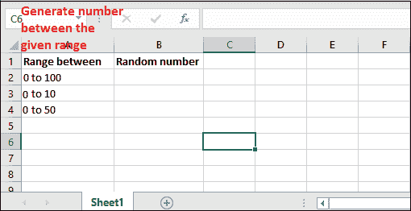

**第二步:**写出如下特定范围的 RAND()公式:

=RAND()*100

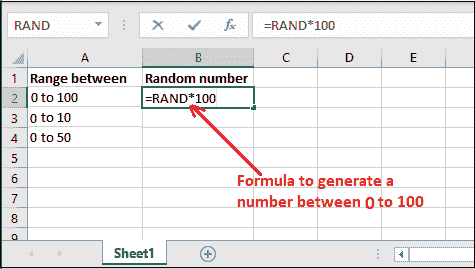

**第三步:**现在，获取上面公式的结果，看看它返回了什么。

你会看到它返回了一个低于 100 高于 0 的随机数 ***82.03015662*** 。

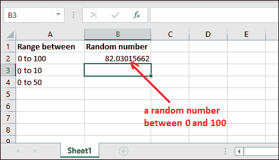

**“你不需要付出太多的努力，你只需要将 RAND()函数与你想要得到的随机数的范围相乘就可以了。”**

**第四步:**现在，让我们得到一个 0 到 10 之间的数字。使用以下公式-

=RAND()*10

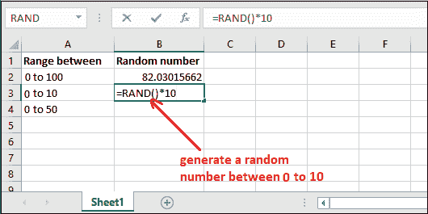

**第五步:**现在，看上面公式计算的结果，这将返回 1 到 10 之间的结果。

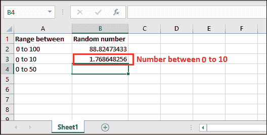

类似地，您可以通过用多个数字指定范围来为任何给定的范围生成随机数。

**在两个数字之间生成一个数字**

除此之外，您还可以定义开始范围和结束范围。我们有另一个公式。使用公式**= RAND()*(endRange-startRange)+startRange**。

**第六步:**这里我们已经指定了开始范围 20 和结束范围 50。在 C2 单元格中写下公式-

=RAND()*(B2-A2)+A2

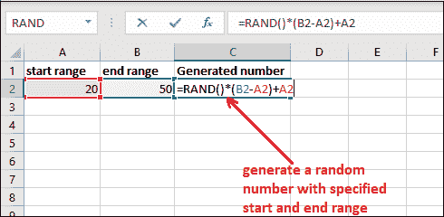

**第七步:**点击**进入**键，得到生成的 20 到 50 之间的数字。

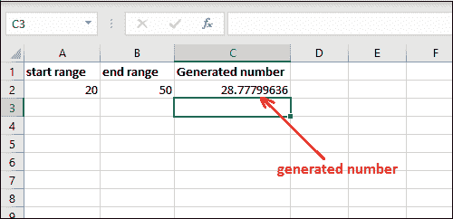

使用此公式，生成的随机数永远不会大于结束范围，也不会小于开始范围。

### 示例 3:生成整数随机数

在以上所有示例中，您已经注意到 RAND()函数正在生成一个带小数点的数字。如果你想要这个数字是一个整数，你必须使用 INT()函数。

请记住，您必须将范围定义为大于 1。否则，RAND()函数的默认范围是 0 到 1。请参见下面的示例:

**第一步:**我们已经使用了带有 INT()的 RAND()函数来获取生成的整数。

=英特（兰特（）*100）

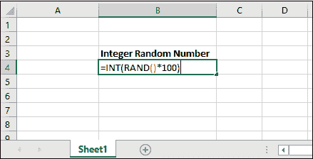

**第二步:**看到它已经作为小于 100 的整数值返回。

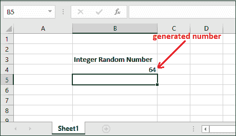

### 示例 4:任务的随机分配

我们来看一个场景，看一个使用 Excel RAND()函数将任务随机分配给一群人的例子。例如，

我们有一组存储在 Excel 工作表中的人员数据，我们希望随机分配其任务。使用 Excel 的 RAND()函数。看看我们的原始数据-

**第一步:**最初，我们在 A 列(单元格 A2 到单元格 A6)有一个五人名单。

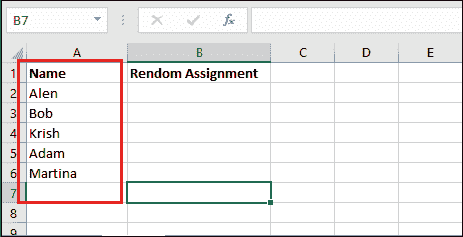

**第二步:**选择所有给定的数据(A2-A6)，将鼠标控制在 A6 单元格右下角，您将看到一个 **+** 符号。将此 **+** 号拖至第 20 排。

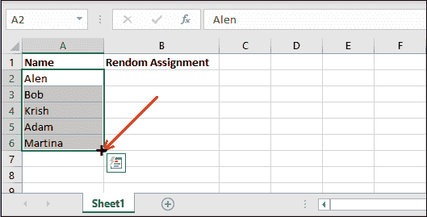

**第 3 步:**您将看到直到第 20 行的数据被重新生成。

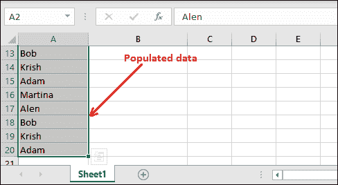

**第 4 步:**现在将 B 列留空，并在 C2 和 C3 单元格中键入两个序列号，如下所示。

选择这些数字，并按照步骤 2 和 3 拖动到第 20 行。

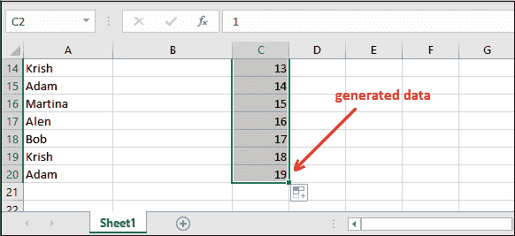

**第五步:**现在，先在 D2 单元格中键入 Excel RAND()公式，生成一个随机数。

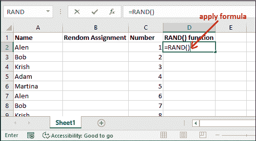

**第 6 步:**选择 D2 单元格，并像前面执行的步骤一样拖动鼠标直到第 20 行。

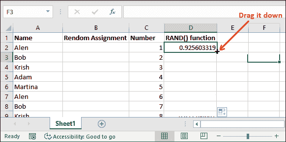

**第 7 步:**会自动生成所有行的随机数，直到 20。查看给定的截图。

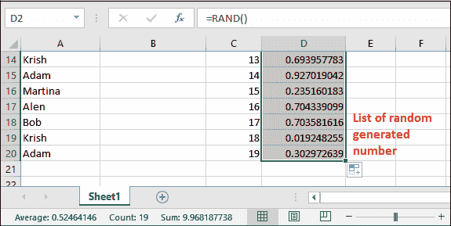

#### 注意:这些生成的随机数是无序的。

**第 8 步:**右键单击 D 列任意一个随机数，点击**排序**，然后选择**从最小到最大排序**。

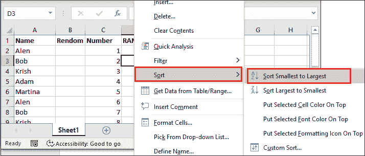

**第九步:**生成的随机数将从最小到最大排序。您还会看到，列 A 和列 C 元素的位置也发生了变化。

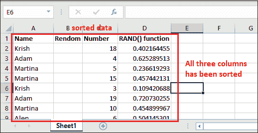

**第十步:**最后删除 D 列和 B 列(空白列)。

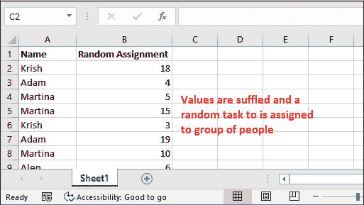

## 关于 RAND()的附加信息

RAND()函数属于**数学&三角**函数范畴。当你把这个函数应用到你的 Excel 表格上时，你可以用它做更多的事情-

1.  每当打开或关闭 Excel 工作表时，RAND()函数都会计算一个新值。如果要防止重新计算并停止重新生成此随机数，请使用 Excel 的“粘贴特殊值”>“值”将数字值转换为文本。
2.  如果希望为多个单元格生成一组随机数，选择单元格，输入=RAND()公式，然后按 **Ctrl+Enter**
3.  每次计算工作表时，此函数都会生成一个新的随机数。如果您希望此结果不会改变，请输入公式并按 F9 键。
4.  如果您希望随机生成您定义的而不是默认的 0 和 1。你也能做到。对此我们有一个公式:=RAND() * (b-a)+a，其中 b 是上限值，a 是下限值。

* * *