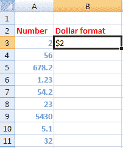

# excel 中的美元函数

> 原文：<https://www.javatpoint.com/dollar-function-in-excel>

excel 中的美元函数是一个专门的函数，用于将给定值转换为美元格式的货币。它只以数字的形式引入具有指定值的美元符号。它不适用于字母形式的字符。

我们也可以说 DOLLAR()函数将数字转换成美元格式的文本。

### 句法

美元有两种表现方式。

1.  美元(数字)
2.  DOLLAR(数字，[小数])

**DOLLAR(数字)**

声明如下:

= DOLLAR(数字)

例如，

= DOLLA(10)

返回值为 **$10.00** 。

DOLLAR 的默认小数值为 **2** 。因此，如果我们在函数中指定任何有或没有小数的数字，它将返回最多两位小数的值。

让我们考虑另一个例子。

= DOLLA(154.5492)

返回值为 **$154.55** 。

**DOLLAR(数字，[小数])**

在这里，我们可以根据我们的要求指定十进制值。它表示十进制值，因为 0 表示该数字没有小数，3 表示最多三位小数的值。我们通常更喜欢指定小数值，因为我们可以根据需要调整小数位。

声明如下:

= DOLLAR(数字，十进制)

例如，

= DOLLA(10，1)

返回值为 **$10.0** 。

或者

= DOLLA(10，0)

返回值为 **$10** 。

#### 注意:我们可以用小写或者大写来声明函数，但是 excel 中函数的默认格式是用大写来表示的。在我们实现函数后，Excel 会自动将其转换为大写。

## 访问 DOLLAR()函数的快捷方法

我们可以通过在选定的单元格/公式栏上键入或通过快捷方式来访问该功能。在前一种情况下，我们需要在函数中指定数字和十进制值，以将其转换为美元格式。但是，使用快捷方式，我们需要在对话框中指定数字和小数值。

让我们讨论一下步骤，如下所示:

1.  选择任意单元格，点击 excel 顶部的**公式**栏，如下图:
    
2.  点击**文字**图标，如下图:
    
3.  将出现一个下拉列表。从给定列表中选择 **DOLLAR** 功能，如下图:
    
4.  将出现一个对话框，如下所示:
    
5.  在相应选项前指定数字和小数值，然后按**确定**。所选单元格上将出现美元形式的所需值。它也会出现在对话框的右上角，如下图:
    

我们可以根据需要设置数值和小数位数。

## 要点

*   DOLLAR()函数不适用于字母、符号、等式等形式的字符。
*   它还接受 0 作为数字，并将其转换为美元格式的文本。
    例如
    =DOLLAR(0)
    返回值: **$0.00**
    或
    =DOLLAR(0，0)
    返回值: **$0**
*   DOLLAR 函数还可以执行函数内声明的数学运算。
    例如
    =DOLLAR(3 + 4，2)
    返回值: **$7.00**
    =DOLLAR(3 / 4，2)
    返回值: **$0.75**
    =DOLLAR(3 * 4，2)
    返回值: **$12.00**
    它将首先计算结果，然后将值转换为美元格式。
    如果数学运算后的结果为负，会以美元格式插入带有数值的括号。
    例如，
    =DOLLAR(3 - 4，2)
    返回值: **($1.00)**

## 例子

让我们考虑一些例子。

### 示例 1:将数字转换为十进制格式。

请考虑以下步骤:

1.  点击 **Dollar 格式**列的第一个单元格，键入=DOLLAR(A3，0)，如下图:
    
    数值 0 不会插入带数字的小数。
2.  按**进入**。所需的美元格式的数字将出现在选定的单元格上，如下所示:
    
    该数字将以整数形式用美元符号表示。如果数字是十进制形式，函数会将给定值舍入到最接近的整数。
3.  拖放到列的最后一个单元格，如下图:
    
4.  已经是十进制格式的数字将被舍入到最接近的整数值。例如，
    1.23 - > $1
    54.2 - > $54

### 例 2:用 2 个小数位换算不同商品的价格。

按照规定，我们将把小数值指定为 2，以便在数字中插入两个小数位。

1.  点击**美元价格**列的第一个单元格，输入=美元(A3，2)，如下图:
    
2.  按**进入**。所需的美元格式的数字将出现在选定的单元格上，如下所示:
    
    如果该数字有两个以上的小数位，该函数将把给定值四舍五入到两个小数位。
3.  拖放到列的最后一个单元格，如下图:
    

DOLLAR()函数将自动应用于该列的选定单元格，如下所示:

* * *