# excel 中的左公式

> 原文：<https://www.javatpoint.com/left-formula-in-excel>

左函数用于从字符串的**左侧**提取字符。指定的字符可以是**数字、字符、**或**符号**的形式。它还包括两个或多个字符之间的空格。我们可以指定要从给定数据元素左侧提取的字符数。我们也可以说 LEFT()函数返回字符串的最后几个字符。

它由下式给出:

LEFT(text, Number_of_characters)

哪里，

**文本**是指我们要从中提取元素的指定单元格。

**Number_of_characters** 是指我们要从 excel 中给定数据中提取的字符数。

#### 注意:与 MID()函数不同，它不需要函数中的 start_position 参数。这是因为 LEFT()函数默认从字符串的左端开始。

LEFT()和 RIGHT()函数的主要区别是从字符串的特定结尾提取字符。使用 LEFT()函数的提取是从字符串的**左端**开始向右，而使用 right()函数是从右端向左。

例如，

数据字符串= abcd123bdf

在这里，我们希望从每个字符串的左侧提取字符形式的代码。所以，我们将使用 LEFT()函数。

上述字符串的语法为:

=LEFT(abcd123bdf, 5)

Excel 将从给定字符串的左端开始提取。提取将从字符串(a)的第一个字符开始，一直计数到第 5 个字符(1)。因此，输出将是:

**输出:** abcd1

我们还将讨论 **LEFTB()** 函数，LEFT()函数的另一部分，它将**双字节字符**计为 2。而 LEFT()函数用于使用单字节字符的语言。这将在本主题后面讨论。

### 快捷公式

我们还可以使用快捷方式访问 LEFT()公式。我们来讨论一下。

1.  选择任意单元格，点击 excel 中公式栏上方的**公式**图标，如下图:
    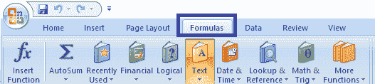
2.  单击文本图标。将出现一个下拉列表。从下拉列表中选择“**low”**选项，如下图:
    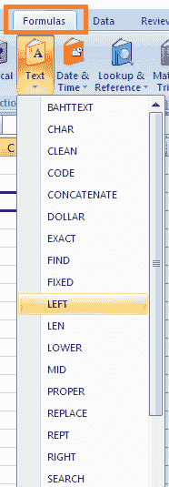
3.  将出现一个对话框。从文本左侧开始指定文本和我们要提取的字符数，如下图:
    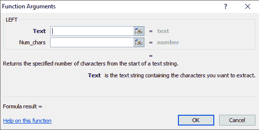
4.  点击对话框底部的**‘确定’**按钮。输出将出现在选定的单元格上。

## 要点

*   如果指定的字符数大于文本长度，excel 将返回到文本末尾的字符。
    例如
    **文字**:12346543
    T5】语法 : LEFT(12346543，20)
    在这里，excel 将返回 12346543，即从左端到右端的字符。
*   如果字符数为负数，excel 将返回' #VALUE！'
    例如
    **文字**:ytr 45321
    T5】语法 : LEFT(YTR45321，-5)
    这里，excel 会返回' #VALUE！'

让我们首先考虑 excel LEFT()函数的一些例子。

## 例子

### 示例 1:从给定的字符串中提取代码号。

请考虑以下步骤:

1.  点击提取单词列的第一个单元格，输入 **=LEFT(A3，3)** ，如下图:
    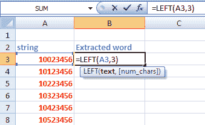
2.  按**进入**。所需的结果将出现在选定的单元格上。
3.  将其拖放到最后一列，即该列的第五个单元格。左公式将自动应用于该列的其余单元格。
    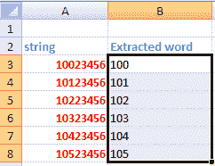

如下所示:

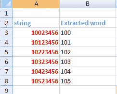

这意味着 LEFT()函数将从左侧开始提取元素(1 st 元素)并计数，直到第三个元素 y 从左向右移动。因此，返回值将是前三个字符。

每个单元格上的 LEFT()函数将按如下方式工作:

=左(10023456，3)

返回值: **100**

=左(10123456，3)

返回值: **101**

=左(10223456，3)

返回值: **102**

=左(10323456，3)

返回值: **103**

=左(10423456，3)

返回值: **104**

=左(10523456，3)

返回值: **105**

### 示例 2:从给定的字符串中提取代码。

请考虑以下步骤:

1.  点击**编码**列的第一个单元格，输入 **=LEFT(A2，4)** ，如下图:
    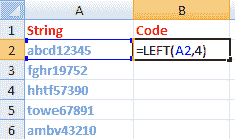
2.  按**进入**。所需的结果将出现在选定的单元格上。
3.  将其拖放到最后一列，即该列的第五个单元格。左公式将自动应用于该列的其余单元格。如下所示:

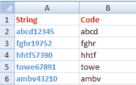

同样，我们可以从给定的字符串中提取所需数量的字符。

### 示例 3:从给定的电话号码列表中提取国家代码。

这里给出了各个国家的电话号码列表。我们需要提取每个电话号码开头的国家代码。代码可以是两位数、三位数或更多。因此，这里我们将使用 SEARCH()函数和 LEFT()函数。

**SEARCH():** 在 excel 表格中查找需要的内容。

语法由下式给出:

LEFT(string, SEARCH(character, string) -1)

将返回函数中指定字符之前的字符数。这里，1 是默认大小。

请考虑以下步骤:

1.  点击**代码**列的第一个单元格，输入 **' =LEFT(A2，SEARCH("-"，A2)-1)'** ，如下图:
    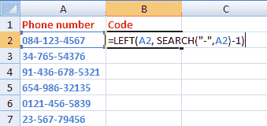
2.  按**进入**。所需结果将出现在所选单元格上，如下所示:
    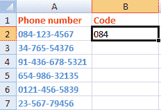
3.  将其拖放到最后一列，即该列的第五个单元格。左公式将自动应用于该列的其余单元格。如下图:
    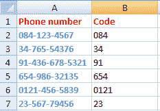

“-”符号前的国家/地区代码将在选定的单元格中返回，与数字无关。同样，我们可以用同样的概念，用不同的方式提取人物。

### 示例 4:如何从给定字符串中删除最后 N 个字符

我们将使用 LEN()函数和 LEFT()函数从给定的字符串中提取最后 N 个字符。

**LEN():** 返回指定字符串的长度。

语法由下式给出:

LEFT(string, LEN(string) - number_of_characters_to_remove)

例如，

左(D2、伦(D2)-6)

哪里，

D2 = abvd 1-34a

该函数将删除字符串的最后六个字符，即一个字母、三个数字、一个连字符和一个额外的空格。返回的值将是 **abvd** 。

我们用一个例子来讨论一下。

请考虑以下步骤:

1.  点击**结果**列的第一个单元格，输入 **' =LEFT(A2，LEN(A2)-7)，'**如下所示:
    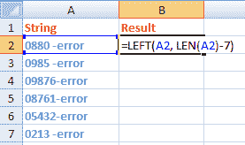
    该函数将删除给定字符串中的最后七个字符，包括空格和连字符。
2.  按**进入**。所需结果将出现在所选单元格上，如下所示:
    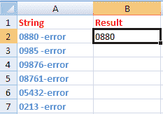
3.  将其拖放到最后一列，即该列的最后一个单元格。

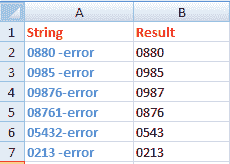

## excel 中的 LEFTB()函数

让我们快速了解一下 excel 中的 LEFTB()函数，以消除 LEFT()函数和 LEFTB()函数之间的混淆。

当我们启用编辑支持 **DBCS** (双字节字符集)的语言并将其设置为默认语言时，LEFTB()函数将双字节字符视为 2。否则，它认为 1。在左()函数的情况下，它将每个单字节字符视为 1。这意味着当设置为默认语言时，LEFTB()的工作方式与 LEFT()函数相同，而不是 DBCS 函数。

双字节语言是**中文、韩语和日语**。这样的语言很难用单引号来表示。

它由下式给出:

LEFT(text, start position, Number_of_bytes)

哪里，

**文本**是指我们要从中提取元素的指定单元格。

**Start_position** 是指我们要开始提取的位置。

**Number_of_bytes** 是指我们要从 excel 中给定数据中提取的字符数。

LEFTB()的输出和条件与 LEFT()函数相似。

### 要点

1.  字节数应大于或等于 0。
2.  如果排除字节数，则假设为 1。
3.  如果指定的字节数大于字符串的长度，它将返回完整的字符串。

* * *