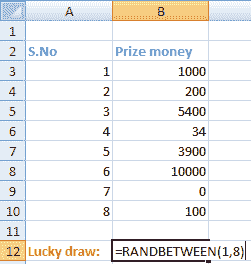
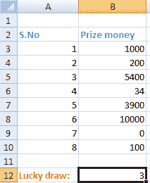
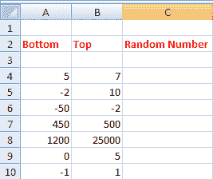
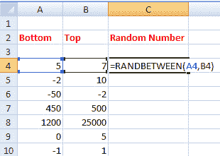
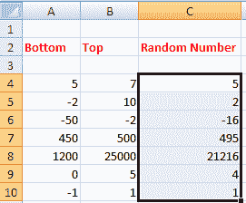

# excel 中的 Randbetween 函数

> 原文：<https://www.javatpoint.com/randbetween-function-in-excel>

randBENTH 公式在指定的数字之间生成一个随机数。源自两个字，**随机**和之间的**。随机意味着选择任何人都不知道的随机数，而介于意味着找到指定范围之间的数字。返回值将仅来自指定的范围。它不能位于指定范围之外。**

它由下式给出:

随机之间(底部，顶部)

哪里，

**底部**:表示指定范围的下限值

**顶部**:表示指定范围的上限值

它将返回 excel 中指定数字范围内的整数。

**条件**:底部<顶部或底部=顶部

底部永远不会大于顶部。否则，excel 将返回一个错误。

#### 注意:RANDBETWEEN()函数只接受整数值。

例如，

随机区间(4，10)

在这里，

4:底部

10:顶部

它将显示一个介于 4 和 10 之间的随机数。它可以是任何数字。一般用于在各种学生中查找 excel 中的抽奖号码或 excel 中的姓名。我们只需要以“=RANDBETWEEN(底部，顶部)”的形式键入公式我们可以根据需要设定任何范围。

让我们考虑其他例子。

**a . RANDBENT(-10，0)**

返回值:-6

解释:该函数将返回-10 到 0 之间的任何数字，即-10、-9、-8、-7、-6、-5、-4、-3、-2、-1 和 0。

这里；返回值为-6。

**b . RANDBENT(1000，10000)**

返回值:1141

说明:这里，范围 1000 到 10000 之间返回的随机数是 1141。

**c . RANDBENT(50，200)**

返回值:131

说明:这里，50 到 200 之间返回的随机数是 131。

**d .边缘网(1，100)**

返回值:19

说明:这里，范围 1 到 100 之间返回的随机数是 19。

## 关于 RANDBENT()的要点

*   它不适用于名称或字母形式的字符。它只适用于与数字相关的数据。
    例如，
    RANDBETWEEN(2，100)
    返回值: **22**
*   我们不能像其他函数一样，用函数中一个或多个单元格的间隙来指定单元格名称。它显示一个错误#VALUE！
    例如，
    RANDBETWEEN(A2，E2)
    返回值: **#VALUE！**
    但是，我们指定的单元格名称没有单元格间隙。
    例如，
    RANDBETWEEN(A2，B2)
    其中，
    A2 和 B2 包含底值和顶值。细胞 A2 和 B2 之间没有细胞间隙。
*   如果顶部和底部相等，函数将返回相同的值。
    例如，
    RANDBETWEEN(1，1)
    返回值: **1**
*   底部数字必须小于或等于函数中的顶部数字。如果底部大于顶部，excel 将返回错误#NUM！
    例如，
    RANDBETWEEN(5，2)
    返回值: **#NUM！**
    它代表
*   每次我们计算时，它都会返回一个新值。
    比如
    RANDBETWEEN(100，500)
    Try 1:**106**T5】Try 2:**258**T8】Try 3:**260**T11】我们可以看到，每次我们在函数内指定相同的范围，它每次都会返回一个新的数字。
*   如果是十进制值，默认情况下该函数将返回 1。
    例如，
    RANDBETWEEN(0.5，5.2)
    返回值: **1**
*   Excel 不接受任何空格代替整数值来代替底部和顶部。
    例如，
    RANDBETWEEN(，2)
    返回值:**#不适用**T5 它代表值不可用错误。

## 例子

让我们考虑一些例子。

### 例 1:找一个序号为 1 到 8 的学校的学生抽奖。

在这里，我们将使用 RANDBETWEEN()函数，该函数作为一个幸运抽奖。该函数返回一个任何人都不知道的值。它可以是指定范围内的任意随机值。

请考虑以下步骤:

1.  点击**前面的单元格抽奖**，如下图:
    T3】
2.  键入' **=RANDBETWEEN(1，8)** ，'如下所示:
    
    这里，1 和 8 指定列表中给出的范围为序列号(序列号)。返还的价值将与奖金相匹配。
3.  按**进入**。将出现作为抽奖的返回值。
4.  因此，候选人赢得的奖金为【5400 卢比。因为返回的值是 **3** 。序列号为 3 的匹配价格为 5400 卢比。

### 示例 2:在这里，我们将生成各种数字范围的随机数。

考虑下表:

要使用 RANDBETWEEN()函数生成随机数，请考虑以下步骤:

1.  点击**随机数**列的第一个单元格，输入 **=RANDBETWEEN(A4，B4)**，如下图:
    
2.  按**进入**。将出现生成的号码。
3.  将它拖放到列的最后一个单元格，如下所示:
    
    RANDBETWEEN()函数将根据相应列中指定的底部和顶部值自动应用于所有选定的单元格。第一列(A)将被视为底值，第二列(B)将被视为顶值。如果底值小于顶值，该函数将生成所需的输出。

因此，每个单元格上的 RANDBETWEEN()函数将按如下方式工作:

= RANDBETWEEN，7)

返回值: **5**

= RANDBETWEEN，10)

返回值: **2**

= RANDBETWEEN，2)

返回值: **-16**

= RANDBETWEEN，500)

返回值: **495**

= RANDBENT(1200，25000)

返回值: **21216**

= RANDBETWEEN，5)

返回值: **4**

= RANDBETWEEN，1)

返回值: **1**

* * *