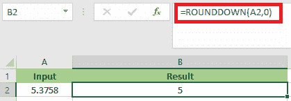
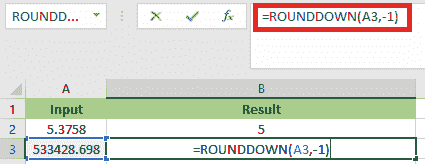
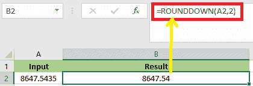

# Excel 中的舍入函数

> 原文：<https://www.javatpoint.com/rounddown-function-in-excel>

在 Excel 中， **ROUNDDOWN** 函数是一个内置函数。我们用这个函数来舍入给定的数字。该函数将给定的数字舍入到相对于给定数字最近的较低数字。该功能可通过键入关键字**=四舍五入**(在任何单元格中)来访问。与标准舍入不同，标准舍入只向下舍入小于 **5 的数字，而向下舍入**向下舍入所有数字。

### 舍入函数的语法

以下是 Excel 中**舍入**函数的语法:

=ROUNDDOWN(number, num_digits)

### 参数或参数

以下是 ROUNDOWN 函数的参数:0

1.  数字
2.  数字

**数字:-数字**是我们需要向下舍入的任何实数。这是一个必要的和强制性的论点。可以输入为**功能、公式**、**号**或**单元格引用。**

**num _ digits:-number _ digits**是我们需要四舍五入的位数。

### 返回

ROUNDDOWN 函数返回一个**数值。**

## 如何使用 Excel ROUNDDOWN 函数？(示例)

ROUNDDOWN 函数真的很容易使用。让我们看一些如何在 Excel 中利用 ROUNDDOWN 函数的例子。

### 示例 1:将正浮点数舍入到小数点后零位

在本例中，单元格 **A2** 是一个输入数字，其值为 **5.3758** 。结果单元格是 **B2** ，其中 **ROUNDOWN** 公式应用的是 **=ROUNDDOWN (A2，0)** ，这意味着我们必须用零小数对 **A2** 中的值进行舍入。

应用公式后，结果将是 **5** ，如下图所示。

### 示例 2:将正浮点数舍入到小数点左边的一个小数位

在本例中，单元格 **A3** 是数值为 **533428.698** 的输入数字。

**B3** 是结果单元格，其中应用的**舍入**公式为**=舍入(A3，-1)** ，指定数字应向下舍入到小数点左边 1。

应用公式后，结果将是 **533420** ，如下图所示。

### 示例 3:将负浮点数四舍五入到小数点后一位

在本例中**，A4** 是输入数值为 **-4.3969** 的数字。应用于结果单元格 B4 的 **ROUNNDDOWN** 公式为 **=ROUNDDOWN(A4，1)**，它将 **A4** 中的值向下舍入一个小数位。

应用公式后，结果将是 **-4.3** ，如下图所示。

### 示例 4:将一个数字向下舍入到两位小数

在本例中，单元格 **A2** 包含一个十进制数值 **8647.5435** 的数字。使用**舍入**功能，我们必须在单元格 **B2** 中将一个数字舍入到两个小数值。

为了对该值进行舍入，我们必须应用以下舍入公式:

=ROUNDDOWN(A2,2)

应用公式后，结果会是 **8647.54** ，如下图截图所示:

**需要记住的事情**

*   **舍入**功能将给定数字舍入到给定数字下最近的数字。
*   在 **ROUNDOWN** 功能中，两个参数都是必需的。
*   在**舍入**功能中，如果第二个参数 **num_digits** 为 **0** ，则该数字被舍入到最接近的整数。
    **举例；=ROUNDDOWN(756.4595)，**返回值 **756** 。
*   在**舍入**功能中，如果第二个参数 **num_digits** 小于 **0** ，则该数字向下舍入到小数点左边。
    ***比如*；=ROUNDDOWN(-756.4595，-2)** 返回值 **-700**
*   如果第二个参数 num_digits 大于 0，则该数字向下舍入到 **ROUNDDOWN** excel 函数中指定的小数位数。
    ***比如*；=ROUNDDOWN(756.4595，2)** 返回值 **756.45**

* * *