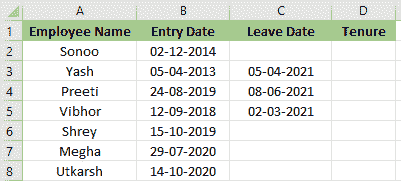
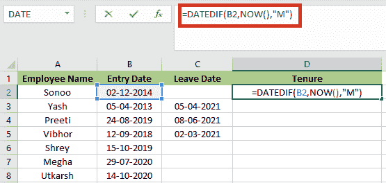
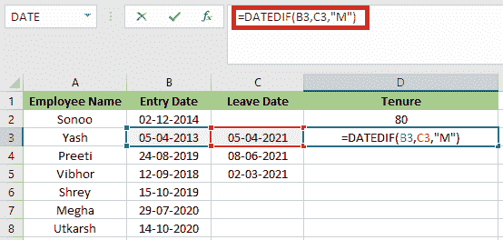
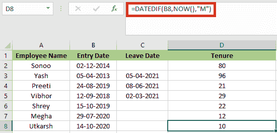
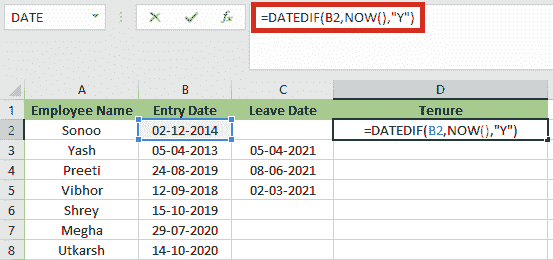
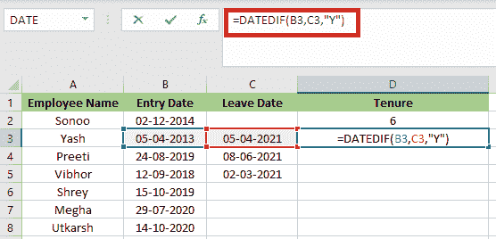
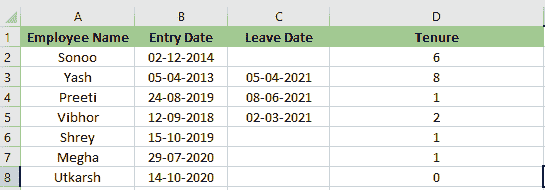
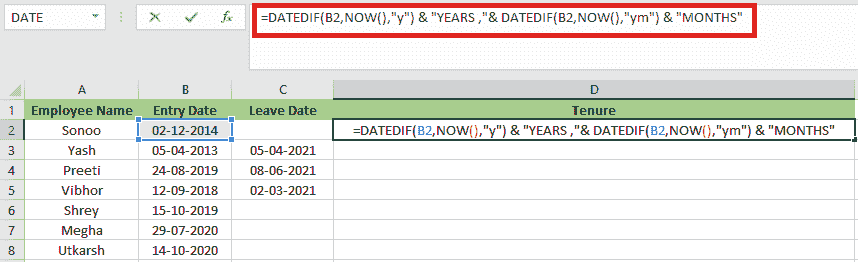
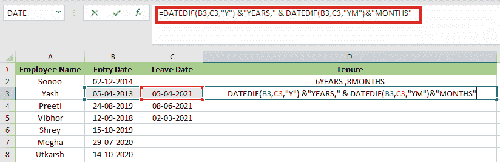
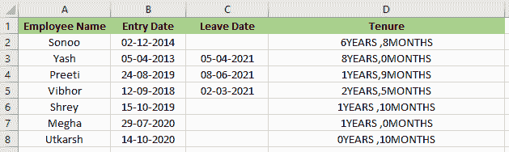

# Excel 中的任期公式

> 原文:[https://www.javatpoint.com/tenure-formula-in-excel](https://www.javatpoint.com/tenure-formula-in-excel)

当提及任何员工的雇佣时，术语**“任期”**将被更频繁地使用。术语**“任期”**是指员工在任何特定雇主的服务期。简单来说，任期就是员工的服务期。

说到计算任期或平均任期，Excel 可以对我们有所帮助。在本教程中，我们将讨论如何使用 Excel 计算平均员工任期。

如果我们负责跟踪我们部门或公司的人员，我们可能想知道是否可以使用 Excel 来

根据这些个人的开始日期计算他们的任期月数。这很容易做到。

例如，假设列 B 包含员工列表的开始日期。为了确定每个员工的任期，请在 C 栏中输入以下公式:

=DATEDIF(B2,NOW(),"M")

在这个公式中，**日期**函数计算开始日期和结束日期之间的差值。公式中的字母**“M”**表示我们希望在完成的月份内得到结果。

如果我们想计算我们这组员工的平均任期，只需将以下公式放在 **B** 栏的底部:

=AVERAGE(B2:B14)

## 如何在 Excel 中计算员工的月或年任期

计算公司或部门员工的任期是人力资源助理或部门秘书的正常任务。因此，掌握在 Excel 中计算任期的技巧是必须的。在本教程中，我们将讨论如何使用一个简单的公式来计算任期。最终的价值可以用月或年来表示，这取决于我们的需求。

让我们通过下面的例子来了解如何计算员工的任期:

### 示例 1:以月为单位计算员工的任期

我们可以使用 DATEIF 函数来计算员工的任期。该函数返回两个日期之间的**年/月/日**。**日期**功能的一般公式为:

=DATEIF(start_date,end_date,unit)

假设我们有一个员工列表，其中有些员工已经离职，有些还在工作。

以下是员工名单，包括**入职日期**和**离职日期。**

*   为了计算每月员工的任期，我们必须在单元格**中输入以下公式:D2 =日期(B2，现在()，“M”)。**本公式中， **B2** 为进场日期。因为没有结束日期和离开日期，所以我们用 **NOW()** 来计算进入日期和现在之间的月份，**M”**代表月份单位。
    
*   然后我们要点击**进入**这样才能得到输出。
    T3】
*   我们可以使用公式**= DATEDIF(C2 B2，“M”)**如果有结束日期参数，比如对于 **Yash** ，休假日期为 **05-04-2021。**
    
*   接下来我们要点击**进入**这样才能得到输出。
    T3】
*   最后，我们将使用与之前类似的公式计算剩余单元格的保有权。
    

### 示例 2:以年为单位计算员工的任期

在本例中，我们将使用相同的数据集。这个例子和上一个一样，只是在这个例子中我们将计算从 **M 到 Y** 的任期。

要计算员工的任职年限，我们必须遵循以下步骤:

*   首先，我们必须在单元格中输入以下公式

=DATEDIF(B2,NOW(),"Y")

*   然后我们要点击**进入**才能得到输出。
    T3】
*   现在，我们在单元格中输入下面的公式

=DATEDIF(B2,C2,"Y")

*   然后，必须点击**进入**才能获得输出。
    T3】
*   最后，我们必须使用与之前类似的公式来计算剩余单元格的保有权。
    

### 示例 3:按年和月计算员工的任期

在这个例子中，我们将使用与第一个和第二个例子中相同的数据集。在此，我们将以年和月为单位计算员工的任期。

我们必须遵循以下步骤，以年和月为单位计算员工的任期:

*   首先，我们必须在单元格中输入下面的公式

=DATEDIF(B2,NOW(),"y") & "YEARS ,"& DATEDIF(B2,NOW(),"ym") & "MONTHS"

*   然后，我们要点击**进入**才能得到输出。
    T3】
*   接下来，我们必须在单元格中输入下面的公式

=DATEDIF(B3,C3,"Y") & "years, "& DATEDIF(B3,C3,"YM") & "months"

*   然后，我们要按**进入**才能得到输出。
    T3】
*   最后，我们必须使用与之前类似的公式来计算剩余单元格的保有权。
    

* * *