# 超越今天和现在

> 原文:[https://www.javatpoint.com/excel-today-and-now](https://www.javatpoint.com/excel-today-and-now)

TODAY()和 NOW()是 Excel 最重要的两个时间函数。使用这些函数，您可以在 Excel 工作表中获取当前日期和时间。TODAY()和 NOW()是 Excel 的预定义函数，其中 TODAY()只返回当前日期，而 NOW()返回系统的当前日期和时间。

| 功能 | 描述 |
| 今日() | 当前日期(系统日期) |
| 现在() | 当前日期和时间(系统日期和时间) |

这两种功能都可以通过各种方式获得系统的日期和时间。日期会在 Excel 工作表打开和关闭后一天自动更改，时间会在一分钟后更改。

#### 注意:您可以按 F9 键重新计算工作表。

本章将逐一描述 TODAY()和 NOW()函数的用法。这些都是获取日期和时间的有用函数，并在日期/时间函数下分类。

## 为什么用函数代替手工写日期？

你可能想知道为什么不手动输入日期和时间并使用函数来代替它。

当您在 Excel 工作表中手动键入日期或时间时，它是硬编码的，不会改变。而当您使用 TODAY()或 NOW()函数获取当前系统时，它是动态的，并在一天后自动更改。

因此，如果您需要每次更新的日期和时间，请使用 TODAY()或 NOW()函数。否则，您可以通过手动输入静态日期来使用它。

## TODAY()函数

TODAY()是一个用来获取当前日期的 Excel 函数。当 Excel 工作表打开和关闭时，返回的日期会不断更新。

TODAY()函数不接受参数。它是一个没有参数的简单函数。但是，您可以将返回的日期格式化为日期格式。它返回唯一的日期。如果同时需要日期和时间，应该使用 NOW()函数。

### 句法

```

=TODAY()

```

### 返回值

函数的作用是:返回从系统中获取的当前日期。默认情况下，日期采用**日-月-年**格式。

### 如何使用 TODAY()函数？

当需要 Excel 工作表中的当前日期时，使用 TODAY()函数。让我们考虑一个例子来学习这个函数的用法。

### 示例 1:查找当前日期

请参阅以下示例，通过简单地使用 today()函数从系统中获取今天的日期。

**第一步:**在空白 Excel 单元格中写出简单的 TODAY()公式，按**回车**键。

=TODAY()

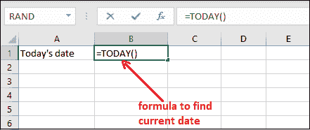

**第二步:**可以看到它已经返回了系统日期，是预格式化的。

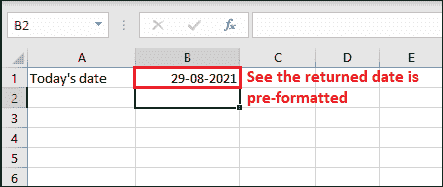

您不需要以任何格式设置返回日期的格式。它是以日-月-年日期格式预先格式化的。

**第三步:**保存带有日期的 Excel 文件，暂时关闭文件。再一次，一天后重新打开文件，看到日期随着系统日期一起改变。

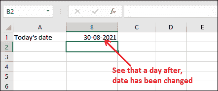

### 示例 2:查找当前日期的天数

在本例中，我们将使用 TODAY()函数和其他函数或数据来查找两个日期之间的总天数。为此，我们在 A2 单元格中取了一个开始日期。

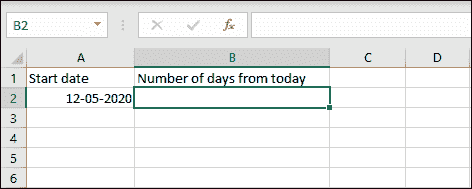

**第一步:**看到下面的数据，在 B2 单元格中写下下面的函数。

=TODAY()-A2

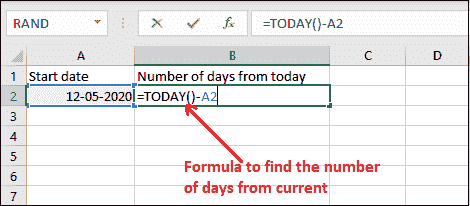

**第二步:**得到今天到给定日期的计算天数。但是您可以看到返回的结果是以日期格式显示的，这是不可理解的。

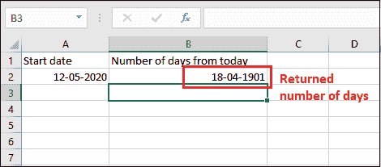

要使结果可读，请从日期开始将其更改为常规/数字格式。

**第 3 步:**转到返回的结果，从**首页>号将格式设置为**通用**。**

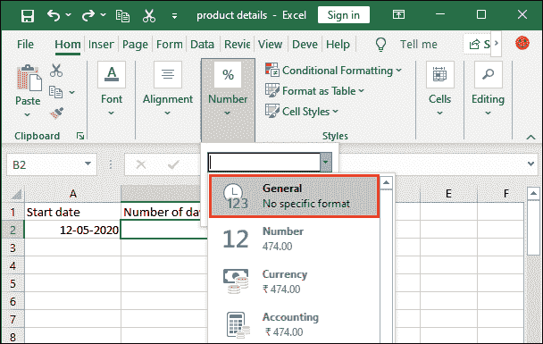

**步骤 4:** 现在，查看格式化的天数。


## NOW()函数

NOW()是 Excel 中 TODAY()函数的替代函数。如果需要时间和日期，可以使用 Excel 的 NOW()函数。它用于获取系统返回的日期和时间。当 Excel 工作表打开和关闭时，此日期和时间会不断更新。

就像 TODAY()函数一样，NOW()不接受参数。它是一个没有参数的简单函数。您可以将返回的日期和时间格式化为适当的格式。

### 句法

```

=NOW()

```

### 返回值

NOW()函数以序列号的形式返回系统的日期和时间。默认情况下，返回的日期和时间格式为**日-月-日 HH:MM** 格式。

### 如何使用 NOW()函数？

当您需要 Excel 工作表中的当前日期和时间时，可以使用 NOW()函数。让我们考虑一个例子来学习这个函数的用法。

**例 1:查找当前日期和时间**

以这个例子为例，直接使用 NOW()函数获取当前日期和时间。

**第一步:**在空白 Excel 单元格中写出给定的 NOW()公式，按**回车**键。

=NOW()

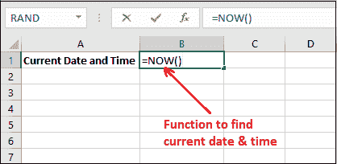

**第二步:**可以看到它已经返回了系统日期和时间，是预格式化的。

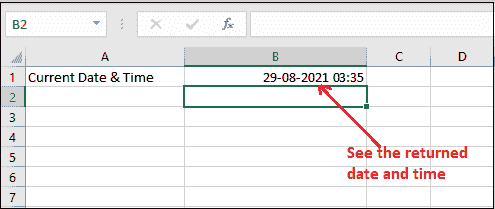

您不需要以任何格式格式化返回的日期和时间。这里，日期是以日-月-年格式预先格式化的，时间是以时:分格式预先格式化的。

**第三步:**保存带有日期&时间的 Excel 文件并关闭。再次重新打开文件或按下 **F9** 键，当您重新打开文件时，您会看到时间发生了变化。

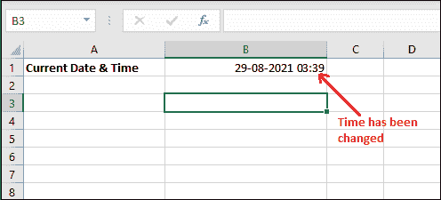

几分钟后，您可以看到时间已自动更改。

**例 2:找到日期&与现在的时差**

在本例中，我们将 NOW()函数与其他 Excel 日期函数一起使用，并查找当前日期和时间的总天数。为此，我们在 A2 单元格中记录了日期和时间。

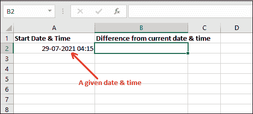

**第一步:**看到下面的数据，在 B2 单元格中写下下面的函数。

=NOW()-A2

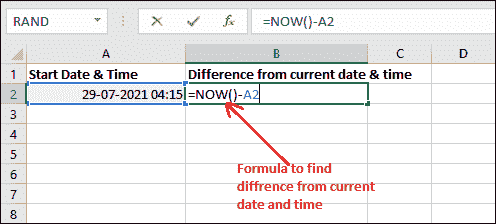

**第二步:**得到计算出的今天到给定日期时间之间的天数。

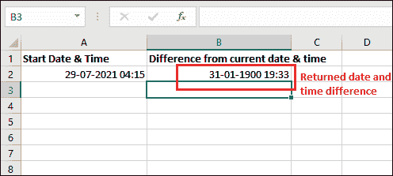

**步骤 3:** 返回的结果显示为日期和时间。我们现在将此格式更改为**通用，**表示大约 31 天零几个小时的日期差。

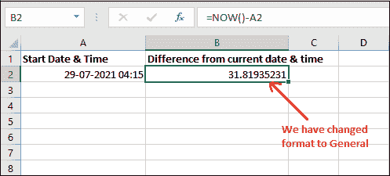

**第四步:**让我们从现在开始找出 6 天后的日期和时间。为此，在空白单元格中编写以下公式。

=NOW()+6

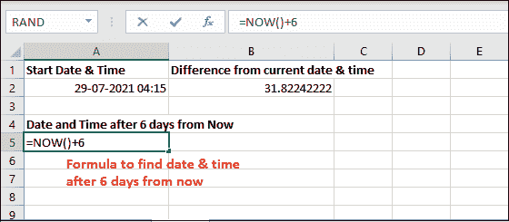

**第五步:**在 Excel 表格中输入公式后，按**回车**键，查看 6 天后的日期和时间。

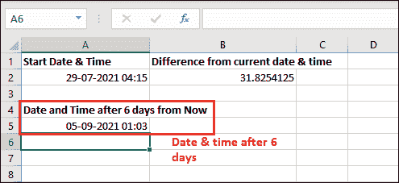

请注意，它已从当前日期和时间返回 05-09-2021 01:03。

**示例**

NOW()函数不接受参数，但可以与其他函数和值一起使用，以获得修改后的结果。见下表中的一些例子-

| 公式 | 说明 |
| =NOW() | //返回当前日期和时间 |
| =NOW()+5 | //返回当前日期和时间 5 天后的日期和时间 |
| =NOW()+7 | //从现在起一周后的返回日期和时间。 |
| =NOW()-7 | //从当前日期和时间返回上周的日期和时间 |

### 日期和时间快捷方式

Excel 提供快捷命令在 Excel 工作表中输入当前日期或时间。你可以在任何需要的地方使用它们。这些命令将插入当前日期和时间，但这些是静态的。这意味着-当工作表重新计算时，它们不会改变。

您使用的上述函数(TODAY()和 NOW())返回每当 Excel 文件关闭和重新打开时重新计算的电流。

快捷命令是-

*   使用**Ctrl+；**(分号)插入当前日期。
*   使用**Ctrl+Shift+；**(分号)插入当前时间。
*   要同时插入当前日期和时间，首先按**Ctrl+；**快捷键插入日期后按空格键换空格。之后，使用**Ctrl+Shift+；**插入当前时间。

这些快捷命令会插入当前日期和时间，但在重新计算或重新打开 Excel 工作表时，这些命令不会更新。需要时，请相应地使用这些命令。

* * *