# 如何在 Excel 中取消工作表隐藏？

> 原文:[https://www.javatpoint.com/how-to-unhide-worksheet-in-excel](https://www.javatpoint.com/how-to-unhide-worksheet-in-excel)

在微软的电子表格中，你可以隐藏工作表，也可以取消隐藏以备使用。您可以隐藏任何工作表以将其从视图模式中移除。当隐藏工作表时，隐藏工作表的数据也会隐藏，但您仍然可以通过另一个工作表引用其数据。要使隐藏工作表中的数据可见，必须取消隐藏工作表。

Excel 用户可以轻松隐藏和取消隐藏工作表。Excel 支持几种取消隐藏工作表的方法。你可以从中选择一个最适合你的。如果需要，Excel 用户可以非常容易地取消隐藏工作表。

在本章中，我们将简要介绍隐藏的工作表以及取消隐藏工作表的方法。

## 如果工作表被隐藏了怎么办？

当工作表隐藏时-

*   当隐藏 Excel 工作表时，其数据也将被隐藏。
*   用户可以从另一个工作表或工作簿中引用隐藏工作表的数据。
*   如果您想要查看隐藏工作表的数据，您必须取消隐藏它，以使工作表及其数据可见。
*   如果 Excel 工作簿中隐藏了多张工作表，一次只能取消隐藏一张工作表。

### 取消隐藏隐藏工作表

当工作表隐藏时，您看不到它的数据。要使工作表及其数据再次可见，请取消隐藏工作表。以下是隐藏工作表的简单步骤-

**步骤 1:** 右键单击现有的工作表标签，然后单击列表中的**取消隐藏**选项。

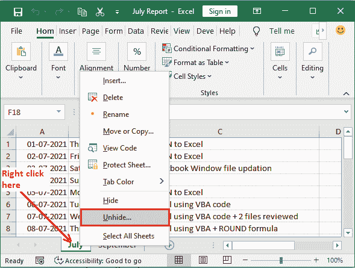

**第二步:**你会在面板中看到隐藏的工作表。目前，只有一个工作表是隐藏的，即八月。

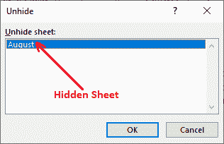

**第三步:**选择隐藏的工作表，点击**确定。**

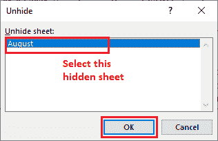

**第 4 步:**所选工作表已成功取消隐藏。您现在可以看到它的数据并使用它。

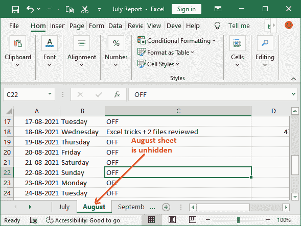

### 取消隐藏“非常隐藏”的工作表

除非是简单的隐藏工作表，Excel 工作表也可以很隐藏。在这种情况下，简单的取消隐藏方法不起作用。您需要另一种方法来取消隐藏非常隐藏的工作表。从 Excel VBA 代码编辑器，用户可以轻松地取消隐藏非常隐藏的工作表。

我们有一个 Excel 工作表，它不是简单隐藏的，它是**非常隐藏的。**工作表隐藏时，不会显示在 Excel 工作表面板的下方。按照以下步骤取消隐藏隐藏的工作表-

**步骤 1:** 右键单击任何现有的工作表标签，然后单击**查看代码。**

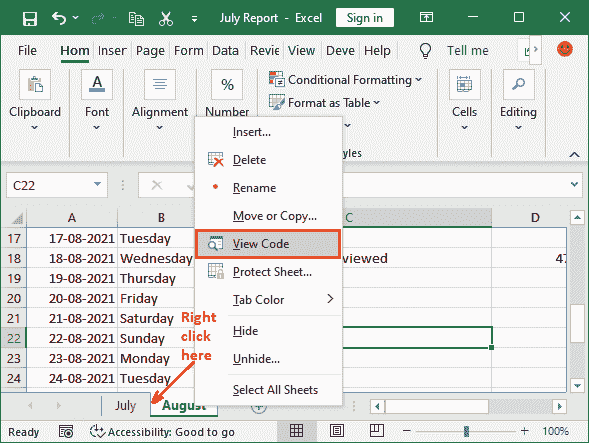

**步骤 2:** 在 VBA 代码编辑器面板的右侧，您将看到当前打开的工作簿中所有隐藏和未隐藏的工作表。

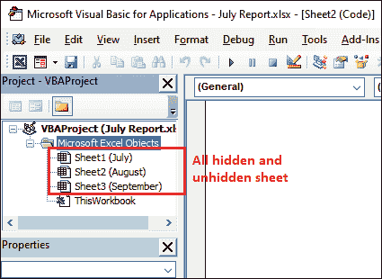

**第三步:**点击不可用(隐藏)的工作表，想要取消隐藏。**比如**表二(八月)就藏在这里。

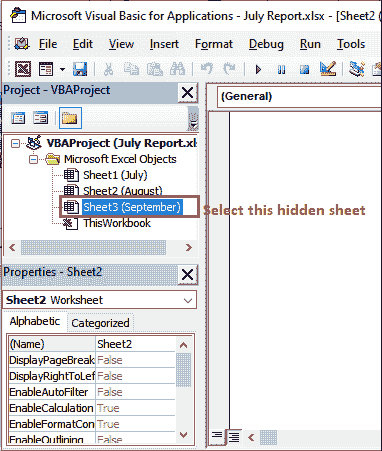

**步骤 4:** 选择工作表时，其相关属性将在工作表窗口下方的属性窗格中启用。

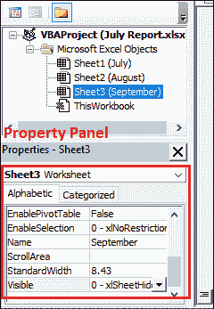

**提示:**如果属性窗格当前在 VBA 代码编辑器中不可用，您可以自己启用它。有一个选项**属性窗口；**点击使其可见。

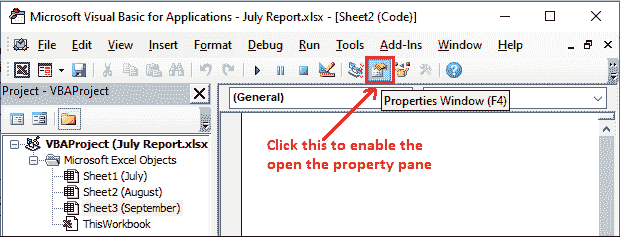

**第 5 步:**从相应的下拉按钮中选择属性**可见**将其更改为-1-xlsheet 可见。

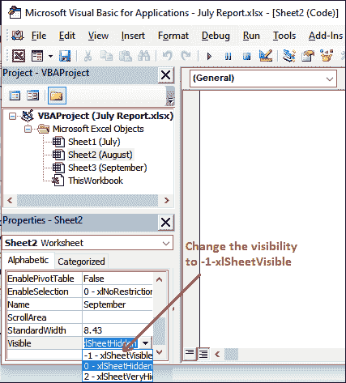

在这里，

| 可见属性参数 | 描述 |
| -1 - xlSheetVisible (TRUE) | 如果选择了此选项，图纸是可见的。 |
| 0-xlsheehidde(false) | 如果选择此选项，图纸将被隐藏。 |
| 2-xlsheetyhidden | 当工作表非常隐藏时，会选择此选项。 |

**步骤 6:** 现在，关闭 VBA 编辑器。

**第 7 步:**您现在会看到隐藏的工作表现在在工作簿中可见，并且隐藏的工作表(九月)成功取消隐藏。

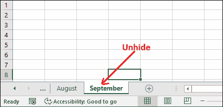

## 取消隐藏多个工作表

有时，会隐藏多个工作表，您需要处理它们。因此，您必须取消隐藏所有隐藏的工作表，使它们可见。在 MS Excel 中，我们有一个一个或者一次取消隐藏工作表的方法。我们上面讨论的方法是一次取消隐藏一个工作表。

如果你是第一个取消隐藏工作表的方法，你必须重复相同的步骤多少次，你想取消隐藏多少张工作表。因为它允许一次取消隐藏一个工作表。所以，如果隐藏的工作表太多，会消耗太多时间。

**步骤 1:** 右键单击现有的工作表标签，然后单击列表中的**取消隐藏**选项。

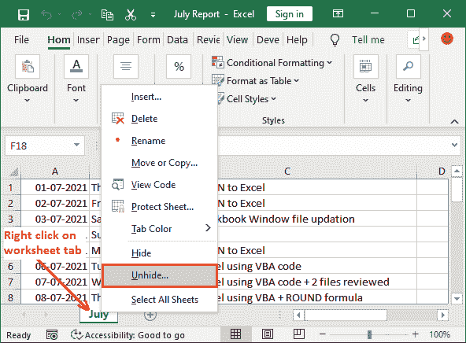

**步骤 2:** 您将在面板中看到所有隐藏工作表的列表。在此选择工作表，点击**确定。**

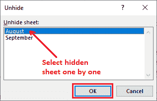

#### 注意:此选项不允许同时选择多个隐藏工作表。

**第三步:**所选工作表已成功取消隐藏。同样，遵循相同的步骤，直到所有工作表都取消隐藏。

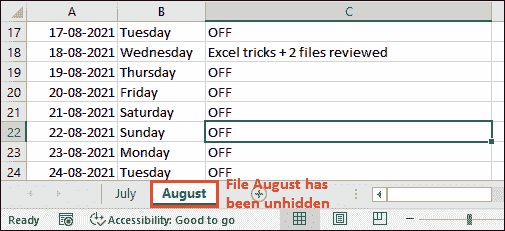

**第 4 步:**当您再次执行相同的步骤以取消隐藏另一个工作表时，您将在列表中只看到一个工作表。

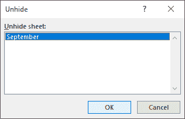

像这样，您必须对每个工作表重复执行相同的步骤。这种方法需要时间，因为每次都必须多次执行相同的步骤。

我们有另一种方法可以同时取消隐藏多个工作表。要使所有工作表再次可见，请使用此方法。以下是一次性取消隐藏多个隐藏工作表的步骤-

**步骤 1:** 右键单击现有的工作表标签，然后单击列表中的**查看代码**选项。

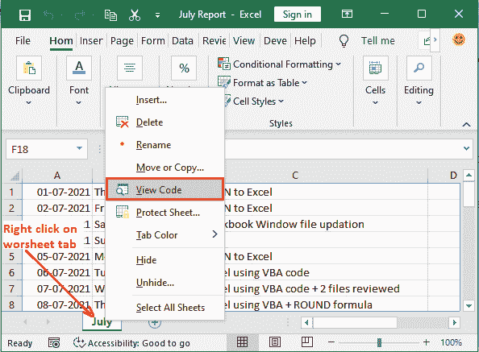

**步骤 2:** 将打开一个 VBA 代码编辑器面板，其中包含所有工作表的列表，包括隐藏的和可见的。


**第 3 步:**逐个选择工作表，并在属性窗格中将其可见属性设置为 **-1-xlSheetVisible** 。


将所有隐藏工作表的可见属性设置为 **-1-xlSheetVisible** 。

**步骤 4:** 当所有工作表可见属性设置为 **-1-xlSheetVisible 时，关闭 VBA 编辑器窗口。**您现在会看到所有工作表现在都可见。

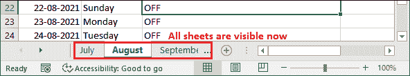

## 一次取消隐藏所有隐藏的工作表

Excel 中没有预定义的内置方法来一次性取消隐藏所有隐藏的工作表。用户必须逐个手动取消隐藏所有隐藏的工作表。Excel 为它启用了几种方法，我们在上面的例子中也讨论过。但是这需要时间，因为您必须执行多少次您想要取消隐藏的工作表。

此外，您可以创建 VBA 代码来一次取消隐藏所有隐藏的工作表。因此，在这个方法中，我们将编写 VBA 代码，并通过运行代码一次取消隐藏所有隐藏的工作表。

遵循下面给出的 VBA 步骤:

**第一步:**进入 Excel 功能区的**开发者**选项卡，点击**可视化基础**打开 VBA 编辑器面板。

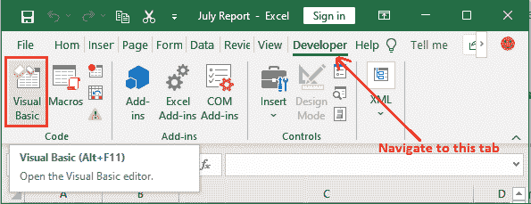

**第二步:**在 VBA 面板内，导航至**插入**选项卡，选择**模块**按钮，打开编码窗口，在此写入代码。

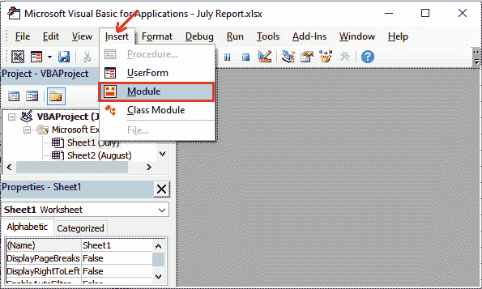

**步骤 3:** 在 VBA 编辑器中编写以下代码，这将有助于取消隐藏工作表。

```

Sub UnhideAllSheetsCode()
Dim ws As Worksheet
For Each ws In ActiveWorkbook.Worksheets
ws.Visible = xlSheetVisible
Next ws
End Sub

```

**第 4 步:**下一步是运行这段代码中编写的方法。为此，点击**运行**按钮。

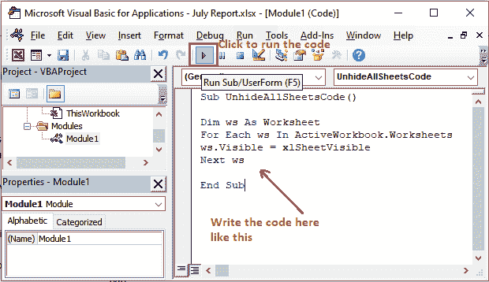

**第 5 步:**运行以下代码时，所有隐藏的工作表将被取消隐藏。关闭 VBA 编辑器以查看取消隐藏的文件。


当几个工作表被隐藏时，这是最好的选择。这将节省用户逐个取消隐藏工作表的时间。

* * *