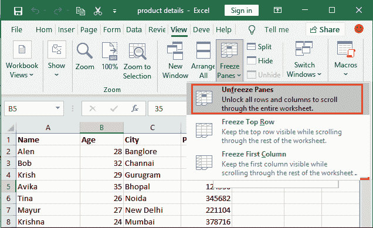

# 在 Excel 中冻结窗格

> 原文：<https://www.javatpoint.com/freeze-panes-in-excel>

Excel 有一个**冻结窗格**功能，可以冻结 Excel 工作表的一部分。它用于冻结行和列。当 Excel 工作表很大时，冻结窗格是冻结工作表特定部分并使另一部分可滚动的有用选项。

在 Excel 中，用户可以使用 Excel 的**冻结窗格**功能来冻结工作表的行或列。他们可以冻结窗格以冻结单行或多行/多列。行和列在冻结时保持可见。

## 什么时候锁定细胞？

每当您处理包含大量数据的大型工作表时，都很难比较数据。当您水平和垂直滚动工作表时，上面单元格的数据会随着滚动而隐藏。在这种情况下，Excel 会启用几种方法，包括**冻结窗格、新建窗口**和**拆分**工作表。

有时，您希望某些行或列总是出现在工作表中。在这里，冻结窗格功能有助于锁定单元格，这样您就可以随时查看工作表。冻结窗格锁定特定的行或列，并使它们在整个工作表滚动中可见。

## 冻结窗格选项在哪里？

有时，我们需要滚动整个工作表，还希望在整个工作表滚动过程中有一些行或列可用。滚动工作表时，不应隐藏这些特定的行或列。在这种情况下，冻结行/列将有助于冻结水平和垂直滚动的整个工作表的数据。

冻结窗格是 Excel 的一项功能，使用户能够锁定 Excel 行和列。这可以在 Excel 功能区的**视图**选项卡中找到。在“视图”选项卡中，您将看到一个窗口组，其中显示了“冻结窗格”选项。

## 冻结窗格的方法

Excel 支持三种方法来冻结窗格。

1.  冻结窗格
2.  冻结顶行
3.  冻结第一列

## 冻结窗格的属性

有些问题你应该知道-

1.  使用冻结窗格功能冻结工作表后，不能通过撤消操作来解冻工作表。你必须手动解冻。
2.  如果冻结顶行，将只冻结工作表的第一行。您不能同时冻结该列。
3.  与第 2 点类似，如果使用**冻结第一列**冻结第一列，则只会冻结工作表的第一列。您不能同时冻结该行。
4.  如果应用 Excel 冻结窗格功能的**冻结窗格**选项，可以同时冻结行和列。

## 1.冻结窗格

当您使用此冻结窗格选项冻结 Excel 工作表的一部分时，它会保持行和列可见，并且可以滚动工作表的其余部分。这允许用户在任何他/她想要的地方冻结工作表。它冻结工作表的行和列。

### 示例:冻结几行和几列

在本例中，我们将冻结前四行和一列。为此，我们将使用冻结窗格的第一个选项，该选项允许同时冻结行和列。

**冻结窗格的步骤**

要使用冻结窗格冻结工作表的特定部分，请执行以下步骤-

**步骤 1:** 转到单元格 B5，冻结前四行(4)和一列(A)，然后将光标选择留在那里。

**步骤 2:** 现在，导航到 Excel 功能区中的**视图**选项卡，您将在窗口组中看到一个**冻结窗格**下拉按钮。

**第三步:**点击**冻结窗格**下拉按钮，然后点击**冻结窗格**选项冻结行和列。

**第四步:**你的前四行第一列(直到 A4 单元格)已经冻结成功。现在，如果您垂直或水平滚动工作表，直到 A4 行和列固定，不要随着滚动而移动，工作表的其余部分将滚动。

**水平滚动**

请注意，第一列是固定的，在滚动时不会隐藏，而其余列向左滚动。

**垂直滚动**

请注意，前四行是固定的，滚动时不要隐藏，而其余行向下滚动。

基本上，这个选项允许自定义冻结行数和列数。

## 2.冻结顶行

使用此冻结窗格选项冻结 Excel 工作表的第一行时，Excel 工作表的第一行会冻结，并且在工作表的整个垂直滚动过程中可见。

请记住-在此方法中，在冻结整个工作表滚动后，只有第一行对用户可见。步骤几乎与上述方法相似。

### 冻结顶行的步骤

在本例中，我们将冻结工作表的第一行(顶行)。对此，Excel 提供了另一个选项，即**冻结顶行**。在冻结窗格中选择此选项，并冻结 Excel 工作表的第一行/顶行。这只会冻结行，不会冻结列。

要仅冻结工作表的第一行并使其在整个工作表滚动过程中可见，请执行以下步骤-

**步骤 1:** 要冻结第一行，不需要选择任何特定的单元格。直接导航到 Excel 功能区的**视图**选项卡。

**第二步:**点击**冻结窗格**下拉按钮，在此选择/点击**冻结顶行**选项。

**第三步:**工作表的第一行已经冻结，可以看到第一行下方已经放置了一条深灰色的颜色线。

**步骤 4:** 现在，如果垂直向上滚动工作表行，第一行将保持可见，其他行将滚动。

## 3.冻结第一列

当您使用此冻结窗格选项冻结 Excel 工作表的第一列时，第一列会在其位置冻结，并在工作表的整个水平滚动过程中可见。

冻结工作表的第一列后，该列可通过水平滚动获得。步骤与冻结顶行方法几乎相同。

### 冻结顶部列的步骤

在本例中，我们将冻结给定 Excel 工作表的第一列。对此，Excel 提供了另一个选项，即**冻结第一列**。在冻结窗格中选择此选项，并冻结 Excel 工作表的第一列。这只会冻结第一列，不会冻结行。

要冻结工作表的第一列并使其在整个工作表水平滚动中可见，请执行以下步骤-

**步骤 1:** 要冻结工作表的第一列，不需要选择任何特定的单元格。直接导航到 Excel 功能区的**视图**选项卡。

**第二步:**点击**冻结窗格**下拉按钮，在此选择/点击**冻结第一列**选项。

**第三步:**工作表第一列已经冻结，可以看到第一列后面已经放置了一条深灰色的颜色线。

**步骤 4:** 现在，如果垂直向上滚动工作表行，第一列将保持可见，其他列将滚动。

当用户冻结工作表窗格时，一行用深灰色突出显示。无论你选择了什么冻结选项，你都可以从同一个选项中恢复解冻。

## 解冻工作表

一旦工作表行或列使用任何选项冻结，您就无法撤消该操作。您可以从同一个“视图”选项卡中将其解冻。

当 Excel 工作表冻结时，**冻结窗格**下的第一个选项变为**解冻窗格**。从那里，工作表可以解冻。我们还将向您展示这方面的步骤，以便您可以轻松解冻工作表行/列。

### 解冻工作表的步骤

无论您选择冻结工作表的行、列或两者，都可以对所有类型使用相同的步骤。例如，当前打开的工作表的最上面一行被冻结。

以下是解冻工作表的步骤-

**步骤 1:** 导航至**视图**选项卡，点击**冻结窗格**下拉按钮。

**步骤 2:** 现在，您将在下拉列表中看到第一个名为**解冻窗格**的选项。单击此选项可解冻工作表。

**第 3 步:**现在您会看到，随着工作表现在解冻，最上面一行的灰色线条已经被移除。

## 冻结工作表的快捷键

Excel 有一个快捷键 **Alt+W+F** 来启用冻结窗格。之后，您可以选择以下三个选项之一:

1.  按下 **F** 键(字母键)，根据光标当前的位置冻结行和列。
2.  按下 **R** 字母键，冻结 Excel 工作表的顶行。
3.  按下 **C** 字母键，冻结 Excell 工作表的第一列。

* * *