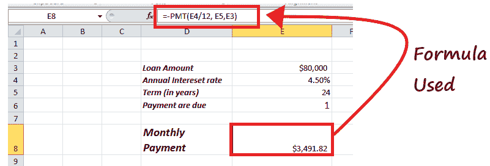
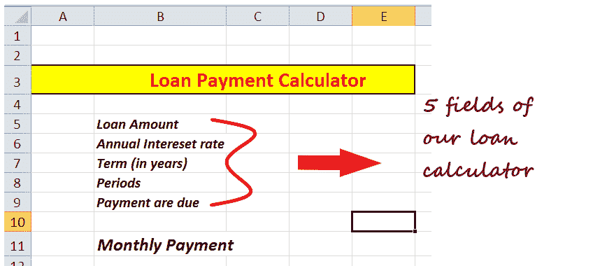
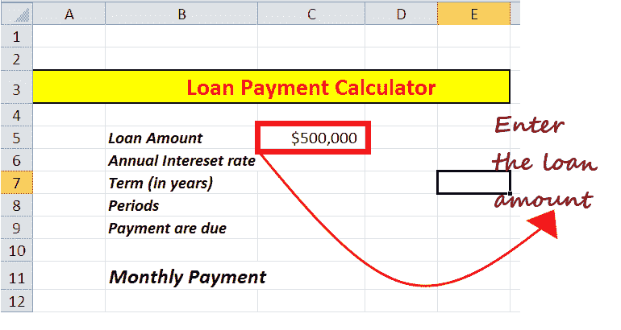
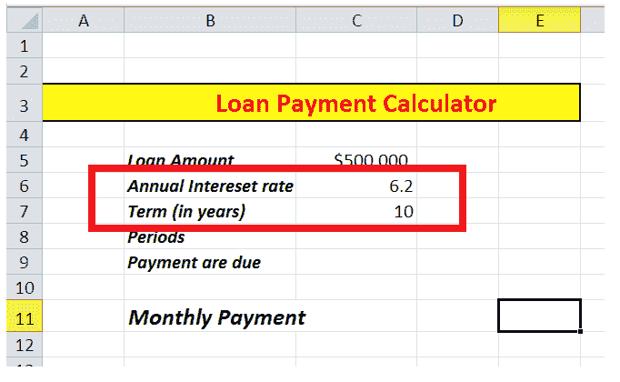
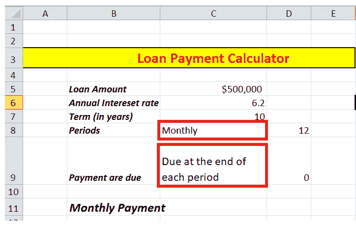
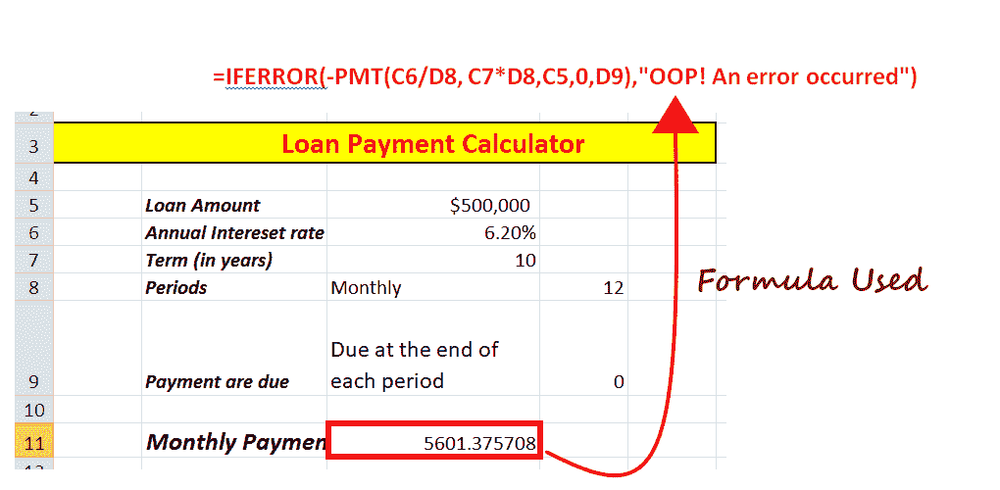

# Excel 付款功能

> 原文:[https://www.javatpoint.com/excel-pmt-function](https://www.javatpoint.com/excel-pmt-function)

> PMT Excel 函数是一个财务函数，它返回贷款的定期付款金额。Excel 用户使用 PMT 函数根据稳定的利率、贷款金额和支付贷款的周期数来计算贷款支付。

函数的实现很简单。您需要输入 PMT()函数，然后是利率除以 12(因为 1 年有 12 个月)、期限(每月分期付款的周期)，然后是贷款金额。

**例如**，假设你正在贷款 500 万卢比，期限 60 个月，年利率 7.8%。在这种情况下，PMT 可以帮助你轻松计算每月的分期付款，它甚至**会知道你每月支付多少本金和利息**。

### 要点:

1.  **PMT 功能返回的支付包括本金金额和利率，但不涉及税费、准备金支付或费用**有时会对贷款收取额外费用。
2.  在指定速率和 nper 参数时始终保持一致。让我们假设你每月支付一笔五年期贷款，年利率为 8%。**始终使用 8%/12 计算速率参数，使用 5*12 计算 nper 参数**。

### 句法

=PMT (rate, nper, pv, [fv], [type])

### 因素

1.  **利率(必填)** -此参数表示指定贷款金额的利率。
2.  **Nper(必选)** -该参数表示贷款的总支付次数。
3.  **pv(必选)** -表示贷款总额。
4.  **Fv-[可选]** -此参数表示最后一次付款后的待定现金值。因为它是可选参数，所以默认值为 0。
5.  **类型-[可选]** -表示到期付款的类型。它有两个值，因为它也是一个可选参数，所以默认值是 0。
    *   0 表示在期末付款。
    *   1 表示在期初付款。Since it is also an optional parameter, therefore, the default value is 0.

让我们借助真实的例子来了解一下在 Excel 中使用 PMT 函数。

## 例 1

**在下面的例子中，我们从一家 xyz 公司借了一笔为期两年的 80，000 美元的贷款。利率为每年 4.5%，贷款分期付款将在每月开始时进行。使用付款功能提取每月付款。**

使用的公式是:

=PMT(费率、nper、pv、[fv]、[类型])

**我们得到以下数值:**

金额= 80000

时间(nper) = 2 * 12 = 24

利率:4.5%

[类型] =在每个周期的开始= 1

应用的公式:

**=-PMT (E4/12，E5，E3)**

*   你每个月都会进行投资。因此，我们将给定的年份转换为月份，即
    2 年 x 12(一年有 12 个月)= 24 个月。
*   在上面的描述中，已经提到付款将在每个周期开始时开始。因此[type]参数应为 1。
*   按照一般的现金流惯例，流出的款项用负数表示，正数表示流入的款项。
*   产值为负，因为这是一笔支出。
*   提取的值包含本金和利率，但不包含外部税收、股票支付或费用。

## 示例 2: Excel 付款计算器

从银行贷款是当今世界常见的做法之一。然而，不同的银行提供不同的贷款选择。在你继续借钱之前，明智的做法是计算所有不同的贷款金额，以找到适合你的选择。为此，我们在 Excel 中创建了贷款支付计算器。

**计算器字段**

*   我们将在 Excel 工作表的单独单元格(分别为 B5、B6、B7、B8、B9)中输入付款公式的五个不同字段(贷款金额、年利率、期限、期间、到期付款)。
*   在第一个字段中，提供贷款金额。

*   在第二个和第三个字段中，我们将输入对我们的贷款有效的年利率和期限。

*   在“期间”字段中，我们将指定如何支付贷款金额。它可以是每月(12)、每周(52)、每季度(4)、每半年(2)和每年(1)。
*   最后一个字段“付款到期”指定付款到期的时间。有两个选项，a .)每个期间结束时付款到期(用 0 表示)，每个期间开始时付款到期(用 1 表示)。

**使用付款公式**

1.  首先，公式根据您的要求为上述所有字段提供值。
2.  输入下面给定的付款公式，并计算定期贷款付款。

**使用的公式:**

**=IFERROR(-PMT(C6/D8，C7*D8，C5，0，D9)，“OOP！出现错误”)**

**一些要点:**

1.  在上面的公式中，您会注意到我们为“**Fv”**参数指定了“0”，因为我们希望在最后一次付款后获取零余额。不过，您也可以自由输入任何不同的值。
2.  另一个奇怪的是在 PMT 公式前面输入的**减号**。因为这是一个外发支付，所以输出将以负数提取。因此，我们使用了减号**将输出转换为正值**。
3.  如果用户忘记定义一些输入值，则在 **IFERROR 中调用 PMT 函数来隐藏错误**。

**就是这样！你的贷款计算器准备好了。现在，在一分钟内，你可以计算任何贷款选项的定期贷款金额。**

Excel 付款函数不起作用的原因

工作时，可能会出现您的光电倍增管功能停止工作或出现意外错误的情况。这可能是因为以下任何一个原因:

*   **#NUM！错误:如果指定的“nper”参数等于 0 或用户在“rate”中传递了负数，则可能会出现此错误**
*   **#VALUE！错误:**如果公式中的一个或多个指定参数是文本值，则会出现这种情况。
*   如果光电倍增管功能的输出远高于或低于预期值，**再次检查为速率和 nper 参数**提供的单位是否稳定。确保你已经**准确地将年利率转换为期间利率**，将年数转换为周数、月数或季度数。

发现了。现在你学会了如何在 Excel 中计算 PMT 公式。

* * *