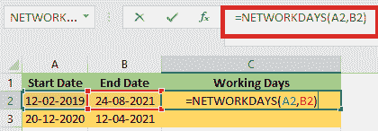

# Excel 中的网络天数公式

> 原文:[https://www.javatpoint.com/networkdays-formula-in-excel](https://www.javatpoint.com/networkdays-formula-in-excel)

在 Excel 中，**网络天数**公式用于计算两个日期之间的**工作日数。使用 NETWORKDAYS 函数时，会自动忽略周末的数量。它还允许我们排除某些节假日，只计算工作日。在 Excel 中被归类为**日期/时间函数**。这个公式可以在 Excel 中用来计算两个日期之间的工作日。**

NETWORKDAYS 函数有**三个参数**或**参数**:**开始日期、结束日期**和**节假日**。所有三个参数都必须使用有效的 Excel 日期。假日参数是可选的。为假日参数提供有效的 Excel 日期范围以排除假日。节假日被视为非工作日，不计算在内。

在确定工作日时，NETWORKDAYS 会考虑这两个日期；开始日期和结束日期。如果开始日期和结束日期相同，并且日期不是周末或假日，则 NETWORKDYS 将**返回 1。**

例如，网络日公式可以用以下格式编写:

```
=NETWORKDAYS(start,end) //exclude weekends
=NETWORKDAYS(start,end,holidays) //exclude weekends + holidays

```

**WORKDAYS** 和 **NETWORKDAYS** 是微软 Excel 中的两个函数，是为了计算工作日而精确开发的。

**WORKDAY** 函数返回未来或过去 N 个工作日的日期。我们可以使用 WORKDAY 函数来增加或减少给定日期的工作日。

借助于 NETWORKDAYS 函数，我们可以确定我们指定的两个日期之间的工作日数。

### 网络日函数的语法

以下是 NETWORKDAYS 函数的语法:

```
NETWORKDAYS( start_date, end_date, [holidays])

```

## 参数或参数

*   **开始日期:-开始日期**是表示**开始日期**的必需参数。
*   **end_date:- end_date** 也是必需的参数，表示**的结束日期**
*   **节假日:-** 这个说法是**自选**。这是一份应排除在工作日计算之外的假期清单。它可以作为包含假日日期的单元格区域(例如 F2:F5)或代表假日日期的序列号列表输入。

## Excel 中网络日的功能

*   **网络天数**确定两个日期之间的工作日总数。
*   **网络天数**计算整个工作日，忽略任何时间值。
*   如果我们使用 **INTL** 功能，那么它会给系统更多的灵活性。
*   自动排除周末**(周六周日)**，也允许省略节假日。

## 网络日功能的应用

我们可以将**网络日**功能用于多种目的。例如，我们可以使用此功能根据工作日、解决定制支持问题所需的工作日、完成项目所需的总天数等来确定员工的福利。

以下是**网络天数**公式在 Excel 电子表格中的一些应用:

*   计算每月工作日
*   计算日期之间的工作时间
*   计算总工作日数
*   计算一个月中剩余的工作日数

## 网络日功能的输出

**网络日**功能需要开始日期和结束日期才能工作。以下是 NETWORKDAYS 函数返回的值:

*   如果开始日期早于结束日期，网络日函数将返回一个**正值**。
*   如果开始日期和结束日期相同，则 NETWORKDAYS 函数返回值 **1** 。
*   如果结束日期早于开始日期，则网络日函数返回负的**值。**
***   该函数返回一个 **#VALUE！错误**如果任何参数没有被 Excel 识别为有效日期。**

 **## 如何在 Excel 中使用网络日功能？

考虑以下示例，以更好地理解 NETWORKDAYS 函数的工作原理。

**例 1:** 假设我们需要计算 2021 年 1 月 1 日至 2022 年 1 月 1 日的工作日或营业日。中间的假期是:

*   **2021 年 3 月 29 日- Holi**
*   **2021 年 11 月 4 日——排灯节**
*   **2021 年 12 月 25 日圣诞节**

我们将使用以下函数来计算工作日的数量。

```
=NETWORKDAYS(A4,B4,C4:C6)

```


应用上述公式后，我们将获得 259 个工作日，如下图所示。


### 示例 2:计算两个日期之间的天数(不包括周末)

如下图截图所示，开始日期在 **A2:A3** 范围内，结束日期为 **B2:B3。**我们必须按照以下步骤仅计算开始日期和结束日期之间的工作日，并自动排除周末:


1.首先，我们必须选择要显示工作日总数的单元格。为此，我们将使用以下公式。

```
=NETWORKDAYS(A2,B2)

```



2.应用公式后，我们必须按回车键，这样我们才能获得输出。


3.继续选择结果单元格，并向下拖动填充手柄，将公式应用于其他单元格，以计算剩余单元格的值。


现在计算指定开始日期和结束日期之间的工作日数。

### 示例 3:计算两个日期之间的天数(不包括周末和节假日)

如果我们也想排除某些节假日，那么本节描述的方法会有所帮助。

1.选择要显示工作日总数的单元格。为此，我们将使用以下公式。

```
=NETWORKDAYS(A2,B2,D2:D3)

```

在这个公式中，D2:D3 是我们将从工作日中排除的假期列表。


2.应用公式后，我们必须按回车键，这样我们才能获得输出。


3.继续选择结果单元格，然后拖动**填充手柄**将公式应用于剩余单元格，计算剩余单元格的值。


## 关键要点

*   在 Excel 中，周末**(周六和周日)**被自动排除在外
*   只有指定了开始日期和结束日期，我们才能计算工作日。
*   如果单元格格式改为**“常规”，**可以看到序列日期的数值，
*   根据 Excel 用户的选择，假日可以从总工作日中排除。
*   借助 **NETWORKDAYS** 功能，我们可以确定两个日期之间的工作日总数。
*   周六和周日被认为是周末。如果我们想利用不同的日子作为周末，可以使用 **INTL** 。
*   如果任何参数包含无效日期，则 **#VALUE！**将返回错误值。
*   **网络天数**功能在计算工作日时忽略任何时间值。
*   计算工作日时，网络日功能将考虑开始和结束日期。因此，如果我们给**网络日**相同的开始和结束日期，它将返回

* * ***