# Excel 中的透视图表

> 原文：<https://www.javatpoint.com/pivot-chart-in-excel>

图表是一个很好的工具，可以更吸引人、更清晰地可视化数据。在 Excel 中，我们有各种类型的图表，透视表图表就是其中之一。

## 什么是透视图表？

> 透视表图表是一个内置的编程工具，用于在 excel 电子表格的交互式数据集中汇总透视表数据。这是数据透视表在 Excel 中的可视化表示，或者换句话说，可以说数据透视表和数据透视表图表是相互链接的。

数据透视表是一种有用的工具，尤其是当用户处理大量数据时。例如，一家 XYZ 公司有 200 名员工。人力资源部在电子表格中保存了每个候选人的工作时间。现在他们想找到全年休假最少的员工姓名，这样你就可以奖励他对公司的真诚和奉献。如果您手动浏览整个列表，将会非常耗时，或者提取的结果也可能不准确。不要担心，因为微软 Excel 提供了一个名为“透视表”或“透视表图表”的内置功能来迎合这类任务。透视图表可以直观地即时重组和理解数据，从而简化整个过程。

#### 注意:透视表或透视表图表是微软 Excel 和微软 Access 的内置工具。而在 Excel 的情况下，用户可以通过在微软 Excel 工作表或其他微软办公软件中使用复制和粘贴功能轻松移动数据透视表图表，而微软 Access 不允许复制和粘贴数据透视表图表。

## 透视图表的优势

1.  **枢纽图**是一种用图片解释数据的强大方式。
2.  **枢纽图**让数据可视化的过程毫不费力。
3.  **枢纽图**广泛用于数据分析。
4.  **枢纽图**有效方便各种数据结论，确定统计计算的依据。
5.  **Pivot Chars** 通过 Pivot 过滤和 Pivot 切片将海量未分割的原始数据关联起来，从而高效地处理这些数据。

## 透视图表的局限性

*   **透视图表**不允许您基于多选/复选框字段类型创建报告。
*   每当您在已经为其创建了透视图表的现有透视表中插入新字段时，Excel 将自动在最后一列中添加新字段。无法更改此顺序或使添加的字段(列)出现在剩余列的中间。

## 插入透视图表

按照下面给出的步骤在 Excel 工作表中插入透视图表:

1. ***选择要插入透视表的单元格*** 。

#### 注意:因为数据透视表和数据透视表是相互链接的。为了插入数据透视表，您需要先插入一个数据透视表。

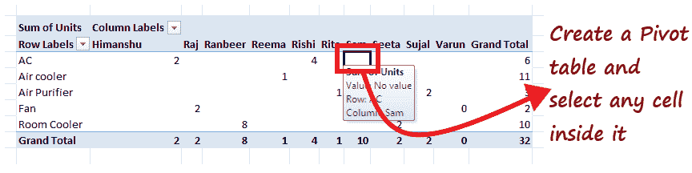

2.在 Excel 功能区选项卡上， ***选项*** (或分析更新版本) ***选项卡- >工具组- >数据透视图。***

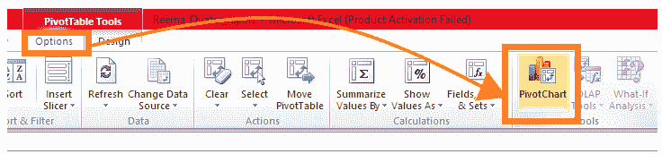

3.您会注意到 ***插入图表对话框将会打开。选择******首选图表类型*** 和 ***点击确定*** 按钮。

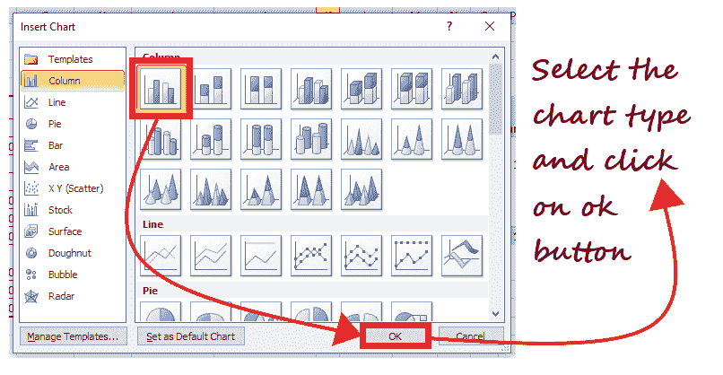

4.如下图所示，根据你的数据透视表的数据，你会得到你的**数据透视表图表。**这个枢纽图将以更具吸引力的方式直观地展示您的数据。

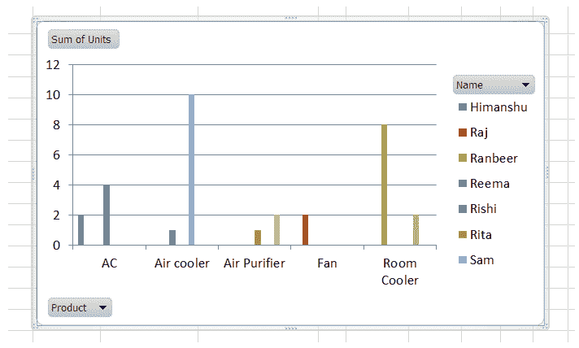

就这样，通过四个不同的步骤，你的枢纽分析图将被创建。上面的透视图表只是一个例子。尽管您可以创建自己的图表，任何数据都可以轻松地可视化和分析，甚至可以根据分析得出各种未来的结论。

#### 注意:如果您对透视图表进行任何修改，它会立即反映在您的透视表中，反之亦然。

## 筛选透视图表

透视图表过滤器选项广泛用于数据分析和可视化。 ***用户经常在 Pivot Chart 中使用不同的过滤器，使用不同的条件来分析指定的数据。*** 例如，假设一个 Pivot Chart 显示了在不同国家购买的商品，并且您想要分离一个特定国家的购买列表。在这种情况下，筛选您的透视图表是您的最佳选择。

按照下面给出的步骤将筛选器插入到透视图表中:

1.  您只能筛选数据透视表中使用的字段。在我们的例子中，它的名称和产品字段。例如，我们想计算出空气冷却器产品的总单位销售额。
2.  ***点击产品旁边的三角形图标*** 。
    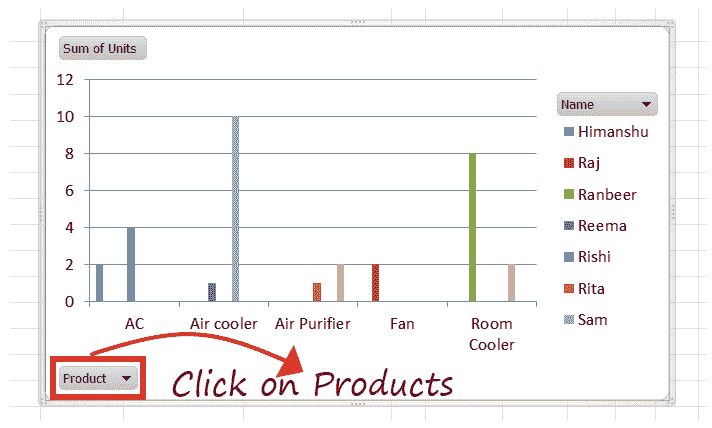
3.  窗户会打开。现在从清单中，我们将只选择空气冷却器，并删除其余的。点击确定。
    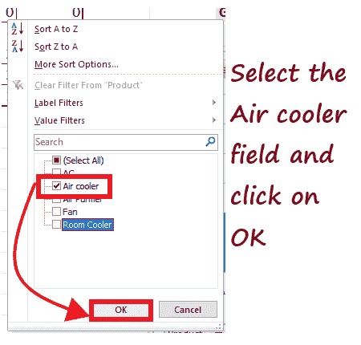
4.  Excel 将立即过滤您的透视图表，并显示如下所示的过滤结果。
    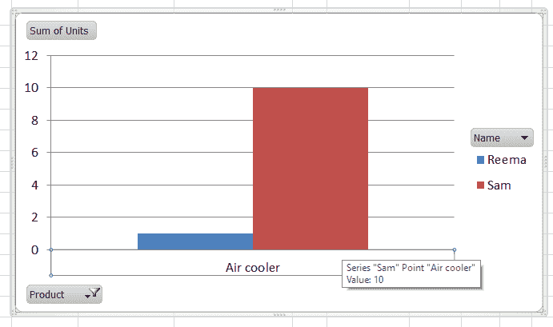

## 在 Microsoft Excel 中更改透视图表类型

Microsoft Excel 提供了不同类型的透视图表，因此您可以选择其中任何一种来直观地表示您的透视表数据。它有助于使数据分析更有效，在视觉上更有吸引力。因此，理解创建和过滤透视图表的过程与选择用于数据可视化的精确透视图表一样重要。您可以在 Excel 电子表格中的任何时间点更改透视图表类型。

按照下面给出的步骤更改 Microsoft Excel 中的透视图表类型:

1.  选择您以前创建的透视图表。
    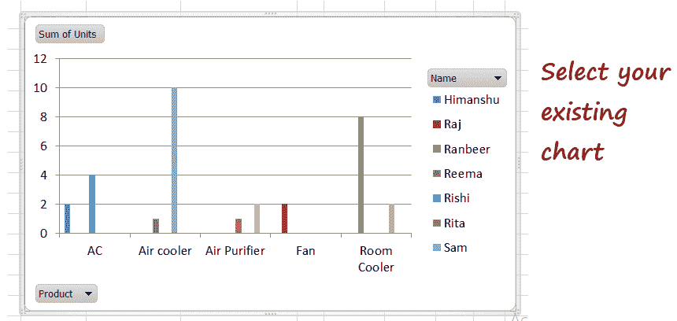
2.  转到 ***菜单栏- >设计选项卡- >类型- >更改图表类型。***
    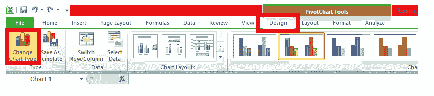
3.  将打开以下窗口。选择您认为有助于更直观地表示数据的 ***首选图表类型*** 。完成后， ***点击确定*** 按钮。
    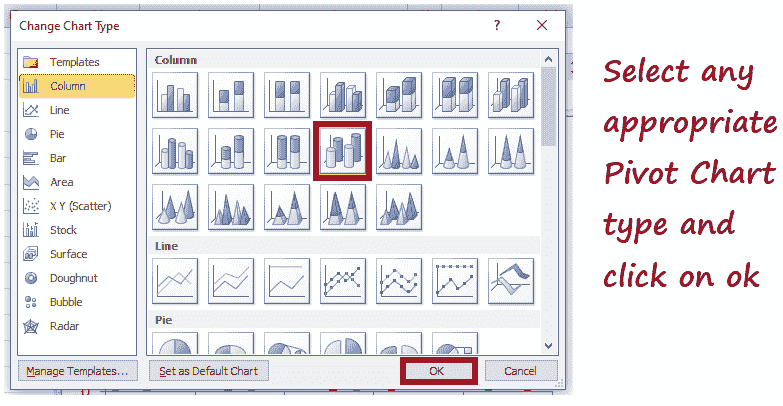
4.  透视图表类型将被更改。如下所示，excel 将立即用新选择的类型替换现有的透视图表。
    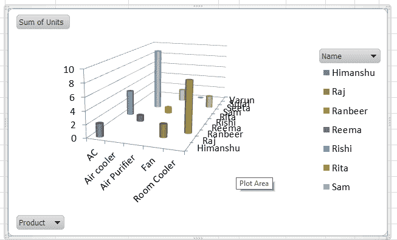

**在 MS Excel 中插入切片器过滤透视表**

切片器是数据透视表和数据透视表图表的一个重要功能，用于对它们进行更改或过滤，以实现有效的数据表示和分析。Slicers 最大的一个优点就是可以通过一些简单的步骤轻松地插入到 MS Excel 中。透视图表筛选器和透视图表切片器执行相同的操作，给出相同的输出。你可以在方便的时候使用其中一个。

按照下面给出的步骤插入切片器来过滤透视图表:

1.  选择要插入透视表的单元格。 ***选择透视表，插入透视表图表。***
    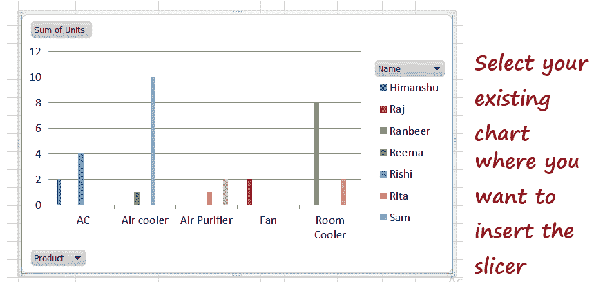
2.  在 Excel 菜单栏中， ***点击分析，从数据组中选择*插入切片器选项**。
    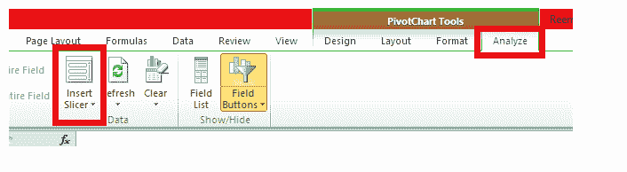
3.  Excel 将抛出显示所有字段名的切片器窗口。 ***选择要应用切片器的字段*** ，点击 ***确定。***
    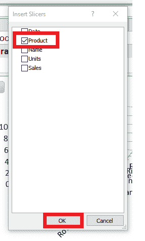
4.  将插入 ***切片器*** ，尽管您可以根据自己的喜好重新定位切片器窗口。
    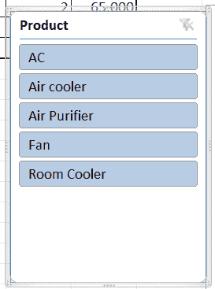
5.  从切片器窗口中选择任何产品，您会注意到 ***Excel 会根据您的选择立即重新创建透视图表。*** 与下图不同的是，我们选择了空气冷却器产品，并且我们有它的枢轴图表示。
    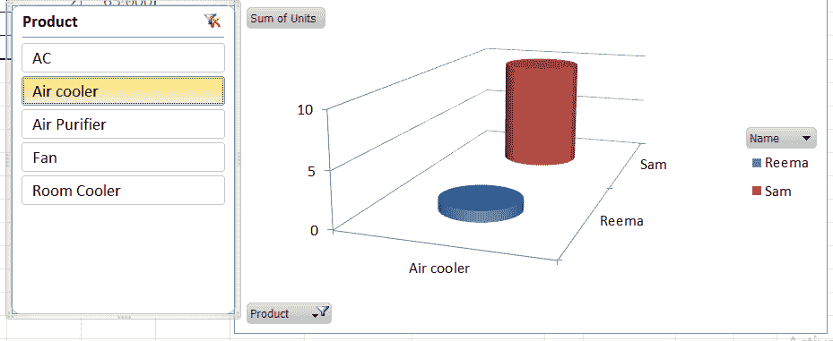

#### 注意:虽然插入切片器需要更多的步骤，但是更容易过滤出数据并立即检查结果。

* * *