# Excel 隐藏快捷方式

> 原文：<https://www.javatpoint.com/excel-hide-shortcut>

微软 Excel 或微软 Excel 是最强大的电子表格软件之一，有几个明显的特点。Excel 中的隐藏功能是其中一个有用的功能，可以帮助用户高效地管理大量数据。这个功能非常容易使用。它相应地用于行和列。

本文讨论了 Excel 隐藏功能以及使用不同快捷方式的过程。本文包括隐藏行和列的过程。

## Excel 行和列中的隐藏功能是什么？

Excel 隐藏功能是基本功能之一，它使用户能够将特定数量的行或列分组并临时隐藏它们。它主要压缩 Excel 工作表中所需的行或列。用户可以在需要查看隐藏行/列的详细信息时取消隐藏行/列。

Excel Hide 功能主要是在数据量巨大的时候隐藏行/列，我们想把不重要的数据隐藏在可见的屏幕上。该功能仅隐藏数据，不会更改或影响与相关行/列相关的结果。隐藏功能在大多数 Excel 版本中都可用，包括 Excel 2007、2010、2013、2016、2019 和 Office 365。

## 使用键盘快捷键隐藏行和列

Excel 已经实现了几个键盘快捷键来简化 Excel 功能的使用。用户可以使用快捷方式执行大多数 Excel 任务。使用键盘快捷键减少了一些步骤和整个工作过程的时间。因此，使用键盘快捷键是在 Excel 中执行大多数任务的最快和最有效的方法。因此，我们必须知道在 Excel 中隐藏行和列的快捷键。

由于行和列是 Excel 的两个不同组件，我们使用不同的快捷键来隐藏行和列:

### 用于隐藏行

在 Excel 中隐藏一行的快捷键是**“Ctrl+9”**不带引号。我们需要按照以下步骤使用键盘快捷键在 Excel 中隐藏一行:

*   首先，我们需要在要隐藏的特定行中选择一个单元格。当我们选择或单击一个单元格时，它将成为相应行的活动单元格。
*   接下来，我们需要按住键盘上的 **Ctrl** 键。
*   按住 Ctrl 键，我们需要按下并释放**‘9’键。**只要我们在按住 Ctrl 键的同时按下键 9，相应的行就会从可见屏幕中隐藏起来。

### 用于隐藏列

在 Excel 中隐藏一列的快捷键是**“Ctrl+0”**不带引号。然而，我们必须正确使用捷径。我们需要按照以下步骤使用键盘快捷键隐藏 Excel 中的列:

*   首先，我们需要在要隐藏的特定列中选择一个单元格。当我们选择或单击一个单元格时，它会成为相应列的活动单元格。
*   接下来，我们需要按住键盘上的 **Ctrl** 键。
*   按住 Ctrl 键，我们需要按下并释放**‘0’键。**只要我们在按住 Ctrl 键的同时按下 0 键，相应的列就会从可见屏幕中隐藏起来。

#### 注意:需要注意的是，按键“0”和“9”只能从键盘数字中按下。使用键盘数字键盘上的各个键不起作用。

### 例子

假设我们有以下包含一些员工数据的 Excel 表格。在下面的 Excel 表格中，我们想用键盘快捷键隐藏第 5和 C 列。这意味着我们需要在同一个工作表中隐藏一行和一列。

我们需要执行以下步骤来隐藏示例工作表中所需的行和列:

*   首先，我们必须选择特定行或列中需要相应隐藏的单元格。在我们的例子中，我们选择单元格 C5，因为它是第 5行和第 c 列
    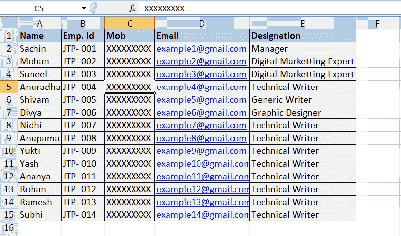中的单元格
*   接下来需要按快捷键 **Ctrl + 0** 隐藏整个 c 列，同样需要按快捷键 **Ctrl + 9** 隐藏整个 5 第行。
*   一旦我们按下相应的快捷键，所需的行和列就会立即隐藏。它们分别在前后的行和列之间被压缩。从视图中隐藏所需的行和列后，它看起来像这样:
    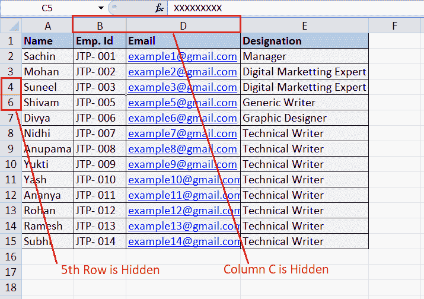
    上图显示了行和列隐藏的相应标题(行标题和列标题)中的不同符号(双线或粗线)。

这就是我们如何使用 Excel 隐藏键盘快捷键来隐藏所需的行或列。

## 使用上下文菜单快捷方式隐藏行和列

在 Excel 中隐藏行和列的另一种方法是使用上下文菜单。右键单击行标题或列标题可以访问上下文菜单。在任何标题上按下右键，它会显示一些选项，包括隐藏选项。但是，应该注意的是，只有在行/列标题上按下右键按钮时选择了整个行/列，上下文菜单才会出现。

### 用于隐藏行

要隐藏一行，我们需要在行标题上按右键。例如，假设下面的 Excel 数据中我们需要隐藏第 3 第 3行。

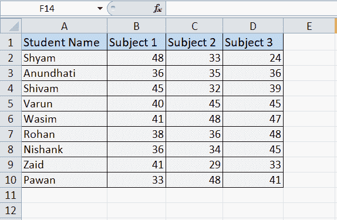

*   首先，我们需要选择 3 第 3行的任意一个随机单元格。在我们的例子中，我们选择细胞 B3。选中单元格后，需要按快捷键 **Shift +空格键**选择整行。或者，我们可以直接点击特定的行标题(比如我们这里的 3)，立即选择整行。
    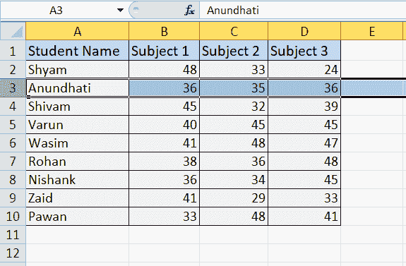
*   选择要隐藏的行后，我们必须将光标移动到相应的行标题上，**右键单击其上的**。右键按钮触发相应行的上下文菜单，如下所示:
    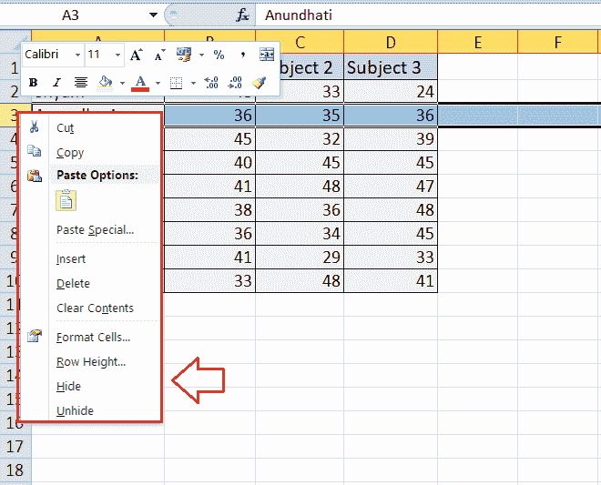
*   最后，我们需要从上下文菜单列表中选择“隐藏”选项。只要我们点击隐藏选项，选中的行就会隐藏在前后行之间(即第 2 行 nd 和第 4 行 th ，如下图:
    T5】

### 用于隐藏列

要隐藏一列，我们需要在列标题上按右键。例如，假设我们需要隐藏列 b 的 Excel 数据如下。

*   首先，我们需要选择整个列 b，我们可以选择所需列的任意单元格，快捷方式 **Ctrl + Space** 选择整个列。或者，我们可以直接点击特定的列标题(比如我们这里的 B 列)，立刻选择整个列。
    T3】
*   选择要隐藏的列后，我们必须将光标移动到相应的列标题上，并在其上右键**。右键打开相应列的上下文菜单，如下所示:
    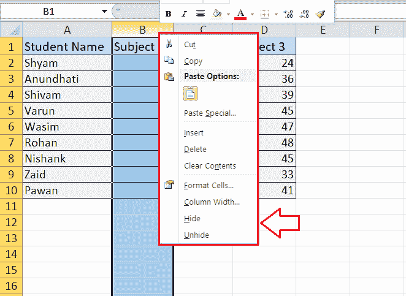**
***   最后，我们需要从上下文菜单列表中选择“隐藏”选项。我们一点击隐藏选项，选中的列就会隐藏在它前后的列(即 A 列和 C 列)之间，如下图:
    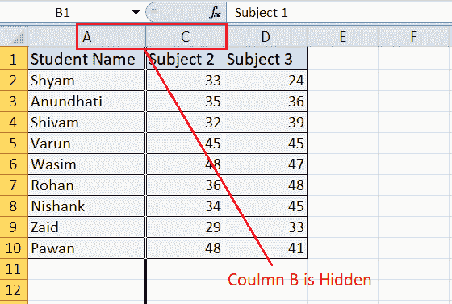**

 **这就是我们如何使用快捷菜单中的隐藏快捷方式来隐藏所需的行或列。

## 使用功能区及其快捷方式隐藏行和列

隐藏所需行或列的最后一种方法包括使用功能区选项卡及其各自的快捷方式。这是隐藏行/列的典型方法。行和列的过程是相同的。让我们讨论一下步骤:

*   首先，我们需要选择要隐藏的特定行或列。假设我们在下面的示例表中选择第 5行进行隐藏。要选择整个行/列，我们必须分别单击行标题/列标题。由于我们隐藏了该行，因此我们单击第 5 行的行标题。
    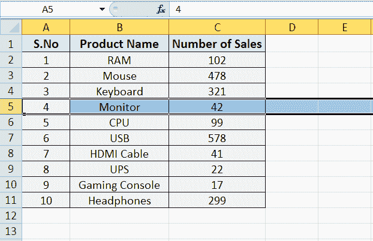
*   接下来，我们需要导航**首页**标签，点击**格式**选项，如下图:
    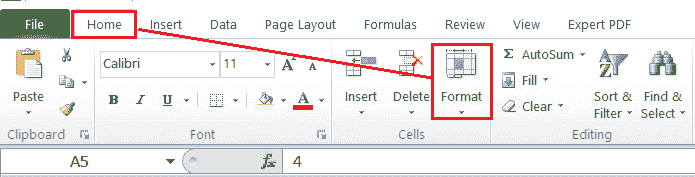
*   之后，我们需要在“可见性”下选择选项**“隐藏”&和“取消隐藏”**。
    T3】
*   最后，我们必须根据我们想要隐藏的内容选择选项**“隐藏行”**或**“隐藏列”**。由于我们已经选择了第 5 行来隐藏，我们从列表中选择“隐藏行”选项。这将立即隐藏所选行，即第 5 行第行。
    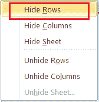

除了上面提到的步骤，我们还可以使用**“Alt+H+O+U+R”**快捷方式，不用引号。为此，我们需要连续按下相应的键。

## 如何在 Excel 中隐藏多行/多列？

隐藏多行或多列就像隐藏单个行或列一样简单。但是，我们必须选择所有对应的行/列，然后才能使用上述任何方法。最简单的方法是使用键盘快捷键。

借助一个示例，让我们了解在同一个 excel 工作表中隐藏多行多列的步骤:

假设我们有以下 Excel 表格，其中我们需要隐藏列“C & D”和行“3 第行&行第行”。

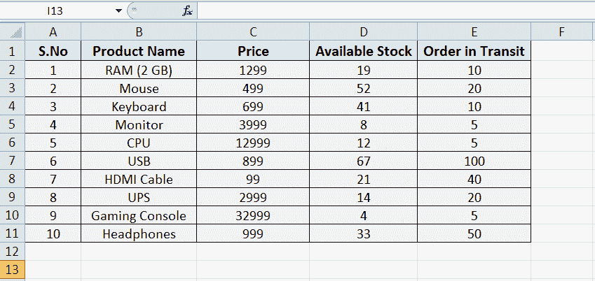

在这种情况下，我们将隐藏相邻的列和不相邻的行。这意味着我们可以隐藏相邻和不相邻的行/列。

我们需要执行以下步骤来隐藏示例表中相应的行/列:

*   首先，我们需要选择 C 列和 D 列来隐藏。要选择连续的列，我们可以按住 **Shift** 键，然后单击相应列的列标题，即 C 列和 d 列
    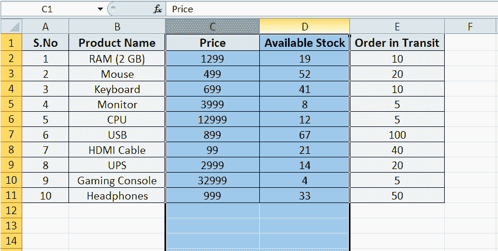
*   选择完列后，我们需要按下快捷键 **Ctrl + 0。**我们一按 Excel 隐藏列的快捷键，对应的列就会瞬间隐藏。隐藏列后，我们的示例表如下所示:
    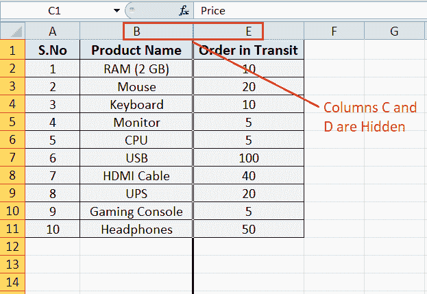
*   现在，我们需要隐藏工作表中的第 3 第行和第 7 第行。为此，我们需要选择相应的行。由于各行不相邻，我们需要使用 **Ctrl** 按钮，而不是 Shift 按钮。我们必须按住 Ctrl 键，然后点击 3 第行和 7 第行的行标题。这将选择相应的行。
    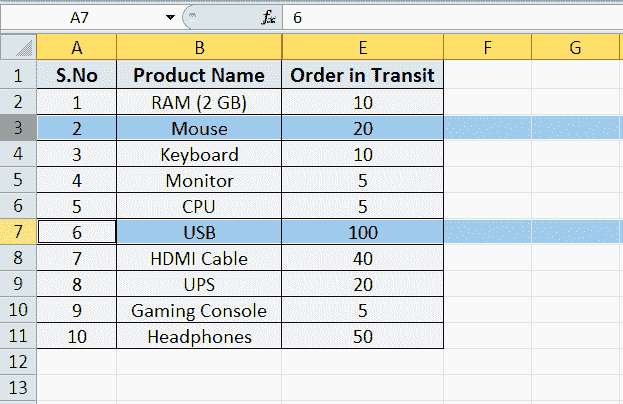
*   选中行后，我们需要使用快捷键 **Ctrl + 9。**这将隐藏相应的行，即第 3 行和第 7 行行。现在，我们的示例表如下所示:
    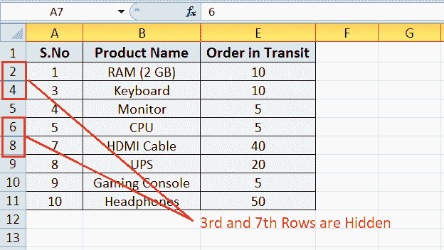

这里需要注意的是，我们应该使用**Ctrl**按钮选择不相邻的行/列，使用 **Shift** 按钮选择相邻的行/列。这样，我们可以隐藏多行或多列，不管它们是相邻的还是不相邻的。

* * ***