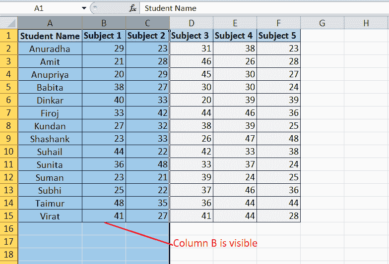

# 在 Excel 中取消隐藏快捷方式

> 原文:[https://www.javatpoint.com/unhide-shortcut-in-excel](https://www.javatpoint.com/unhide-shortcut-in-excel)

MS Excel 是目前最流行的数据分析和许多其他业务相关任务的电子表格软件。Excel 可以轻松存储大量数据。可能有些情况下，我们需要隐藏一些不重要的数据来展示给别人。在这种情况下，我们使用 Excel 中的隐藏功能来隐藏数据。但是，我们以后可能需要取消隐藏它。对于这种情况，取消隐藏功能是解决方案。

在本文中，我们将讨论一些在 excel 中显示隐藏数据的快捷方式。文章解释了所有的步骤和相关的例子。

## Excel 中的行和列取消隐藏功能是什么？

取消隐藏功能可帮助用户在工作表中显示隐藏的数据。这只不过是 Excel 中隐藏功能的相反过程。取消隐藏功能有助于轻松取消隐藏所需的行/列。

例如，假设我们有一个 Excel 工作表，其中一些行包含不想显示给其他人的数据。然而，我们需要向一个人展示表格中的总结分析或存储的数据结果。在这种情况下，我们通常会隐藏某些行或列。稍后，我们可能需要再次查看隐藏的数据以进行进一步的工作或更正。因此，为了促进完整的数据视图，取消隐藏数据变得至关重要。

## 使用键盘快捷键取消隐藏行和列

Excel 支持许多用于执行各种基本操作的键盘快捷键。使用键盘快捷键减少了整体工作时间，使过程更加容易和顺畅。由于这是在 Excel 中快速执行大多数操作的最快方法，所以我们必须知道在 Excel 中取消隐藏行和列的快捷键。

由于行和列是 Excel 的两个不同组件，它们的作用也不同，因此我们有不同的快捷键来取消隐藏行和列:

### 对于行

在 MS Excel 中取消隐藏一行的快捷键是**“Ctrl+Shift+9”**不带引号。我们必须执行以下步骤才能轻松地在 Excel 中取消隐藏行:

*   首先，我们需要选择隐藏行两侧的一行。
*   选择范围内的行后，我们必须使用键盘快捷键。
*   一旦我们使用快捷方式，该范围内的所有隐藏行都将从可见屏幕中取消隐藏。

### 对于列

在 Excel 中取消隐藏一列的快捷键是**“Ctrl+Shift+0”**不带引号。我们必须执行以下步骤才能轻松地在 Excel 中取消隐藏列:

*   首先，我们需要在隐藏列的两侧选择一列。
*   选择范围内的列后，我们必须使用键盘快捷键。
*   一旦我们使用快捷方式，该范围内的所有隐藏列都将从可见屏幕中取消隐藏。

#### 注意:要在 Excel 中使用键盘快捷键进行取消隐藏功能，我们必须只使用键盘数字中的数字键，而不是数字键盘。此外，键盘快捷键在 Excel 2010 和更早版本中可能无法使用。

在 Excel 2010 及更早版本中，我们可以使用**“Ctrl+Shift+”(“**)来取消隐藏行，使用**“Ctrl+Shift+)”**来取消隐藏列。在这里，我们不需要在使用相应的快捷键时使用引号。这些传统的键盘快捷键也适用于 Excel 的更高版本。

在 Excel 中取消隐藏行/列的键盘快捷键并不总是适用于每台计算机，尤其是基于 Windows 8、Windows 10 和更高版本的系统。这是因为 Windows 8 和 Windows 10 通常使用快捷键组合“Ctrl + Shift”进行区域/语言设置，以更改键盘布局。因此，快捷方式会弄乱系统默认值。因此，要解决此问题，我们必须使用以下步骤用另一个组合键更改默认键盘布局快捷键:

*   首先，我们需要启动**控制面板**，选择**‘更换键盘或其他输入方式’。**
*   接下来，我们将看到一个**“地区和语言”**对话框，在该对话框中，我们必须单击**“键盘和语言”**选项卡下的**“更改键盘”**选项。
*   在下一个窗口中，**文本服务和输入语言，**我们需要单击**“高级按键设置”**选项卡下的**“更改按键顺序”**选项。
    
*   现在，我们需要导航**“切换键盘布局”**并将单选按钮设置为选项**“未分配”**以禁用相应的功能。但是，如果我们需要使用该功能，我们可以使用其他选项来实现这一点。进行所需的更改后，我们需要单击“确定”按钮。
    

通过这样做，我们禁用了用于更改键盘布局的区域/语言设置的快捷方式**‘Ctrl+Shift’**。因此，它开始为 Excel 中的取消隐藏功能工作。

### 例子

考虑以下包含一些员工数据的 Excel 表。在下面的表格中，我们有一个隐藏行(即第 6行)和一个列(即 C 列)。我们需要取消隐藏相应的行和列，以便使用键盘快捷键使数据在屏幕上可见。

我们需要执行以下步骤来取消隐藏示例表中所需的行和列:

*   首先，我们需要选择隐藏行两侧的特定行。这意味着我们必须在隐藏行的上方和下方选择一行。在我们的例子中，第 6行是隐藏的。因此，我们必须选择第 5 排第和第 7 排第。
    
*   在隐藏行的任意一侧选择一行后，我们必须使用快捷键‘Ctrl+Shift+9’来取消隐藏所需的行，即第 6 行第行。当我们取消隐藏该行后，我们可以看到它在屏幕上显示其数据，如下图所示:
    
*   在我们取消隐藏所需的行之后，我们对该列执行相同的过程。这意味着我们必须首先选择隐藏列两侧的一列，然后使用快捷键“Ctrl + Shift + 0”。具体来说，我们选择列 B &列 D，然后按快捷键。
    
    数据在屏幕上完全可见，因为所需的行和列都可见。

这就是我们如何使用 Excel 的“取消隐藏”键盘快捷键来取消隐藏所需的行或列。

## 使用上下文菜单快捷方式取消隐藏行和列

在 Excel 中取消隐藏所需行或列的最简单方法是使用上下文菜单。当光标出现在相应的行标题或列标题上时，通常通过按下鼠标右键来访问上下文菜单。该菜单显示一些基本选项以及“取消隐藏”功能。但是，我们必须选择整行或整列；否则，上下文菜单将不会出现。

### 对于行

要取消隐藏一行，我们需要按下特定行标题上的右键按钮。但是，我们必须首先选择隐藏行两侧的一行。例如，考虑下面的 Excel 表格，其中我们需要取消隐藏第 5行。

*   首先，我们必须选择隐藏行上方的一行和隐藏行下方的一行。这意味着我们完全选择第 4 行和第 6 行。
    
*   接下来，我们需要将光标移动到任意第 4 行第行或第 6 行第行的行标题上，并用鼠标按下右键。
    
*   最后，我们必须从上下文菜单列表中选择“取消隐藏”选项。
    
*   只要我们从上下文菜单中选择“取消隐藏”选项，隐藏的行和数据就会在屏幕上变得可见，如下所示:
    

### 对于列

要取消隐藏一列，我们需要按下特定列标题上的右键按钮。与行一样，我们必须首先选择隐藏列两侧的一列。例如，考虑下面的 Excel 表，其中我们需要取消隐藏列 b。

*   首先，我们必须选择隐藏列左侧的一列和隐藏列右侧的一列。这意味着我们完全选择列 A 和列 C。
    
*   接下来，我们需要将光标移动到任何对应列(A 列或 C 列)的列标题上，并用鼠标按下右键。
    
*   最后，我们必须从上下文菜单列表中选择“取消隐藏”选项。
    
*   只要我们从上下文菜单中选择“取消隐藏”选项，隐藏的列和数据就会在屏幕上变得可见，如下所示:
    

## 使用功能区及其快捷方式取消隐藏行和列

另一种取消隐藏所需行和列的基本方法是使用功能区中的特定快捷方式。这是取消隐藏行或列的常用方法。根据这种方法，行和列的过程几乎相同。

假设我们有下面的 excel 表格，其中我们需要取消隐藏第 4行和 c 列。

让我们讨论一下步骤:

*   首先，我们需要选择隐藏行/列两侧的特定行或列(列为左右，行为上下)。要选择第 4行(隐藏行)上下的行，我们必须单击任何对应行的行标题，并将其拖动到另一行。
    T3】
*   接下来，我们需要导航**首页**标签，点击**格式**选项，如下图所示:
    
*   之后，我们需要在“可见性”标签下选择选项**“隐藏&取消隐藏”**。
    T3】
*   最后，我们从列表中选择一个想要的选项。要取消隐藏一行，我们必须点击选项**“取消隐藏行”。**同样，要取消隐藏一列，我们必须点击选项**“取消隐藏列”。**由于我们需要取消隐藏第 4 行行，我们选择“取消隐藏行”选项。
    
*   同样，我们选择列 B 和列 D，然后从列表中选择“取消隐藏列”选项来取消隐藏列 c。
    
    取消隐藏所需的行和列后，相应的数据变得可见。
    

尽管用鼠标手动单击功能区中的快捷方式，我们也可以使用键盘按键序列来访问它们。我们需要按以下键来执行相应的操作:

| 键盘按键 | 行动 |
| Alt + H + O + U + O | 取消隐藏行 |
| Alt + H + O + U + L | 取消隐藏列 |

但是，在使用上表中提到的键盘键之前，我们必须在隐藏行/列的任一侧选择一行/列。

## 使用双击快捷方式取消隐藏行和列

使用鼠标双击是另一种快速取消隐藏行或列的典型方法。为此，我们必须执行以下步骤:

*   首先，我们需要分别在隐藏行/列的两侧选择一行/列。
*   接下来，我们需要双击行或列标题/标签之间的双线图标，如下所示:
    
    这样做会瞬间取消隐藏相应的行/列。

## 如何在 Excel 中取消隐藏多行/多列？

当工作表中隐藏多行或多列时，我们可以选择隐藏行/列两侧的连接行或列，并使用上面讨论的任何方法。要选择工作表中的多行，我们必须按住 Ctrl 键，并用鼠标单击所需的行/列标题。

例如，我们有以下表格，其中隐藏了第 3 行第和第 7 行第。要取消隐藏它们，我们需要从隐藏行的两侧选择行。因此，我们选择第 2 第T12】4第行，然后选择第 6 第T13】第 8 第行。

接下来，我们导航到主页选项卡下的格式选项，并从下拉列表中选择取消隐藏行。同样，我们可以取消隐藏多个列。

## 如何一次取消隐藏 Excel 工作表中的所有行和列？

当 Excel 工作表中有几个隐藏的行和列时，选择许多行和列并使用取消隐藏快捷方式将成为一项繁琐的任务。因此，我们必须执行以下步骤，然后取消隐藏快捷方式:

*   我们需要一次选择整个工作表，而不是选择特定的行或列。为此，我们可以使用键盘快捷键“Ctrl + A”或单击列 A 标签左侧的三角形图标。
    

一旦选择了整个工作表，我们需要使用上面讨论的任何取消隐藏快捷方式。我们可以用 Alt + H + O + U + O 来取消隐藏行，Alt + H + O + U + L 来取消隐藏列。但是，在使用指定的快捷键时，我们必须一次按一个键。

* * *