# Excel 中的范围

> 原文：<https://www.javatpoint.com/range-in-excel>

每当我们在 excel 中看到 ***【范围】*** 这个词时，我们称之为***excel 电子表格中的一个单元格或单元格集合。*** 也可以用来 ***指代数据集中的相邻单元格或非相邻单元格。*** 在 excel 中，每个范围都有自己定义的一组坐标或位置，不像 A4:A7、B5: F9C 等。

与复制数据集、将数据从一个位置移动到另一个位置、格式化单元格，甚至命名区域不同，您可以对 Excel 工作表中的区域执行许多操作。在本教程中，我们将简要介绍所有关于范围的主题。

## 选择一个范围

使用 excel 时，您可能希望 ***选择一个多单元格区域，以便您可以轻松地一次为所有单元格生成命令。*** 例如，假设您可以突出显示单元格区域 A2:E2 中的标题。您可以选择范围并更改单元格的背景颜色。

以下是在 Excel 中选择范围的步骤:

### A.选择连续的单元格区域

1.  ***选择单元格*** ，从这里开始选择你的范围。在我们的例子中，我们选择了 B2 细胞。
    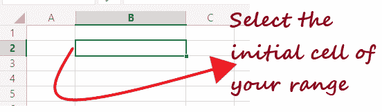
2.  ***将光标拖动到范围的最后一个单元格*** 。如您所见，我们已经将指针拖到了 D5 单元。
    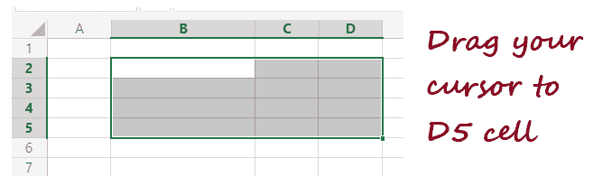
3.  于是 ***范围 B2: D5 入选。***
    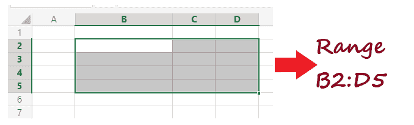

同样，您可以在 Excel 工作表中选择任意范围的单元格。

### B.选择不连续的单元格区域

1.  ***选择单元格*** ，从这里开始选择你的范围。在我们的例子中，我们选择了 B2 细胞。
    
2.  按住 ***上的***【CTRL】***键，选择各种不相邻的单元格。*** 我们选择了 B2:B6、C3:C6、D4 范围内的细胞。
    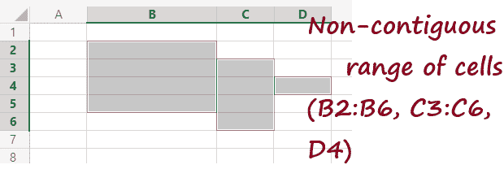

## 范围的类型

1.  **垂直范围**
    垂直范围是指选择一列内的单元格。例如，在下图中，垂直范围是 A1:A5。但是，如果您选择整个列，垂直范围将是 A: A.
    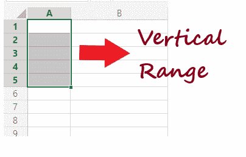
2.  **水平范围**
    水平范围是指选择一行内的单元格。例如，在下图中，水平范围是 A2:E2。但是，如果选择整行，垂直范围将是 2:2。
    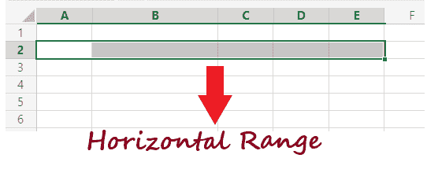
3.  **混合范围**
    混合范围是指相邻行、列组合而成的单元格集合。例如，在下面的示例中，混合范围是 A2: E10。
    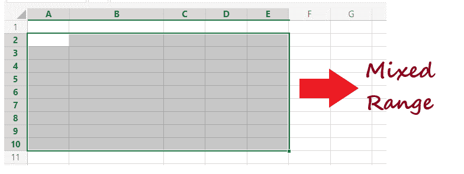
4.  **多重选择范围**
    要定义一个范围，不需要只选择相邻的单元格。因此，在“多重选择范围”中，会选择一组不相邻的单元格。例如，在下面的例子中，多重选择范围是 B4、B8、C7、D5、D8、E6。
    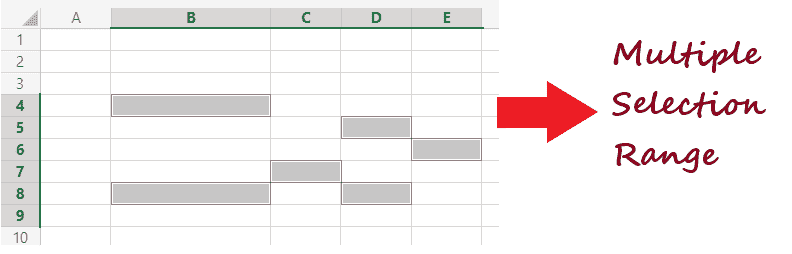

## 移动范围

默认情况下，如果在 excel 中移动单元格区域， ***会将数据从一个位置移动到另一个位置，同时移动的还有其格式*** ，如字体、文本或数字格式、单元格边框、字体颜色等。

按照下面给出的步骤在 Excel 中移动单元格区域:

1.  ***选择要在 excel 电子表格中从一个位置移动到另一个位置的单元格范围*** 。
    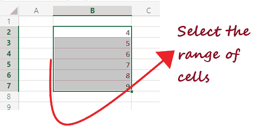
2.  一旦你选择了细胞，你会注意到整个范围内选择的 ***细胞变得活跃，周围有一个绿色的方框*** 。
    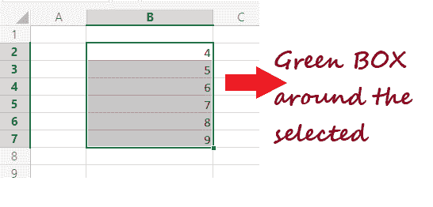
3.  将光标移动到绿色边框，会看到**光标变为四向箭头图标。**
    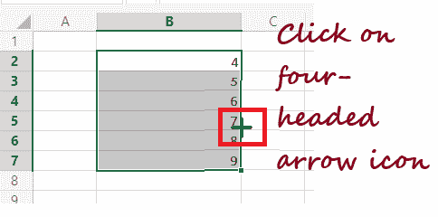
4.  使用箭头 ***将单元格移动到同一 Excel 工作表中的另一个位置。*** 不像这里，我们可以把它移到 e 列
    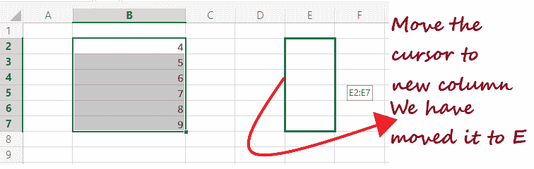

#### 注意:移动单元格后，所有数据和格式将自动从原始范围中删除(C1:C6)。

## 复制/粘贴范围

默认情况下，如果您在 excel 中 ***复制一个单元格区域，它将从一个位置复制数据及其格式*** ，如字体、文本或数字格式、单元格边框、字体颜色等。 ***将其粘贴到新位置。***

按照以下步骤复制并粘贴 Excel 中的单元格区域:

1.  ***选择想要复制的单元格范围*** 。
    
2.  将光标放在选定的单元格上，然后右键单击它。将显示以下窗口。单击复制选项。或者可以直接按快捷键，即 ***CTRL + c.***
    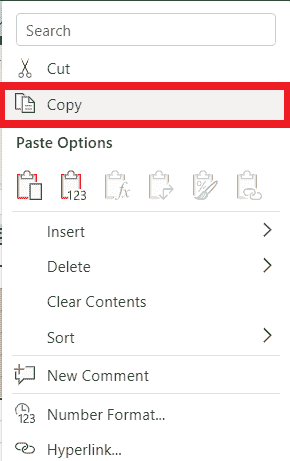
3.  选择要开始粘贴复制单元格的单元格。右键单击单元格并选择粘贴选项，或者直接按下***【CTRL+V】***选项。
    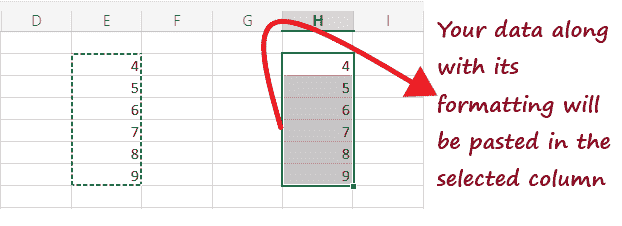

就是这样，您的数据(及其格式)将被粘贴到 excel 电子表格的新位置。

#### 注意:您会注意到选定的单元格区域(B1:C6)仍然有虚线边框。这意味着 excel 区域仍被复制到剪贴板中，您可以再次将其粘贴到 excel 工作表中的任何位置。因此，我们需要从剪贴板中删除数据。要清除剪贴板内容，请按键盘上的退出键。一旦你这样做了，范围周围的虚线边界将会更长。

## Excel 中的命名区域

***命名区域是一个惊人的 excel 功能，用于定义工作表中单元格或区域集合的名称。*** 命名范围是一个额外的优势，因为它有助于快速计算函数和公式。

要在 Excel 工作表中添加命名区域，请执行以下步骤:

1. ***选择要定义名称的单元格范围*** 。

2.转到位于 Excel 窗口顶部的功能区工具栏。点击 ***公式选项卡- >定义名称组- >定义名称选项。*T3】**

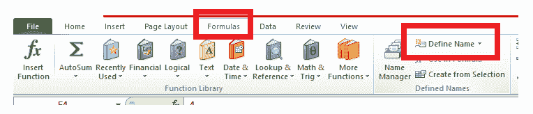

3. ***新名称窗口将打开*** (如下图)。在描述性名称文本框中， ***为该范围输入任何合适的名称。*** 在我们的例子中，我们已经输入了 Student_Marks 作为所选范围的名称。

#### 注意:名称文本框最多只能容纳 255 个字符。

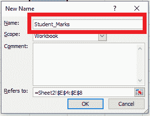

4.指定名称后，是时候 ***指定要应用名称的单元格范围了；*** 因此，在“引用”框中，从 Excel 工作表中选择范围。

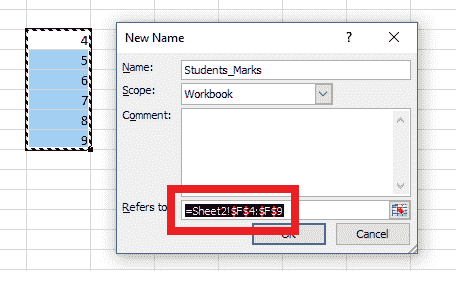

5.完成后， ***点击确定按钮。*T3】**

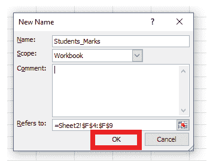

6.窗口将关闭，当您返回电子表格时，您会注意到所选单元格范围的名称框 中突出显示了名称 ***学生 _ 标记(如下图所示)。***

#### 注意:如果您已经命名了任何范围，则每当您选择该列时，都会在“名称”框中看到该范围的名称。

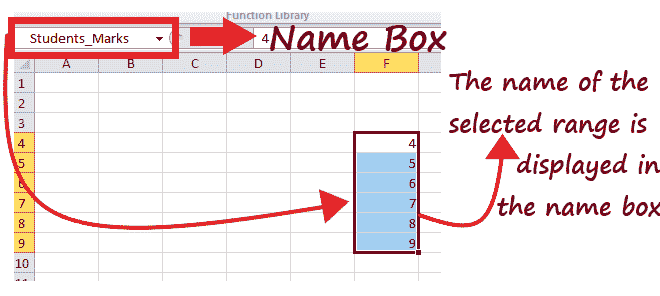

7.现在我们已经定义了区域的名称，我们可以直接在公式中使用 Student_Marks 这个名称来引用命名的单元格区域。例如，在 excel 工作表中键入以下公式。

***所用公式:***

=SUM(Student_Marks)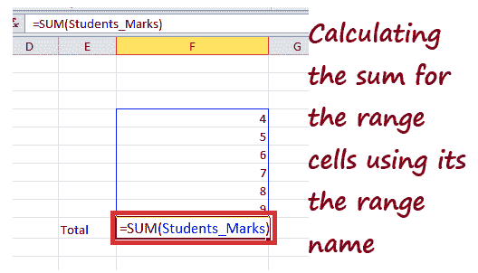

8.SUM 公式会快速 ***计算出定义范围内存在的所有数字*** 的总和，并给出如下结果。

Result: 55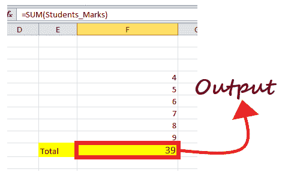

* * *