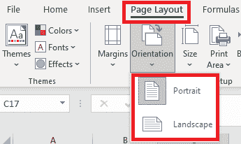
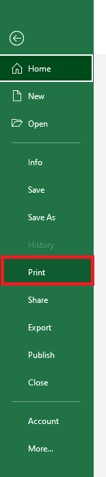
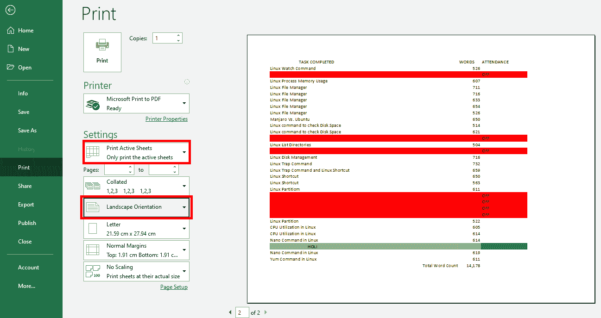
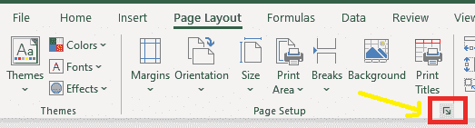
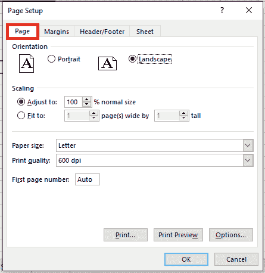
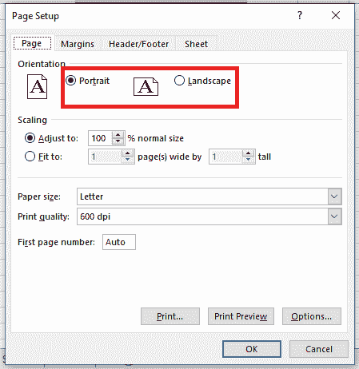
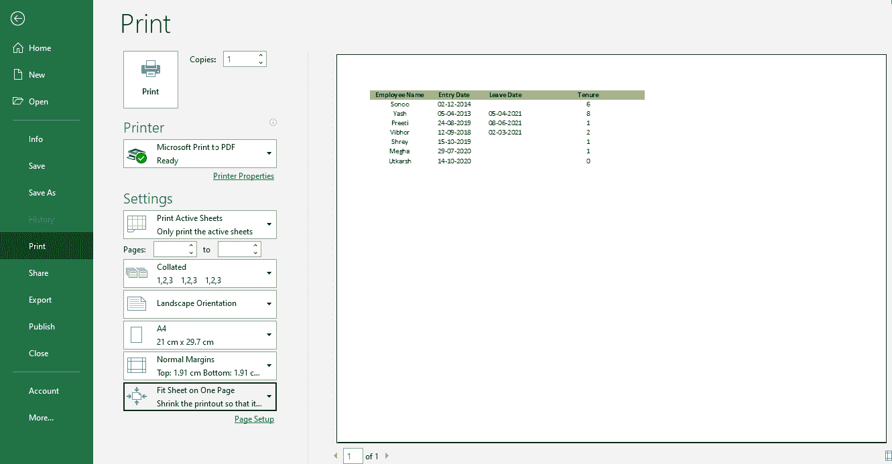
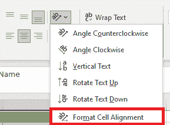
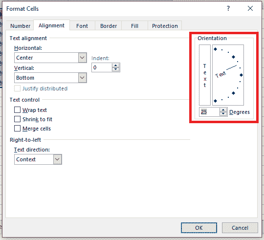
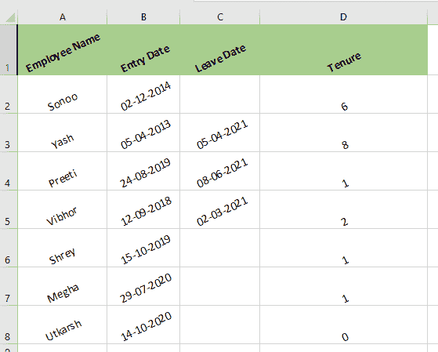

# Excel 中的页面方向

> 原文:[https://www.javatpoint.com/page-orientation-in-excel](https://www.javatpoint.com/page-orientation-in-excel)

## 页面方向

输出打印在页面上的方式称为页面方向。每当我们更改页面方向时，屏幕上的分页符都会自动调整新的纸张方向。

MS Excel 中有两种页面方向选项；**人像**和**风景。**纵向定位页面**，横向定位页面**。**多列的工作表受益于横向模式，而多行的工作表受益于纵向模式。默认情况下，Microsoft Excel 以纵向打印工作表。**

 **## 页面方向的类型

在微软 Excel 中，有两种类型的页面方向:

1.  肖像
2.  风景

### 纵向

纵向页面方向用于打印高页。在纵向方向，信息平行于页面的短边打印。

### 横向

横向页面方向用于打印宽页面。如果我们有一个不适合垂直方向页面的大范围，这种方向是有益的。信息以横向平行于长边的方式打印。

## 如何在 Excel 中更改页面方向

如果我们想在 Excel 中更改页面方向，那么我们必须遵循以下步骤:

1.首先，我们必须选择需要更改方向的工作表。

#### 注意:如果我们选择多个工作表，则[分组]选项将出现在工作表顶部的标题栏中。如果我们需要取消工作簿中几个工作表的选择，我们可以单击任何未选择的工作表。如果没有未选定的工作表可见，我们必须右键单击选定工作表的选项卡，然后我们需要单击名为取消工作表分组的选项。

2.接下来，在**页面设置**组中的**页面布局选项卡**上，我们将单击**方向**选项，然后单击**纵向**或**横向**选项。

**备注:**

*   如果我们没有设置打印机，则方向选项将变暗，无法选择。为了解决这个问题，我们需要安装一台打印机。当我们修改单元格的内容时，该选项同样会变暗。我们必须按**进入**接受修改，或按 **Esc** 取消修改以解决问题。
*   因为我们可以逐个工作表地设置页面方向，所以我们可以在同一个工作簿中以一个方向**(像纵向方向)**打印工作簿中的某些工作表，以另一个方向打印其他工作表**(像横向方向)。**在打印工作表或工作簿之前，只需为每个工作表选择合适的方向。

## 准备打印时更改页面方向

准备打印时，我们必须按照以下步骤更改页面方向:

1.  首先，我们必须选择需要打印的工作表、工作表或工作表数据。
2.  然后我们要点击**文件>打印。**
    
3.  接下来，在**设置下的**页面方向**下拉框中，**我们要点击**纵向方向**或**横向方向。**
    
4.  当我们准备打印时，点击**打印。**

## 使用页面设置启动器工具在 Excel 中更改页面方向

虽然前面的比较简单，但是我们还将讨论改变页面方向的另一种选择。

这个方法中使用了一个对话牛启动器工具。一个**对话框启动器()**是一个出现在一个组中的小图标。此工具充当打开有关相应组的对话框或任务窗格的快捷方式。通过这种方式，我们获得了更多相关的选项。

为了修改页面方向，我们可以使用**页面设置启动器。**

以下是我们必须遵循的修改页面方向的步骤:

1.  首先，我们必须选择需要打印的工作表区域。
2.  接下来，我们要选择**页面布局**选项卡。
3.  寻找**“页面设置”**工具组。我们可以在这个组的右下角看到一个小小的对话框**盒子启动器工具()，**。我们必须点击这个工具来启动**页面设置对话框。**
    
4.  现在将出现**页面**设置对话框。然后，我们必须选择对话框顶部的**“页面”选项卡**。
    
5.  在这个标签窗口的顶部，我们可以看到“方向”下的两个选项——纵向和横向。选择适当的选项。
    
6.  现在我们的页面设置在我们需要的方向。为了检查是否正确，我们可以看到打印后页面外观的预览。为此，我们必须点击窗口底部的**打印预览**按钮。
    T3】
7.  这将把我们带到打印菜单，在那里我们可以看到打印预览选项。如果我们想看看它是什么样子，那么我们可以直接从这里打印。
    

## 更改单元格中文本的方向

以下步骤用于更改单元格中文本的方向:

**1。**首先，我们必须选择要更改文本方向的单元格:

**2。**然后我们必须点击**主页**选项卡下的**方向**按钮，然后在方向按钮的下拉列表中选择任何方向样式。

#### 注意:单击列表中的“设置单元格对齐方式”项目，可在“设置单元格格式”对话框中获得更多方向样式。

要修改单元格中文本的方向，请转到**格式单元格对话框**中**对齐选项卡**下的**方向部分，拖动方向指针或输入方向度数。请看下面的截图:**

**3。**应用方向样式后，我们的数据如下所示:

* * ***