# Excel 中的面积图

> 原文：<https://www.javatpoint.com/area-chart-in-excel>

微软 Excel 是最受欢迎和最强大的电子表格程序之一，具有独特的功能。使用图表以图形方式表示数据是微软 Excel 的一大特色。Excel 中有不同类型的图表，选择合适的图表有时很难，除非我们知道所有的 Excel 图表。

Excel 中的面积图是少数有助于在 Excel 中显示数据的图形表示的图表之一。它通常用于展示数据，描述时间序列关系。本文简要介绍了面积图，包括面积图的类型、示例以及在 Excel 工作表中创建面积图的分步教程。

## 什么是 Excel 中的面积图？

面积图通常被定义为微软电子表格的一种数据可视化功能，它集中展示了一个或多个变量在一段时间内的变化率。它通常通过使用颜色填充 x 轴和线段之间的区域来帮助测量不同数据集随时间的趋势。简而言之，面积图是一种特定的折线图，线条下方的区域用颜色填充。

当使用多个线段时，图表可能会在两个连续线段之间的区域显示不同的颜色。作为折线图的一种特殊变体，面积图强调数据和坐标轴之间的“间隙”，主要用于比较数据组。

面积图可以通过以下两种方式显示:

*   相互重叠的数据图
*   相互堆叠的数据图

### 面积图的组成部分

Excel 中的面积图有五个主要组成部分，如下所示:

*   **绘图区域:**用图形表示数据的区域称为绘图区域。
*   **图表标题:**是绘制图表的主标题，可以根据需要进行编辑。
*   **纵轴:**纵轴代表 X 轴上的测量值。它也被称为 X 轴。
*   **横轴:**横轴表示 Y 轴上的数据类别。它也被称为 Y 轴，系列数据可以相应地在这个轴上分组。
*   **图例:**图例是一个信息元素，有助于列出各种数据组并区分它们。它可以放在图表或绘图区的任何一侧。

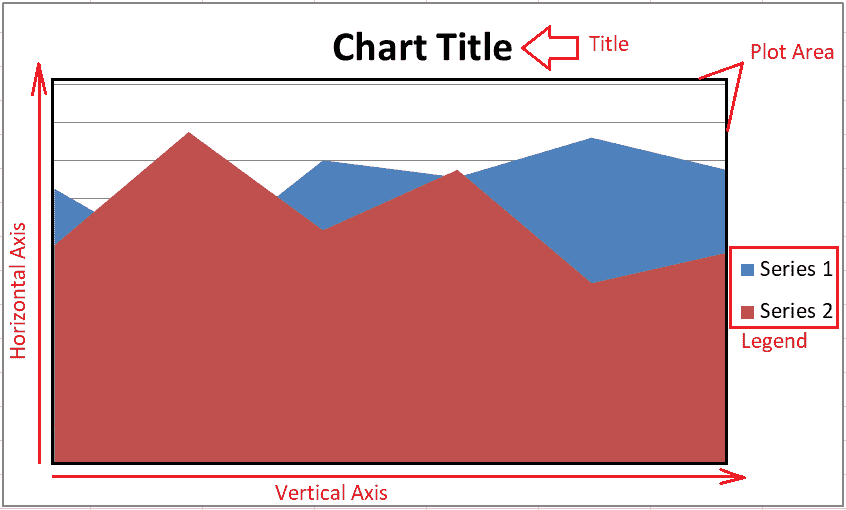

## 面积图的用途

虽然我们可以在 Excel 中使用面积图的场景很多；但是，以下是面积图最常见的一些用途:

*   **趋势分析:**由于面积图通常绘制在 X 和 Y 两个轴上，因此它主要用于显示具有幅度的趋势，而不是单个数据值。面积图有助于分析集体和单独趋势的每个组的性能。
*   **对比数据总结快速结果:**当我们有离散时间序列数据时，面积图很有帮助。我们需要显示或汇总每组数据与整个数据的关系。例如，假设我们有一些学生的数据和他们一年中不同科目的分数。我们希望评估数据并总结结果，以确定每个学生在特定科目上的实力。我们可以通过查看标绘图表上受试者的最高音量部分，用面积图来确定每个学生的优势。
*   **集体数据分析:**集体数据分析时也使用面积图。图表通过对有效数据点进行分组，有助于将量感融入到我们的数据中。它还有助于将数据点视为特定线段的区域，而不是单个数据点的线段。

## 面积图类型

MS Excel 中的面积图主要有三种类型:简单面积图、堆叠面积图和 100%堆叠面积图。

### 简单面积图

绘制简单面积图时，有效图表区域的彩色部分相互重叠。简单面积图中的数据是一个接一个地绘制的，使得图表的彩色区域相交。

最好绘制一个简单的面积图，在最后一个地方有最小的值，使它在其他绘制数据的顶部可见。此外，如果我们先绘制最小的数据区域，较大的数据区域将与最小的区域重叠，使它们完全不可见。但是，我们可以使用透明度功能使所有图表部分可见。这样，没有任何图表区域被隐藏。

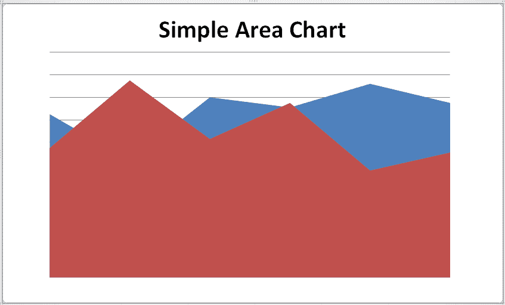

### 堆叠面积图

堆叠面积图是一种典型的面积图，它通过将数据组组合成彼此的延伸来显示数据图。简单地说，彩色线段(数据图)是一个接一个绘制的。

我们必须从上一个分段的数据中减去上面绘制的数据，同时在堆叠面积图中的前(或最后)分段的 Y 轴上获取准确的数据值。这种类型的面积图主要用于突出类别之间的变化。然而，比较堆叠面积图中数据点的相对位置有些困难。

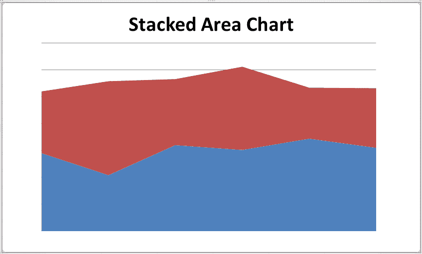

### 100%堆叠面积图

100%堆叠面积图是 Excel 中堆叠面积图的扩展版本。它几乎类似于堆叠面积图，但有一个主要变化:100%堆叠面积图中的垂直轴比例表示为整个数据的百分比。

100%堆叠面积图中的面积段通常会占用整个图表区域。这种面积图主要用于计算或确定数据趋势的百分比估计值。然而，在阅读或分析这些图表上的趋势时，我们需要进一步计算才能得出结论。

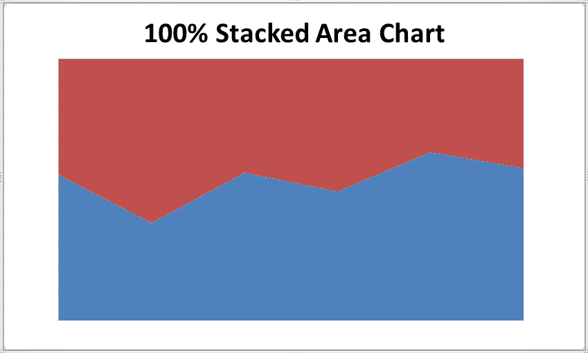

所有这些图表都是以二维格式绘制的；但是，我们可以从图表部分选择任何图表的三维版本。基于三维格式，面积图被命名为三维面积图、堆叠三维面积图和 100%堆叠三维面积图。唯一不同的是，三维面积图包含三个轴，如 X、Y 和 z。因此，用户/读者也可以看到面积图的俯视图和侧视图。

## 如何在 Excel 中创建面积图？

由于 Excel 中有三种不同类型的面积图，我们需要了解使用三种不同示例的面积图，以及将它们插入 Excel 的相应步骤:

### 示例 1:创建简单的面积图

我们需要执行以下步骤在 Excel 中创建一个简单的面积图:

*   首先，我们需要**将**的数据输入到 Excel 表格中。我们必须选择或突出显示整个数据或有效数据范围来创建图表。
    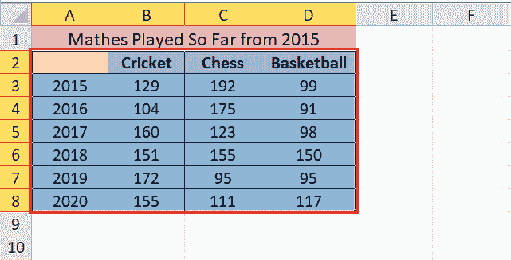
*   接下来，我们需要导航到**插入**选项卡，并从**图表**部分选择一个选项**区域**，如下所示:
    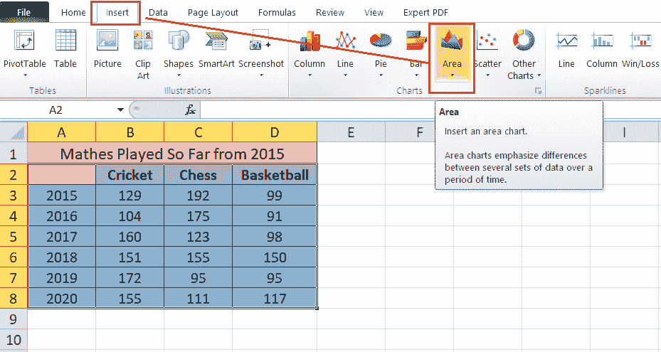
*   点击面积选项后，我们会在**下拉列表下看到其他图表选项。**创建**简单面积图，**我们需要相应地选择**二维或三维面积**下的**第一个图块**。
    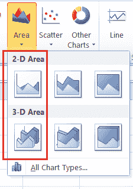
    在我们的案例中，我们选择了**二维简单面积图。**
    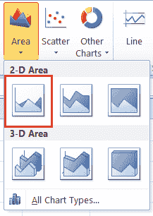
    一旦我们点击了想要的图表类型，同样会很快插入到活动工作表内。我们的示例区域图将如下图所示填充:
    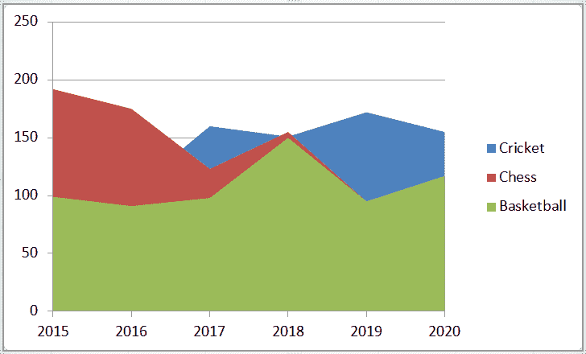

### 示例 2:创建堆叠面积图

我们需要执行以下步骤在 Excel 中创建堆叠面积图:

*   创建堆叠面积图几乎类似于在 Excel 中创建简单面积图。首先，我们需要在 Excel 工作表中输入数据，选择数据或数据区域，导航到插入选项卡，然后单击图表部分下的区域选项。
    
*   但是，当从区域下拉列表中选择图表类型时，我们必须分别选择二维或三维区域类别下的第二个图块。
    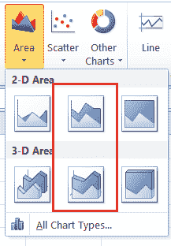
*   在我们的示例中，我们选择了如下的二维堆叠面积图:
    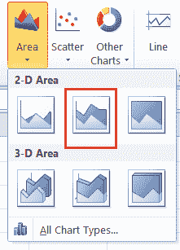
*   选择所需的图表后，我们的堆叠面积图将绘制在工作表中，如下所示:
    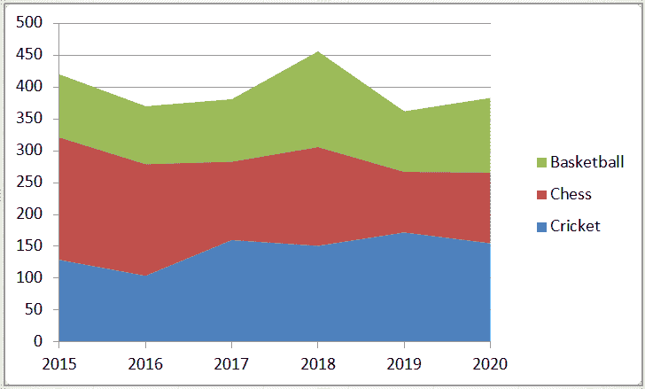
    在上图中，我们可以确定数据和年份随时间的关系。这典型地展示了相应年份的游戏趋势。

### 示例 3:创建 100%堆叠面积图

我们需要执行以下步骤在 Excel 中创建 100%堆叠面积图:

*   像上面两个例子一样，我们需要在 Excel 工作表中输入数据，选择有效数据，导航到插入选项卡，然后单击图表部分下的区域选项。
    
*   接下来，我们必须根据需要从二维或三维区域类别下的区域下拉列表中选择最后一个图块。
    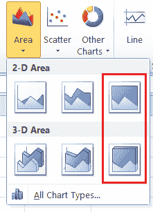
*   在我们的示例中，我们选择了选项 100%堆叠二维面积图。
    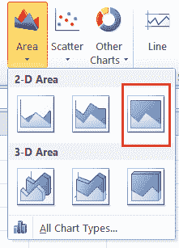
    我们的示例数据会是这样的:
    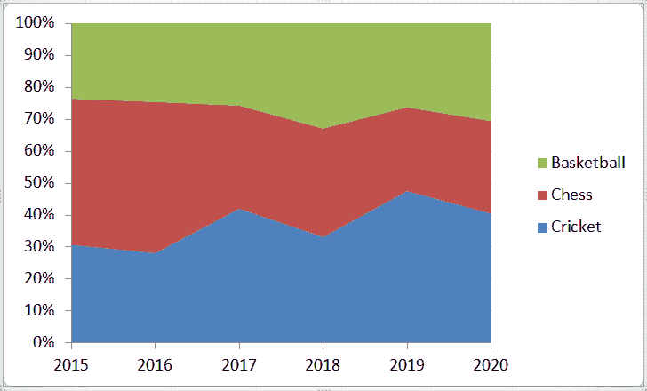
    现在，考虑以下两种不同产品随着时间推移的销量数据。我们需要创建一个 100%堆叠的三维面积图。
    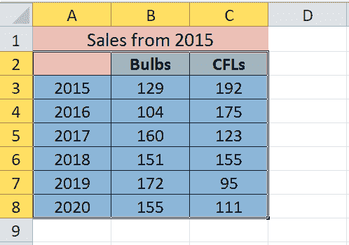
    为此，我们选择了选项 100%堆叠三维面积图。
    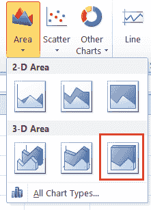
    这通常有助于显示每种产品贡献的百分比相对于年份的趋势，如下所示:
    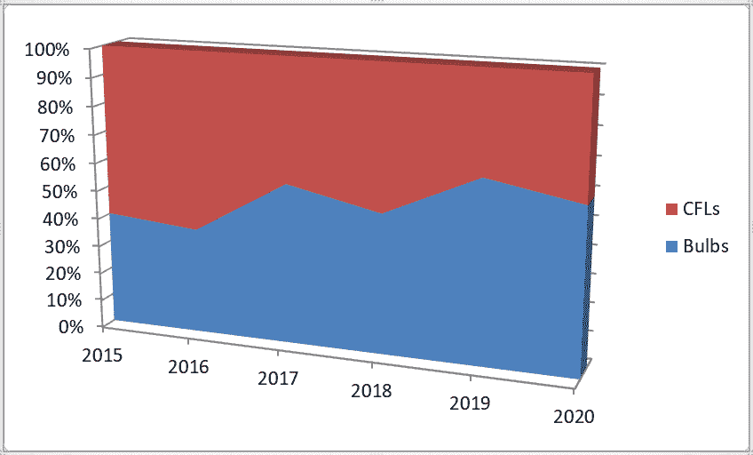

这样，我们可以在 Excel 中创建三种不同类型的面积图，这主要有助于显示趋势，而不是价值数据表示。

## 在 Excel 中自定义面积图

自定义面积图及其元素类似于修改 Excel 中的其他图表。此外，Excel 图表可以通过不同的方式进行编辑或自定义。以下是在 Excel 中轻松自定义面积图的一些基本方法:

### 双击

这是在 Excel 中修改或编辑图表的任何元素的最基本功能。每当我们双击任何图表项目时，它都会显示一个侧面板，其中包含与所选元素相关的不同编辑选项。显示侧面板后，我们只需单击一下即可选择或激活另一个元素，并获得其各自的编辑选项。我们不需要反复双击。

侧面板包括特定于元素的编辑选项和一些典型的格式选项，如编辑颜色和效果。侧面板通常会从活动 Excel 窗口的右侧弹出，如下图所示:

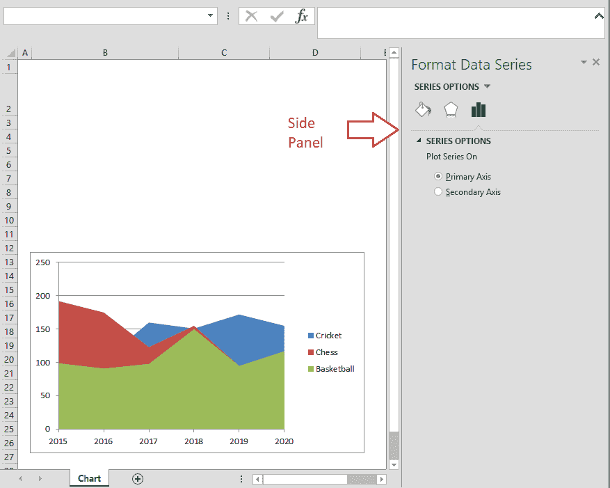

在 Excel 2010 和更早的版本中，我们会得到一个弹出窗口，而不是侧面板。

### 右键单击(上下文)菜单

访问图表及其元素的自定义选项的另一种典型方法是使用鼠标右键单击。当我们右键单击任何元素或图表本身时，我们会得到上下文菜单。上下文菜单或上下文菜单显示一些快速选项来修改基本元素样式，如颜色和其他格式。此外，我们可以激活侧面板来查看详细的选项视图。

要从上下文菜单访问侧面板，我们需要选择一个以文本“格式”开头的选项。例如，下图有“格式化数据系列”选项，从文本格式开始。

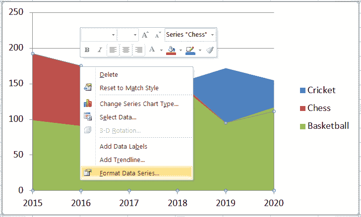

同样，我们可以根据区域图中的选定元素获得其他菜单选项。

### 图表快捷方式

在 Excel 2013 或更高版本中，我们还可以选择使用图表快捷方式。它由加号(+)标识，默认情况下位于绘制图表的右侧。它包含几个名称前带有复选框的图表元素。我们可以插入/移除特定元素，应用内置图表样式或颜色集，并通过标记或取消标记相应复选框来过滤值。

使用图表快捷方式的最大好处是，只要我们将鼠标悬停在复选框或选项上，就可以看到我们希望应用的选项的预览或效果。在下图中，我们仅在“数据标签”选项上移动光标，标签预览甚至在应用之前就显示在图表上。

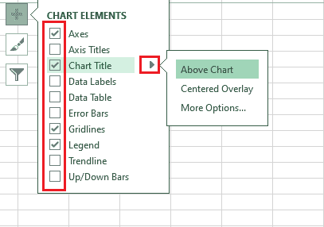

### 带状物

功能区是访问几乎所有 Excel 选项的最基本区域。插入图表后，Excel 会自动在功能区中插入一些新的选项卡。插入的选项卡仅包含“图表工具”类别下的特定图表相关选项。该类别还包括两个选项卡，即“设计”选项卡和“格式”选项卡。但是，在 Excel 2010 和更早版本中，有三个选项卡，其中布局是附加选项卡。在更高版本的 Excel 中，布局选项卡及其选项被合并到“设计”选项卡下。

“设计”选项卡主要包括添加图表元素、布局、颜色、样式和其他基本选项，以修改数据甚至图表本身。另一方面，FORMAT 选项卡包含许多其他对象共有的一些通用选项。

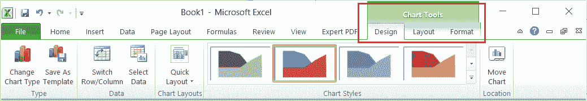

## 一次更改面积图的布局和样式

预设布局和内置样式选项总是快速更改布局和样式或面积图的好选项。我们可以从图表工具下的设计选项卡中选择所需的样式或特定布局。或者，我们可以通过单击图表快捷方式中的画笔图标来访问它。

快速布局选项如下所示:

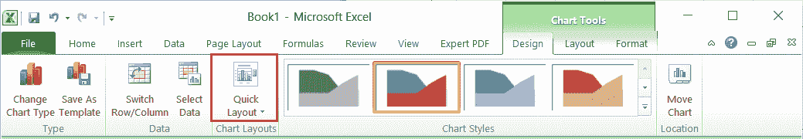

可以直接从下面显示的部分选择样式:

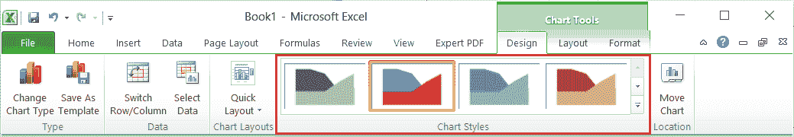

## 更改图表类型

在微软 Excel 中，更改图表是一个更容易的过程。插入图表后，我们需要选择图表并导航到“设计”选项卡。在这里，我们需要选择“更改图表类型”选项，如下图所示:

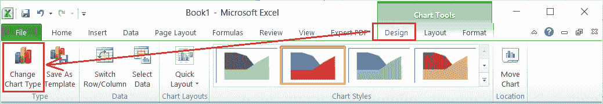

选择特定选项后，我们将看到所有图表类型。我们可以从列表中选择任何想要的图表，相应的图表将立即插入工作表中。此外，当我们将光标移动到任何特定的图表时，我们甚至会在单击之前看到相应的预览。

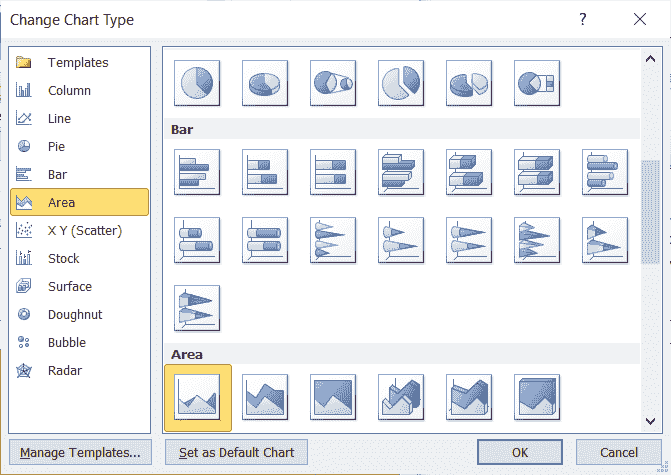

这样，我们就可以在不同的区域图之间切换，甚至可以使用全新的图表类型。

## 将面积图移动到另一张工作表

当我们在 Excel 中创建新图表时，它将在与所选数据相同的工作表中创建。但是，Excel 允许我们将图表移动到同一工作簿中的另一张工作表中。为此，我们需要单击功能区上“设计”选项卡下的“移动图表”选项。或者，我们可以从所选图表的右键菜单中选择移动图表选项。但是，我们必须右键单击图表的空白区域来访问适当的图表选项。

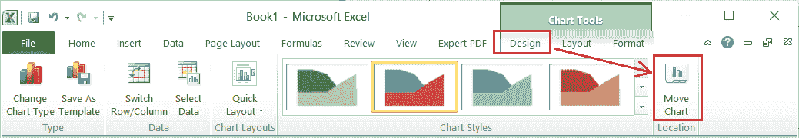

单击移动图表选项后，我们会看到带有以下两个选项的移动图表对话框:

*   **新工作表:**选择此选项将创建一个具有指定名称的新工作表，并将所选图表移入其中。
*   **对象在:**选择此选项允许我们从下拉列表中选择现有工作表的名称，以将图表移动到那里。

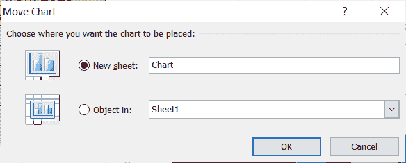

我们可以选择任何想要的选项，然后单击“确定”按钮。所选图表将立即移动到相应的工作表中。

## 在 Excel 中使用面积图的优势

以下是在 Excel 中使用面积图的优点:

*   借助 Excel 中的面积图，我们可以轻松展示不同类别中每个特定产品遵循的趋势。
*   还可以读取面积图中重叠的数据，这进一步有助于理解分析。这是可能的，因为不同的颜色和适当提供的值。
*   与重叠数据相比，面积图中的堆叠面积易于阅读或理解。然而，阅读它需要比阅读两类图表更多的努力。

## 在 Excel 中使用面积图的缺点

以下是在 Excel 中使用面积图的优点:

*   有时，根据所提供数据的复杂性，理解图表并适当读取其数据以获得适当的克服可能是一项挑战。
*   要提取绘制面积图的值或数据，我们必须读取相应的图进行比较。不是每个人都习惯于比较同一图表中的多个图。

## 使用面积图时需要记住的重要事项

*   用户/读者必须对图表有基本的了解，才能理解绘制的面积图。
*   关于时间，面积图中的数据应该相互比较。

* * *