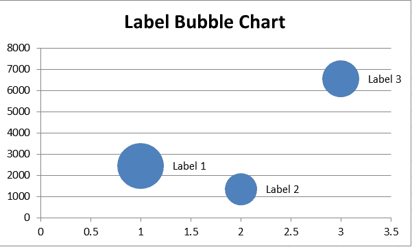
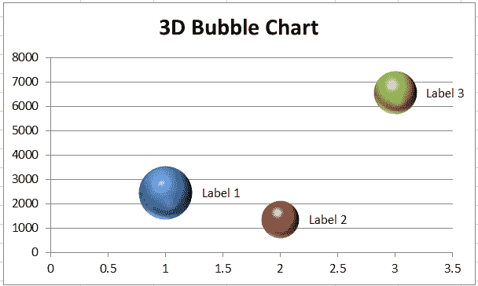
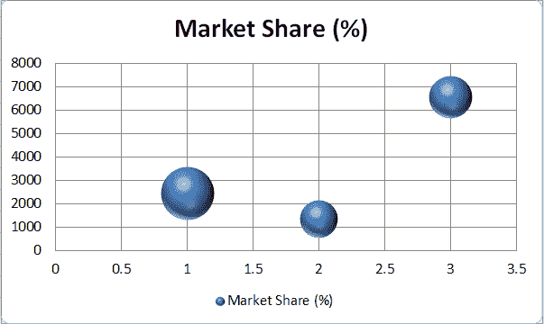

# 气泡图 Excel

> 原文：<https://www.javatpoint.com/bubble-chart-excel>

数据可视化是微软 Excel 的一个有效功能。使用此功能，我们可以使用形状、颜色、样式和其他格式样式自定义工作表数据，甚至创建不同的图表/图形。气泡图是 Excel 中一种独特的图表类型，它不仅仅是像图形一样制作点，还像 Excel 中的其他图表一样具有实际应用。

在本文中，我们讨论了 Excel 中气泡图的简要介绍以及在 Excel 工作表中插入或创建气泡图的过程。文章结合相关图片和实例讨论了这一循序渐进的过程。

## 什么是 Excel 中的气泡图？

气泡图是微软电子表格中散点图的典型变体。在散点图中，我们在绘图区域获得数据点，以显示或可视化数值和比较。然而，正如其名称所示，气泡图使用气泡代替数据点。像散点图一样，气泡图也有助于在水平轴和垂直轴上显示数据比较。

绘制气泡图时，数值较高的数据点会形成较大的气泡，并显示在图表的顶部。此外，数值较低的数据点形成小气泡，显示在 Y 轴附近的底部区域。气泡图选项存在于 Excel 2010 和其他更高版本中。

这种类型的高级散点图通常用于以图形方式表示三组数据。使用气泡图，我们可以显示不同数据集之间的关系，它们在绘制人口数据或区域容量数据时非常有帮助。气泡图最常用于绘制商业、社会、经济和许多其他领域的财务数据，以了解数据之间的关系。

#### 注意:气泡图必须提供至少三个变量(列)的数据，并且数据必须包含三个数值列的数据。一个代表气泡的大小，另外两个代表点的水平和垂直轴或位置。

## 气泡图的类型

气泡图在不同的分析领域有几种不同的应用，包括数学和统计学。由于其广泛的应用或用途，Excel 中存在不同类型的气泡图，以帮助我们相应地绘制每个领域的数据。

下表显示了 Excel 中气泡图的不同变体:

*   简单气泡图
*   标记气泡图
*   多变量气泡图
*   地图气泡图
*   三维气泡图

让我们详细讨论每种类型:

### 简单气泡图

简单气泡图是带有默认设置的气泡图的基本版本或原始版本。它不是那种泡沫图。相反，它是泡泡图本身。在简单的气泡图中，数据点表示为气泡。它不使用类别轴。这意味着水平轴和垂直轴都是简单气泡图中的数值轴。但是，气泡图通常包含 x、y 和 z 值(对于气泡大小)。它主要用于分析数据中的模式和趋势。

### 标记气泡图

标记气泡图几乎类似于简单气泡图；然而，标记气泡图有一点变化。带标签的气泡图使用气泡上的标签作为图例的替代，标签通常有助于识别相应气泡所代表的变量。

标记气泡图实际上只有在处理相对较少数量的数据点时才有帮助。如果我们试图在几个数据点上贴标签，就会变得很耗时。此外，绘图区域中有如此多的标签会使图表变得混乱且难以理解。

### 多变量气泡图

多变量气泡图主要用于处理数据中的多个变量，尤其是处理三个以上的变量。这种类型的气泡图使用不同的颜色来突出不同的变量组。以上两个气泡图通常只以一种颜色形成或可视化所提供的数据。然而，默认情况下，多变量气泡图在颜色的帮助下可视化不同的变量组。

### 地图气泡图

地图气泡图是一种特殊类型的气泡图。这种类型的图表通常绘制在地图上。它主要用于地理科学，因此也被称为“地图”。地图气泡图有助于使用气泡在地图上表示地理位置。使用气泡图或气泡图图表，气泡(圆形或球形)绘制在特定的地理区域上，气泡的面积与其在所提供的数据集中的值成比例。

地图气泡图被认为最适合在地图上比较地理区域，而不需要考虑区域的具体大小。然而，使用这种类型的气泡图的一个缺点是气泡会重叠或隐藏地图上的区域。

### 三维气泡图

当我们通常在 Excel 表格中创建一个基本气泡图时，它是以 2D 格式绘制的。但是，我们可以使用 3D 效果将其更改为 3D 格式。Excel 还有一个三维版本的气泡图。使用三维气泡图，图表中绘制的气泡不再是圆形。相反，三维气泡图有类似球体的气泡。

气泡图中球体的半径是根据数据集中提供的第三个参数计算或绘制的。3d 气泡图可以包括上述所有类型的气泡图。但是，当我们有很多气泡时，不建议使用这种类型。这可能会影响图表的整体外观，有时甚至难以理解或研究。

## 气泡图的用途

有时，我们可能需要使用多个条形图来有效地显示结果。与其绘制多个条形图，不如创建一个气泡图。气泡图是一种简单易用的图表，可以有效地显示三种类型的定量数据集。

虽然气泡图在 Excel 中有无数种用途，但最常见的有以下几种:

### 搜索引擎营销

气泡图有助于分析高点击费用对特定广告投放、点击量和网站转化率的影响。当提供实时数据时，图表上绘制的气泡也会随着时间的推移显示出显著的改善。

### 关键词密度

在处理关键词图表时，气泡图可以帮助确定特定关键词的密度。绘制在图表上的气泡将根据气泡在图表上占据的空间显示搜索次数最多或搜索次数最少的关键词。

### 促销效果

广告商可以使用气泡图来跟踪广告和促销的效果。他们可以为三个变量生成气泡图:创建的广告数量、花在每个广告上的钱以及广告产生的总收入。气泡的大小将有助于他们分析广告的影响。

### 销售和营销

像所有数据可视化一样，气泡图也能快速呈现一个故事或总体总结结果。销售和营销专家使用气泡图来显示他们的销售见解，而不是用一系列要点或表格来描述整个指标。气泡图由跨越不同时期的多个数据序列通过一个简洁的表示组成。因此，幻灯片上的图表讲述了表现最佳的数字营销活动的故事，这些活动强调了各种在线/离线细分市场的投资回报率。

## 如何在 Excel 中创建气泡图？

创建气泡图类似于在 Excel 中绘制其他类型的图表。但是，我们必须确保我们的数据包括以下内容:

*   **每个数据点三个值:**我们要求气泡图中每个气泡有三个值。这些值可以写入工作表的行或列中；但是，它们必须处于前面的顺序:x、y 和 z。
*   **多个数据系列:**在气泡图中绘制多个数据系列与在散点图中绘制多个数据系列相同。在气泡图中，我们创建多个气泡系列，而在散点图中，我们创建多个散点图系列。此外，散点图只需要 x 和 y 值。但是，气泡图需要 x、y 和 z 值。

如果我们的数据中有上述参数，我们可以使用气泡图，以气泡的形式显示我们的数据。

让我们借助一个例子来了解创建气泡图的逐步过程:

*   首先，我们需要在 Excel 表格中输入数据来绘制气泡图。我们必须选择/突出显示没有行/列标题的输入数据。
    我们来考虑一下下表，有一些随机销售。
    
    由于每个系列至少有三个数据，创建一个泡泡图是一个不错的选择。
*   我们需要选择一张纸来插入气泡图，然后导航到**插入>散布(X，Y)或气泡图>气泡。**
    
    但是，在 Excel 2010 中，我们必须导航到**插入>其他图表>气泡。**
    
*   之后，我们会在一张纸上看到一个空的图表。我们需要在空图上**右键**，从列表中点击**选择数据**选项，如下图:
    
*   在下一个窗口，我们必须点击**添加**按钮。
    T3】
*   在**编辑系列**对话框中，我们必须指定气泡图的数据。我们为示例数据选择以下设置:
    在**系列名称**文本框中选择所需的名称单元格。
    在**系列 X 值**文本框中选择要在 X 轴上使用的所需列数据。
    在**系列 Y 值**文本框中选择要在 Y 轴中使用的所需列数据。
    在**“系列气泡尺寸”**文本框中选择所需的列数据作为气泡。
    
*   在编辑系列对话框中给出数据后，必须点击**确定**按钮。之后，气泡图将显示在选定的工作表中。根据我们的示例数据，气泡图如下所示:
    

这就是我们如何在 Excel 表格中插入气泡图的方法。但是，我们必须相应地定制图表元素，使它们整洁且易于理解。

## 自定义气泡图

我们可以右键单击图表区域和特定的图表元素来相应地编辑或自定义它们。气泡图中的一些基本修改将在下面讨论:

### 添加气泡图标题

插入的图表顶部的矩形框代表一个图表标题，可以用鼠标双击进行编辑。我们可以为气泡图输入任何想要的标题。

在我们的示例气泡图中，我们输入标题“产品在市场中的份额(2020-21)”，如下所示:

### 在气泡图中添加数据标签

现在，我们已经在工作表中添加了气泡图。为了更容易理解，我们可以在绘制的气泡上添加标签。为此，我们需要右键单击任何气泡并选择添加数据标签选项，如下所示:

我们可以按照我们的要求编辑标签。插入数据标签后，我们的示例图表如下所示:

### 更改图表布局和样式

如果我们想要更改图表布局和/或样式，我们可以在“设计”选项卡下选择所需的布局和/或图表样式，如下所示:

## 将 2D 气泡图更改为三维气泡图

如果我们想将 2D 气泡图更改为三维气泡图，我们需要导航至**插入>散布(X，Y)或气泡图>三维气泡。**在 Excel 2010 中，我们必须导航**插入>其他图表>气泡图>三维气泡。**

在我们选择三维气泡图后，气泡圆将被气泡球替换。我们的示例图表如下所示:

## 气泡图的优势

以下是在 Excel 中使用气泡图的一些优点:

*   气泡图可用于或绘制成三维数据集。
*   气泡图表示比表格格式的数据好得多。
*   泡泡图的不同大小和颜色吸引了其他人的注意力，看起来很有视觉吸引力。

## 气泡图的缺点

以下是在 Excel 中使用气泡图的一些缺点:

*   泡泡图有时会让读者难以理解。要理解 Excel 中的气泡图，必须具备基本的图表知识。
*   在某些情况下，泡沫的大小可能会令人困惑。此外，如果两个或多个数据点包含相同的 X 轴和 Y 轴值，气泡可能会重叠并隐藏。
*   使用 Excel 2010 或更低版本时，在大型气泡图中调整格式和添加数据标签很复杂。

## 使用气泡图时需要记住的重要事项

绘制气泡图时，我们必须记住的一些基本事项如下:

*   我们必须尝试创建一个至少有四行或四列数据的气泡图。如果我们使用三行或更少的行/列绘制气泡聊天，图表通常不会正确形成气泡。
*   建议在创建气泡图时不要选择行或列标题。因为如果我们选择标题作为数据的一部分，图表可能会显示一些不正确的结果。
*   在为气泡选择颜色时，我们一定不要选择特别鲜艳或浮华的颜色，因为它们会破坏图表的整体外观。
*   建议尽可能多地格式化图表元素。例如，数据标签、图表标题、轴标题、数据点等。图表元素的正确格式使理解或研究图表变得更加容易。

* * *