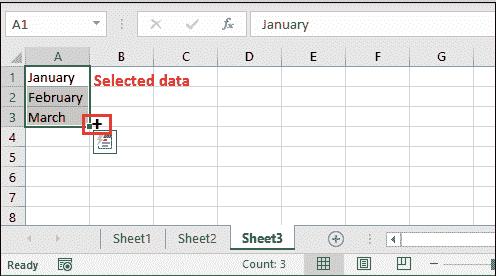
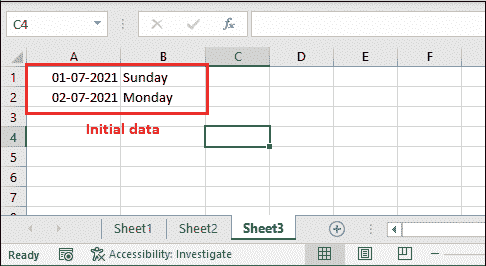

# Excel 中的自动填充

> 原文:[https://www.javatpoint.com/autofill-in-excel](https://www.javatpoint.com/autofill-in-excel)

自动填充是 Excel 的一个有趣且有价值的功能。使用“自动填充”功能，用存储在其他单元格中的特定模式的数据填充 Excel 单元格。它会自动填充一系列单元格。

**例如，**您想要在 Excel 中创建一个月报表，其中一列包含日期。您可以一天一天地手动输入日期，也可以使用自动填充功能在符合模式的单元格中填充日期。这个特性对它来说是一个非常有用的特性。

使用自动填充功能，您可以水平和垂直地自动填充特定模式的数据。

## 什么是自动填充？

自动填充是 Excel 的一个功能，它可以识别序列，并相应地填充相应行或列中的数据。当您沿某个方向(向下、向左或向右)拖动数据时，它会识别单元格数据的模式并自动填充其他单元格。

要使用这个特性，我们首先需要一两个单元格中的数据来识别模式。基于此数据将填充其他单元格。它可以生成所有类型的值(数字、文本、日期等)。).

Excel 通过重复第一个单元格的相同值来填充单元格中的数据，或者通过识别第一个单元格和第二个单元格的模式来插入序列。

## 自动填充示例

我们将向您展示自动填充功能的不同示例，以自动生成和填充遵循特定模式的单元格。

### 示例 1:水平自动填充数据

举个例子，我们将尝试通过识别数据模式来自动水平填充单元格中的数据。

**第一步:**我们已经初步将月份名称作为 A1 和 B1 单元格中的缩写。

**步骤 2:** 现在，选择两个单元格，并将鼠标悬停在所选单元格的右下角。将出现一个小的粗体+符号。(这叫做 **Excel 填充处理程序。**)

**第三步:**在 Excel 表格中向下拖动 **+** 号。它会将模式识别为月，并自动在其他单元格中填充剩余的月名。

请注意，数据是水平生成并放置在单元格中的。这里，它通过识别第一个细胞和第二个细胞的模式插入了一个序列。

**第 4 步:**在生成的值结束时，将显示一个**自动填充选项框**。

**第五步:**点击这个**自动填充选项框**，会显示很多自动填充选项。

### 示例 2:垂直自动填充数据

举个例子，我们将尝试通过识别数据模式来自动垂直填充单元格中的数据。你必须至少选择细胞来识别模式。

**第一步:**我们已经初步取了 A1 和 B1 单元格中的月份名称。

**步骤 2:** 现在，选择多个单元格，并将鼠标悬停在所选单元格的右下角。一个小粗体 **+** 标志将出现。(这叫做 **Excel 填充处理程序。**)

**第三步:**在 Excel 表格中垂直向下拖动 **+** 号。它会将模式识别为月，并自动在其他单元格中填充剩余的月名。

请注意，数据是垂直生成并放置在单元格中的。这里，它通过识别第一个细胞和第二个细胞的模式插入了一个序列。

**第四步:**如果你把这个拖到一年中的月份以上，它会从第一个开始重复这个值。

### 示例 3:在多行/多列中自动填充数据

到目前为止，我们已经使用了自动填充功能来生成单行或单列的数据。Excel 允许使用自动填充功能一次填充多行多列的数据。

你不需要做任何复杂的事情。步骤和上面两个例子差不多。本示例将帮助您自动填充单元格区域的单元格。

以下是相关步骤:

**第一步:**我们有一张 Excel 表，其中我们最初在 A 列中取日期，在 B 列单元格中取日期。

**步骤 2:** 现在，选择两列数据，并将鼠标悬停在所选单元格的右下角。一个小粗体 **+** 标志将出现。

**第三步:**在 Excel 表格中向下拖动下面的 **+** 符号。它会将 A 列的模式识别为日期，将 B 列识别为日，然后在其他单元格中自动填充剩余的月份名称。

请注意，自动填充功能已经为这两列生成了数据，并将其放置在下面的单元格中。

### 示例 4:自动填充重复值

如果希望使用 Excel 自动填充功能在其他单元格中填充相同的值，则必须只选择要重复其值的单元格。这就像在连续的单元格中复制相同的数据。

**第 1 步:**对于这个例子，我们已经取得了这个数据，我们想要填充在连续的单元格中。

**第二步:**选中它，将鼠标悬停在选中单元格的右下角，然后拖动下方的 **+** 符号(自动填充)。

**第三步:**看到了吗——这一次，它在下面的单元格中生成并填充了相同的值。

如果在连续单元格中需要相同的值，这种方法比使用 Excel 的复制粘贴选项更好。这将节省你的时间和精力。

### 示例 5:自动填充重复的日期/天

Excel 允许使用 Excel 自动填充功能在其他单元格中自动填充相同的日期。如果其他单元格需要相同的日期或日期，可以使用自动填充，但是我们上面使用的方法没有用。

如果您尝试对日期或日期执行与示例 4 相同的步骤，这将不起作用。以上方法不够完整；你必须遵循更多的步骤。

**第一步:**我们已经使用 **Ctrl+输入了当前日期；**键在 A1 单元格。

现在，重复与示例 4 相同的步骤(从步骤 2 到步骤 3)。

**第二步:**你会得到特定模式(递增顺序)下的自动填充值，如下-

**步骤 3:** 生成的值仍然被选择。按下 **Ctrl+D** 命令，在选择时将生成的日期更改为重复日期(当前日期)。

请注意，所有自动填充的单元格现在都包含重复的日期。

### 自动填充选项

使用**自动填充选项**填充使用 Excel 自动填充功能自动生成的 Excel 单元格中的特定数据。例如工作日、日、月、年、系列等。使用自动填充功能时，这些选项可见；一个**自动填充选项框**显示在自动生成值的末尾。

让我们举个例子来看看这些自动填充选项是如何自动填充工作日日期的。工作日是指周一至周五的工作日。当您选择“工作日”选项时，它会用工作日日期填充单元格。

### 使用 Excel 自动填充填充单元格中工作日日期的步骤

**第 1 步:**在单元格中输入日期，并选择它以自动填充其他字段中的日期。

**第 2 步:**将自动填充( **+** )符号向下拖动到其他单元格，看到它已经自动填充了一系列已识别模式中的日期。

**第三步:**在生成值的末尾，将显示一个**自动填充选项框**。点击这个**自动填充选项框**，会显示很多自动填充选项。

**第四步:**点击列表中的**填充工作日**选项。

**第五步:**你会看到所有自动填充的日期都变成了工作日日期。

#### 提示:工作日是指周一到周五的工作日。当您选择“工作日”选项时，它会用工作日日期填充单元格。

因此，您可以像这样使用自动填充选项。列表中还有其他几个选项。根据需要随时使用它们。

* * *