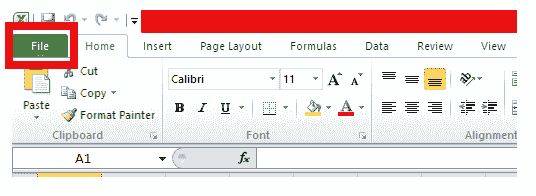
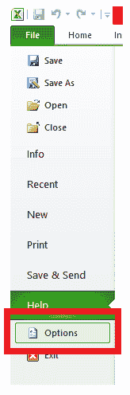
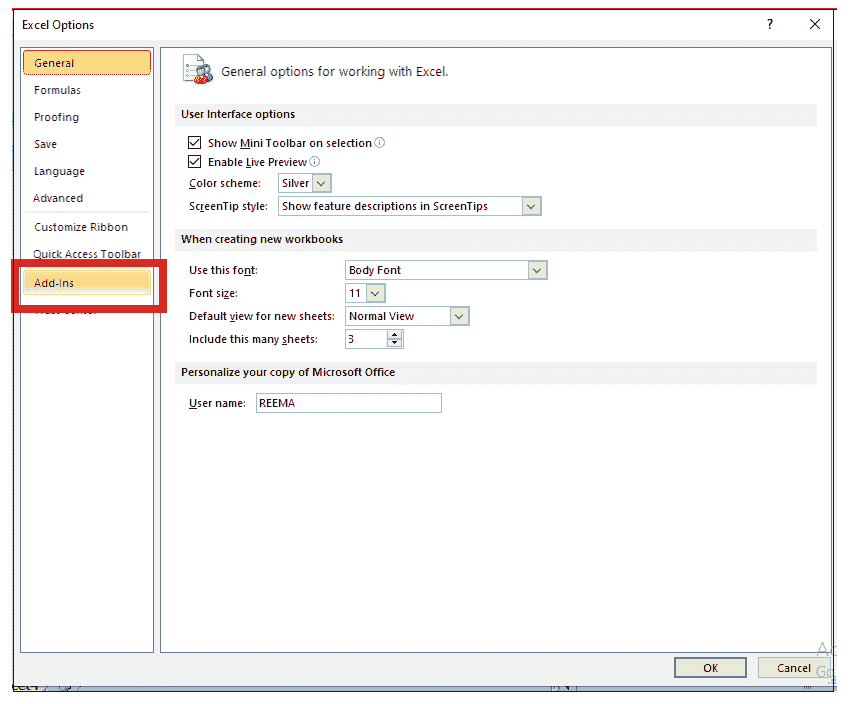
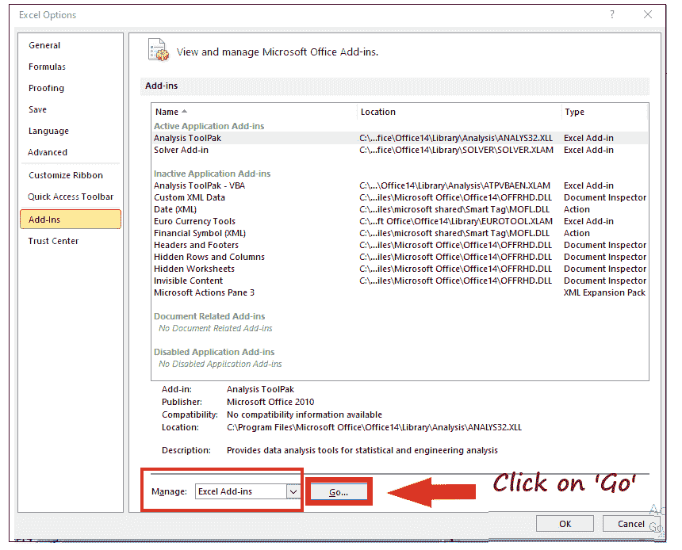
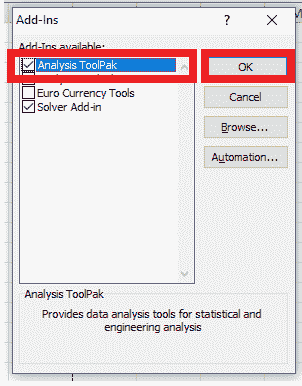
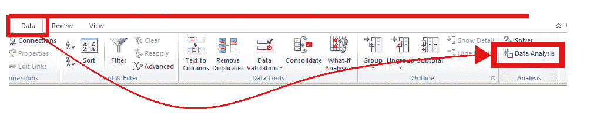
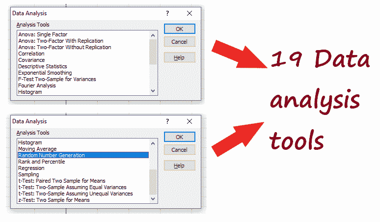

# 分析工具箱

> 原文:[https://www.javatpoint.com/analysis-toolpak](https://www.javatpoint.com/analysis-toolpak)

微软 Excel 提供的功能比你想象的要多得多。数据分析是 Excel 提供给用户的最大功能之一。使用 Excel 的 ***分析工具箱、*** 可以生成复杂的统计或工程分析。

在本教程中，我们将简要了解分析工具库功能及其功能。

## 什么是分析工具箱？

***“分析工具库是一个内置的插件程序，为各种财务、统计和工程问题提供数据分析工具。”*T3】**

分析工具库通过使用 ***相关的统计或工程宏函数来获取输出表中的结果。*** 这个出色的工具通过为每次分析提供数据和参数，无疑节省了时间和精力。

虽然有很多分析函数，但在 Excel 工作表上只能使用一个函数。有时您可能会在分组的工作表中工作，对于这些情况，数据分析的结果将显示在第一个电子表格中，而其他格式化的表格将显示在剩余的电子表格中。但是如果您希望对剩余的工作表执行数据分析，请为每个 excel 电子表格重新计算分析工具。

## 如何在 Excel 中加载分析工具箱？

要在 Excel 工作表中安装分析工具箱，请按照下面给出的步骤操作。

1.  打开你的 Excel 工作表，并从 Excel 功能区工具栏 ***中点击文件。***
    
2.  将出现文件窗口(如下所示)。点击 ***【选项】。***
    
3.  接下来，将打开 Excel 选项窗口。在窗口的左侧，您将看到各种选项。点击 ***“加载项”选项。***
    
4.  确保从管理框(靠近底部)中选择 Excel 加载项，并点击执行按钮。
    
5.  Excel 将抛出“加载项”对话框。选择 ***分析工具箱*** 复选框，点击 ***确定*** 按钮。
    
6.  您会注意到在 ***数据选项卡中，将出现一个新的“分析”部分*** ，包含数据分析功能。
    

就这样！现在，您的分析工具已成功安装在您的 Excel 工作簿中。

## 数据分析功能

***点击【数据分析】选项后，*** 将出现如下窗口，显示不同的分析工具选项，用户可以正确分析数据，并帮助他们执行不同的统计测试以获取合适的输出。

上面的窗口显示了 19 个选项。下面给出了包含这 19 个选项及其简短描述的表格:

| 没有 | 分析工具 | 描述 |
| one | 方差分析:单因素 | 它通过进行方差分析得出两个数据集是否相关的结论。 |
| Two | 方差分析:复制的双因素 | 这是单因素方差分析的扩展。它通过进行方差分析得出两个数据集是否相关的结论。这里唯一的区别是，它可以包含每个组的多个数据样本。 |
| three | 方差分析:无复制的双因素 | 它通过进行方差分析得出两个数据集是否相关的结论。然而，该分析工具并不包括每个组的一个以上的数据样本。 |
| four | 相互关系 | 相关性决定了两个成对变量之间的关系程度。 |
| five | 协方差 | 协方差衡量一个变量在另一个变量变化时的变化。协方差可以是正的，也可以是负的。 |
| six | 描述统计学 | 此工具计算一系列统计计算，并将它们编译成 excel 表格。此表包括平均值、模式、中值、总和、标准偏差、误差、最大值、最小值、样本方差、峰度、计数、范围、最小值、最大值等的计算。 |
| seven | 指数平滑法 | 该工具用于平滑数据，即赋予最近的数据文件更多的权重。 |
| eight | 方差的 f 检验二样本 | f 检验用于比较两个总体方差。零假设是两个总体的方差相同。 |
| nine | 傅里叶分析 | 傅立叶分析通过使用离散傅立叶变换方法或快速傅立叶变换方法解决线性系统中的问题并检查周期性数据。 |
| Ten | 柱状图 | 直方图工具允许用户创建数据分布和直方图。 |
| Eleven | 移动平均数 | 移动平均用于时间序列数据，即一段时间内的数据，如一段时间内的电费支出或一段时间内的公司股票价格或甲类物品的销售单位等。它用于平滑短期波动(或者可能是季节性波动)并突出长期趋势。 |
| Twelve | 随机数生成 | 它用于生成不同类型的随机数，如离散、均匀、正态、伯努利、泊松、模式等。 |
| Thirteen | 等级和百分位数 | 该工具构建了一个从最高到最低排序的数字列表，并给出了一个百分比值，该值显示了特定数字与其他数字相比的排名情况。 |
| Fourteen | 回归 | 回归用于估计两个或更多变量之间的关系——因变量和自变量。简单来说，自变量形成一个方程，有助于估计因变量的值。 |
| Fifteen | 抽样 | 抽样工具用于随机或定期产生数据样本总体。 |
| Sixteen | t 检验:两个样本配对的平均值 | 该分析工具用于测试两个配对样本的零假设。 |
| Seventeen | t 检验:假设方差相等的双样本 | 该分析工具用于检验均值相等的两个配对样本的零假设。 |
| Eighteen | t 检验:假设方差不相等的双样本 | 该分析工具用于测试假设方差不相等的两个配对样本的零假设。 |
| Nineteen | z 检验:均值的两个样本 | z 检验用于计算方差已知的两个数据样本的平均值。 |

每种分析工具都有其自身的重要性，并被统计人员用于不同的计算中。

* * *