# Excel 自动换行文本快捷方式

> 原文：<https://www.javatpoint.com/excel-wrap-text-shortcut>

微软 Excel 是目前功能最强大的电子表格软件，拥有众多功能和特性。它允许用户在工作表中输入大量数据，并使用各种内置工具调整格式。在 excel 工作表中正确设置数据的格式至关重要，因为它为我们的 Excel 数据提供了一个整洁而专业的视图，并使其他人更容易阅读和理解。Excel 中的“环绕文本”功能是一种特定的格式功能，有助于排列单元格数据。

在本文中，我们将讨论各种 Excel 环绕文本快捷方式以及使用它们的分步教程。在讨论快捷方式之前，让我们首先介绍一下 Excel 中的环绕文本功能。

## Excel 中的换行功能是什么？

Excel 中的自动换行功能是格式化的一部分。它不改变任何单元格的值；但是，它会更改值或文本在电子表格单元格中的显示方式。这意味着格式化为换行文本的文本仍然与未格式化为换行文本时相同。

简而言之，当我们在 Excel 单元格中输入超过单元格宽度的文本或句子时，文本会溢出到其他相邻的单元格中。如果相邻单元格中也有文本，溢出的文本将消失，符合单元格宽度的文本仍然可见。因此，我们使用环绕文本功能，使文本在单元格宽度内可见，而不会溢出到其他单元格上。

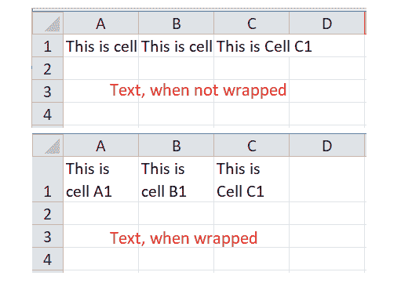

## Excel 中的自动换行快捷方式

在 Excel 中，有多种方法可以执行任何特定的任务。同样，它也支持单个任务的多个快捷方式。在 Excel 中使用换行快捷方式时，有四种重要的方法，即:

*   使用键盘快捷键换行
*   使用快速访问工具栏快捷方式换行
*   使用功能区中的快捷方式换行
*   使用单元格格式快捷方式换行

让我们详细讨论每种方法；

### 使用键盘快捷键换行

在 Excel 中执行任何特定任务的最快方法是使用键盘快捷键。Excel 几乎对每项任务都有特定的快捷键。如果 Excel 中没有特定任务的特定快捷键，Alt 快捷键方法在大多数情况下都有效。

使用环绕文本功能时，我们在 Excel 中没有任何明确的快捷键。因此，我们需要使用 Alt 键方法。根据这种方法，我们首先需要按下并释放 Alt 键，然后按下屏幕上显示的或与所需选项相关联的一系列特定键。要使用键盘快捷键来使用环绕文本功能，我们需要按下并释放 Alt 键，然后逐个按下 H 键和 W 键。

让我们用示例数据来试试这个快捷键:

**使用环绕文字键盘快捷键的步骤**

假设我们有以下 Excel 表格，其中 A1、B1 和 C1 单元格包含相对较长的句子。这意味着句子的长度比相应单元格的默认宽度相对更长，如下所示:

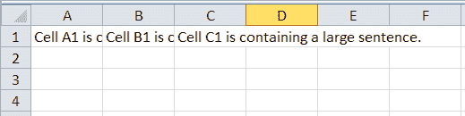

在上图中，单元格中的句子在所有单元格中都不完全可见，并且看起来不合适，因为它与其他单元格重叠。但是，我们可以更改单元格的格式，并使用环绕文本功能使文本在屏幕上可见。要使用自动换行功能，我们必须执行以下步骤:

*   首先，我们需要选择一个或多个具有更多字符的数据的单元格，以便在默认单元格宽度内可见。在我们的示例中，我们选择了单元格 A1、B1 和 C1。由于单元格是相邻的，我们可以按住 shift 键并单击单元格 A1 和单元格 C1 来选择所有相应的单元格。此外，我们可以使用 Ctrl 键代替 Shift 键来选择 Excel 工作表中不相邻的单元格。
    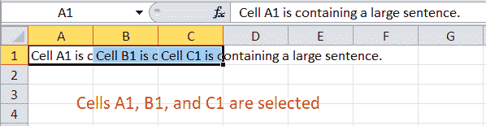
*   一旦选择了所需的单元格，我们必须按下并释放 **Alt** 这将激活 Excel 中的快速快捷功能。我们可以在 Excel 窗口内的所有选项上看到各种具体的快捷键，如下图:
    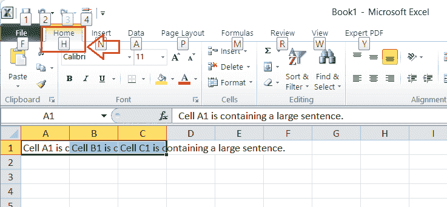
    我们必须按下 **H 键**才能快速选择首页选项卡。
*   在我们按下 H 键后，我们将看到主页选项卡下的选项。在这里，我们将看到环绕文本选项与**键 W** 相关联。因此，我们必须点击键盘上的 W 键。
    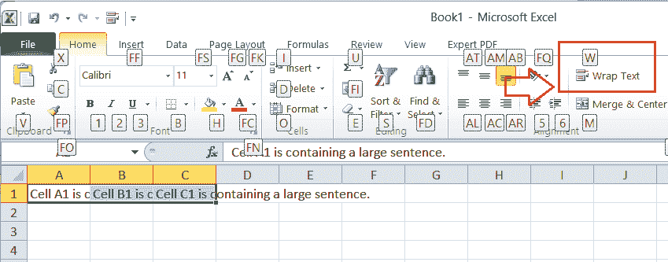
    我们一点击 W 键，选中的数据就会瞬间被包裹起来，如下图为我们的示例 Excel 工作表:
    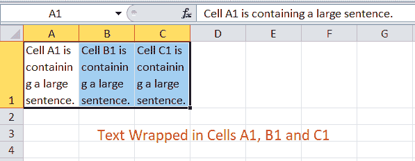

这样，我们就可以使用快捷键 **Alt + H + W** 在 Excel 中换行。

### 使用快速访问工具栏快捷方式换行

另一种快速使用环绕文本功能的方法包括直接从快速访问工具栏(QAT)快捷“环绕文本”命令。但是，我们需要先在 QAT 中添加这个快捷方式，然后才能开始使用它。添加后，我们可以在快速访问工具栏的任何 Excel 窗口中任意多次使用“自动换行”快捷方式。

**在快速访问工具栏中添加环绕文本快捷方式**

*   首先，我们需要从顶部导航进入**首页**选项卡。在这里，我们会看到**环绕文字**的选项，如下图所示:
    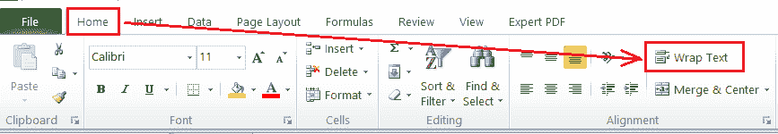
*   我们需要在环绕文本选项上用鼠标右键点击按钮，它会显示一个包含一些选项的列表。在列表中，我们必须点击选项“**添加到快速访问工具栏**”。
    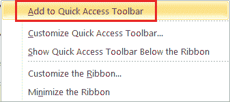
*   一旦我们从列表中单击相应的选项，**环绕文本快捷方式**将立即添加到快速访问工具栏中。看样子:
    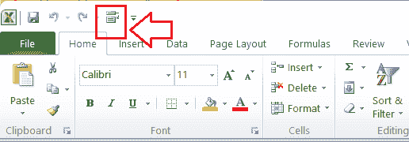

**使用 QAT 中的环绕文字快捷方式的步骤**

一旦将环绕文本快捷方式添加到快速访问工具栏，我们需要单击快捷方式来环绕文本。但是，我们必须选择我们希望在其中换行的单元格，然后只需要从 QAT 中单击相应的快捷方式。

让我们实际尝试一下这条捷径:

假设我们有下面的 Excel 表，其中单元格 A1 和 B1 有大句子:

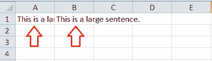

我们需要执行以下步骤来包装示例 Excel 工作表中的文本:

*   首先，我们需要同时选择单元格 A1 和 B1，如下图:
    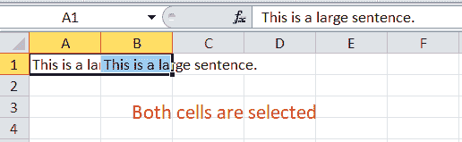
*   选定单元格后，我们需要将光标移动到快速访问工具栏，然后单击我们使用上述方法添加的环绕文本快捷方式。
    
*   从快速访问工具栏中单击快捷方式后，将排列选定的单元格并包装数据。
    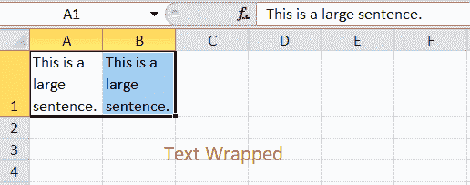

使用这些步骤后，我们的示例表如下所示:

在上面的图像中，我们可以看到文本现在被包装，因此它只保留在单元格宽度内。然而，细胞的高度是这样安排的。

### 使用单元格格式快捷方式换行

在 Excel 中换行的另一个快捷方式是使用“单元格格式”窗口。我们可以使用快捷键 **Ctrl + 1** 快速启动格式单元格窗口。然后我们可以从窗口中选择包装文本选项，我们选择的数据将被立即包装。

考虑下面的 Excel 表，其中单元格 A1 有一个长句子，溢出到其他单元格 B1、C1 等。

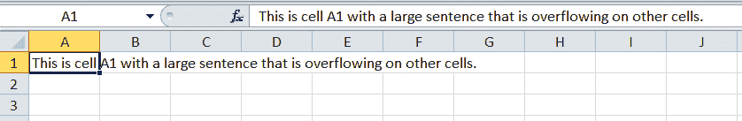

我们需要执行以下步骤来使用格式化单元格快捷方式换行:

*   首先，我们需要选择单元格 A1，因为它包含必须换行的文本。选择单元格 A1 后，我们需要使用键盘按快捷键 Ctrl + 1。我们一按快捷键，就会得到格式单元格窗口，如下图:
    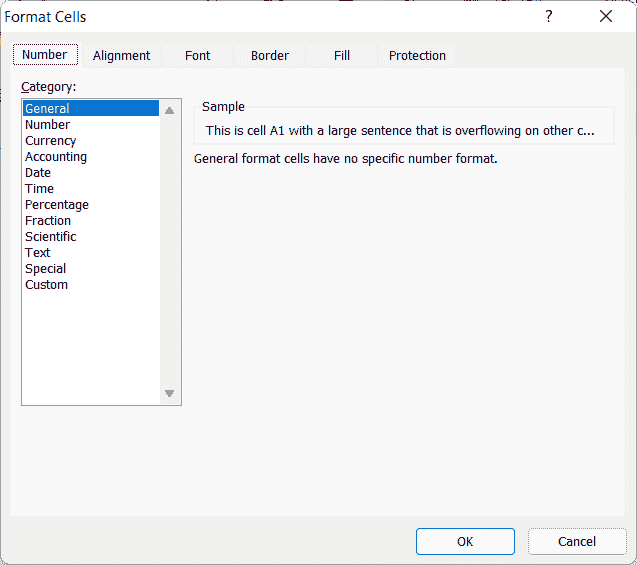
    需要注意的是，数字键‘1’必须只能从键盘区按，不能从数字键区按。
*   在“设置单元格格式”窗口中，我们需要单击“对齐”选项卡，并选中“环绕文本”选项前的复选框。选中/标记该框后，我们必须单击“确定”按钮。
    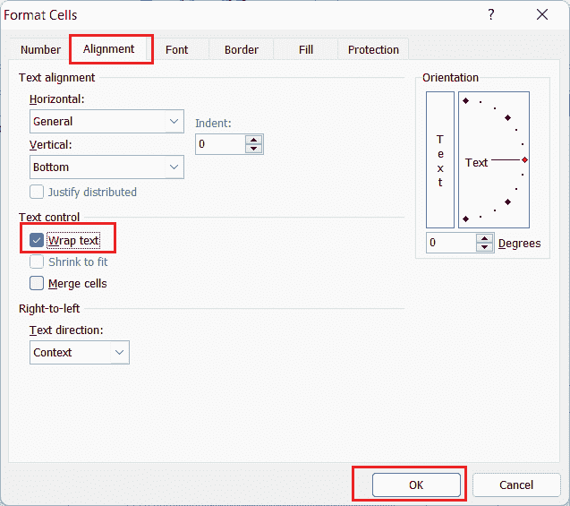
    我们选中的数据会瞬间被包裹，如下图所示:
    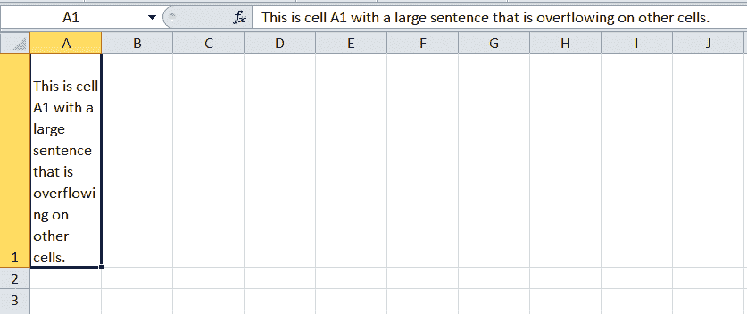

在上面的例子中，我们可以看到文本已经被包装。然而，它看起来仍然不合适，因为一些拼写(即溢出)在两行中断裂或扩展。因此，我们必须通过拖动相应的单元格标题来调整单元格宽度，并相应地调整文本。

在我们的示例中调整单元格宽度后，它看起来更好:

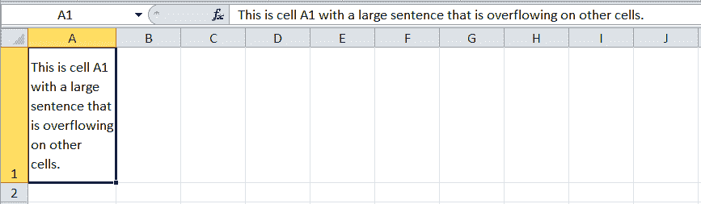

### 使用功能区中的快捷方式换行

使用功能区中的快捷方式是在 Excel 中访问所需功能的典型方式。要换行，我们必须首先单击“主页”选项卡，然后从那里选择“换行”选项。与上述方法一样，我们需要在使用功能区中的“环绕文本”快捷方式之前，在 Excel 工作表中选择所需的单元格。

一旦选择了所有需要的单元格，我们就可以直接点击相应的快捷方式，我们会很快将文本打包。

这就是我们如何使用 Excel 换行快捷方式在 Excel 工作表中换行的方法。

## 调整行高以调整所有换行文本

每当我们在 Excel 中换行时，额外的一行会放在单元格中第一行的底部。因此，我们可能看不到完全换行的文本，尤其是行高较少的时候。在这种情况下，调整高度是最好的解决方案。

虽然我们总是可以使用拖动功能通过所需行的底部边缘手动调整行高，但最好的解决方案是使用自动调整行高。我们可以通过导航“主页”选项卡，然后单击“格式”下拉列表来访问该选项，如下图所示:

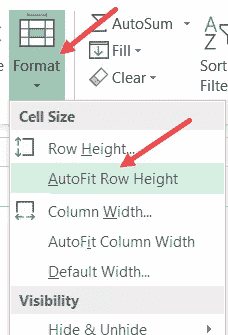

在使用自动调整行高之前，我们必须选择单元格中需要调整高度的所有单元格。

## 插入换行符

Excel 允许用户调整包装数据中每行的文本断点。具体来说，它有助于在活动单元格内的任何所需点开始新的文本行。我们可以在所需的单元格中插入换行符，并根据需要调整单元格的文本。

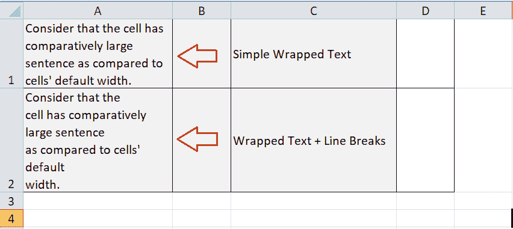

要在单元格中插入换行符，我们必须执行以下两个步骤:

*   首先，我们需要在任意特定单元格上双击**，在该单元格中插入一个换行符。或者，我们可以选择单元格并单击 F2 功能按钮。**
***   一旦光标在单元格中开始闪烁，我们需要**将光标**移动到句子中我们希望换行的特定部分。我们也可以直接用鼠标点击特定的点。最后，我们必须同时点击 Alt 键和 Enter 键，即键盘上的 **Alt + Enter** 按钮。**

 *** * ***