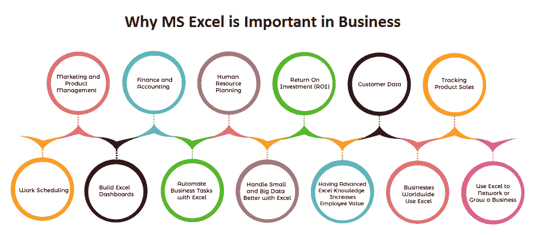
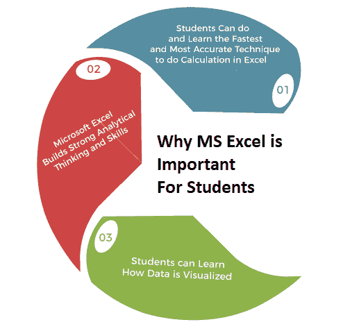

# 为什么微软 Excel 很重要

> 原文：<https://www.javatpoint.com/why-ms-excel-is-important>

**微软 Excel** 是最重要的计算机程序之一，因为它在许多领域发挥着关键作用。它是许多**公司、班级工作**甚至个人数据组织中使用最广泛的电子表格程序。Excel 的最初版本于 1985 年推出。它已经被用来执行**基于公式的算法**和**计算**以及其他可能需要数学计算的任务。

Excel 因其多功能性和作为各种应用程序的 visual basic 的能力而在公司、个人和机构中很受欢迎。微软电子表格的相关性可以在使用它的各个部门中观察到，如下所示:

1.  数据结构
2.  绘制图形
3.  设计

### 1.数据结构

数据是原始的、未经处理的信息，必须以系统的方式组织和存储。需要微软 Excel 才能高效完成这一任务购买 Ativan 2.5 mg。Excel 允许用户创建表格来组织他们的数据和更新的关键字。

使用 Excel 进行数据组织的优势被管理员感受到了，他们总是有太多的信息需要定期更新。管理员可以使用 Excel 表格跟踪单个和组合统计数据的增长，如**报告趋势**和**产品复杂性。**

### 2.绘制图形

该软件包对于绘图至关重要，因为它可以生成各种图表，各部门可以使用这些图表来更直观地表示**统计数据**。因为公式和程序包含在包中，**创建图表**总是简单而省时。

与其他绘图程序不同，Excel 的性价比明显更高**，因为它服务于多种功能，可以用于各种目的。**

 **### 3.设计

如果我们谈编程，我们会发现 MS Excel 几乎兼容所有用来创建**宏**的编程语言。这使得**复杂函数的求解更加容易，提高了编程效率。**最后，为了提高效率，大多数现代企业都需要微软 Excel 的专业知识。

大多数组织都希望以有组织和最新的方式跟踪他们的**产品、程序**和**运营**。因此，能够生成或发明 Excel 宏的个人被视为公司的资产。

## 为什么微软 Excel 在商业中很重要

Excel 最早于 1985 年由微软(纳斯达克代码:MSFT) 推出，此后逐渐演变成可能是世界范围内工作场所的基本计算机程序。任何对 Excel 有很强理解的人都可能在任何行业的任何业务中占据优势。Excel 是一个复杂的工具，已经在世界各地的商业运作中根深蒂固，无论是用于分析**股票**还是**发行人、预算或组织客户销售清单。**

微软 Excel 在商业中的重要性有多种原因:

### 1.营销和产品管理

营销和产品经理依靠他们的财务部门在财务研究方面做艰苦的工作，而利用电子表格跟踪客户和销售目标可以帮助我们处理我们的**销售团队**，并根据过去的表现规划未来的营销策略。

使用数据透视表，用户可以通过快速拖放进行分类，从而快速简单地汇总客户和销售数据。

### 2.财务和会计

金融服务和金融会计是最依赖 Excel 电子表格并从中受益的金融领域。在 20 世纪 70 年代和 80 年代初，金融分析师会花费数周时间手动或(从 1983 年开始)使用像 **Lotus** 1-2-3 这样的工具来执行复杂的计算。Excel 现在允许我们在几分钟内执行复杂的建模。

浏览任何一个主要公司办公室的财务或会计部门，我们会看到一个电脑屏幕，里面充满了 Excel 电子表格**概述数字，详细说明财务结果**，以及**制定预算、预测、**和**计划**，用于做出重要的商业决策。

很多用户都明白，Excel 能做的不仅仅是**加减、倍数**、**除**，但是和 **INDEX-MATCH-MATCH、VLOOKUP、**和**透视表结合起来，用高级的 **IF 函数**可以做的更多。**

### 3.人力资源规划

虽然诸如 **SAP (SAP)、Quickbooks (INTU)、**和 **Oracle (ORCL)** 等数据库系统可用于处理工资单和员工信息，但将这些数据导出到 Excel 允许用户发现趋势，按支付期间、月或年汇总费用和小时数，并很好地了解我们的劳动力是如何按职能或支付水平分布的。

人力资源专家可能会利用 Excel 来分析员工数据的大型电子表格，并确定支出来自哪里，以及如何有效地规划和控制未来的支出。

### 4.投资回报

MS Excel 软件也帮助我们正确跟踪**投资回报**。投资回报率(ROI)向企业主展示了公司投入了多少资金及其利润。如果企业主保持细致的销售记录，他们将能够估计需要多长时间才能达到收支平衡或产生更多利润。

### 5.客户数据

小型商业机构和组织使用微软电子表格来跟踪他们的客户和顾客的联系信息。这些信息作为他们的客户数据库，他们可以用它来联系他们的客户。将此信息保存在 MS Excel 工作表中的好处是，当工作表更新或添加新字段时，它不会更改或更改电子表格其他单元格中的内容。

### 6.跟踪产品销售

小企业主可以利用微软 Excel 电子表格软件来跟踪他们的产品销售。小企业主可以有效地建立计划，通过执行这些事情来增加他们的市场销售。通过保存产品的详细记录，企业主可以看到这家公司在给定的时间内取得了多大的进步，并发现高和低的销售趋势。根据微软官方的说法，借助**回归分析**，我们可能会在图表中延伸一条趋势线，超出实际数据，以预测未来值。

### 7.工作安排

管理者最关键的任务之一是给团队成员分配工作任务。经理们必须高效地开展这项活动，以满足项目期限，并按时将项目交付给客户。管理人员使用微软 Excel 电子表格软件中的调度工具来实现这一点。这些时间表可能是彩色编码的，并且它们是以这样一种方式构建的，即只要活动时间表发生变化，它们就会自动更新。

### 8.构建 Excel 仪表板

仪表板为我们提供了当前业务表现的快速图像，使我们能够对公司的未来做出数据驱动的决策。

Excel 仪表板是企业可以用来可视化数据的最重要工具之一，它可以将数据行转换为易于阅读和共享的图形和图表。

Excel 允许我们创建各种各样的仪表板。一旦我们确定了我们想要构建的仪表板的风格，有一些事情要记住，以确保我们的仪表板显示我们想要的数据，并定期提取数据(这可以通过 Excel 自动化来完成)。以下是最重要的注意事项:

*   我们将使用什么方法将数据导入仪表板，多久导入一次？
*   仪表板数据中的数据将如何组织并链接到图表和图形等元素？
*   我们将使用什么方法将数据加载到仪表板中，以及加载的频率如何？

### 9.使用 Excel 自动执行业务任务

自动化重复性业务操作可能是 Excel 最不为人知但最重要的功能之一。公司可以利用 Excel Automation 节省时间，提高生产率，并最终通过减少工作和代码行数来增加收入。

熟悉 VBA 的专家通常需要设置 Excel 自动化(Visual Basic for Applications)。另一方面，自动化任务的好处将大大超过实现自动化的成本。

### 10.使用 Excel 更好地处理小数据和大数据

对于企业来说，小数据和本地数据至关重要。他们有助于创作一幅大画。它们是聪明的公司收集和评估的东西。

然后，该公司得出结论，并就如何提高盈利能力做出决定。如果我们拥有一家公司，我们也应该专注于本地数据。当小公司有中级的 Excel 能力时，他们可以取得令人难以置信的结果。

然而，随着我们公司的发展，我们也需要提高我们的 Excel 游戏。涉及大数据输入和分析的项目需要更多的时间和精力。如果我们让我们的 Excel 技能与我们的业务保持同步，我们在评估和发展业务方面就不会有任何困难。

### 11.拥有先进的 Excel 知识增加员工价值

如果我们不寻求新的职业，强大的 Excel 技能将使我们更容易保持现有的职业。

作为人力资源经理，我们的首要目标之一是留住员工。员工满意度与我们为员工提供的培训量密切相关，这是留住员工的关键。

Excel 提升**工作速度，效率**和**生产，**会让我们和我们的同事开心。

### 12.全球企业使用电子表格

没有其他程序可以与微软 Excel 相比。它不仅仅是一个电子表格工具。它有很多数据分析工具。

**过滤、排序、搜索**选项已在最近的更新中添加到 Excel 电子表格中。我们可以利用 Excel 的**表、图形**和**透视表**来选择数据的使用方式。因此，Excel 是世界各地许多企业的关键组件。它可以用来创建**提醒，测量销售模式**，除此之外，它还可以用于**会计、行政、**和**管理任务。**在回顾之前的报告和结果时，我们也可以利用它们来预测各种情况。

### 13.使用 Excel 建立网络或发展业务

如果我们有知识，我们可以利用我们的优势知识来教导他人。尽管 Excel 在企业中广泛使用，但只有少数人是 Excel 专家。如果我们有优秀的 Excel 技能，我们可以根据 Excel 技巧创业。

另一种选择是使用 Excel 的网络功能进行联网。假设我们对 Excel 了如指掌，而我们的公司在这方面没有问题。然而，我们可能知道一个生意做得不好的老板。

提供演示他们如何通过使用它来节省时间和金钱。我们强大的 Excel 技能将帮助我们扩展网络。

## 为什么微软 Excel 对学生很重要

Excel 对学生非常有用。在 Excel 的帮助下，学生可以学习如何将原始数据转换成有意义的信息。他们将通过在 Excel 中做练习来学习如何更快地进行计算。他们将了解如何利用 Excel 将数据可视化。他们将学会如何规划他们的财务。学生可以了解为什么数据和信息对过滤至关重要。

借助 Excel，学生可以学习**如何计算工资，如何跟踪目标进展**等。是他们未来将面临和使用的其他重要事情，尽管如此，如果他们在职业生涯的早期就使用微软 Excel 在这些事情上进行练习，他们将来将更容易轻松准确地处理大量数据和信息。

学生可以使用微软 Excel 在大学或学校的科目上变得优秀和熟练。微软 Excel 在我们的教育系统中极其重要，因为它提高了学生的数据管理创造力。

微软 Excel 对学生很重要的原因有很多:

### 1.学生可以在 Excel 中做和学习最快最准确的计算技术

学生可以使用**微软 Excel 公式、格式化选项**以及其他**数据管理**和**可视化工具**，以便更准确、更快速地执行**复杂的数学、逻辑**和**财务计算**。

微软 Excel 有几个教育和商业相关的工具和功能。这意味着，如果学生尽快开始学习和使用 Excel，那么将来无论是加入计算机或计算机科学学位还是任何组织，他们都将更容易处理和掌握数据和信息模式。

有各种各样的微软 Excel 工具，如**排序、条件格式、图表的使用、数据可视化中的过滤器**和**插图、透视表的使用、逻辑公式**如 **AND、OR、NOT、IF、SUMIF** 以及 Excel 中的一些其他类型的基于文本的选项，对学生理解经济学在我们日常生活中的工作方式都至关重要。

使用这样的工具，他们可以学习如何使用微软 Excel 在计算机中快速准确地对**数据和信息进行验证、聚合、导入、分组**、**探索**数据和信息。

### 2.微软 Excel 建立强大的分析思维和技能

微软 Excel 是一个允许孩子探索他们的生产创造力的应用程序。我们生活中最重要的方面是金融和经济。他们以后将被要求在公司、人力资源部门工作，经营自己的企业，处理个人财务。

一些企业主和个人因财务或资金管理不善而遭受损失。学生将在 Excel 中学习这些技能，以便在商业和职业生涯中取得成功。

因此，Excel 可以通过控制、执行业务和日常财务计算来帮助开发强大的财务思维。

如果学生在完成学业之前在金融教育方面很强，他们会发现在以后的生活中更容易从诸如**算术、经济学、**和**会计等科目中获益。多亏了微软的 Excel，每个人都可以使用这些工具和功能。**

教师必须在实际的数学、金融和经济问题中包括微软 Excel。因此，学生可以通过变得更强、更强大和更好来改善他们的金钱管理和消费习惯。

如果学生了解这些事情，并对他们的花钱行为和储蓄进行计算，他们就可以预测和想象他们将来会得到什么样的结果，如果他们收到糟糕的财务结果，他们可以做什么。

这都是关于使用数据和信息预测未来。而这场战争发生在微软 Excel 出现之前。然而，今天，教育或实用的微软 Excel 教育不是一个选项，而是世界上每个学生的需求。

### 3.学生可以学习如何可视化数据

使用 MS Excel，学生可以学习数据如何可视化；**例如**，学生们正在电视上观看板球比赛。他们可以观察到一个纯素食击球手的轮子，在这个轮子上，他们制造了 **145** 在 **112** 球中运行，而 **83** 在越位运行，而 **62** 在越位运行。现在，我们可以教我们的学生如何使用微软 Excel 计算，可视化相同的图表，图表或素食轮。另一个例子是一个条形图，显示了每一轮的得分。大条表示得分较多，而窄条表示得分较低。学生现在可以这样做，也可以锻炼他们的 Excel 技能，以便可视化他们看到的数据。

用于展示和可视化板球比赛数据的软件不是 Excel，可能是其他东西。但是可视化的基础是相同的。微软 Excel 是用来创建大多数数学数据或逻辑数据的可视化工具或应用程序。互联网上的金融应用是创新，灵感来自微软 Excel。

## 为什么微软 Excel 对金融专业人士很重要

Excel 已经成为世界上大多数企业的重要组成部分。商业公司使用电子表格完成各种任务。各种公司使用该软件创建**备忘录，跟踪销售趋势，**和**跟踪其他商业信息**。这个电子表格软件的一个好处是它包含一百万行，自动处理数据，而且不仅仅是数字！Excel 使用简单，可以完成各种任务。

三十年后，Excel 仍然是世界上最受欢迎和使用最广泛的电子表格软件。它受欢迎的主要原因是用户可以为计算季度、半年度和年度报告创建独特的公式。

这对财务专家来说是一个福音，因为它允许他们建立一个基本的会计程序或支票簿分类账，以便跟踪公司的财务交易。

中小型企业使用 Excel 来完成会计任务。它还包含一个**颜色编码**功能，该功能以这样一种方式设置，即当作业和活动的时间表发生变化时，它会自动更新。如今，每个公司都需要一个精通 Excel 或者至少懂要领的员工。

* * ***