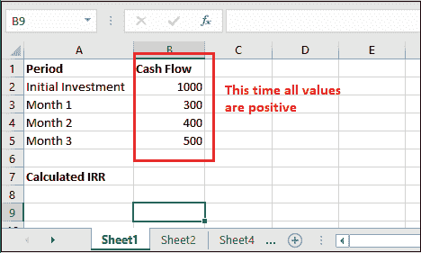

# Excel 内部收益率公式

> 原文:[https://www.javatpoint.com/excel-irr-formula](https://www.javatpoint.com/excel-irr-formula)

内部收益率是指内部收益率。Excel 提供了 IRR 公式来计算一系列现金流的内部收益率。此公式属于 Excel 财务函数类别。可以直接应用到你的 Excel 数据中，计算内部收益率。

IRR()函数对于计算内部收益率非常有用，有助于财务建模。本章将详细阐述内部收益率函数及其用法，并举例详细学习该函数。就像内部收益率一样，你听过 MIRR 和 XIRR 这个术语。

## IRR()函数是如何工作的？

Excel 中有三个内置函数计算内部收益率，IRR()就是其中之一。用户会很高兴知道——这个函数在所有的 Excel 版本中都可用。IRR()允许用户计算内部收益率，并以百分比值的形式返回计算结果。

*   在所有现金流之间，总是有相等的时间间隔。
*   每一次，项目产生的利润都以内部收益率进行再投资。

正如我们上面定义的，内部收益率术语指的是**内部收益率，**，其中术语**内部**表示内部收益率()函数只考虑内部因素。有时，它也被称为 ***贴现现金流收益率。***

### 内部收益率()语法

Excel 的 IRR()函数有以下语法，该函数接受两个参数。其中一个是必需的，另一个是可选参数。

```

=IRR(values, [guess])

```

### 争论

**Values -** Values 参数是表示一系列现金流的一组值。这是一个必需的参数，现金流包括净收益值和投资。Values 参数以单元格区域的形式提供。**如** B2:B7

**【猜测】-** 是 IRR()函数中可选提供的另一个参数。这是一个由用户猜测的接近预期内部收益率的数字。基本上，它是预期内部收益率的估计值。默认情况下，它是. 1(表示 10%)。

### 返回值

函数的作用是:返回内部收益率。这个函数返回的值是百分比形式的，这意味着它返回一个百分比值。

### 目的

使用该函数的目的是计算一系列流的内部收益率。这个函数返回的结果是百分比的形式。这意味着它返回一个百分比值。

#### 提示:用户应该熟悉内部收益率的数学版本，这样他/她就可以轻松更好地学习它。

**注**

1.  值参数，它是一个值数组，必须包含至少一个正值和一个负值才能计算内部收益率。
2.  请记住-**值参数**中的值应该按时间顺序排列。这意味着它遵循价值顺序来解释现金流。
3.  函数只处理值参数中的数字。其他类型的值(如文本、空单元格或逻辑值)将被忽略。
4.  有时使用 IRR()函数时，会返回 **#NUM** 错误。它发生在-

    1.  如果计算内部收益率的值不包含至少一个正值和一个负值。
    2.  20 次迭代后计算失败。如果仍然无法找到内部结果比率的结果，则返回#NUM 错误。

## 内部收益率函数的局限性

IRR()函数是评估资本项目回报率的有用函数。由于 IRR()函数很有用，但它也有一些局限性。这些限制是-相同的再投资率，多重结果和相对衡量。

MIRR()和 NVP 函数解决了这些限制。

1.  **相同的再投资率**
    IRR 有一个问题:它总是假设一个项目产生的所有现金流都以与 IRR 本身相等的比率进行再投资。
    此问题由 MIRR()函数解决，该函数指的是修改后的内部收益率。它允许用户定义不同的再投资率和融资。
2.  **多个结果**
    正如我们告诉你的，必须有一个正值和一个负值在交替顺序中计算多个内部收益率。就像上面的限制一样，这个问题通过内部收益率的替代方案来解决:MIRR()函数。它是专门设计的，只产生一个速率。
3.  **相对度量**
    结果不考虑绝对值，IRR()函数考虑百分比。
    在这种情况下，NPV 就是它的解决方案。它是一个比内部收益率更好的矩阵，因为它考虑了承担一个项目所获得或损失的实际金额。

## IRR()函数的示例

我们将尝试定义每个有用的例子，帮助您学习这个函数，并使您能够轻松计算内部收益率。

假设我们用初始投资和现金流获取了以下数据，使用 Excel IRR()函数计算内部收益率。

| 时期 | 资金流动 |
| 最初投资 | -$1000 |
| 第 1 个月 | $300 |
| 第 2 个月 | $400 |
| 第三个月 | $500 |
|  |  |
| **计算的内部收益率** | **8.90%** |

使用以下公式公式=内部收益率(B2:B5)

确保为您要放置或使用 IRR()公式的单元格设置了**百分比**公式，以便正确显示结果。(Excel 会自动为您这样做。)

现在，在 Excel 表中实现这个例子，并计算这个数据的回报率。

### 例 1

在这个例子中，我们将使用 IRR()函数找出给定现金流值的内部收益率。请注意，在本例中，我们没有提供猜测(可选参数)。

现在，仔细按照步骤学习 IRR()函数及其正确工作。

**第一步:**我们有以下数据，有初始投资和区间。


这里，一个值为正，另一个值为负。

**步骤 2:** 转到一个空单元格，用它们的参数写出 IRR()公式。对于我们的数据集，公式如下-

=内部收益率(B2:B6)


**第三步:**点击**进入**键，计算出的内部收益率()作为结果返回一个百分比值。


请注意，它已经返回了一个值，即 9%。意味着上述数据的内部收益率为 9%。

### 例 2

我们用上面例子中使用的相同数据做了另一个例子。但是这一次，我们将初始投资值更改为负值，现在我们将使用 IRR()函数找出给定现金流值的内部收益率。

现在，按照步骤操作，看它会返回#NUM！错误。

**第一步:**我们现在将所有负值改为正值，看看结果。



**第二步:**现在，我们将计算相同数据的 IRR，但这次初始投资包含一个正数(1000)。


**第三步:**看它有没有返回#NUM！错误，因为至少有一个值必须是负数，一个值必须是正数。


### 例 3

现在，再举一个计算内部收益率的例子来学习 IRR()函数，并且不要对此有任何疑问。在这个例子中，我们将采取初始投资价值 100 万英镑和十年收益。以下是计算内部收益率的步骤-

**第一步:**是本例 Excel 表中存储的数据，初始投资为-70000，五年现金流。


**第二步:**对于我们的数据集，公式如下-

=内部收益率(B2:B12)

转到一个空单元格，并在其中写入 IRR()公式。


**第三步:**点击**进入**键，得到计算出的内部收益率百分比结果。


请注意，它已经返回值 a，即 9%。这意味着上述数据的内部结果率为 9%。

**第四步:**我们试着计算一下每年之后的内部收益率，看看它会有什么回报。所以，我们为它设计了一个新的专栏。


**第五步:**现在，把计算一年后给出的公式连同初始投资一起写下来。

=内部收益率(B2:B3)


**第 6 步:**已经返回计算出的内部收益率。


现在，同样计算每年的内部收益率，看看我们计算的结果。


## 内部收益率函数的基本术语

您可能听说过 MIRR 和 XIRR 这个术语，它们带有 IRR()函数的一些高级功能。它们也被用来产生回报率。IRR()函数有几个重要的术语，在使用这些函数时应该知道。

### 需要负现金流值和正现金流值

包括 IRR()在内的所有三个函数都需要至少一个正现金流值和一个负现金流值进行计算。通常，计算回报率的 Excel 数据的第一个数字是负数，通常指的是初始投资。

### 输入猜测

猜测可以被称为起始利率，IRR()函数从该利率开始递增计算内部收益率。IRR()函数允许用户输入猜测值(期望值)，因为它是一个可选参数。

Excel 允许用户为内部收益率函数计算多达 20 个周期，直到找到 0.00001%以内的结果。如果在 20 次迭代中没有找到结果，Excel IRR()将生成#NUM 错误。

### 如果你不提供猜测

如果不提供猜测值(这是 IRR()函数中的可选参数值)，Excel 会自动假设 0.1 (10%)作为初始猜测值。

### 月收益率

如果要计算月现金流的内部收益率，结果必须乘以 12 才能得出年收益率。但是如果我们谈论 XIRR 函数，它会自动产生年收益率的结果。因此，用户不需要将结果乘以 12 作为 IRR()函数。

如果计算年现金流收益率的内部收益率，则不需要将结果乘以任何值。

### #在错误中

IRR()函数采用**猜测**参数，用户可以在该参数中提供内部收益率的期望值。如果返回的结果不接近您定义的期望值，该函数返回 **#NUM！错误。**

在这种情况下，Excel 建议用户使用不同的猜测期望值再试一次。

### 注意

IRR()函数与净现值函数非常相似。

* * *