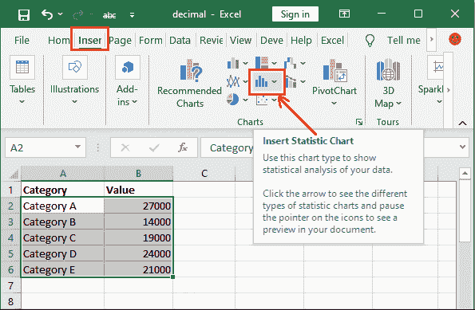

# Excel 帕累托图

> 原文:[https://www.javatpoint.com/excel-pareto-chart](https://www.javatpoint.com/excel-pareto-chart)

一张**帕累托图**也被称为**帕累托图。**是基于帕累托原则的统计图，表示订单中的主要原因/问题。帕累托图是一种包含竖线和横线的直方图。或者你可以说帕累托图是条形图和折线图的结合。

使用帕累托图，您可以执行帕累托分析。它是 MS Excel 的高级类型的图表，一般不常用，但有时候你需要它。您可以在直方图类别图表下找到此图表。本章将向您展示如何创建和使用帕累托图。

在这一章中，我们将讨论与帕累托图相关的各种观点以及例子。这些是-

*   [帕累托图的类型](#Types)
*   [何时使用帕累托图？](#use)
*   [帕累托图如何帮助分析问题？](#issue)
*   [什么是帕累托分析？](#analysis)
*   [创建一个简单的帕累托图](#Create)
    *   [设置图表标题](#title)
    *   [在每个条上显示精确值](#Display)
    *   [修改数值](#Modify)
    *   [删除数值](#Delete)
*   [创建帕累托图分析投诉](#complaints)

记住一件事，帕累托图在 Excel 2016 和更高版本中可用。如果您没有 2016 或更高版本，您可以通过组合柱形图和折线图来执行相同的过程。

帕累托图=柱形图+折线图

*   [用柱形图和折线图](#Analyze)分析问题

## 帕累托图的类型

Excel 中有两种类型的帕累托图-

1.  静态帕累托图
2.  动态帕累托图

### 静态帕累托图

静态帕累托图是表示整个数据的简单图表。不存在允许用户查看对应于特定值的数据的选项。您可以创建一个帕累托图来分析数据并找出问题。

### 动态帕累托图

动态帕累托图是一种图表，用户可以在其中调整值并查看结果以进行实时更新。在动态图表中，Excel 用户可以看到对应于特定值的数据。

我们将通过不同的例子来定义帕累托图的几种方式和类型。

## 何时使用帕累托图？

帕累托图可以被认为是一个强大的决策和问题分析/解决工具。它可以用于各种情况，例如-

*   如果有人想用图形化的方式表示数据来分析问题。
*   当他们需要组织数据以找出缺陷时，可以使用它。
*   当需要根据严重程度确定任务或缺陷的优先级时。比如根据对一个数据是这个的组织的影响。
*   如果有人需要分析问题。

在下面的示例中，您将了解如何使用帕累托图，以及它如何有助于分析数据和发现问题(如果有)。

## 帕累托图如何帮助分析问题？

帕累托图是一种以可视化方式表示数据的图形方式。它通过按顺序排列来帮助用户找到问题。它有助于首先解决最大的问题，然后逐一解决所有其他问题。

以下是三个要点，通过这些要点，您将了解此图表将如何帮助用户分析问题并解决问题。

1.  帕累托图是一种通过按降序排列缺陷来更好地解释缺陷的图表。
2.  意思是-帕累托图把问题按降序排列。因此，最大的问题处于最高优先级，最小的问题处于最低优先级。它自动按降序排列帕累托图的竖线。
3.  因此，用户可以很容易地找到并解决最大的问题，首先在顶部找到它，然后将它放在最高到最低的优先级。

## 什么是帕累托分析？

你可以把帕累托分析理解为——它指出 80%的问题是由 20%的因素造成的。你也可以认为，通过对 20%的因素(这是问题的原因)进行处理，你可以解决 80%的问题。这就是为什么这种方法被称为 80/20 法则。

## 创建一个简单的帕累托图

我们将举一个例子，我们将创建一个基本的帕累托图。借助这个图表，我们将得到一个图表的概述，为什么以及如何在微软 Excel 中使用它。以下是创建帕累托图的数据。


**第 1 步:**选择给定的数据，通常选择一个文本列和一个数字列。


**第二步:**进入**插入**选项卡，点击图表组下的**插入统计图表**下拉按钮。

**插入>插入统计图**



**第三步:**现在，选择直方图类别下的**帕累托图**，并将其插入到你的 Excel 表格中。


#### 提示:您也可以选择插入>推荐图表>所有图表来创建帕累托图。

**第 4 步:**将帕累托图插入 Excel 表中。图表会自动将对应于数字值列的文本列作为标签。


在这里，您可以看到类别按照值的递增顺序进行了洗牌。

**设置图表标题**

图表带有默认标题，即图表标题。Excel 允许用户随时随地提供新的图表标题。

**第五步:**点击图表标题进行编辑，根据数据提供新标题。


该图表是根据数据自动设置的值。您不需要像其他图表那样努力设置图表标签和类别。

**在横条上显示精确值**

通过使用相关选项，您可以使您的帕累托图更具信息性。到目前为止，你已经通过条形图看到了价值，但它们没有显示确切的价值。

**第六步:**双击插入的图表，将在 Excel 的右窗口中启用一些选项。点击**图表选项**下拉按钮，从列表中选择**系列数据标签**。


**第 7 步:**在此选择**标签选项**。


**第 8 步:**在这里，展开**标签选项**，然后勾选**值**复选框。它会将精确的值添加到栏中的每个栏。


**第 9 步:**请注意，每个条形图现在都显示了每个条形图的精确值以及视觉表示。


该图表现在提供了更多信息，并定义了 Excel 数据的每个参数。

**修改数值**

如果修改 Excel 数据中的值，竖线会自动改变长度。所以，我们将把**C 类的值从 19000 修改为其对应单元格中的 25500** 。

**第 10 步:**我们已经更改了 C 类单元格对应的值，因此条形图也发生了变化。


如果您注意到，您会看到当类别 C 值为 19000 时，其相应的条形图位于帕累托图右侧的第二位。但当值变为 25500 时，C 类栏从右侧移到第四位。

**删除数值**

如果您删除任何类别值，其相应的竖线也将从图表中删除。

**第 11 步:**看到了吗——这次我们去掉了 excel 数据里面的**E 类**值。因此，它在图表中的相应条也被删除。


这样，您就可以对 Excel 数据使用帕累托图。

### 创建静态帕累托图来分析投诉

让我们以一个真实的场景为例，我们将创建一个帕累托图来分析数据。

**场景**

像亚马逊这样的电子商务公司，即使过了很多年也不那么受欢迎了。因此，该公司首席执行官希望找出背后的原因，即为什么用户没有访问和使用他们的网站。他做了一项调查，并听取了顾客对不使用产品的反馈。他把这些数据都收集在一张 Excel 表格里，如下所示-

**电商数据反馈**


只需查看 excel 数据，就可以轻松分析并找出小数据集中最大的问题。当数据太大时，最好创建一个帕累托图，然后解决问题。

**第一步:**选择给定数据，导航至**插入**选项卡，在图表组下，您将获得**插入统计图表**下拉按钮和**推荐图表**。


推荐图表和插入统计图表都包含插入帕累托图的选项。这次我们将选择**推荐图表**选项。

**第二步:**点击这里的**推荐图表**按钮。


**第 3 步:**插入图表面板将打开，您将移动到**所有图表**选项卡。


**第四步:**在左侧栏，选择**直方图**打开相关选项。这里会得到两个图表，即直方图和帕累托图。


**第 5 步:**选择**帕累托图**并点击**确定。**您也可以看到帕累托图是什么样子的。


**第六步:**将选中的图表插入 Excel 表中。


在这里，您可以看到数据被打乱，首先显示最大的问题，最后显示最低的问题，这样用户就可以首先找到并解决最大的问题。

**第七步:**点击图表标题进行编辑，并根据您正在为其设计图表的数据提供新标题。


#### 提示:帕累托图可以自动设置几乎所有的图表数据。这是一个不言自明的图表，不需要显式设置太多东西。

**显示每个条的精确值**

目前，你可以看到许多问题的条形图是按降序排列的。我们将通过添加该图表中每个条形图的确切值来增加该图表的信息量。

**第 8 步:**双击插入的图表，点击在选择插入图表时出现的图表附近的 **+** 符号(称为**图表元素**)。


**第 9 步:**选中**数据标签**复选框，该复选框通过单击**图表元素(+)** 选项启用。


**第 10 步:**通过横条看到每个横条现在都有每个问题的精确值。


该图表现在提供了更多信息，并定义了 Excel 数据的每个参数。

**分析图表数据**

现在，是时候分析插入的图表数据了，因为用户必须知道如何分析数据。我们现在有一个完整的图表。所以，试着去理解它，通过视觉表象去发现问题。

我们有这个特定问题的图表-


### 问题

你可以通过看图表发现客户不使用指定电子商务网站的最大原因。

**不使用网站的最大问题:**网站工作不正常

**不使用网站的最低原因:**用户界面不好

### 解决办法

现在，公司 CEO 知道了不使用他的电子商务网站的主要原因。他现在可以命令他们的软件团队更新网站界面、处理和所有的技术问题。因此，它变得有吸引力，反应灵敏，加载时间快。

通过这种方式，帕累托图帮助用户在更短的时间内找到问题并解决问题。

### 用柱形图和折线图分析问题

帕累托图仅在 Excel 2016 及更高版本中可用。所以，如果你用的是 MS Excel 的早期版本，你不会在里面找到帕累托图。但是你可以把柱形图和折线图结合起来做同样的过程，这就等于帕累托图。

```

Pareto chart = Column chart + Line graph

```

我们将使用与上述示例中相同的电子商务投诉数据。所以，你可以比较两个图表，看它们是否相同。这些数据还没有按顺序排列。首先，将投诉数据按降序排列，以创建图表的方式向前移动。

**第一步:**首先进入要对其列数据进行排序的单元格，然后点击首页选项卡内的**排序&过滤**按钮。


**第二步:**点击**排序 Z 至 A** 对投诉数据数量进行降序排序。


**第三步:**新建一列，命名为**累计计数。**现在，将第一个值手动设置为投诉数量的最高计数。


**第 4 步:**接下来，在 C3 单元格中写入以下公式，计算累计计数。

=(C2+B3)


**第五步:**按回车键，查看计算值。现在，选择单元格 C3 单元格(计算值)并向下拖动下面的累积百分比公式。


**“累积影响是由于缺陷长时间发生而造成的影响。”**

**步骤 6:** 查看所有投诉的累计百分比值。


**第 7 步:**再创建一列，命名为**累计%** ，然后在第一个单元格(D2 单元格)中写入给定的公式，计算累计百分比。

=(C2/$ 10 加元)*100


**第 8 步:**按回车键，获得计算出的“不工作”投诉的累计百分比。


**第 9 步:**现在，选择单元格 D2 单元格，向下拖动下面的累计百分比公式。


**第十步:**看下面截图中所有计算出来的累计值。


现在，我们有了创建像帕累托图这样的图表所需的所有数据。

**步骤 11:** 现在，按住 **Ctrl** 键选择 A、B 和 D 列。


**第 12 步:**进入**插入**选项卡，点击柱形图，选择聚类图。

**插入>柱形图>聚类图**


**步骤 13:** 一个 2D 柱形图已经插入到 Excel 表格中。


**第 14 步:**在此图表上，选择橙色条并右键单击其中一条，然后在此列表中单击**更改系列图表类型**。


**第 15 步:**将打开一个面板，点击**累计%** 对应的下拉按钮，选择**带标记线。**


**第 16 步:**现在，选中**累计百分比复选框**并点击**确定**保存此处完成的所有更改。


**第 17 步:**请注意，您的图表看起来像帕累托图，并且代表与帕累托图相同的数据。


现在，您可以设置图表标题，并执行与帕累托图相同的操作。不用担心使用早期版本的 Excel。您可以在其中创建一个帕累托图，但是这个过程很长而且很耗时。

### 使用帕累托图的优势

帕累托图相对于其他 Excel 图表有如下优点-

1.  帕累托图改善了过程中的决策。
2.  帕累托图识别并确定问题的主要原因。这意味着当您为 Excel 数据创建帕累托图时；它强调了问题的主要原因。
3.  帕累托图是一种通过将缺陷按降序排列来提供更好、更准确的解释的图表。
4.  自动按降序排列帕累托图的竖线是帕累托图的最佳品质。因此，用户可以很容易地找到并解决最大的问题，首先在顶部找到它，然后将它放在最高到最低的优先级
5.  通过使用帕累托图，开发了 Excel 用户的几项技能，如解决问题技能、决策技能、数据分析技能、时间管理等。
6.  这是一个节省时间和非凡的图表，帮助用户分析他们的 Excel 数据。它会自动按照所需的顺序对数据进行排序。

* * *