# 柱形图

> 原文：<https://www.javatpoint.com/column-chart>

> 柱形图是 Ms Excel 中显示竖线的图表，竖线的访问值显示在图表的左侧。它也可以称为图形对象，用于表示工作表中的数据。当用户想要比较不同类别的值时，柱形图被广泛使用。

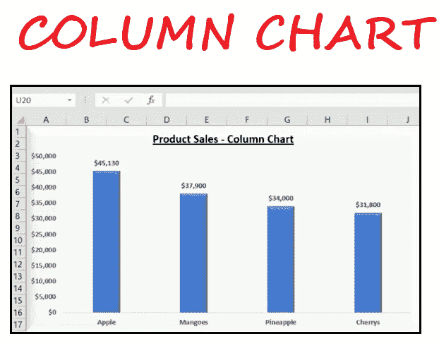

柱形图主要用于比较 excel 中的离散值。如上图所示，柱形图的每个数据点都绘制成一个垂直的矩形条，其中列的高度代表数据点的值。您可以使用 Excel 柱形图执行各种操作，并根据您的数据系列进行自定义。您可以为图表提供标题，并定义标签和值，以使图表更易于理解。看看我们可以用 Excel 图表做些什么。

## 柱形图的优势

1.  ***柱形图****非常简单易懂，不言自明。*
**   ***使用柱形图，*** 可以很容易地在条形图的末尾添加数据标签。*   ***柱形图*** (堆叠柱形图)轻松显示各种类别的相对值/比例。*   ***柱形图****也可以表示负数。***   ***柱形图*** 可以保存不同类别的数据值和不同时段一个分部的数据。**

 **## 柱形图的类型

Microsoft Excel 中有几种类型的柱形图，如下所示:

### 1.聚集柱形图

聚集柱形图用于用户想要 ***比较不同类别值的地方。*** 使用这种图表类型的优势是 ***它以聚集竖线格式显示多个数据系列。*** 顾名思义，在聚集柱形图中，每个数据系列共享同一个轴标签；因此，所有的竖线都是按类别分组的。集群柱形图支持直接比较多个系列，但不建议使用大数据，因为它可能会变得视觉复杂。然而， ***它们在用户数据集有限的情况下工作得最好。***

例如，在下图中，我们使用了聚类柱形图来理解销售和利润之间的关系。

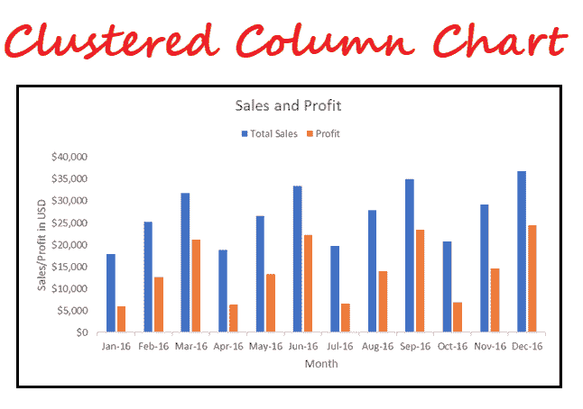

可以看出，与本季度的前两个月相比，人们可以很容易地评估出过去几个月的销售额有所上升。通过查看上面的聚集柱形图，我们还可以得出结论，当销售额下降时，利润也会下降。

### 2.堆叠柱形图

堆叠柱形图是一种基本的 Excel 图表， ***允许表示一段时间内不同类别的总(和)比较。*** 在堆栈中，柱形图数据系列在垂直列中一个堆叠在另一个之上。这个 ***类型可以显示随时间的变化，因为很容易比较总的列长度。*** 使用这个图表的好处是 ***在一个紧凑的空间中，表现了多个系列的数据，可以突出趋势和随时间的变化。*** 这种类型的缺点是很难比较单个类别的大小。

例如，在下图中，如您所见，我们创建了一个堆叠柱形图，以找出哪个产品可以在几个月内带来更多利润。

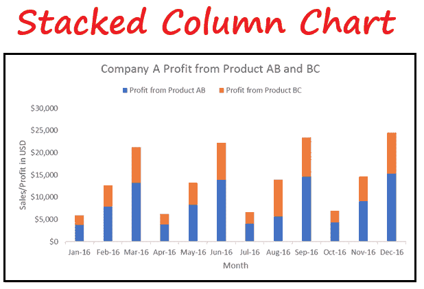

可以看出，与产品 BC 相比，产品 AB 对利润的贡献更大，但在 8 月份，产品 BC 对利润的贡献比产品 AB 更大。这将在下一个图表类型 100%堆叠列中更加清晰。

### 3.100%堆叠柱形图

100%堆叠柱形图 ***显示堆叠列中多个数据系列的相对百分比，其中堆叠列的总和始终等于 100%。*** 这种类型常用来表示部分到整体随时间的对比。

在堆叠柱形图中，很难比较组成每一列的组件的相对大小，也很难理解 Excel 中引入了 100%堆叠柱形图。它有助于我们的日常运营，不像显示每个地区的季度收入比例或代表每月支付给供应商或代理商的佣金比例等。

如您所见，在下面的 100%堆叠柱形图中，我们设计了图表，显示了 AB 产品和 BC 产品补贴的利润百分比。

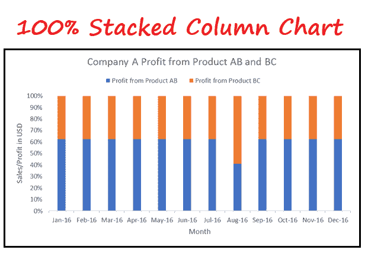

从上图可以看出，产品 BC 通常贡献约 38%，但在 2016 年 8 月，它贡献了近 60%的整体利润。

## 创建 2D 柱形图的步骤

要在 Excel 中制作柱形图，请按照下面给出的步骤操作:

1.在创建图表之前，在 Excel 电子表格中插入表格格式的数据很重要 ***。*** 例如，这里我们有显示 A 公司销售和利润的数据，并确定趋势。

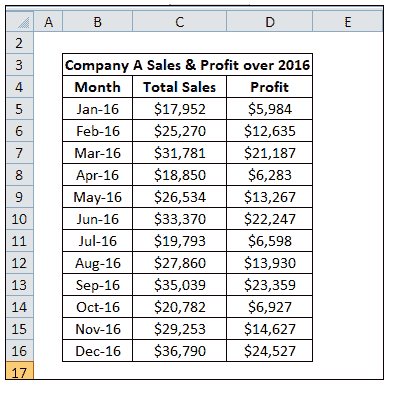

2.选择整个表格(将光标放在表格上，然后按快捷键 ctrl + A)。

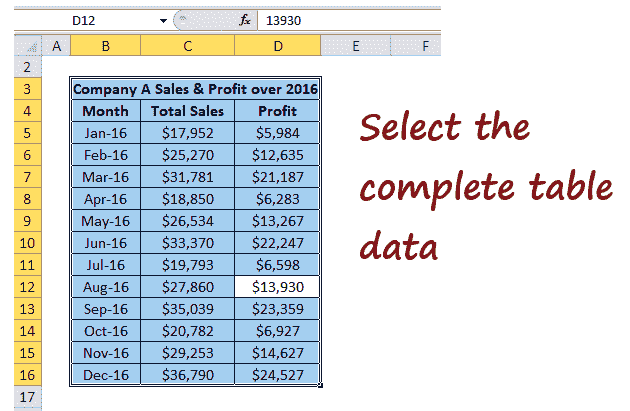

3.转到 ***插入选项卡- >在图表组- >下，单击插入列。*** 将显示柱形图对话框。由于我们必须比较销售数字和利润，我们将使用二维聚集柱形图 ***。***

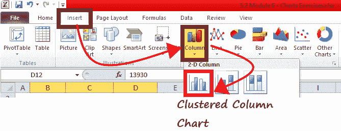

4.如下图所示， ***聚类柱形图将插入***Excel 工作表中。

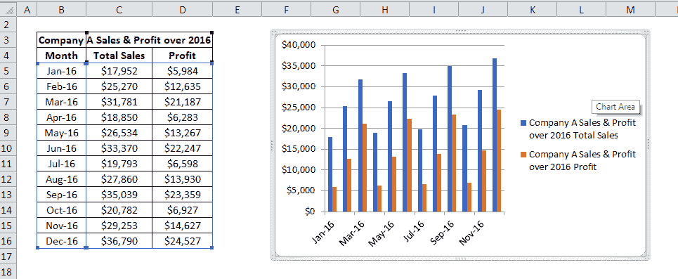

5.下一步是 ***给你的图表添加格式。*** 可以写出正确的图表标题、坐标轴标题，尝试不同的图表格式。

#### 注:您可以自定义柱形图，使其更具可读性和可理解性。

6.从图表工具中，单击布局->图表标题->图表上方(在图表区域顶部显示图表)。您会注意到在图表窗口的顶部会插入一个矩形框。键入适当的标题，然后单击输入。

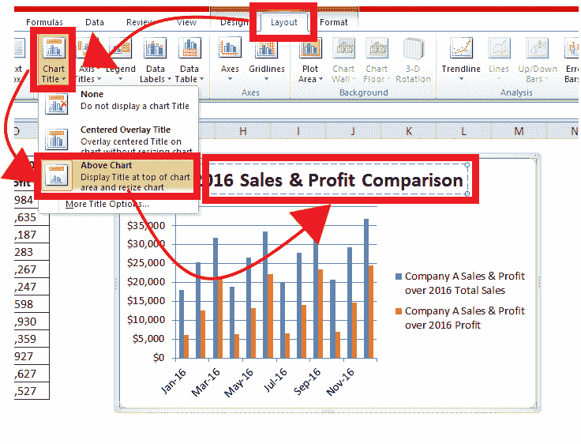

7.从图表工具中，添加坐标轴标题和数据标签。如下图所示，数据值被插入到每个条的末尾，并且水平轴和垂直轴也被定义。

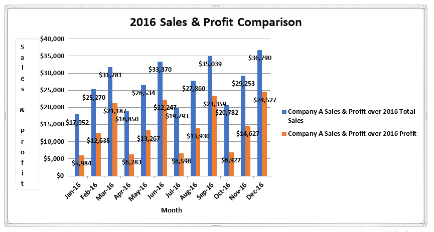

虽然我们的聚类图已经准备好了，但是你可以进一步格式化它，尝试不同的条，布局，设计方法。也可以搭配三维柱形图，让图表看起来更生动。

## 创建三维柱形图的步骤

要在 Excel 中制作三维柱形图，请按照下面给出的步骤操作:

1.  首先，我们将在 Excel 电子表格中插入表格格式的数据。例如，这里我们采用了与创建上述 2D 柱形图相同的数据。
    
2.  选择整个表格(将光标放在表格上，然后按快捷键 ctrl + A)。
    
3.  转到插入选项卡->图表组下->单击插入列。将显示柱形图对话框。由于我们必须比较销售数字和利润，我们将使用三维聚集柱形图。
    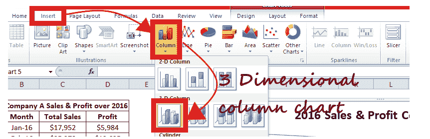
4.  如下所示，三维聚集柱形图将插入到您的 Excel 工作表中。
    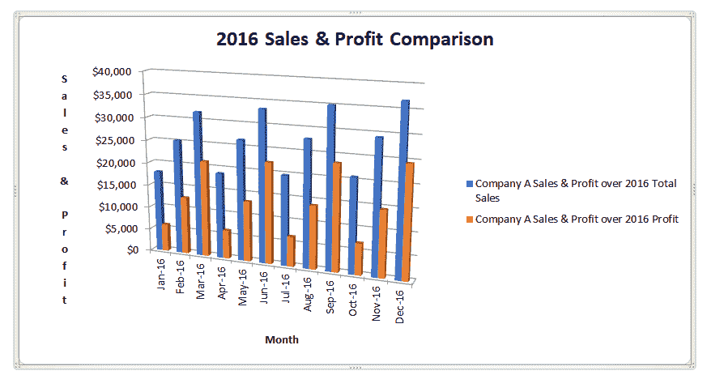

您还可以导航到不同的格式工具，使图表更加全面。

## 2D 柱形图和三维柱形图的区别

柱形图在 Excel 中有多种格式，但常用的是 2D 柱形图和三维柱形图。2D 柱形图和三维柱形图的主要区别是-2D 图表以二维视点显示条形图，并且还使用第三个数值轴。同时，三维柱形图以三维视角显示条形图。但与二维柱形图不同，它也不使用深度轴(第三个数值轴)。

* * ***