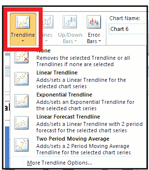

# 格式化图表

> 原文：<https://www.javatpoint.com/formatting-charts>

插入图表后，下一步是根据您的数据规范对其进行格式化，使其看起来有视觉吸引力。在本教程中，我们将了解更多关于图表及其各种格式选项的信息。

## 图表工具

在 excel 工作表中插入图表后，您会注意到您将获得一个名为“图表工具”的额外选项卡，其中包含各种不同的选项卡，例如:

### 1.设计选项卡

此选项卡具有 ***现成的图表布局和图表样式格式*** -您可以通过滚动不同的选项来查看不同的选项及其对图表的影响。您还可以选择不同的图表类型或更改图表的数据。

### 2.布局选项卡

该选项卡为 ***，用于添加/删除/编辑图表标题、数据标签和坐标轴标题。*** 我们还可以在图表中插入形状、图片。这个标签的另一个重要用途是 ***【趋势线】。***

您可以在图表中添加 ***【线性趋势线】【指数趋势线】*** 。线性(或指数)趋势线基于一个线性(或指数)方程，该方程由 excel 拟合到所提供的数据。您也可以通过右键单击趋势线并选择“设置趋势线格式”，然后单击“在图表上显示方程”来查看方程。R2 (R 平方)显示了模型解释的因变量的变化量。值越高，方程越好-它应该在 0 和 1 之间，但是一个好的模型的 R2 在 0.7-0.8 之间。

### 3.格式选项卡

此选项卡用于编辑或美化图表。它为您提供了选择形状样式、艺术字样式、形状效果、形状填充选项等选项。,

## 设置图表区格式

您可以使用工具栏或 ***右键单击图表并选择“设置图表区域格式”选项来设置图表格式。*** 当你点击一个图表时，一个概念性的标签“设计”也会被创建，它提供了很多快速格式化图表的选项。

***【格式化图表区】*** -这些选项用于在图表创建后“美化”图表-

*   ***【填充-*** 你可以上色，添加图片，改变图表中不存在图形的区域的图案
*   ***边框颜色-*** 默认情况下，图表的边框上没有颜色，但是您可以通过选择“实线”、“渐变线”来选择边框颜色
*   ***边框样式-*** 您可以选择想要粗边框线还是细边框线
*   ***阴影-*** 默认情况下，此设置为白色，但通过将其更改为任何其他颜色，您将创建图表的轻微阴影。通过使用“阴影”中的其他选项，您可以更改图表阴影的外观
*   ***【辉光和柔和边缘】-*** 你可以在你的图表周围添加一个“辉光”——默认情况下这是白色，即没有颜色。通过更改软边缘，您可以更改图表边缘的显示方式
*   ***三维格式-*** 这也是用来改变图表出现的方式。尝试可用的不同选项。
*   ***大小-*** 与图表的大小相关-您可以从这里增加/减少高度或宽度，或者您也可以选择图表并在鼠标周围移动以查看您满意的内容
*   ***属性-*** 默认为“使用单元格移动和调整大小”-也就是说，如果列宽发生变化，并且图表位于该列上方，那么它也会变宽或缩小-如果您添加了新列，那么图表将会扩展并移动(如果您在图表所在的列之前有一列)。通过选择其他选项“移动但不调整大小”，图表的大小将不会改变，使用第三个选项，无论您添加列还是删除列(与行相同)，图表也不会移动。

## 绘图区

当您在绘制图表的区域(也称为“绘图区域”) 上单击鼠标右键 ***时，您将获得与“设置图表区域格式”选项具有相同功能的选项，只是现在影响将仅在绘图区域上，而不是不包含图表的外部区域上。***

*   充满
*   边框颜色
*   边框样式
*   阴影
*   发光和柔和边缘
*   三维格式

最后 6 个具有与 ***“图表区”相同的功能。*T3】**

## 格式化图例

当你做一个 ***右键点击图例-你得到‘格式化图例’选项*** 其中你有以下选项-

*   ***图例选项-图例位置-*** 您希望图例出现在图表区的哪个位置-您希望它出现在顶部、底部、右侧还是左侧
*   充满
*   边框颜色
*   边框样式
*   阴影
*   发光和柔和边缘

最后 5 个具有与“图表区”或“绘图区”相同的功能。

## 设置柱形图或条形图的数据系列格式

当你在为柱形图或条形图绘制的数据点上单击 ***时，你会得到一个选项“格式化数据系列”-***

*   ***系列选项*** -如果你有 2 个不同等级的系列(不能像年龄和工资一样比较)，这里最重要的选项是主纵轴或副纵轴上的“绘制系列”。使用间隙宽度，我们可以改变 x 轴上两个数据点之间的间隙，请看下面的大间隙和无间隙的例子
*   充满
*   边框颜色
*   边框样式
*   阴影
*   发光和柔和边缘
*   三维格式

最后 6 个具有与 ***“图表区”或“绘图区”相同的功能。*T3】**

## 设置折线图的数据系列格式

当您在绘制成折线图的数据点上单击鼠标右键 ***时，您会看到一个选项“格式化数据系列”-***

*   ***系列选项-*** 如果你有 2 个不同等级的系列(不能像年龄和工资一样比较)，这里最重要的选项是主纵轴或副纵轴上的“绘制系列”
*   ***标记选项-*** 您可以更改突出显示数据点的标记和大小
*   ***标记填充-*** 您可以更改标记的颜色
*   ***线条颜色-*** 您可以更改连接不同标记即数据点的线条的颜色
*   ***线条样式-*** 这有助于根据我们想要的线条类型增加/减少线条宽度
*   ***标记线颜色-*** 更改标记线的颜色-默认为标记的颜色
*   ***标记线条样式-*** 您可以更改标记的线条样式和宽度-默认情况下，它是宽度为 0.75 毫米的线条
*   阴影
*   发光和柔和边缘
*   三维格式

最后 3 个具有与“图表区”或“绘图区”相同的功能。

## 格式化数据标签

当你在添加到图中的数据标签上点击 ***时，你会得到一个选项【格式化数据标签】-***

*   ***标签选项-*** 默认为“值”，但也可以通过点击“系列名称”来添加列名，也可以在“系列名称”中添加该值所属的观察名称。标签位置有助于更改标签在绘图区域上的位置
*   ***【数字-*** 您可以根据标签是日期还是数字、百分比等来更改标签的格式。
*   ***对齐-*** 您可以通过选择垂直对齐、水平对齐来更改文本在标签中的显示方式。您也可以更改文本的自定义角度
*   充满
*   边框颜色
*   边框样式
*   阴影
*   发光和柔和边缘
*   三维格式

最后 6 个具有与“图表区”或“绘图区”相同的功能。

## 格式化轴

当你在纵轴上做一个 ***右键，你会得到一个选项【格式化轴】*** (水平也有同样的功能)-

*   ***轴选项-***
    1.  最小值-垂直刻度上显示的最小值-您可以更改它-默认为 0
    2.  最大值-垂直刻度上显示的最高值- excel 会根据您拥有的数据自动设置它
    3.  主要和最小单位-它们改变比例值-具有小的主要单位将意味着存在太多的比例值，而具有大的最小单位将意味着很少的比例值
    4.  显示单位-如果坐标轴上的值是千或百万甚至更多，那么你可以用单位替换那些 000
*   数字
*   对齐
*   充满
*   边框颜色
*   边框样式
*   阴影
*   发光和柔和边缘
*   三维格式

最后 8 个具有前面讨论过的相同功能。

## 设置图表标题格式

当你在图表标题&上右键点击 ***时，你会得到一个选项【图表标题格式】-***

*   充满
*   边框颜色
*   边框样式
*   阴影
*   发光和柔和边缘
*   三维格式
*   对齐

所有这些都具有前面讨论过的相同功能。使用“格式”概念选项卡，您可以获得与前面提到的相同的结果。

## 复制图表

您可以简单地复制一个图表，方法是单击它并 ***先复制它(Ctrl + C)，然后将其粘贴到其他地方(Ctrl+V)***-然后您也可以更改数据源，但图表的格式将保持不变。

## 迷你图

迷你图只是单元格大小的图表。它们在 excel 中有三种类型-

1.  **线:**迷你图折线图类似于折线图。
2.  **列:**迷你图柱形图类似于柱形图。
3.  **赢/输:**迷你图赢/输是一种将每个数据点显示为高块或低块的图表类型。当我们从一个时间点移动到另一个时间点时，当我们想要绘制特定项目的变化时，这个图表就派上了用场——如果变化是正的，则用蓝色的高条表示，否则用红色的低条表示，并且在没有变化的月份中，它将不会显示任何条。

在下图中，表一由一个家庭 12 个月的支出组成，该表也由折线图和柱形图组成。

第二个表格显示了当我们从一个月到另一个月时的支出变化。

## 日期轴(组轴)

通常，当绘制基于时间的数据时，假设数据点的间隔相等。但情况可能并非总是如此，为了避免得出错误的结论，您可以使用“日期轴”选项。

您需要指定由日期组成的单元格，然后选择确定-如果某些日期的数据丢失，迷你图将确保数据以相等的间隔排列。

* * *