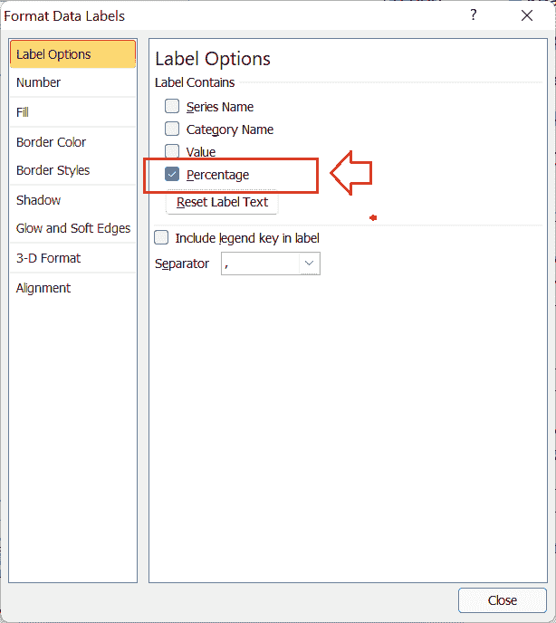

# 圆环图 Excel

> 原文：<https://www.javatpoint.com/doughnut-chart-excel>

微软 Excel 或微软 Excel 是最受欢迎的电子表格软件，具有特殊的内置功能和广泛的功能。当以图形方式显示电子表格数据时，Excel 提供了几个选项。我们可以使用各种形状、图像、剪贴画甚至图表来使我们的电子表格具有吸引力和信息量。

使用 Excel 中的图表，我们可以快速地以图形方式显示我们的数据。圆环图是微软电子表格中最受欢迎的图表类型之一，它可以与特殊的格式功能一起使用，在电子表格中清晰地表示数据，并使图表更容易阅读。

在本文中，我们讨论了 Excel 圆环图的简介。本文还通过示例解释了在 Excel 工作表中创建圆环图的分步过程。

## Excel 中的甜甜圈图是什么？

顾名思义，Excel 中的圆环图通常用提供的数据集构成一个圆环形状的结构或图形。甜甜圈图几乎类似于饼图，但中间有一个洞。这些图表通常被称为饼图的扩展或修改版本。与饼图不同，圆环图不需要比较要测量的切片的大小或面积。相反，它们通常是根据环中圆弧的长度来测量的。

换句话说，甜甜圈图可以定义为围绕自身旋转的堆叠条形图，以便其两端连接并形成一个圆。圆环图比饼图更受欢迎，因为它们具有更好的数据强度比和更好的空间效率。圆环图中的中间孔也很有用，因为我们可以使用这个空间来添加相关数据，例如切片的数据标签、数据弧的总数、所需的文本等。与饼图相比，圆环图的另一个优势是我们可以在这些图表中一次使用多个数据系列。

圆环图主要有两个子类型:

*   **圆环图:**圆环图以圆环的形式表示数据。这类图表的每个环代表或突出显示一个数据系列。换句话说，如果我们为环的每个部分显示百分比数据标签，整个环将覆盖精确的 100%，从而形成一个甜甜圈。在这个图表中，环的部分或切片是连接在一起的，而不是分开的。
    T3】
*   **爆炸圆环图:**爆炸圆环图以破碎或分离的环形零件的形式表示数据。它展示了每个价值对总价值的贡献，同时强调了分离的价值。爆炸圆环图的主要优点是它可以很容易地表示多个数据系列。
    T3】

#### 注意:圆环图和分解圆环图在 Excel 中不是三维格式。但是，我们可以使用三维格式样式使这些图表看起来像三维表示。在 Excel 2016 和更高版本中，微软删除了甜甜圈图，转而使用新的图表类型名称“星爆图”。

## 在 Excel 中使用圆环图的优势

下面列出了在 Excel 中使用圆环图的一些基本优势:

*   甜甜圈图很容易创建，也很容易被读者理解。即使对于不了解 Excel 图表基础知识的人来说，解释这些图表的必要性也很小。
*   在 Excel 中创建圆环图后，会自动计算百分比值。
*   当在 Excel 中比较数据集时，圆环图有助于清晰直观地表示数据。
*   与饼图不同，甜甜圈图可以在 Excel 工作表中表示多个数据集。此外，我们可以根据自己的需求，轻松地实时更改或替换圆环图中的数据值。

## 在 Excel 中使用圆环图的缺点

下面列出了在 Excel 中使用圆环图的一些基本缺点:

*   如果我们的数据中有太多的类别，圆环图会在一个环中分别显示太多的切片或圆弧。这有时会使图形表示混乱和密集。
*   数据分布或表示严格限于整个数据的一部分。
*   计算切片的确切大小或长度并不容易，除非它们相互表示，这使得在圆环图中比较切片的相对大小变得困难。
*   圆环图不能用于显示特定时间内发生的数据变化，这些图表被认为不能很好地显示随时间发生的变化。

## 我们应该什么时候在 Excel 中使用甜甜圈图？

我们应该考虑在以下情况下使用 Excel 圆环图:

*   当我们有一个或多个数据系列要绘制时。
*   当我们要绘制的数据没有负值时。
*   当我们要绘制的数据没有零值时。
*   当我们每个数据系列有超过七个类别时。
*   当我们有数据时，类别构成了圆环图每个环的整体部分。

## 如何在 Excel 中创建圆环图？

虽然创建圆环图类似于在 Excel 中插入其他典型的图表类型，但我们必须小心插入它，因为它可以接受多个数据系列。它是 Excel 旧版本中内置的图表类型，可以很容易地插入，将数据的一部分表示为切片，其中所有部分的总和为 100%。

由于圆环图可用于一个或多个数据系列，因此我们讨论了在不同情况下插入这些图表的过程，例如:

*   使用单个数据系列创建圆环图
*   使用双数据系列创建圆环图
*   使用多个数据系列创建圆环图

### 使用单个数据系列创建圆环图

当我们在 Excel 中使用单个数据系列插入一个圆环图时，插入的图表通常被称为**单个圆环图。**现在让我们使用以下示例数据在 Excel 中插入单个圆环图:

考虑下面的 Excel 表，它显示了前一个月十个不同品牌销售的移动设备的一些示例数据:

我们需要在圆环图中以图形方式显示上述数据。为此，我们需要执行以下步骤:

*   首先，我们需要选择具有有效数据的整个单元格范围。在我们的示例中，我们选择了从单元格 A3 到单元格 B12 的数据，如下所示:
    
*   接下来，我们需要从内置的 Excel 图表中选择甜甜圈图。为此，我们需要导航到**插入**选项卡，并选择其他图表下拉菜单。我们需要从其他图表的下拉部分点击甜甜圈图，如下图所示:
    
    在 Excel 2013 中，我们需要在饼图下拉部分选择甜甜圈图。
*   一旦我们选择了圆环图，图表就会被插入到工作表中。对于我们的示例数据，甜甜圈图如下所示:
    

将圆环图插入工作表后，我们需要调整一些基本格式，使其看起来美观且组织得当。我们可以添加多个图表元素和格式。一些基本定制如下:

*   我们需要**选择环的切片**，使用快捷方式 **Ctrl +1** 进入【格式】**数据系列的快速切换菜单。**在【数据序列格式】菜单下，我们可以调整第一个切片的角度、甜甜圈爆炸、甜甜圈孔洞大小等。假设我们像下图一样手动调整偏好:
    
    现在，我们的甜甜圈图将如下所示:
    
*   接下来，我们右击切片，选择**添加数据标签**选项，使我们的图表信息丰富。
    
    Excel 会以默认样式插入数据标签，我们会在各自的切片中得到每个品牌对应的值(已售单位值)。添加默认数据标签后，我们在甜甜圈图中的示例数据将如下所示:
    
*   由于数据标签在百分比中使用时看起来更专业，我们将更改默认样式。为此，我们需要在数据标签上双击**或者选择任意数据标签后按快捷键 Ctrl + 1。它将启动一些选项来相应地修改数据标签。我们需要**选择选项名称**百分比**的复选框**，并保留所有其他标签选项未标记，如下所示:
    **
*   最后，我们插入/编辑图表标题，并将图例移动到左侧，使整体演示更加美观和专业。在最后一步之后，我们的示例圆环图如下所示:
    
    此外，我们还可以根据需要更改切片的颜色并插入其他图表元素。

这就是我们在 Excel 中插入单个圆环图的方法。

### 使用双数据系列创建圆环图

当我们在 Excel 中使用两个数据系列或矩阵插入一个圆环图时，插入的图表通常被称为**双圆环图。**现在让我们使用以下示例数据在 Excel 中插入一个双圆环图:

考虑下面的 Excel 表，它显示了前两个季度售出商品(鼠标、键盘、内存)的一些示例数据:

我们需要在圆环图中以图形方式显示两个季度的数据。为此，我们需要执行以下步骤:

*   当我们有多个数据系列时，最好先插入一个空白的圆环图，然后手动选择数据，以消除不正确的可能性。因此，我们转到**插入**选项卡，并从图表部分选择**甜甜圈图**以插入空白甜甜圈图。
    
*   接下来我们需要在空白图表上**右键**，点击**选择数据选项，**如下图:
    
*   我们需要点击**添加**按钮，从选择数据源窗口的表单中插入所需的数据。
    T3】
*   在下一个窗口中，我们需要在系列名称框下选择系列一的标题单元格，在系列值框下选择第一个系列数据，如下图所示:
    
*   我们有两个系列的数据，所以我们对第二个系列重复同样的内容。我们需要再次点击**添加**按钮，选择第二个系列(Q2)的数据，如下图:
    
*   接下来，我们需要从**选择数据源**窗口的右侧点击**编辑**按钮。
    
*   在下一个窗口中，我们必须在**轴标签范围**框下提供项目名称。
    T3】
*   最后，我们需要点击**确定**按钮，默认格式的数据甜甜圈图会立即插入到表单中，如下所示:
    

虽然插入了甜甜圈图，但并没有多大帮助。因此，我们必须相应地安排格式。像前面的方法一样在双圆环图中排列格式后，我们的图表如下所示:

这就是我们在 Excel 中插入双圆环图的方法。

### 使用多个数据系列创建圆环图

当我们在 Excel 中使用两个以上的数据系列或矩阵插入一个圆环图时，插入的图表通常被称为**多重圆环图。**在 Excel 中创建多圆环图几乎与插入双圆环图类似。多圆环图的唯一区别是它需要多个指标。

现在，让我们使用以下示例数据在 Excel 中插入一个多圆环图:

考虑下面的 Excel 表(与前面的相同，但有 4 个季度的数据)，其中显示了一些销售项目的样本数据(鼠标、键盘、内存):

我们需要在圆环图中以图形方式显示所有季度的数据。为此，我们需要执行以下步骤:

*   和前面的方法一样，我们先从插入>图表部分插入一个**空白甜甜圈图表**，然后在空白图表上按**右键**。我们需要从右键菜单中选择**选择数据**。
    
*   接下来，我们需要点击**添加**按钮来选择甜甜圈图的源数据。
    T3】
*   在下一个窗口中，我们必须在系列名称框下选择系列一(Q1)的标题单元格，并在系列值框下选择第一个系列数据。同样，我们需要为其他季度单击添加按钮并提供数据。
    
*   之后，我们需要从选择数据源窗口的右侧点击**编辑**按钮。这里，我们需要在**轴标签范围**框下提供项目名称。
    
*   最后，我们必须点击**确定**按钮，以获得表单上的甜甜圈图。
    T3】

插入图表后，我们必须相应地安排格式化。像前面的方法一样在多个圆环图中排列格式后，我们的图表如下所示:

这就是我们在 Excel 中插入多圈图的方法。

## 需要记住的重要事情

*   甜甜圈图类似于中间有一个洞的饼图。
*   圆环图有助于创建单矩阵、双矩阵和多矩阵的可视化效果。
*   甜甜圈图主要有助于为总的 100%指标创建图表。
*   根据我们绘制图表的数据系列，可以创建单圆环图、双圆环图和多圆环图。

* * *