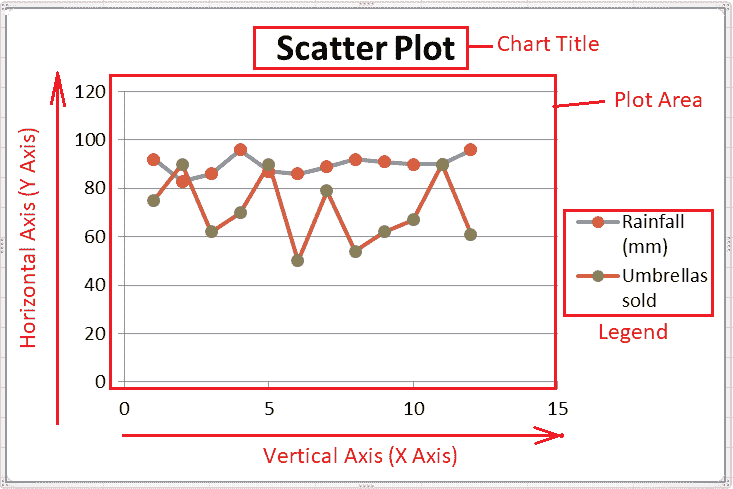
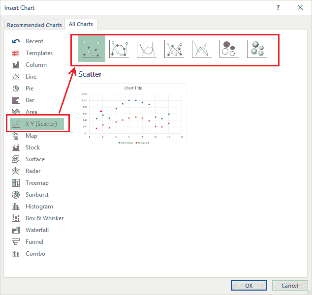
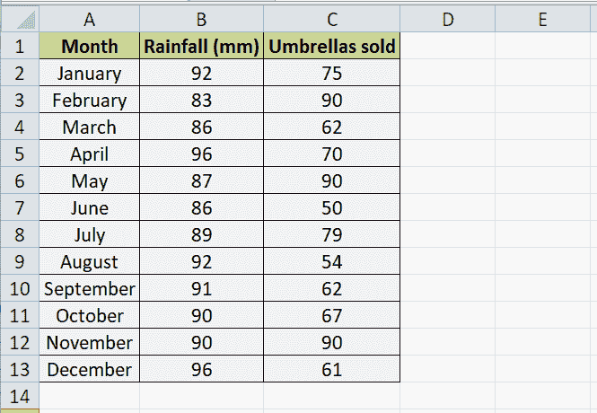
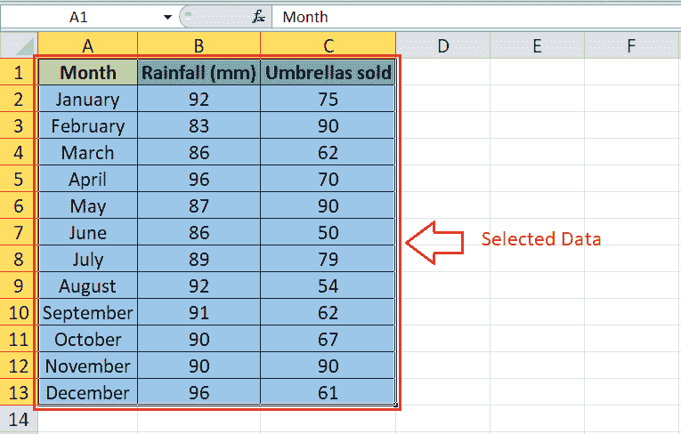
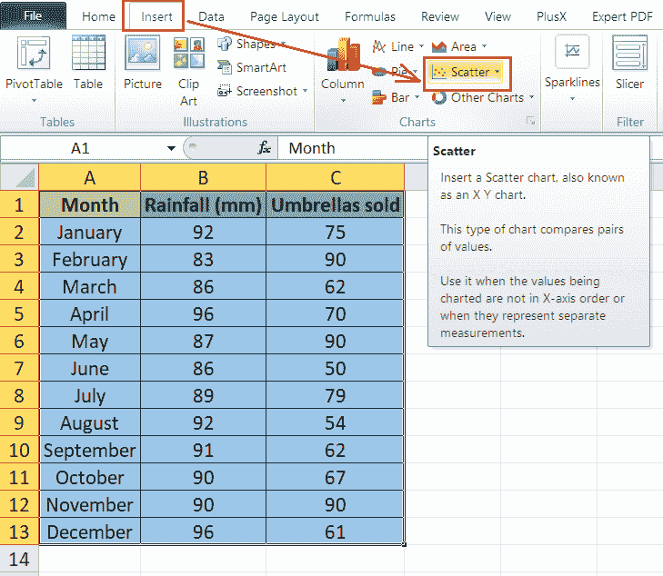
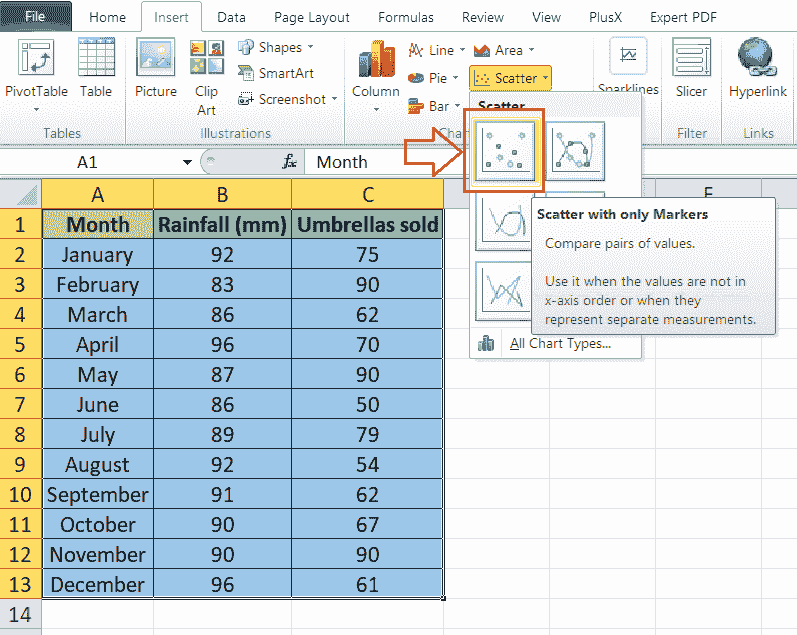
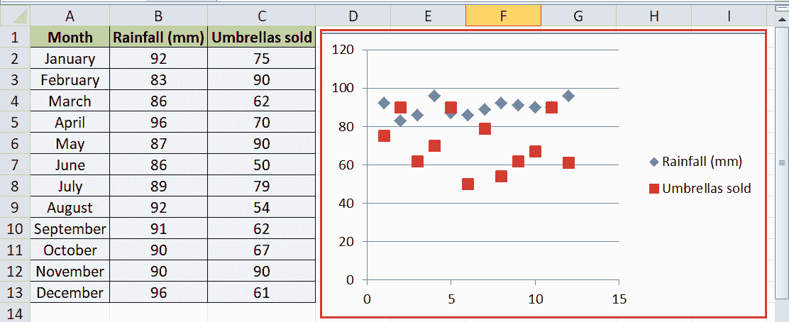
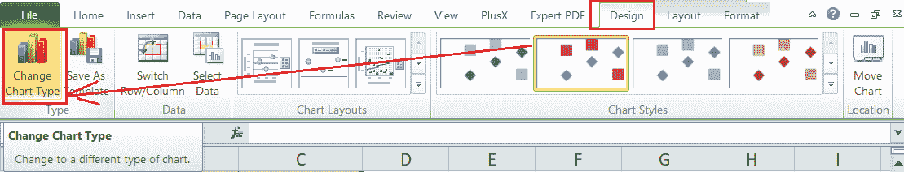

# 散点图 Excel

> 原文:[https://www.javatpoint.com/scatter-plot-excel](https://www.javatpoint.com/scatter-plot-excel)

微软 Excel 或微软 Excel 是流行的电子表格软件，当可视化电子表格数据时，图表是 Excel 最受欢迎的元素。插入图表时，一定要有 Excel 图表的基础知识。因为不同的图表适合不同的数据集，所以我们需要明智地选择所需的图表类型。

散点图是一种特殊类型的内置 Excel 图表。然而，这个图表并不那么受欢迎。但在大多数情况下，这是有帮助的。在本文中，我们讨论了 Excel 散点图的简要介绍。此外，我们详细说明了如何在 Excel 中使用散点图来显示数据集的图形表示。

## 什么是 Excel 中的散点图？

散点图是指 Excel 工作表中的二维图表，它直观地实时表示所提供的数据。通常，散点图在 X 轴和 Y 轴上可视化两组数据，它们在 Excel 工作表中相互关联。这种类型的 Excel 图表根据提供的数据集在纵轴和横轴上显示许多点，主要用于显示两个变量之间的关系。

散点图的工作原理是在纵轴上放置一个变量，在横轴上放置一个不同的变量。然后，每条数据都被绘制成图表上的一个离散点。X 轴和 Y 轴都在散点图中显示值，这意味着散点图没有类别轴。按照惯例，X 轴代表不依赖于另一个变量(称为自变量)的任意值。此外，Y 值位于垂直轴上，代表因变量。

Excel 中有不同类型的散点图。它们有助于数据的相关研究和回归研究。此外，散点图有助于检索见解，以确定给定值或量(称为变量)的估计值之间的关联程度。这些图表还有许多其他名称，如**‘散点图、散点图、散点图、散点图、XY 图、**等

## 散点图的组成部分

散点图主要有五个组成部分，如下所示:

*   **绘图区域:**图纸中绘制数据的图形形式/区域称为绘图区域。
*   **图表标题:**图表标题代表绘制图表的主题，主要帮助确定图表的主题或动机。图表标题中的文字可以编辑，位置也可以相应排列。
*   **纵轴:**垂直位于图表窗口中的轴称为纵轴，它位于绘图区域的底部区域。由于垂直轴通常代表 X 轴上的测量值，因此称为 X 轴。
*   **横轴:**水平位于图表窗口中的轴称为横轴，位于绘图区域的左侧。由于横轴表示 Y 轴上不同的数据类别，因此也称为 Y 轴。我们可以在横轴上分组系列数据。
*   **图例:**图例是图表的另一个有用的组成部分，有助于列出和区分各种数据组。我们可以移动图例或相应地改变图例的位置，它可以放在图表窗口的任何一侧。

## Excel 中散点图的类型

在当前版本的 Excel 中，我们通常会发现以下类型的散点图:

*   **仅带有标记的散点图:**仅带有标记的散点图在 Excel 表中没有数据点可绘制时，被认为是最佳的。这种类型的散点图有助于在绘图区域内分别可视化每个变量。
*   **带有平滑线条和标记的散点图:**带有平滑线条和标记的散点图对于较少的数据点也有好处。这种类型的散点图使用标记在平滑线(也可以是曲线)上可视化每个变量。
*   **用平滑线分散:**如果我们有多个有很多变量的数据点，用平滑线分散比用平滑线和标记分散更好。这主要是保持图表干净，不使用标记。
*   **用直线和标记进行分散:**用直线和标记进行分散通常用于可视化一组小变量及其数据点。这种类型的散点图通过将点连接成一条直线来可视化数据点。此外，它在绘图区域上使用标记。
*   **直线散点图:**直线散点图是一种散点图，通过将点连接在一条直线上但没有标记来帮助可视化数据。当我们至少有两个数据集要比较时，这种类型的图表被认为是最好的。但是，可以有多个数据点。
*   **气泡:**气泡图是一种特殊的散点图类型，出图几乎相似。然而，我们在使用泡沫图时必须提供三个变量，第三个变量主要影响泡沫的大小。对于气泡图，数据/值必须按照前面的顺序给出:x、y 和 z。
*   **三维泡泡:**三维泡泡无非是泡泡图的三维呈现。它通常以三维效果表示工作表中提供的变量，给出图表的详细视图。

## 在 Excel 中使用散点图的优势

以下是在 Excel 中使用散点图的优点:

*   散点图有助于确定两个或多个变量之间的关系，它们主要展示一个变量与另一个变量之间的关系。
*   散点图可以直观地显示相关性。
*   当在 Excel 中直观地显示非线性模式时，散点图被认为是最好的。
*   很容易分析数据流范围散点图中的最大值和最小值(高值和低值)。
*   散点图用于各种科学分析，因为绘制这些图表相当容易，而且感知和读数也很准确。

## 在 Excel 中使用散点图的缺点

以下是在 Excel 中使用散点图的缺点:

*   虽然散点图可以显示变量之间的关系，但它们不能提供精确的关系。
*   散点图有助于确定估计数据或关系概念。
*   散点图只在需要相关性的地方效果最好。
*   散点图不能用于显示两个以上变量之间的关系。
*   与其他 Excel 图表相比，读者可能很难理解散点图。

## 如何在 Excel 中创建散点图？

由于散点图需要两个数据段，我们将下面的 Excel 表作为示例数据集，并相应地创建散点图。

散点图的创建和格式化类似于在 Excel 中插入其他典型图表。具体来说，我们需要执行下面提到的步骤:

**第一步:**首先，我们必须**在 Excel 表格中输入数据**，然后**选择特定的数据单元格**来创建散点图。由于我们已经有了一个带有**两段的示例 Excel 表，**我们选择整个数据，包括标题。

**第二步:**选择有效数据集后，我们需要从 Excel 图表中选择所需的图表类型。为此，我们需要转到**插入**选项卡，并从**图表**部分单击**分散下拉**图标。

**步骤 3:** 接下来，我们需要从下拉菜单中选择所需的散点图类型。例如，我们通过单击第一个图块从菜单中选择基本散点图，如下所示:

**第 4 步:**在我们单击所需的图表后，在我们有数据集的同一张纸上会立即创建相同的图表。示例数据的散点图如下所示:

## 自定义散点图 Excel

在 Excel 中自定义散点图和修改其他 Excel 图表几乎是一样的，我们可以根据自己的需要修改插入的图表。说到自定义或调整散点图的格式，我们通常有以下几种方法:

*   **双击:**在插入的图表中编辑任何元素最简单的方法是用鼠标双击。当我们双击某个特定的图表元素时，Excel 会显示相关的自定义选项，以根据我们的需要修改首选项。
*   **右键单击:**访问详细定制首选项的另一种简单方法是右键单击特定的图表元素。选择一个图表元素后，我们一按右键，Excel 就会显示该选定元素的更多选项。我们可以用这种方式修改插入图表的任何元素。
*   **图表快捷方式:**自从 Excel 2013 推出后，我们也有了图表快捷方式。图表快捷方式位于插入图表的右侧，由加号图标标识。此外，它还包括格式和过滤选项。我们可以快速访问图表快捷方式并启用/禁用所需的图表元素。
*   **功能区:**最基本的方法是使用功能区及其选项来编辑、添加或移除特定的图表元素、格式和样式。当我们在 Excel 工作表中插入图表时，我们也会在功能区上获得额外的选项卡，尤其是与图表相关的选项卡，它主要包括设计、布局和格式。使用这些选项卡，我们可以轻松定制所需的图表元素。

## 更改散点图类型

有时，我们可能需要将散点图从一种类型更改为另一种类型。在 Excel 中更改图表类型很容易，即使我们已经插入了任何特定的图表。为此，我们需要转到设计选项卡，选择**“更改图表类型”**选项，如下图所示:

单击上图中的快捷方式后，我们将获得包含所有图表类型的新窗口。我们可以从菜单中选择任何想要的散点图。此外，我们可以在 Excel 中选择任何其他图表类型。单击所需的图表类型后，我们将立即在工作表中获得相应的图表。此外，旧的图表将被新的图表取代。

这就是我们如何从一种散点图类型切换到另一种类型，甚至选择一种全新的图表类型。

## Excel 散点图中的关系类型

Excel 中散点图可以有以下三种关系:

*   **无相关性:**表示变量之间没有中间联系的点。例如，一个公司的电脑数量和给员工的工资没有直接关系。
*   **正:**代表两个不同因素遵循同一方向或某个联系，相互之间形成直接关系的点。例如，在员工晋升后支付给他们的工资增加。这里关注的是薪资和晋升，很明显，以前的员工都是因为晋升而加薪。
*   **否定:**代表不同因素遵循逆联系，形成直接关系的一个点。具体来说，当一个变量增加时，另一个变量减少。比如玩游戏的时间和学习的时间。这通常意味着如果我们玩得更多，我们学习的时间就会相应减少。

## Excel 散点图的使用

Excel 中散点图的一些基本用途如下:

*   突出显示或演示两个变量之间的关系，特别是显示一个变量如何影响另一个变量。
*   预测一个变量(因变量)相对于另一个变量(自变量)的行为。
*   以图形方式绘制两个不同变量之间的相关性，而不考虑时间。
*   在我们的数据中定位和/或创建集群。
*   可视化并处理根本原因分析，特别是确定潜在的问题。

## 需要记住的重要事情

*   变量必须以数字形式提供，以便在 Excel 工作表中绘制。
*   我们不能为了数据保持有效可见而大量格式化图表元素。
*   散点图应该供熟悉 Excel 图表的读者使用，因为散点图对某些读者来说可能很难理解。但是，我们可以使用连接数据点的线来使它们更容易理解。
*   我们应该仔细选择有效数据，因为散点图至少需要两段。否则，将不可能创建完美的散点图。

* * *