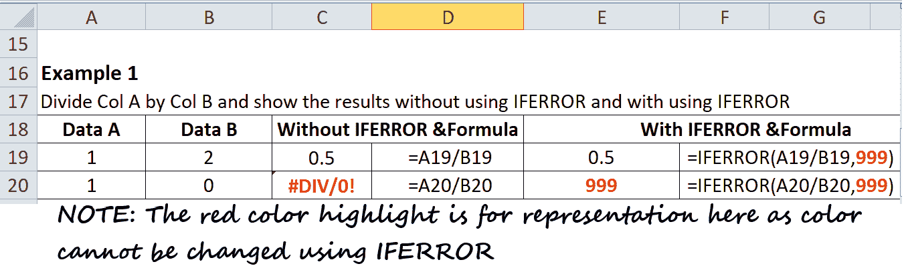
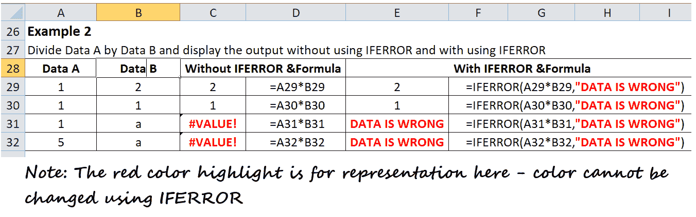
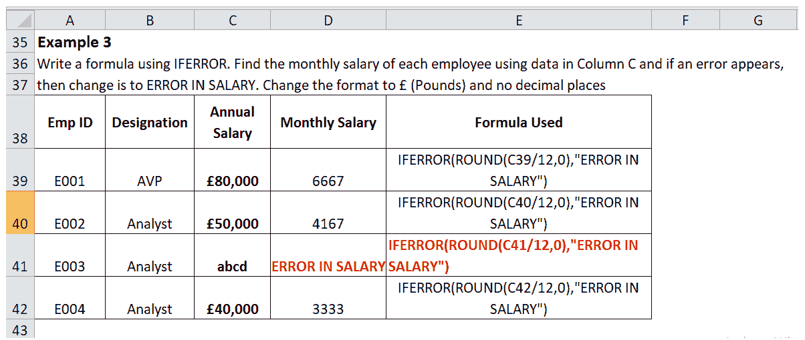

# Excel IFERROR()函数

> 原文:[https://www.javatpoint.com/excel-iferror-function](https://www.javatpoint.com/excel-iferror-function)

IFERROR()是 Excel 的一个逻辑函数。这是一个特殊的函数，旨在捕捉和处理公式和计算中的错误。有时在使用 Excel 公式时，由于我们使用的单元格值不正确，会出现一些意外错误。在这种情况下，IFERROR 函数允许我们用任何其他不同的值替换这些错误消息。

更具体地说，IFERROR 会检查 Excel 公式，如果公式触发错误，函数会返回您指定的另一个值(空白、自定义文本、数值、布尔值)；否则，如果公式没有计算任何错误，它只是返回公式的输出。

无论用户使用任何不正确的值或数据类型，如- #N/A，#NUM，该函数都适用于 Excel 生成的 9 个公式错误！，#VALUE！，#REF！，#NAME？，#DIV/0！，或者#NULL！错误。

### 句法

IFERROR (Value, [Value_if_error])

### 因素

**值(必需):**该参数代表第一个被评估以查看是否出现错误的值。

**Value_if_error(可选):**如果单元格中有错误，此参数会用此值替换错误值。

### 例子

**例 1:在下面的例子中，我们已经将数据 A 除以数据 B，并显示了两个输出，一个使用了 IFERROR，另一个没有使用 IFERROR 函数。**

从上面的例子中可以看出，在将数据值 1 除以 0 时，Excel 抛出了一个错误，即“#DIV/0！”。因此，使用 IFERROR，我们可以给出我们想要的值，不像这里，我们已经用数字数据替换了错误，即 999。您还可以输入文本、特殊符号或一些逻辑值，让用户知道数据有问题。

**例 2:将数据 A 除以数据 B，在不使用 IFERROR 函数和使用 IFERROR 函数的情况下显示输出。**

您还可以提供定制的文本消息，向用户指示数据有问题。

正如你在上面的例子中看到的，在 1 除以 a 时，我们得到一个错误(因为我们不能用字母表来划分一个数字)，不使用 IFERROR 我们得到#VALUE！即错误。因此，使用 IFERROR，我们可以给出我们想要的值，不像这里，我们已经用定制的消息替换了错误，即“数据是错误的”。

现在，无论何时 IFERROR 发现错误，它都会显示相同的文本消息。您还可以输入数字、特殊符号或一些逻辑值，让用户知道数据有问题。

**例 3:用 IFERROR 在下面的数据表中写一个 Excel 公式，利用 C 列中的数据找到每个员工的月薪，如果出现错误，将错误信息替换为‘ERROR IN SALARY’。将格式更改为(磅)并且没有小数位(使用舍入函数来避免小数)。**

| 电磁脉冲识别码 | 指定 | 年薪 | 月薪 |
| E001 | 血管加压素 | Eighty thousand |  |
| E002 | 分析师 | Fifty thousand |  |
| E003 | 分析师 | 加快收寄投递系统 |  |
| E004 | 分析师 | Forty thousand |  |

在上面的问题中，我们将使用 IFERROR 和 Round 函数的组合。其中 IFERROR 函数有助于捕捉和处理公式中的错误，如果出现**错误，则将其更改为**工资中的错误。相反，ROUND 函数将对所有计算进行舍入(如果没有错误)。我们知道工资数字总是数字，但是对于 E003，工资是‘ABCD’，这不是一个有效的数字。因此，在这种情况下，它会抛出一个错误，我们将使用 IFERROR 函数捕获并处理该错误。关于上述问题的解决方案，请参考下图。

就这样！现在，您可以自由地使用 Excel 的 IFERROR 函数来按照您想要的方式捕获和管理错误。

## 使用 Excel IFERROR 函数时需要记住的事情

1.  与#N/A，#NAME 不同，IFERROR 函数对于 Excel 错误类型(特别是 9 个 Excel 公式错误)运行良好？，#DIV/0！，#NUM！，#NULL！，#REF！，和#VALUE！。
2.  IFERROR 函数最大的优点是，它用您定制的文本消息、数字、日期或逻辑值来替换错误消息，因为它看起来更专业。
3.  如果在 value 参数中传递空白单元格，它将被视为空字符串(“”)，而不是错误。
4.  Excel IFERROR()函数最初是在 Excel 2007 中引入的，从那以后，它在 Excel 2010、2013、2016 甚至最新的 Office 365 等所有后续版本中都可以使用。
5.  要在 Excel 2003 及其所有早期版本中查找错误，可以使用 ISERROR 函数和 IF 函数的组合。它的工作方式也将与 IFERROR 相同。

## IF 误差与 IF 误差

现在，正如我们已经发现的关于 IFERROR 函数，它的用法，语法，参数，实现，你可能会问为什么一些 Excel 用户仍然倾向于使用 ISERROR 函数(结合 IF)。此外，您可能想知道 EXcel 中的 IFERROR 函数和 ISERROR 函数之间的区别，因为两者听起来是一样的。

在下表中，我们简要讨论了这两个主要的不确定性:

| S.NO | IFERROR | iseries error |
| 1. | 微软 Excel IFERROR 是一个特殊的函数，旨在捕捉和处理公式和计算中的错误。 | 微软 ISERROR 函数检查不同类型的公式错误，不像#VALUE！，#REF！，#DIV/0！，#NUM！，#NAME？和#NULL。 |
| 2. | =IFERROR(值，[值 _if_error]) | =ISERROR(值) |
| 3. | IFFERRPR 函数也考虑了#N/A。 | ISERR 函数不包括#N/A 错误 |
| 4. | IFERROR 函数是在 Excel 2007 中引入的，从那以后，它在所有后续版本中都可用，如 Excel 2010、2013、2016，甚至最新的 Office 365。 | 为了在 Excel 2003 及其所有早期版本中找到错误，用户使用了 ISERROR 函数和 IF 函数的组合。因此，许多 Excel 用户仍然习惯于使用 ISERROR 而不是 IFERROR 函数。 |
| 5. | 这是捕捉和处理错误的最简单方法。 | ISERROR 和 IF 函数的组合也可以用来捕获和管理错误。这只是实现输出的一种复杂方法。 |

## 在 Excel 中使用 IFERROR 的最佳实践

到目前为止，我们已经理解了 IFERROR 函数背后的逻辑，并认为这是在微软 Excel 中捕获和管理错误的最简单方法。它很容易用空白单元格、数字数据或自定义文本消息替换错误值。然而，这并不意味着你应该用 IFERROR 函数覆盖每个 Excel 公式，因此下面的建议可能会帮助你保持平衡。

1.  没有任何理由不要应用错误函数。如果你确定不会有任何错误，不要使用它，因为越小的公式越聪明。
2.  覆盖 IFERROR 函数中任何公式的最低可能部分。
3.  IFERROR 不是处理错误的唯一方法，因为还有一些其他的 Excel 函数，使用这些函数，您只能处理范围较小的特定错误:
    *   要捕获不适用错误，请使用 IFNA 或中频 ISNA 函数。
    *   要捕获除#不适用以外的所有错误，请使用 ISERR 函数。

* * *