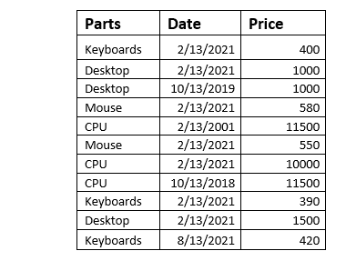

# Excel 中位数()函数

> 原文:[https://www.javatpoint.com/excel-median-function](https://www.javatpoint.com/excel-median-function)

用简单的数学术语来说，**中值**被定义为给定数据集中的**中间值**，**将数据值的上半部分与下半部分**分开。更具体地说，它是数据集中元素按数量级排列的中间值。

类似地，“**Excel 中值()函数返回一个位于给定数据集**中所有数字的中心值的数字。

偶数和奇数组的中位数计算公式不同。例如，在包含奇数个数值**的数据集中，中间值将是所有数值**的中间值。相比之下，对于包含**偶数组的数据集，通过计算中间两个数字**的平均值来获取中位数。

#### 注:中位数是在按升序或降序排列数据集后计算的。在 Excel 中，数据集的有序排列不会像在后端那样可见。

人们总是混淆均值和中位数，有时会互换使用。但是两者是不同的，因为它们指的是一组数字的平均值。相反，当数据集按升序或降序排列时，中位数是中间值。中位数不太容易受到异常值(极大或极小的数据值)的影响。因此，建议在不对称分布的计算中使用中位数。一个完美的例子是工资中位数，因为它能更好地反映员工的具体收入。相比之下，如果你已经计算了平均工资，这些数字可能会因为极低或极高的工资数字而扭曲。

### 句法

=MEDIAN([number1],[number2], and so on..)

### 因素

1.  **数字 1(必需):**此参数表示列表的第一个数字。必须在中值函数中至少输入一个数字。
2.  **【数字 2】，以此类推..(可选):**此参数表示您想要找到中位数的数字列表。这些可以保存任何值，包括数字、日期(其中日期以通用格式提及)、命名范围、数组，甚至单元格引用。

#### 注意:在 Excel 2003 及其所有早期版本中，中值函数最多只能容纳 30 个参数，只有在使用 Excel 2007 时，它才扩展到 255 个参数。现在，在最新版本的 Excel 365、Excel 2016、2013、2010 和 2007 中，中值函数最多可以接受 255 个参数。

## 关于 Excel 中位数需要记住的 4 个事实

1.  当数据集包含奇数个值时，中位数将是所有数字的中间值。相反，对于包含偶数组数字的数据集，通过计算中间两个数字的平均值来获取中位数。
2.  中值()函数还包括计算中零值(0)的单元格。
3.  虽然中值()函数不包括空单元格以及包含文本和逻辑值的单元格。
4.  中值()函数计算数据集中的布尔值。如果用户在参数中传递布尔值 FALSE，它会将其读取为 0，如果用户传递布尔值 TRUE，它会将其读取为 1。例如，公式中位数(1，4，真，假，3)返回 0，这是数据集{1，4，0，1，3}的中位数。

### 例子

**例 1:计算以下数字的中位数。**

表一

**求解:**选择一个单元格，输入下面的公式，计算上表的中值。

**所用公式:**=中位数(A15:A35)

如果您对值进行升序排序，并计算这里的观测值数量，我们有 21 个(在表 A 中)，中间的观测值将是第 11 个观测值，其值为 84。

表二

**求解:**选择一个单元格，输入下面的公式，计算上表的中值。

**所用公式:**=中位数(G15:G35)

如果观察数是 20(如表 B 中的情况)，那么中位数是第 10+11 次观察除以 2，这就是我们的中位数。

如上例所示，Excel 中值公式对数字和日期值的工作方式相同，因为日期在 Excel 中被视为数字值。继续尝试日期值的中位数公式！

**例 2:根据准则找出下表的中位数。计算零件等于桌面的中间值。**

虽然微软 Excel 中没有根据条件计算中位数的特殊函数，但众所周知，Excel 允许我们通过合并两个或多个函数来创建定制的公式。同样的技巧，我们可以用来建立我们自己的中位数公式，将其与中频函数相结合。

**使用的配方**

=MEDIAN(IF(table_range=criteria, median_range))

**公式说明:**

为了找到中位数，我们使用了中位数公式。在中值公式中，我们引入了中频函数。在 IF 内部，我们将检查表范围是否等于标准值(Range (A45: A55) = Desktop)。如果“If”函数返回真，它将返回中值范围(D45: D55)。之后，中值函数将开始发挥作用，以找到返回范围的中值。

在上面的截图中，为了找到 Desktop 的中值金额，我们创建了另一个包含零件名称、中值和公式的表格，并借助以下公式根据该条件获取特定项目的中值:

=MEDIAN(IF(B45:B55=F46,D45:D55))

在上面的例子中，我们已经找到了基于单个标准的中位数，但是你也可以放纵更多，并且可以将中位数公式用于多个标准。去试试吧！

* * *